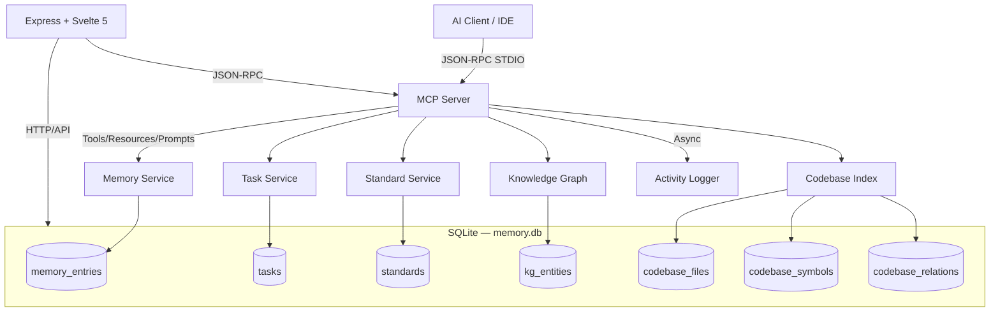

# Application Documentation

This directory contains the complete documentation for the **local-memory-mcp** application — an MCP (Model Context Protocol) server with persistent memory, task orchestration, knowledge graph, and codebase intelligence.

## Modules

| Module             | Overview                                                                 | Description                                                                                        |
| :----------------- | :----------------------------------------------------------------------- | :------------------------------------------------------------------------------------------------- |
| **MCP Server**     | [modules/mcp-server/overview.md](modules/mcp-server/overview.md)         | Core MCP protocol server: memory, task, standard, and KG management via JSON-RPC over STDIO        |
| **Dashboard**      | [modules/dashboard/overview.md](modules/dashboard/overview.md)           | Svelte 5 web dashboard for memory visualization, task kanban, activity stream, and knowledge graph |
| **Codebase Index** | [modules/codebase-index/overview.md](modules/codebase-index/overview.md) | Code parsing, symbol storage, and structural code querying using tree-sitter AST parsing           |

## Architecture

## API Documentation

| Module             | Specs                                                                                                                                          |
| :----------------- | :--------------------------------------------------------------------------------------------------------------------------------------------- |
| **MCP Server**     | [Core](api/mcp-server/api-core.md) · [Memory](api/mcp-server/api-memory.md) · [Task](api/mcp-server/api-task.md)                               |
| **Dashboard**      | [Memories](api/dashboard/api-memories.md) · [System](api/dashboard/api-system.md) · [Tasks](api/dashboard/api-tasks.md)                        |
| **Codebase Index** | [Indexing](api/codebase-index/api-indexing.md) · [Search](api/codebase-index/api-search.md) · [Resources](api/codebase-index/api-resources.md) |

## Test Documentation

| Module             | Specs                                                                                                                                                                                                                                                                                                             |
| :----------------- | :---------------------------------------------------------------------------------------------------------------------------------------------------------------------------------------------------------------------------------------------------------------------------------------------------------------- |
| **MCP Server**     | [Memory](testing/mcp-server/test-memory.md) · [Task](testing/mcp-server/test-task.md)                                                                                                                                                                                                                             |
| **Dashboard**      | [Dashboard](testing/dashboard/test-dashboard.md)                                                                                                                                                                                                                                                                  |
| **Codebase Index** | [Overview](testing/codebase-index/README.md) · [Tools](testing/codebase-index/test-tools.md) · [Indexing](testing/codebase-index/test-indexing.md) · [Search](testing/codebase-index/test-search.md) · [Performance](testing/codebase-index/test-performance.md) · [Strategy](testing/codebase-index/strategy.md) |

## Quick Links

- [Module Catalog](modules/README.md)
- [API Catalog](api/README.md)
- [Testing Catalog](testing/README.md)
- [Design Documentation](../design/)
- [Architecture Decision Records](../design/decisions/)
