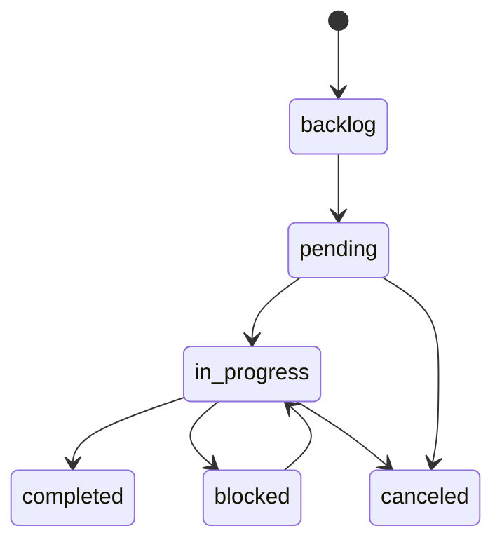

# API Specification: Task Management

## Header & Navigation

- [MCP Server Module Overview](../../modules/mcp-server/overview.md)
- [Task Feature](../../modules/mcp-server/task.md)
- [Task Tests](../../testing/mcp-server/test-task.md)

This document outlines the MCP Tool interfaces for Task management. Responses comply with the [MCP 2025-11-25 Structured Content](https://modelcontextprotocol.io/specification/2025-11-25/server/tools#structured-content) specification.

## 1. Task Lifecycle Tools

### 1.1 `task-create`

- **Method:** `tools/call`
- **Description:** Register one or more new tasks in a repository. `task_code` must be unique within the repository. Supports single task object or an array of tasks for bulk creation.
- **Arguments:**
  - `task_code` (string, required)
  - `title` (string, required)
  - `description` (string, optional)
  - `status` (enum: `backlog`, `pending`, optional, default: `pending`)
  - `phase` (string, optional)
  - `priority` (number, optional, 1-5)
  - `parent_id` (UUID, optional, for hierarchical task trees)
  - `depends_on` (UUID, optional, for sequencing)
  - `tags` (array of strings, optional)
  - `tasks` (array of task objects, optional, for bulk creation)
  - `scope injection`: owner, repo from session context
- **Response:**
  ```json
  {
  	"content": [
  		{ "type": "text", "text": "Created task [TASK-001] Fix Auth Flow in repo \"my-repo\". See structuredContent.id." }
  	],
  	"isError": false,
  	"structuredContent": {
  		"success": true,
  		"id": "uuid-v4-string",
  		"repo": "my-repo",
  		"task_code": "TASK-001",
  		"title": "Fix Auth Flow",
  		"status": "pending",
  		"createdCount": 1
  	}
  }
  ```

### 1.2 `task-create-interactive`

- **Method:** `tools/call`
- **Description:** Triggers MCP elicitation flow for missing fields. When an agent provides incomplete data, the server requests structured input from the user.
- **Response:**
  ```json
  {
  	"content": [{ "type": "text", "text": "Interactively created task. See structuredContent." }],
  	"structuredContent": { "success": true, "id": "uuid", "repo": "..." }
  }
  ```

### 1.3 `task-update`

- **Method:** `tools/call`
- **Description:** Update one or more tasks. Supports single update via `id` (UUID) or `task_code`, bulk via `ids` (UUID array) or `task_codes` (string array). MANDATORY WORKFLOW: Cannot move `pending`/`blocked` → `completed` directly; MUST go through `in_progress` first. Include `est_tokens` when moving to `completed`.
- **Arguments:**
  - `id` (UUID or string, optional)
  - `task_code` (string, optional)
  - `ids` (array of UUIDs, optional for bulk)
  - `task_codes` (array of strings, optional for bulk)
  - `status` (enum, optional)
  - `comment` (string, optional — recorded in task_comments)
  - `est_tokens` (number, required when moving to `completed`)
  - `priority`, `phase`, `tags` (optional fields)
  - `force` (boolean, optional — bypass transition validation)
- **Response:**
  ```json
  {
  	"content": [{ "type": "text", "text": "Updated task(s) in repo \"my-repo\". See structuredContent." }],
  	"isError": false,
  	"structuredContent": {
  		"success": true,
  		"id": "uuid-1",
  		"repo": "my-repo",
  		"status": "completed",
  		"archivedToMemory": true,
  		"updatedCount": 1,
  		"updatedFields": ["status", "comment"]
  	}
  }
  ```

### 1.4 `task-delete`

- **Method:** `tools/call`
- **Description:** Delete one or more tasks from a repository. Supports single `id` or bulk `ids`.
- **Arguments:**
  - `repo` (string, required)
  - `id` (UUID, optional)
  - `ids` (array of UUIDs, optional)
- **Response:**
  ```json
  {
  	"content": [{ "type": "text", "text": "Deleted 3 task(s) from repo \"my-repo\"." }],
  	"structuredContent": {
  		"success": true,
  		"repo": "my-repo",
  		"deletedCount": 3,
  		"ids": ["uuid-1", "uuid-2", "uuid-3"]
  	}
  }
  ```

### 1.5 `task-list`

- **Method:** `tools/call`
- **Description:** PRIMARY navigation and search tool for tasks. Returns a compact tabular list of tasks (id, task_code, title, status, priority, updated_at, comments_count). Defaults to `backlog, pending, in_progress, blocked` tasks. Use `status` to override or `all` for all statuses.
- **Arguments:**
  - `repo` (string, required via scope injection)
  - `status` (string, comma-separated, optional — defaults to `backlog,pending,in_progress,blocked`)
  - `phase` (string, optional)
  - `query` (string, optional — search by title or task_code)
  - `limit` (number, optional, default: 20)
  - `offset` (number, optional)
- **Response:**
  ```json
  {
  	"content": [{ "type": "text", "text": "Found 5 active tasks in repo \"my-repo\"." }],
  	"isError": false,
  	"structuredContent": {
  		"schema": "task-list",
  		"tasks": {
  			"columns": ["id", "task_code", "title", "status", "priority", "comments_count"],
  			"rows": [["uuid", "TASK-001", "Fix Auth", "in_progress", 3, 2]]
  		},
  		"count": 5,
  		"offset": 0
  	}
  }
  ```

### 1.6 `task-detail`

- **Method:** `tools/call`
- **Description:** Fetch full details of a specific task by ID or task code.
- **Arguments:**
  - `id` (UUID or string, optional)
  - `task_code` (string, optional)
- **Response:**
  - `content`: Text summary and resource link.
  - `structuredContent`: Full task object with comments.

### 1.7 `task-search`

- **Method:** `tools/call`
- **Description:** Dedicated search tool for tasks. Returns compact pointer table. Use `task-detail` for full content.
- **Arguments:**
  - `query` (string, required)
  - `repo` (string, optional)
  - `status` (string, optional)
  - `limit` (number, optional)
  - `offset` (number, optional)

## 2. Task State Machine



### Transition Rules

| Rule                   | Description                                                                                    |
| :--------------------- | :--------------------------------------------------------------------------------------------- |
| **Linear Progression** | Cannot move from `pending`/`blocked` directly to `completed`. MUST pass through `in_progress`. |
| **Token Budgeting**    | When moving to `completed`, MUST provide `est_tokens`.                                         |
| **Singleton Focus**    | Ideally only one task `in_progress` per repo at a time.                                        |
| **Auto-Archiving**     | Completing a task auto-generates a `task_archive` memory with full history.                    |
| **Audit Trail**        | Status changes with `comment` are recorded in `task_comments`.                                 |

## 3. Resources (URIs)

| URI                                 | Description                                         |
| :---------------------------------- | :-------------------------------------------------- |
| `repository://{owner}/{name}/tasks` | Paginated list of tasks for a repository            |
| `task://{id}`                       | Detailed view of a specific task including comments |

## 4. Error Codes

| Code          | Name             | Description                                                                     |
| :------------ | :--------------- | :------------------------------------------------------------------------------ |
| `-32602`      | Invalid Params   | Required argument missing or type mismatch (Zod validation)                     |
| `-32603`      | Internal Error   | Database write failure or unexpected server error                               |
| `ERR-TRN-001` | Transition Error | Invalid status transition (e.g., `pending` → `completed` without `in_progress`) |
| `ERR-TRN-002` | Missing Token    | `est_tokens` required when moving task to `completed`                           |
| `ERR-TRN-003` | Duplicate Code   | `task_code` already exists in the repository                                    |
