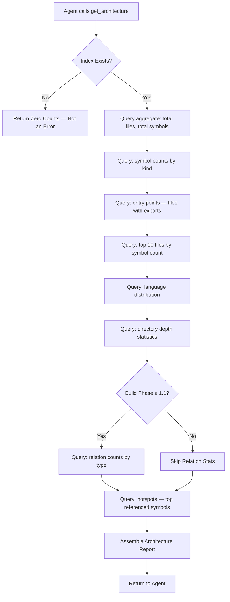
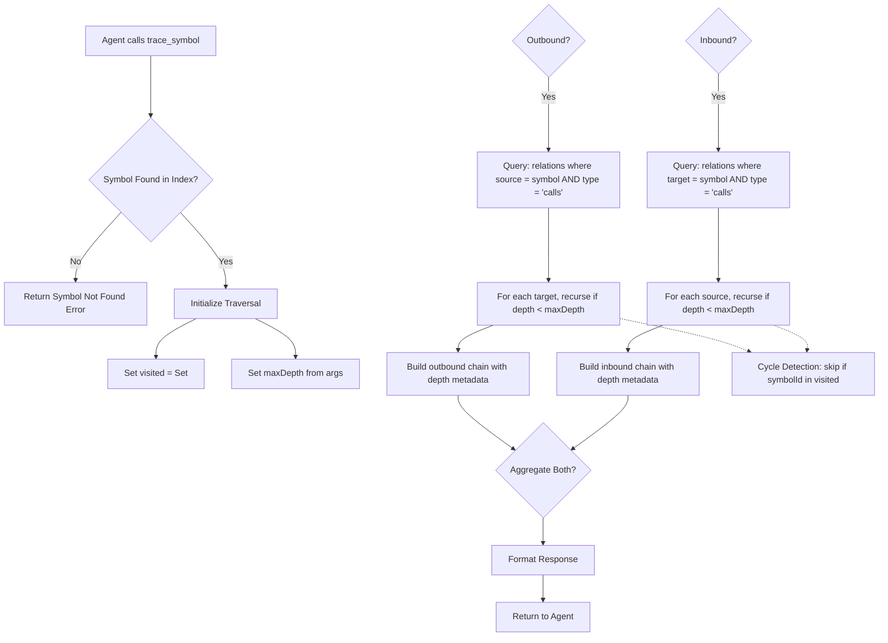
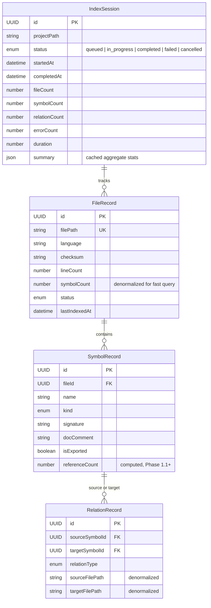

# Feature: Codebase Architecture Query

## User Stories

### US-09: Get Architecture Overview

> As an **AI agent**, I want to **query the high-level structure of the project (file count, symbol counts per kind, entry points)** so that **I can decide which modules to explore in depth**.

**Priority**: P1 (Should) | **Effort**: M | **Depends on**: SQLite aggregate queries

### US-10: Auto-Index on Session Start

> As a **developer**, I want the **codebase to be indexed automatically when the MCP session starts** so that **I never have to remember to trigger indexing manually**.

**Priority**: P1 (Should) | **Effort**: S | **Depends on**: Index command, session lifecycle hook

### US-11: Search Code with Symbol Context

> As an **AI agent**, I want to **search file contents and get results enriched with surrounding symbol definitions** so that **I can understand the context of a match without opening the file**.

**Priority**: P2 (Could) | **Effort**: M | **Depends on**: tree-sitter parsing

### US-12: View Index in Dashboard

> As a **developer**, I want to **browse the indexed symbols in the local-memory-mcp Dashboard** so that **I can visually explore the codebase without switching to an IDE**.

**Priority**: P2 (Could) | **Effort**: M | **Depends on**: Svelte Dashboard tab

## Acceptance Criteria

### AC-14: Architecture Overview Returns Aggregate Data [Event-driven]

> **Applies to**: S3 — `get_architecture` tool

When `get_architecture` is called, THEN it SHALL:

- Return total file count, total symbol count, and counts by symbol kind.
- Return the top 10 files by symbol count.
- Return entry point files (files with exports).
- Return directory depth and breadth statistics.

**Test**: Given an indexed project with 20 files and 150 symbols, when `get_architecture` is called, then all required fields are present and counts are accurate.

### AC-15: Auto-Index Lifecycle [Event-driven]

> **Applies to**: S5 — Auto-index on session start

When the MCP server initializes a new session, THEN the system SHALL:

- Check whether a codebase index exists for the current project root.
- If no index exists, trigger a full index automatically.
- If an index exists and is stale (older than 24 hours), trigger an incremental re-index.
- If an index exists and is fresh, skip indexing.
- Include a file count guard (default max 50,000 files) to prevent runaway indexing.

**Test**: Given a project with no existing index, when the MCP session starts, then indexing begins automatically and completes within 60 seconds.

## Business Flow

### get_architecture Tool



### trace_symbol Tool



## Architecture Data Model

### get_architecture Output Schema

```json
{
	"languages": [{ "language": "typescript", "fileCount": 1024, "symbolCount": 12800 }],
	"totalFiles": 1247,
	"totalSymbols": 14892,
	"totalRelations": 8341,
	"symbolCounts": {
		"function": 8230,
		"class": 342,
		"interface": 567,
		"type": 1203,
		"enum": 89,
		"variable": 2100,
		"method": 2361
	},
	"relationCounts": {
		"calls": 5400,
		"imports": 2100,
		"extends": 340,
		"implements": 280,
		"member_of": 221
	},
	"entryPoints": [
		{
			"name": "src/index.ts",
			"kind": "file",
			"filePath": "src/index.ts",
			"line": 1
		}
	],
	"topFiles": [{ "filePath": "src/services/order-service.ts", "symbolCount": 142 }],
	"hotspots": [
		{
			"name": "validateItems",
			"kind": "function",
			"filePath": "src/services/validate.ts",
			"referenceCount": 48
		}
	]
}
```

## Hotspot Detection & Complexity Metrics

### Hotspot Algorithm

Hotspots are symbols with the highest reference counts (inbound + outbound relations). These represent high-churn, high-impact areas of the codebase — changes to these symbols affect the most dependent code.

```sql
SELECT
  s.id,
  s.name,
  s.kind,
  s.file_id,
  COUNT(DISTINCT r_in.id) + COUNT(DISTINCT r_out.id) AS reference_count
FROM codebase_symbols s
LEFT JOIN codebase_relations r_in  ON r_in.target_symbol_id  = s.id
LEFT JOIN codebase_relations r_out ON r_out.source_symbol_id = s.id
GROUP BY s.id
ORDER BY reference_count DESC
LIMIT 20;
```

### Complexity Metrics

In addition to hotspot detection, the architecture tool computes the following structural metrics:

| Metric              | Description                      | SQL / Computation                                       |
| :------------------ | :------------------------------- | :------------------------------------------------------ |
| **File depth**      | Directory nesting depth per file | `LENGTH(filePath) - LENGTH(REPLACE(filePath, '/', ''))` |
| **Symbol density**  | Symbols per file ratio           | `symbolCount / fileCount`                               |
| **Export ratio**    | Percentage of exported symbols   | `SUM(isExported) / COUNT(*)`                            |
| **Module coupling** | Average relations per symbol     | `relationCount / symbolCount` (Phase 1.1)               |

### Dead Code Candidates (Phase 1.1)

Symbols with zero inbound references (no callers, no importers) are flagged as dead code candidates:

```sql
SELECT s.name, s.kind, s.file_path
FROM codebase_symbols s
LEFT JOIN codebase_relations r ON r.target_symbol_id = s.id
WHERE r.id IS NULL
  AND s.kind IN ('function', 'class', 'variable')
  AND s.isExported = 0;
```

These are included in the architecture response under a `deadCodeCandidates` field.

### Directory Statistics

```json
{
	"directoryStats": {
		"maxDepth": 8,
		"avgDepth": 3.2,
		"filesPerDir": {
			"src/services": 42,
			"src/api": 18,
			"src/utils": 25
		},
		"depthDistribution": {
			"1": 5,
			"2": 18,
			"3": 34,
			"4": 22,
			"5": 12,
			"6": 7,
			"7": 2
		}
	}
}
```

## Business Rules

### Architecture Query Rules

1. **Graceful Degradation**: If no index exists, return zero counts — not an error. All fields are always present with their type-appropriate zero value.
2. **Pagination for Hotspots**: Hotspot results are limited to top 20 by reference count.
3. **Entry Point Heuristics**: Entry points are files containing at least one exported symbol, sorted by export count descending.
4. **Phase-Gated Features**: Relation counts and hotspot data are only included when the index was built with Phase 1.1+ (relation resolution enabled).

### Trace Symbol Rules

1. **Direction Semantics**: `inbound` = who calls/imports this symbol; `outbound` = what this symbol calls/imports.
2. **Depth Semantics**: `depth=1` returns direct relations only. `depth=2` includes relations of relations. Default: 1, max: 10.
3. **Cycle Protection**: A visited set prevents re-traversal of already-seen symbols in a single trace call.
4. **Ambiguous Name Resolution**: When multiple symbols share a name, the most-referenced match is used. The response includes file paths for disambiguation.
5. **Empty Results**: Symbols with no relations return empty `inbound`/`outbound` arrays — not an error.

### Auto-Index Rules

1. **Session Lifecycle Hook**: Auto-index check runs in the MCP server's `initialize` handler, non-blocking (async, background).
2. **Freshness Window**: 24 hours from `lastIndexedAt` timestamp. Configurable via server options.
3. **File Count Guard**: If `totalFiles > 50,000`, auto-index is skipped. The agent must call `index_repository` explicitly.
4. **Staleness Detection**: `indexed → stale` transition occurs when any file's mtime exceeds its `lastIndexedAt`.

## Data Model



## Dashboard Integration (Phase 1.2)

### Architecture Tab

```
┌──────────────────────────────────────────────────────────────┐
│  Codebase Architecture                                       │
│                                                              │
│  ┌──────────────┐  ┌──────────────┐  ┌──────────────┐       │
│  │  Files        │  │  Symbols     │  │  Relations   │       │
│  │  1,247        │  │  14,892      │  │  8,341       │       │
│  │  ▲ 12 this wk │  │  ▲ 143       │  │  ▲ 89        │       │
│  └──────────────┘  └──────────────┘  └──────────────┘       │
│                                                              │
│  ┌──────────────────────────────────────────────────────────┐│
│  │  Symbol Distribution                    [By Kind ▼]      ││
│  │                                                          ││
│  │  function  ████████████████████████████████  8,230        ││
│  │  method    ██████████████                    2,361        ││
│  │  variable  ██████████                       2,100         ││
│  │  type      ██████                            1,203         ││
│  │  interface ███                                567          ││
│  │  class     ██                                 342          ││
│  │  enum      ▍                                   89          ││
│  └──────────────────────────────────────────────────────────┘│
│                                                              │
│  ┌──────────────────────────────────────────────────────────┐│
│  │  Hotspots (Top 10 by Reference Count)                    ││
│  │                                                          ││
│  │  validateItems         48 refs  src/services/validate.ts ││
│  │  formatOrder           42 refs  src/services/orders.ts   ││
│  │  calculateTotal        38 refs  src/services/pricing.ts  ││
│  │  sendResponse          35 refs  src/api/middleware.ts     ││
│  │  ...                                                     ││
│  └──────────────────────────────────────────────────────────┘│
│                                                              │
│  ┌──────────────────────────────────────────────────────────┐│
│  │  Directory Structure                 [Collapse All ▼]    ││
│  │                                                          ││
│  │  📁 src/                          42 files               ││
│  │    📁 api/                        18 files               ││
│  │    📁 services/                   42 files               ││
│  │      📁 orders/                   12 files               ││
│  │      📁 payments/                  8 files               ││
│  │    📁 utils/                      25 files               ││
│  │  📁 tests/                        30 files               ││
│  └──────────────────────────────────────────────────────────┘│
└──────────────────────────────────────────────────────────────┘
```

### Color Legend for Architecture Visualizations

| Element   | Color              | Meaning                          |
| :-------- | :----------------- | :------------------------------- |
| Function  | Green              | Standalone function declaration  |
| Class     | Purple             | Class declaration                |
| Interface | Teal               | Interface declaration            |
| Type      | Yellow             | Type alias                       |
| Enum      | Orange             | Enum declaration                 |
| Method    | Blue               | Method inside a class            |
| Variable  | Gray               | Exported variable/constant       |
| Hotspot   | Red glow           | Symbol with high reference count |
| Dead Code | Gray strikethrough | Zero-referenced symbol           |

## Performance Targets

| Metric                           | Target    | Condition                      |
| :------------------------------- | :-------- | :----------------------------- |
| `get_architecture` latency       | < 50ms    | Indexed project <10K files     |
| `trace_symbol` latency (depth=1) | < 50ms    | Indexed project <10K symbols   |
| `trace_symbol` latency (depth=3) | < 200ms   | Indexed project <10K symbols   |
| Architecture stats cache TTL     | 5 minutes | Computed on first call, cached |
| Hotspot calculation              | < 500ms   | Updated on index completion    |

## Error Responses

| Scenario                       | HTTP Analogue | Behavior                                                    |
| :----------------------------- | :------------ | :---------------------------------------------------------- |
| No index exists (architecture) | 200           | Return zero counts — not an error                           |
| Symbol not found (trace)       | 404           | Return error: "Symbol 'X' not found in index."              |
| No relations available (trace) | 200           | Return symbol with empty inbound/outbound                   |
| No index exists (trace)        | 404           | Return error: "No index found. Run index_repository first." |
| trace maxDepth >10             | 400           | Return validation error                                     |
| trace maxDepth <1              | 400           | Return validation error — default to 1                      |
