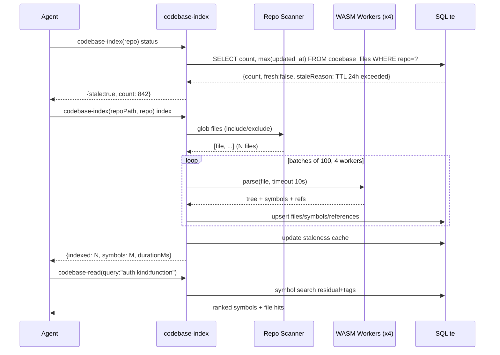

# Codebase Indexing — Tree-Sitter Indexing Pipeline

> **Module:** `codebase-index` · **Feature:** Tree-Sitter Indexing + Search Pipeline · **Tools:** `codebase-index` (status/index) + `codebase-read` (5 modes) · **Storage:** `codebase_files` + `codebase_symbols` + `codebase_references` + WASM grammars

## 1. Overview

Codebase Indexing is the local code intelligence layer. It parses the working tree with **tree-sitter WASM grammars** (14 languages: `typescript`, `javascript`, `python`, `go`, `rust`, `php`, `java`, `c`, `cpp`, `c_sharp`, `ruby`, `dart`, `kotlin`, `swift`, `vue`) into `codebase_files`/`codebase_symbols`/`codebase_references` tables, then exposes a unified `codebase-read` surface (NL search, symbol trace, file symbols, content grep, architecture). Index freshness is checked via `codebase-index(repo)` status; staleness triggers `codebase-index(repoPath+repo)` scan. The pipeline runs in-process with bounded worker slots and optional file-watcher polling.

Unlike cloud code search, the index is local-first, repo-keyed (not `owner/repo` — intentional per ADR-008), and lives inside the same SQLite DB as memories/tasks.

## 2. User Stories

| #   | As a ...        | I want ...                                                               | So that ...                                       |
| --- | --------------- | ------------------------------------------------------------------------ | ------------------------------------------------- |
| 1   | Agent (explore) | to call `codebase-index(repo)` and get freshness + symbol count          | I know if the index is stale before querying      |
| 2   | Agent (search)  | to run `codebase-read(query:"auth kind:function")` with inline tags      | I find symbols without learning DSL               |
| 3   | Agent (trace)   | to call `codebase-read(name:"MyClass")` and see definition + references  | I map blast radius before editing                 |
| 4   | Agent (file)    | to call `codebase-read(filePath:"src/mcp/tools/memory.write.ts")`        | I enumerate symbols in a known file quickly       |
| 5   | Agent (grep)    | to call `codebase-read(content:"TODO.*fix", regex:true)`                 | I grep indexed file contents without `rg`         |
| 6   | Agent (arch)    | to call `codebase-read()` with no params (or `depth:3`) for architecture | I get a repo tree + symbol counts for orientation |
| 7   | Dashboard       | to show repo file/symbol counts and staleness badge                      | Operators see index health at a glance            |

## 3. Business Logic (Pseudocode)

```text
function ensureIndex(repo, repoPath, force=false):
  status = checkFreshness(repo)  // row count + max updated_at + TTL
  if !force && status.fresh: return status
  files = scanRepo(repoPath, includeGlobs, excludeGlobs)
  for batch in chunk(files, DEFAULT_BATCH_SIZE=100):
    for file in batch parallel (CODEBASE_INDEX_WORKERS=4 slots):
      src = readFile(file)
      if src exceeds limits: skip or truncate
      tree = wasmParser(languageOf(file)).parse(src, timeout=10s)
      symbols = extractSymbols(tree, file)   // functions, classes, methods, interfaces
      refs = extractReferences(tree, file)   // calls, imports, extends, implements
      upsert codebase_files {path, language, hash, updated_at}
      upsert codebase_symbols {id, file, name, kind, language, exported, range}
      upsert codebase_references {from_symbol, target_file, target_symbol_id, kind}
  update staleness cache (INDEX_STALENESS_TTL_MS=30s)
  return {count: symbolCount, fresh: true}

// codebase-read dispatch:
function codebaseRead(params):
  if params.name && !params.query:  return traceSymbol(name, includeRefs, exportedOnly)
  if params.filePath:                return fileSymbols(filePath)
  if params.content:                 return contentGrep(content, regex, limit, cache)
  if params.query:                   return symbolSearch(query, kind, language, regex, tags)
  return architecture(depth, includeSymbolCounts)  // default mode

// Tag extraction (query-tags):
tags = extractInlineTags(query)  // kind:function language:php file:src/foo.ts
residual = stripTags(query, tags)
```

Worker model: tree-sitter WASM runs in worker threads (`CODEBASE_INDEX_WORKERS`, alias `CODEBASE_INDEX_PARSE_CONCURRENCY`); per-file timeout `CODEBASE_INDEX_PARSE_TIMEOUT_MS=10000`.

## 4. Sequence Diagram



## 5. Data Model

```mermaid
erDiagram
    codebase_files ||--o{ codebase_symbols : "contains"
    codebase_symbols ||--o{ codebase_references : "outgoing refs"
    codebase_files {
        TEXT repo PK_part
        TEXT path PK
        TEXT language
        TEXT hash
        TEXT updated_at
    }
    codebase_symbols {
        TEXT id PK
        TEXT repo
        TEXT file FK
        TEXT name
        TEXT kind
        TEXT language
        INTEGER exported
        TEXT range
        TEXT created_at
    }
    codebase_references {
        TEXT id PK
        TEXT repo
        TEXT from_symbol FK
        TEXT target_file
        TEXT target_symbol_id FK_nullable
        TEXT kind
        TEXT created_at
    }
    grammars {
        TEXT language PK
        TEXT wasm_path
        INTEGER loaded
    }
```

Additional: `codebase_references` kinds `call`/`import`/`extends`/`implements`/`instantiation` (v21/v23); `kg_degrees` cache (v22) for graph degree.

## 6. Public Interface

| Tool             | Mode   | Key Params                                                                                                   | Returns                                                   |
| :--------------- | :----- | :----------------------------------------------------------------------------------------------------------- | :-------------------------------------------------------- |
| `codebase-index` | STATUS | `repo` only                                                                                                  | `{fresh, count, lastIndexedAt, staleReason}` (cached 30s) |
| `codebase-index` | INDEX  | `repoPath` + `repo` (+ `force`, `includeGlobs`, `excludeGlobs`)                                              | `{indexed: fileCount, symbols: count, durationMs}`        |
| `codebase-read`  | SEARCH | `query` (supports `kind:`, `language:`, `file:` inline tags) + `kind`, `language`, `regex`, `limit`/`offset` | Ranked symbol hits                                        |
| `codebase-read`  | TRACE  | `name` + `includeReferences` (default true), `exportedOnly`                                                  | Definition + cross-file references                        |
| `codebase-read`  | FILE   | `filePath`                                                                                                   | Symbols in file                                           |
| `codebase-read`  | GREP   | `content` + `regex`, `limit`                                                                                 | Content matches with shared cache (16MB / 256 files)      |
| `codebase-read`  | ARCH   | (no params) or `depth` (1-5) + `includeSymbolCounts`                                                         | Repo tree + per-dir/file symbol counts                    |

Behavior notes: `depth` only in ARCH mode; `CODEBASE_REPOS_DIR` is **dashboard-only**; MCP server indexes only its CWD.

## 7. Dependencies

- **WASM grammars** `dist/grammars/*.wasm` — generated by `bash scripts/copy-grammar-wasm.sh` (needs network for `dart`/`kotlin`/`swift`, `npm pack` for `vue`).
- **Build pipeline:** `vite build` → `tsup` → `copy-grammar-wasm` → `gen-bins.mjs` (AGENTS.md).
- **Worker config:** `CODEBASE_INDEX_WORKERS=4` (or `CODEBASE_INDEX_PARSE_CONCURRENCY`), `CODEBASE_INDEX_PARSE_TIMEOUT_MS=10000`.
- **Watcher:** `ENABLE_FILE_WATCHER` (`true` default), `FILE_WATCH_INTERVAL_MS=30000`, `FILE_WATCH_TTL_MS=300000`, `CODEBASE_AUTO_INDEX=true`, `CODEBASE_AUTO_INDEX_TTL=24h`.
- **Content grep cache:** `CODE_SEARCH_CACHE_MAX_BYTES=16MB`, `CODE_SEARCH_CACHE_MAX_FILES=256`, `CODE_SEARCH_MAX_REGEX_LENGTH=200` (ReDoS guard), `FILE_CONTENT_MAX_LINES=2000`.
- **Runtime profile:** `MCP_RUNTIME_PROFILE` controls lazy vs eager index startup.

## 8. Limitations

| Limitation                 | Detail                                                          | Mitigation                                                              |
| :------------------------- | :-------------------------------------------------------------- | :---------------------------------------------------------------------- |
| Repo-keyed only            | Index is `repo`-keyed, not `owner/repo` — intentional (ADR-008) | MCP callers pass explicit `owner`/`repo` when needed                    |
| No cross-repo search       | `repos[]` param deprecated; one repo per query                  | Call per repo and merge client-side                                     |
| WASM language coverage     | 14 grammars; unsupported files skipped                          | Add grammar + rebuild `dist/grammars`                                   |
| Per-file timeout           | 10s wall-clock per file parse                                   | Large generated files excluded via `excludeGlobs`                       |
| File watcher polling       | 30s sweep, not `fs.watch` (portability)                         | Tune `FILE_WATCH_INTERVAL_MS` / disable via `ENABLE_FILE_WATCHER=false` |
| Fresh checkout needs build | `dist/grammars` absent after clone                              | Run `bash scripts/copy-grammar-wasm.sh` before tests                    |

## 9. Compliance

- **Local-first:** no cloud APIs; all parsing in-process.
- **Scope isolation:** memories/tasks are `owner`/`repo` isolated; codebase index is `repo`-keyed by design.
- **Staleness truth:** `codebase-index(repo)` is mandatory first call before `codebase-read`; stale → re-index.
- **ReDoS guard:** `CODE_SEARCH_MAX_REGEX_LENGTH=200` on `content` grep.
- **Standards gate:** codebase exploration policy — `codebase-index` + `codebase-read` first; `explore` sub-agent only on fallback; direct `rg` forbidden.

## 10. UI Layout

Dashboard `Codebase` / `Code Graph` tabs (`src/dashboard/ui/src/lib/components/Code*.svelte`):

- **Index status bar:** repo selector, freshness badge (fresh/stale/indexing), symbol/file counts, `Re-index` button, last indexed timestamp, watcher toggle.
- **Symbol search:** input with inline tag chips (`kind:`, `language:`, `file:`), results as symbol cards (name, kind icon, file path, exported badge, language tag), click → trace drawer.
- **Trace drawer:** definition snippet (range highlight), outgoing/incoming references, file navigation.
- **Architecture view:** collapsible tree by `depth`, per-node symbol counts, language color coding.
- **Content grep results:** file-grouped matches with line preview, regex toggle, result cap indicator.
- **States:** indexing spinner, empty (unindexed), error (WASM load failure + rebuild hint).

## 11. Implementation Tasks

| #   | Task                                                                      | Scope                                                                                            |
| --- | ------------------------------------------------------------------------- | ------------------------------------------------------------------------------------------------ |
| 1   | WASM grammar pipeline + `copy-grammar-wasm.sh` + `gen-bins.mjs`           | `scripts/copy-grammar-wasm.sh`, `scripts/gen-bins.mjs`, `dist/grammars/`                         |
| 2   | Repo scanner + worker pool + per-file timeout + batch upsert              | `src/mcp/codebase-index/indexing-service.ts`, `src/mcp/codebase-index/parser.ts`                 |
| 3   | `codebase_files`/`symbols`/`references` entities + migrations v01/v21/v23 | `src/mcp/entities/codebase*.ts`, `src/mcp/storage/migrations/`                                   |
| 4   | `codebase-index` status/index tools + staleness cache (30s TTL)           | `src/mcp/tools/codebase.index.ts`                                                                |
| 5   | `codebase-read` 5 modes + inline tag extraction + grep cache              | `src/mcp/tools/codebase.read.ts`, `src/mcp/utils/query-tags.ts`                                  |
| 6   | Dashboard codebase tab + code graph + watcher controls                    | `src/dashboard/services/codebase.service.ts`, `src/dashboard/ui/src/lib/components/Code*.svelte` |

## 12. Cross-References

- API contracts: `../../api/codebase-index/api-codebase-index.md` · `../api/codebase-index/api-codebase-index-status.md` · `../api/codebase-index/api-codebase-read.md` · `../api/codebase-index/api-codebase-read-modes.md`
- Module landings: `../memory/overview.md` · `../tasks/overview.md` · `../standards/overview.md` · `../handoffs/overview.md` · `../dashboard/overview.md`
- Testing: `../../testing.md` · `../../../testing/codebase-index/codebase-index.test.md` · `src/mcp/tests/codebase-index/` · `src/mcp/tests/codebase.read.test.ts`
- Design: `../../../design/domain/domain.md` (§ codebase entities) · `../../../design/database/schema.md` (§ `codebase_files`, `codebase_symbols`, `codebase_references`, `kg_degrees`)
- Operations: `../../../_archive/operations/codebase-index.md` · Decisions: `../../../_archive/decisions/ADR-008-global-vs-scoped-ownership-and-dashboard-repo-view.md`
- Manifest: `../manifest.md` · Tool contract: `../../../../src/mcp/prompts/server/instructions.md` · Build: `AGENTS.md`

---

_Feature owner: `documentation` agent · Last verified: 2026-09-07 against `src/mcp/tools/codebase*.ts`, `src/mcp/codebase-index/`, and `src/mcp/prompts/server/instructions.md`._
