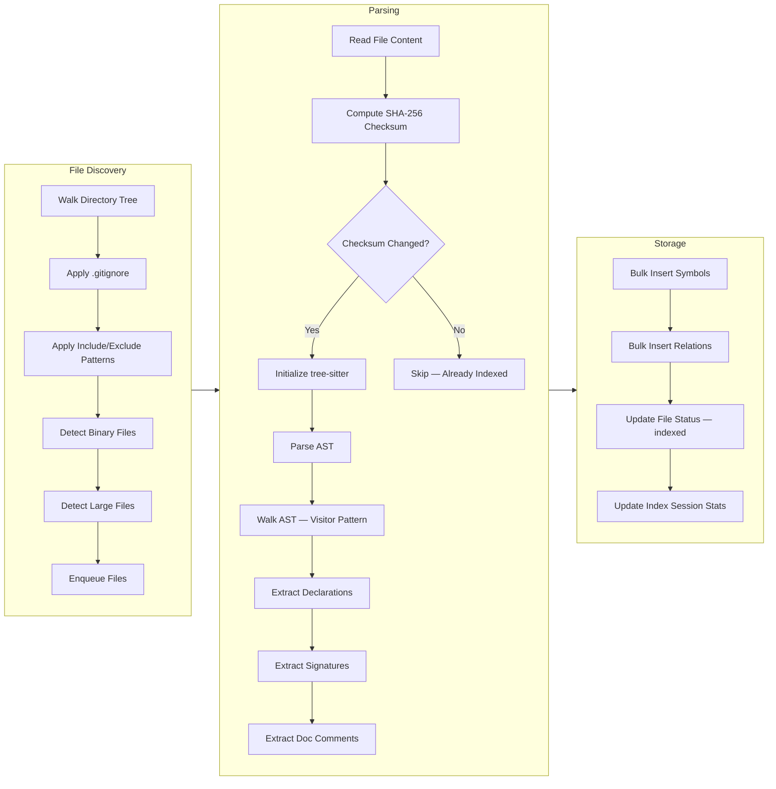
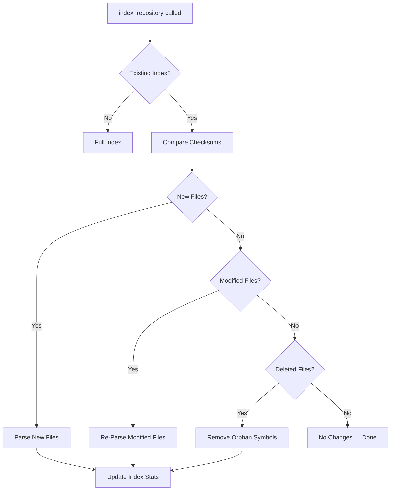
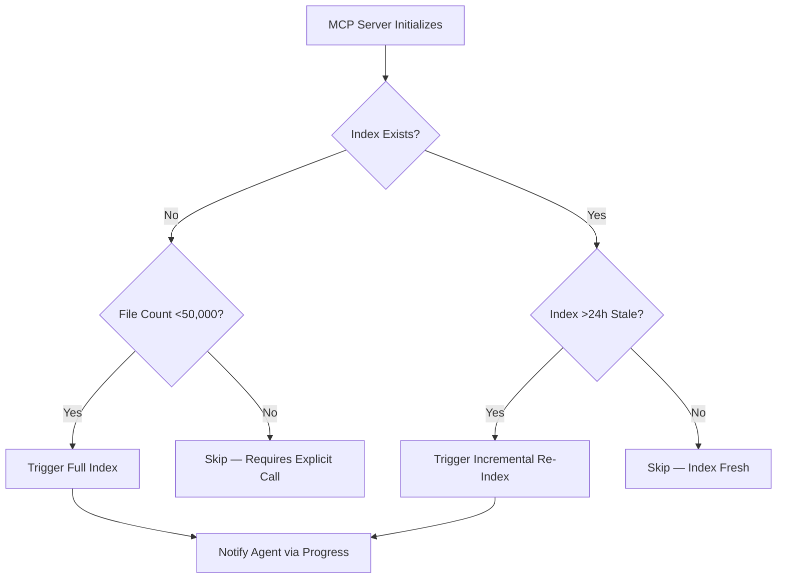
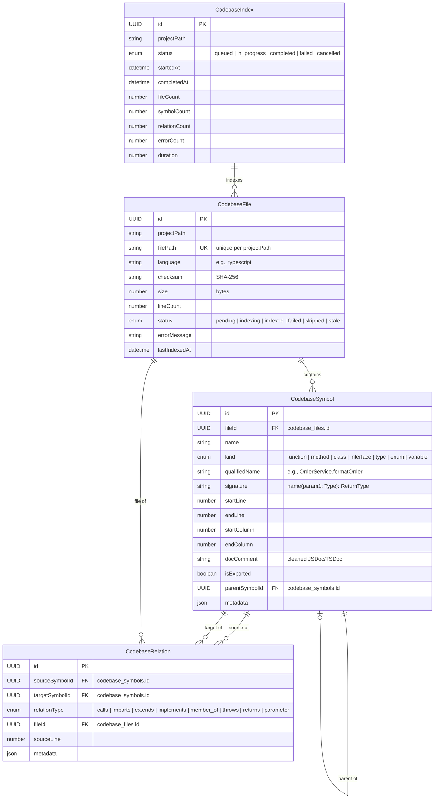

# Feature: Codebase Indexing Pipeline

## User Stories

### US-01: Index Project on Demand

> As an **AI agent (autonomous)**, I want to **trigger indexing of the current project** so that **I can query the code graph without a separate setup step**.

**Priority**: P0 (MVP) | **Effort**: L | **Depends on**: File discovery, tree-sitter parsing, SQLite storage

### US-02: Discover Indexable Files

> As an **AI agent**, I want the **indexer to automatically find all relevant source files while respecting `.gitignore`** so that **I only query files that are part of the project, not dependencies or build artifacts**.

**Priority**: P0 (MVP) | **Effort**: S | **Depends on**: Nothing (foundational)

### US-03: Search Symbols by Name

> As an **AI agent**, I want to **search for symbols (functions, classes, interfaces, types) by name using exact, prefix, and fuzzy matching** so that **I can find relevant code without grepping through the filesystem**.

**Priority**: P0 (MVP) | **Effort**: M | **Depends on**: SQLite storage

### US-04: List Symbols in a File

> As an **AI agent**, I want to **retrieve all symbols defined in a specific file** so that **I can understand a module's public API at a glance without reading the entire file**.

**Priority**: P0 (MVP) | **Effort**: S | **Depends on**: SQLite storage

## Acceptance Criteria

### AC-01: File Discovery Respects `.gitignore` [Ubiquitous]

> **Applies to**: M1 — File discovery and filtering

The system SHALL:

- Discover source files for indexing.
- Read `.gitignore` from the project root and each subdirectory.
- Exclude all files and directories matched by `.gitignore` patterns.
- Exclude `node_modules`, `.git`, and `dist` directories even if not listed.
- Support configurable include patterns defaulting to `["**/*.ts", "**/*.tsx", "**/*.js", "**/*.jsx"]`.

**Test**: Given a project with 100 source files and 50 files in `node_modules`, when file discovery runs, then exactly 100 files are returned.

### AC-02: tree-sitter Parsing Extracts Declarations [Event-driven]

> **Applies to**: M2 — tree-sitter AST parsing

When the system parses a TypeScript or JavaScript file via tree-sitter, THEN it SHALL:

- Extract all top-level declarations including functions, classes, interfaces, types, enums, and exported variables.
- Extract method declarations within classes.
- Record symbol name, kind, start line, end line, start column, end column, file path, and doc comment.
- Extract function/method signatures (parameters with names and types, return type).

**Test**: Given a 100-line TypeScript file with 5 functions, 2 classes, 1 interface, and 1 type alias, when parsed, then 9+ symbol records are produced.

### AC-10: Binary and Unsupported Files Are Skipped [Ubiquitous]

> **Applies to**: M1, M2 — File discovery and parsing

The system SHALL:

- Detect binary files by reading the first 512 bytes and checking for null bytes.
- Skip binary files without attempting to parse them.
- Skip files with extensions not in the configured include patterns.
- Log a warning for each skipped file at DEBUG level.
- NOT crash or abort indexing when encountering unsupported files.

**Test**: Given a directory containing a `.png` file, a `.py` file, and a `.ts` file, when indexing runs, then exactly 1 file is parsed (the `.ts` file).

### AC-11: Symlinks Are Resolved Safely [Ubiquitous]

> **Applies to**: M1 — File discovery

The system SHALL:

- Follow symbolic links to directories during file discovery.
- Detect and skip circular symlinks.
- Detect symlinks pointing outside the project root and skip them (configurable).
- Store the real (resolved) path for symlinked files.

**Test**: Given a symlink `src/utils` pointing to `../shared/utils`, when file discovery runs, then files under the resolved path are indexed with their real paths.

### AC-12: Large File Handling [State-driven]

> **Applies to**: M2 — tree-sitter parsing

While a file exceeds 10,000 lines, the system SHALL still parse the file but SHALL limit AST depth to 500 nodes. While a file exceeds 50,000 lines, the system SHALL skip the file and log a warning. While the total project exceeds 10,000 files, the system SHALL index all files but SHALL report the total count and estimated completion time.

**Test**: Given a project with 3 files of 200 lines, 1 file of 60,000 lines, and 1 file of 12,000 lines, when indexing runs, then the 60K-line file is skipped, the 12K-line file is shallow-parsed, and the 200-line files are fully parsed.

### AC-08: Incremental Re-Index Detects Changes [Event-driven]

> **Applies to**: S4 — Incremental re-indexing

When `index_project` is called with `incremental=true`, THEN the system SHALL:

- Compare file modification timestamps (mtime) against stored index timestamps.
- Re-parse only files whose mtime is newer than the last index timestamp.
- Detect deleted files and remove their symbols.
- Detect new files and add them to the index.

**Test**: Given an indexed project with 50 files, when 1 file is modified and 1 file is added, then incremental re-index processes exactly 2 files.

### AC-13: Index Staleness Detection [State-driven]

> **Applies to**: S4 — Incremental re-indexing

While a file's modification timestamp is newer than its last indexed timestamp, the system SHALL consider that file stale. While a file has been deleted from the filesystem but still exists in the index, the system SHALL remove its symbols on the next incremental re-index.

**Test**: Given an index of "file A" (stale mtime) and "file B" (fresh mtime), when incremental re-index runs, then only "file A" is re-parsed.

### AC-15: Auto-Index Lifecycle [Event-driven]

> **Applies to**: S5 — Auto-index on session start

When the MCP server initializes a new session, THEN the system SHALL:

- Check whether a codebase index exists for the current project root.
- If no index exists, trigger a full index automatically.
- If an index exists and is stale (older than 24 hours), trigger an incremental re-index.
- If an index exists and is fresh, skip indexing.
- Enforce a file count guard (default max 50,000 files) to prevent runaway indexing.

**Test**: Given a project with no existing index, when the MCP session starts, then indexing begins automatically and completes within 60 seconds.

## Business Flow



### Multi-Pass Pipeline

```
Phase 1 (MVP):     [DISCOVERY] → [PARSE DECLARATIONS] → [STORE SYMBOLS]
Phase 1.1:         + [RESOLVE RELATIONS] → extract calls, imports, extends
Phase 1.2+:        + [HOTSPOT ANALYSIS] → compute reference counts, detect dead code
```

### Incremental Flow



### Auto-Index on Session Start



## Business Rules

### Indexing Rules

1. **Idempotency**: Running `index_repository` twice with no file changes produces identical results. Checksum comparison guarantees this.
2. **Partial Progress**: If indexing is interrupted mid-way, already-indexed files retain their `indexed` status. On restart, only `pending`/`stale` files are re-processed.
3. **File Limit Guard**: Files exceeding the configured size limit (default: 1MB) are skipped with `skipped` status.
4. **Binary Detection**: Files identified as binary (via null byte detection in first 512 bytes) are skipped silently.
5. **Single Active Index**: Only one `index_repository` call per `projectPath` can be `in_progress` at a time. Duplicate requests receive current progress.
6. **Checksum Dedup**: SHA-256 checksum is computed before parsing. On incremental re-index, if `checksum(new) === checksum(stored)`, the file is skipped entirely.
7. **File Status Transitions**: `pending → indexing → indexed`; any state → `failed` on error; `indexed → stale` on checksum mismatch.

### Error Handling

| Scenario                  | Behavior                                                        |
| :------------------------ | :-------------------------------------------------------------- |
| File parse error          | Log warning, store partial symbols, record error in file record |
| File too large (>1MB)     | Skip file, record as `skipped` with reason                      |
| Binary file detected      | Skip silently (DEBUG log)                                       |
| tree-sitter init failure  | Fail entire index operation, return error                       |
| SQLite write failure      | Rollback transaction, return error                              |
| Concurrent index request  | Return "already indexing" with current progress                 |
| Empty project (no files)  | Complete with zero files indexed                                |
| Permission denied on file | Skip file, record as `skipped` with reason                      |
| Symlink cycle detected    | Skip symlink, log warning                                       |
| Language not supported    | Skip file, record as `skipped` with reason                      |
| Index interrupted (crash) | On next start, detect incomplete index, re-index from scratch   |

## Data Model



### Entity Invariants

- **CodebaseFile**: `filePath` unique per `projectPath`. `checksum` recomputed on every successful re-parse.
- **CodebaseSymbol**: `name` must not be empty. `fileId` must reference an existing file. `startLine ≤ endLine`. Cascade delete: deleting a file deletes all its symbols.
- **CodebaseRelation**: `sourceSymbolId ≠ targetSymbolId` (no self-references). Composite unique: `(sourceSymbolId, targetSymbolId, relationType)`. Cascade delete: deleting a symbol deletes all relations referencing it.
- **CodebaseIndex**: Only one active `in_progress` index per `projectPath` at a time. `completedAt` and `duration` set on completion/failure.

## Value Objects

### FileStatus

| Value      | Description                                                          |
| :--------- | :------------------------------------------------------------------- |
| `pending`  | File discovered but not yet indexed                                  |
| `indexing` | File is currently being parsed                                       |
| `indexed`  | File parsed successfully, symbols stored                             |
| `failed`   | File parsing failed; `errorMessage` contains the error               |
| `skipped`  | File intentionally skipped (binary, too large, unsupported language) |
| `stale`    | File changed since last index, needs re-index                        |

### SymbolKind

| Value       | tree-sitter Node Type             | Description                        |
| :---------- | :-------------------------------- | :--------------------------------- |
| `function`  | `function_declaration`            | Standalone function declaration    |
| `method`    | `method_definition`               | Method defined inside a class      |
| `class`     | `class_declaration`               | Class declaration                  |
| `interface` | `interface_declaration`           | Interface declaration (TypeScript) |
| `type`      | `type_alias_declaration`          | Type alias (TypeScript)            |
| `enum`      | `enum_declaration`                | Enum declaration (TypeScript)      |
| `variable`  | `variable_declaration` (exported) | Exported variable/constant         |

### IndexStatus

| Value         | Description                                     |
| :------------ | :---------------------------------------------- |
| `queued`      | Index request received, not yet started         |
| `in_progress` | Indexing is actively running                    |
| `completed`   | Indexing finished successfully                  |
| `failed`      | Indexing terminated with an unrecoverable error |
| `cancelled`   | Indexing was cancelled by user/abort signal     |

## Compliance & Audit Notes

- All tool invocations are logged to `action_log` with action type `index`, source agent, and duration.
- Progress notifications are emitted via `notifications/progress` during `index_repository`.
- File errors (parse failures, permission denied) are recorded in `codebase_files.errorMessage` for auditability.
- Index session records (`codebase_index`) provide full history of all indexing operations with timestamps and counts.
- Write operations (`index_repository`) execute under `store.withWrite()` for concurrent safety.
- The module respects the same session-scoped `owner`/`repo` injection as all other MCP tools.

## Backend Tasks

| ID  | Task                               | Effort | Depends On | Files                          |
| :-- | :--------------------------------- | :----: | :--------- | :----------------------------- |
| T1  | File Discovery Service             |   S    | —          | `file-discovery.ts`            |
| T2  | SQLite Storage Schema & Migrations |   M    | —          | `entity.ts`, `schema.ts`       |
| T3  | tree-sitter Parser Integration     |   L    | T1, T2     | `parser.ts`, `ast-visitors.ts` |
| T4  | Index Orchestrator                 |   M    | T1, T2, T3 | `indexer.ts`                   |
| T9  | Incremental Re-Indexing            |   M    | T4         | `indexer.ts` (extension)       |
| T10 | Auto-Index on Session Start        |   S    | T4         | `indexer.ts` (lifecycle hook)  |

## UI / Layout Specification (Phase 1.2)

### Index Status Widget

Displayed in the dashboard Codebase tab header. Shows real-time indexing state.

```
┌──────────────────────────────────────────────────┐
│  Codebase Index                         [Re-Index] │
│                                                    │
│  Status: ● Idle (last indexed: 5 min ago)          │
│  Files: 1,247 indexed  ·  12 skipped  ·  3 failed  │
│  Symbols: 14,892  ·  Relations: 8,341              │
│  Languages: TS (1,024), JS (223)                   │
└──────────────────────────────────────────────────┘
```

### Progress Indicator

Shown during active indexing. Updates in real-time via MCP notifications.

```
┌──────────────────────────────────────────────────┐
│  Indexing in progress...                          │
│  ━━━━━━━━━━━━━━━━━━━━━━░░░░░░ 78%                 │
│  1,023 / 1,312 files processed                    │
│  12 errors  ·  8 skipped  ·  ETA: 12s             │
└──────────────────────────────────────────────────┘
```

### Color States

| State    | Indicator         | Description                    |
| :------- | :---------------- | :----------------------------- |
| Idle     | ● Green           | Index exists and is fresh      |
| Indexing | ● Blue (animated) | Index operation in progress    |
| Stale    | ● Yellow          | Index >24h old, needs re-index |
| Error    | ● Red             | Last index had errors          |
| No Index | ○ Gray            | Project not yet indexed        |
