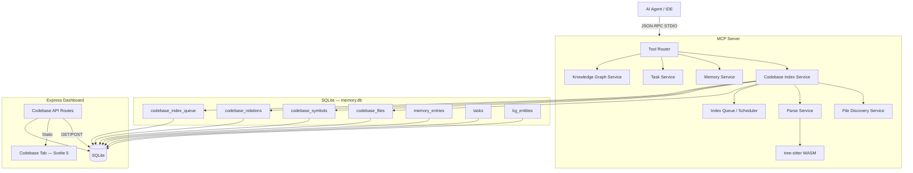
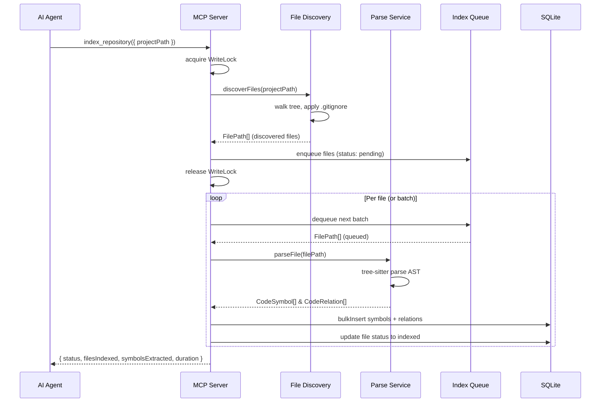

# Module Overview: Codebase Index

## Header & Navigation

- [Indexing Pipeline Feature](indexing.md)
- [Symbol Search Feature](search.md)
- [Architecture Query Feature](architecture-overview.md)
- [Design — Architecture](../../design/codebase-index/architecture.md)
- [Design — Domain Model](../../design/codebase-index/domain.md)
- [Design — API Contracts](../../design/codebase-index/api-contracts.md)
- [Requirements — User Stories](../../requirements/codebase-index/user-stories.md)
- [Requirements — Acceptance Criteria](../../requirements/codebase-index/acceptance-criteria.md)
- [Requirements — Feature Decomposition](../../requirements/codebase-index/feature-decomposition.md)
- [MCP Server Module](../mcp-server/overview.md)
- [Dashboard Module](../dashboard/overview.md)

## Responsibility

The `codebase-index` module provides structured code intelligence for the MCP server. It enables AI agents to parse, index, and query source code structure without reading every file. Using tree-sitter WASM for AST-level parsing, it extracts declarations (functions, classes, interfaces, types, enums, methods), resolves cross-file relationships, and exposes the indexed graph via MCP tools and dashboard routes.

The module is designed as a self-contained subsystem within the existing MCP server, sharing the SQLite database but operating on its own set of tables. It follows the same modular entity pattern as `MemoryEntity`, `TaskEntity`, and the knowledge graph.

## Features

| Feature                   | Description                                                                                                                                                     | Doc Link                                             |
| :------------------------ | :-------------------------------------------------------------------------------------------------------------------------------------------------------------- | :--------------------------------------------------- |
| **Indexing Pipeline**     | Discover source files, parse with tree-sitter, store symbols and relations in SQLite. Supports full and incremental indexing with checksum-based deduplication. | [indexing.md](indexing.md)                           |
| **Symbol Search & Query** | Search indexed symbols by name (exact, prefix, substring), filter by kind, retrieve file-level symbol listings with signatures and doc comments.                | [search.md](search.md)                               |
| **Architecture Overview** | Query aggregate project structure, entry points, hotspot detection, and directory statistics.                                                                   | [architecture-overview.md](architecture-overview.md) |
| **Call Trace**            | Follow inbound/outbound call chains with configurable depth for blast radius analysis.                                                                          | [architecture-overview.md](architecture-overview.md) |
| **Auto-Indexing**         | Automatically index on session start; incremental re-index when files change.                                                                                   | [indexing.md](indexing.md)                           |

## Architecture

The Codebase Index integrates into the MCP server as a new service layer. It shares the existing SQLite database (`memory.db`) and follows the same entity pattern, but adds its own tables (`codebase_files`, `codebase_symbols`, `codebase_relations`, `codebase_index_queue`).



### Data Flow — Index Pipeline



## Core Services

### 1. File Discovery Service

Recursive directory walker with `.gitignore` integration via the `ignore` package. Handles include/exclude patterns, binary file detection (magic bytes), symlink resolution with cycle detection, and size limit guards (default 1MB). Language detection via file extension mapping.

### 2. Parser Service

Initializes tree-sitter WASM once at module load. Loads language grammar WASM files (TypeScript/JavaScript MVP). Performs AST traversal with a visitor pattern to extract declarations. Extracts signatures (parameters with names/types, return type) and JSDoc/TSDoc comments. Implements error recovery — partial symbols are stored even when syntax errors are present.

### 3. Index Scheduler / Queue

Coordinates the multi-pass indexing pipeline. Enqueues discovered files, manages batch processing with progress reporting, handles concurrency guards (single active index at a time), and orchestrates full vs. incremental re-index strategies.

### 4. Symbol Store

Manages the `codebase_symbols` table. Provides CRUD operations for extracted declarations with indexing on name, kind, file ID, and qualified name. Handles bulk inserts within transactions and cascade deletes when files are removed.

### 5. Relation Store

Manages the `codebase_relations` table. Stores directed edges between symbols (calls, imports, extends, implements, member_of, throws, returns, parameter). Enforces composite uniqueness per `(sourceSymbolId, targetSymbolId, relationType)` and cascade deletes.

### 6. MCP Tools

Registers 6 MCP tools via the `registerAllTools()` pipeline:

- `index_repository` — write tool (under write lock)
- `get_file_symbols` — read tool
- `search_symbols` — read tool
- `get_architecture` — read tool
- `trace_symbol` — read tool
- `index_status` — read tool

All tools follow existing patterns: Zod validation, action logging, session-scoped owner/repo injection, progress notifications.

### 7. AutoIndexer

Hooks into the MCP server initialization lifecycle. On session start, checks for existing index — triggers full index if absent, incremental re-index if stale (>24h), or skips if fresh. Enforces a file count guard (default 50,000 files) to prevent runaway indexing.

### 8. Dashboard Tab (Phase 1.2)

Express API routes (`/api/codebase/*`) and a Svelte 5 UI tab providing visual browsing of files, symbols, search, and index status. Routes follow the existing controller pattern in `src/dashboard/routes/`.

## Dependencies

- **`web-tree-sitter`**: Node.js WASM bindings for tree-sitter. Loaded once at module init, cached for process lifetime.
- **`@tree-sitter-grammars/tree-sitter-typescript`**: TypeScript/JavaScript grammar WASM (MVP languages).
- **`ignore`**: `.gitignore` pattern matching for file discovery.
- **`better-sqlite3`**: Shared SQLite instance for persistence (existing dependency).
- **`uuid`**: Unique identifier generation (existing dependency).
- **`zod`**: Schema validation for tool parameters (existing dependency).

### Language Support Matrix

| Phase     | Language   | Grammar Package                                | Include Patterns                  |
| :-------- | :--------- | :--------------------------------------------- | :-------------------------------- |
| MVP       | TypeScript | `@tree-sitter-grammars/tree-sitter-typescript` | `*.ts`, `*.tsx`                   |
| MVP       | JavaScript | Same package (shared grammar)                  | `*.js`, `*.jsx`, `*.mjs`, `*.cjs` |
| Phase 1.2 | Python     | `tree-sitter-python`                           | `*.py`, `*.pyi`                   |
| Phase 1.2 | Rust       | `tree-sitter-rust`                             | `*.rs`                            |
| Phase 1.2 | Go         | `tree-sitter-go`                               | `*.go`                            |
| Phase 1.2 | PHP        | `tree-sitter-php`                              | `*.php`                           |

## Security Invariants

- **Path Validation**: All `projectPath` values are validated against MCP root boundaries.
- **Write Locking**: `index_repository` executes under `store.withWrite()` — only one active index at a time.
- **Binary Detection**: Binary files are detected via null bytes in the first 512 bytes and skipped.
- **Size Limits**: Files exceeding 1MB (configurable) are skipped to prevent resource exhaustion.
- **Read-Only Queries**: Search, file symbols, architecture, and trace tools execute outside the write lock.
- **No Code Execution**: tree-sitter operates on AST level only — no code is ever executed.
- **Incremental Safety**: Checksum-based change detection ensures idempotent re-indexing.
- **File Count Guard**: Auto-index aborts if the project exceeds 50,000 files (requires explicit call).

## Performance Targets

| Metric                     | Target              | Condition                   |
| :------------------------- | :------------------ | :-------------------------- |
| Cold index (<10K files)    | < 60 seconds        | Full re-index               |
| Incremental index          | < 10 seconds        | <100 files changed          |
| `search_symbols` latency   | < 100ms             | Indexed, results <500       |
| `get_file_symbols` latency | < 50ms              | Single file                 |
| Storage overhead           | < 50MB for 100K LOC | Symbols + relations + files |
| Memory usage during index  | < 2GB peak          | Large project (<50K files)  |

## Directory Structure

```
src/codebase-index/
├── entity.ts                  # CodebaseIndexEntity (extends BaseEntity)
├── file-discovery.ts          # FileDiscoveryService
├── parser.ts                  # tree-sitter parser orchestration
├── ast-visitors.ts            # Language-specific AST visitors
├── indexer.ts                 # Index orchestrator (pipeline coordination)
├── mcp-tools.ts               # MCP tool handlers
├── schemas.ts                 # Zod validation schemas
├── types.ts                   # TypeScript interfaces
├── resource-handlers.ts       # MCP resource URI handlers (Phase 1.2)
└── __tests__/
    ├── entity.test.ts
    ├── file-discovery.test.ts
    ├── parser.test.ts
    ├── mcp-tools.test.ts
    └── fixtures/
        ├── sample-class.ts
        ├── sample-function.ts
        ├── sample-interface.ts
        └── sample-syntax-error.ts
```
