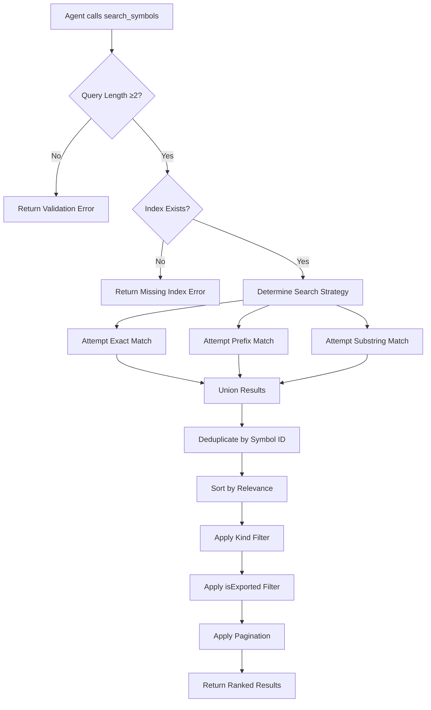
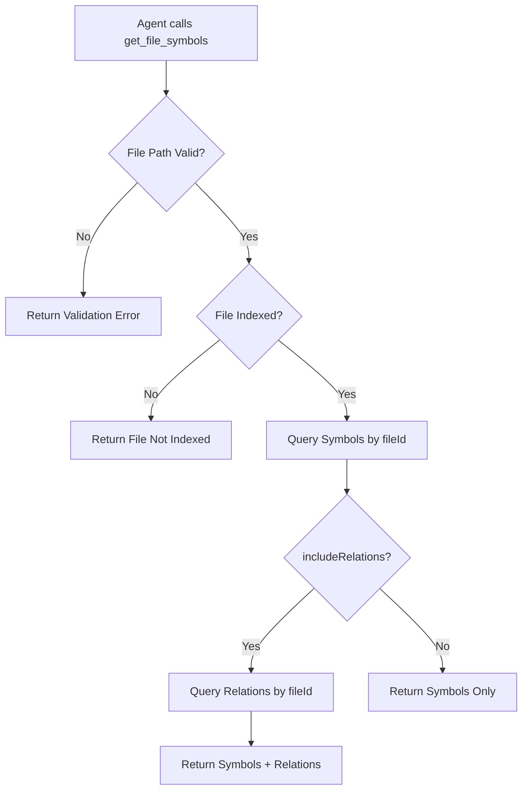
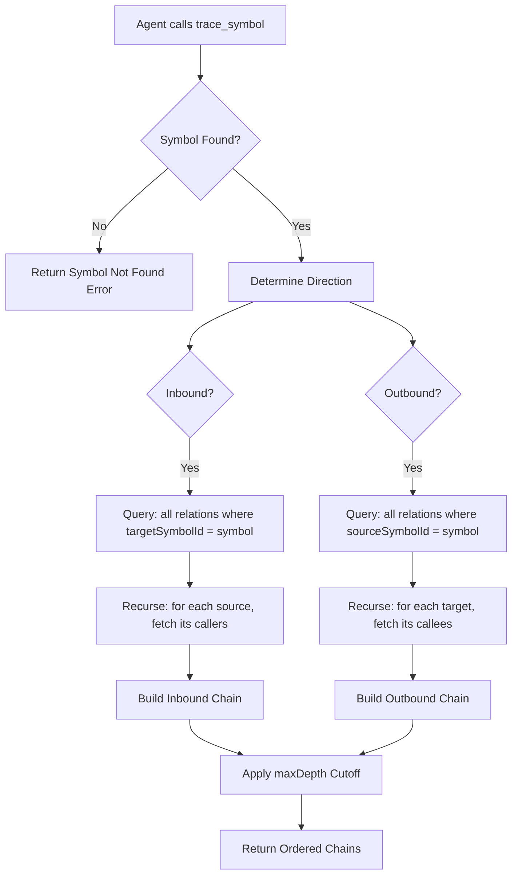
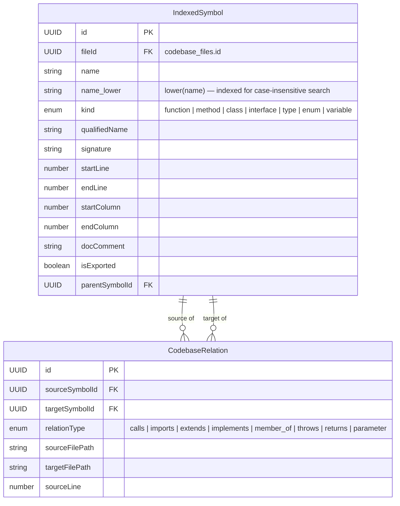

# Feature: Symbol Search & Query

## User Stories

### US-05: Understand Function Signatures

> As an **AI agent (sub-agent)**, I want to **get the full signature of a function including parameters and return type** so that **I can call it correctly in generated code without guessing parameter names**.

**Priority**: P0 (MVP) | **Effort**: M | **Depends on**: tree-sitter parsing with signature extraction

### US-06: Get Symbol Documentation

> As an **AI agent**, I want to **retrieve JSDoc/TSDoc comments associated with a symbol** so that **I can understand its purpose and usage conventions without reading its implementation body**.

**Priority**: P0 (MVP) | **Effort**: S | **Depends on**: tree-sitter parsing with doc comment extraction

### US-07: Trace Call Relationships

> As an **AI agent (reviewer)**, I want to **trace which functions call a given function and which functions it calls** so that **I can assess the blast radius of a change before writing code**.

**Priority**: P1 (Should) | **Effort**: L | **Depends on**: Cross-file call resolution

### US-08: Incremental Re-Index

> As a **developer**, I want the **index to update automatically when I modify files** so that **the code graph is never stale without requiring a full re-index**.

**Priority**: P1 (Should) | **Effort**: L | **Depends on**: File watcher, mtime tracking

## Acceptance Criteria

### AC-03: Symbol Search Returns Relevant Results [Ubiquitous]

> **Applies to**: M4 — `search_symbols` tool

The `search_symbols` tool SHALL:

- Support exact-match queries.
- Support prefix-match queries.
- Support case-insensitive substring-match queries.
- Return results ordered by relevance (exact > prefix > substring).
- Return name, kind, file path, line number, signature, and doc comment for each match.
- Limit results to a configurable maximum (default 50, max 500).
- Return an empty array (not an error) when no symbols match.

**Test**: Given an indexed codebase containing `formatOrder`, `formatOrderItem`, and `OrderFormatter`, when searching for `"formatOrder"`, then `formatOrder` is the first result.

### AC-04: Search Performance Meets SLA [State-driven]

> **Applies to**: M4 — `search_symbols` tool

While the codebase contains fewer than 500,000 indexed symbols, the `search_symbols` tool SHALL respond within 200ms for exact-match queries and within 500ms for substring-match queries.

**Test**: Given an index of 100,000 symbols, when an exact-match search is performed, then P99 latency < 200ms.

### AC-05: get_file_symbols Returns File Contents [Event-driven]

> **Applies to**: M5 — `get_file_symbols` tool

When `get_file_symbols` is called with a valid indexed file path, THEN it SHALL:

- Return all symbols defined in that file with name, kind, line range, and signature.
- Include exported vs non-exported status for each symbol.
- Order symbols by their declaration order in the file.

**Test**: Given an indexed file with 3 classes and 5 functions, when `get_file_symbols` is called, then 8 symbols are returned in source order.

### AC-06: Doc Comments Are Preserved [Ubiquitous]

> **Applies to**: M2 — tree-sitter AST parsing

The system SHALL:

- Extract the full JSDoc or TSDoc comment block immediately preceding a symbol declaration.
- Trim leading `*` characters and whitespace from doc comment lines.
- Store the cleaned doc comment text with the symbol record.
- Handle symbols without doc comments (store null/empty).

**Test**: Given a file where `calculateTotal` has a JSDoc comment and `helper` does not, when parsed, then `calculateTotal` has a non-empty doc comment and `helper` has null.

### AC-07: Error Handling for Missing Index [Unwanted]

> **Applies to**: M4, M5 — MCP tools

The `search_symbols` and `get_file_symbols` tools SHALL return a clear error message when the project has not been indexed. The error message SHALL include instructions to run the `index_repository` command. The tools SHALL NOT crash or return partial data when no index exists.

**Test**: Given a fresh local-memory-mcp instance with no codebase index, when `search_symbols("foo")` is called, then a user-friendly error about missing index is returned.

### AC-09: trace_symbol Returns Ordered Call Chains [Event-driven]

> **Applies to**: S2 — `trace_symbol` tool

When `trace_symbol` is called with a symbol name and direction "inbound", THEN it SHALL return an ordered list of all functions that directly call the given symbol. When called with direction "outbound", it SHALL return an ordered list of all functions directly called by the given symbol. When called with a symbol that has no callers or callees, it SHALL return an empty array. It SHALL support a `maxDepth` parameter to limit chain depth (default 1, max 10).

**Test**: Given `function A() calls B() calls C()`, when tracing inbound for `C`, then `[B, A]` is returned (respecting depth limit).

## Business Flow

### Symbol Search



### File Symbol Retrieval



### Call Trace



## Business Rules

### Search Rules

1. **Search Strategy**: Three-tier matching (exact → prefix → substring) unioned, deduplicated, and ranked by match quality.
2. **Case Insensitivity**: All searches use `COLLATE NOCASE` for case-insensitive matching.
3. **Minimum Query Length**: Queries must be at least 2 characters (validated by Zod).
4. **Pagination**: Default 50 results per page, maximum 500. Supports `offset` for pagination.
5. **Empty Results**: Return `{ symbols: [], total: 0 }` — not an error — when no symbols match.
6. **Kind Filtering**: Results can be narrowed by `SymbolKind` (function, class, interface, type, enum, variable).
7. **Export Filter**: Optional `isExported` boolean to limit to public API symbols.

### File Symbol Rules

1. **Source Ordering**: Symbols are returned in declaration order (sorted by `startLine`, then `startColumn`).
2. **Relation Inclusion**: Relations are only included when `includeRelations=true` (default: false for performance).
3. **Nested Symbols**: Methods are included as child symbols with `parentSymbolId` pointing to the containing class.
4. **Qualified Names**: For nested symbols, `qualifiedName` is derived from the parent chain (e.g., `OrderService.formatOrder`).

### Call Trace Rules

1. **No Self-References**: `sourceSymbolId ≠ targetSymbolId` is enforced at the relation level.
2. **Depth Limit**: Default `maxDepth = 1`, configurable up to 10. Results at depth > maxDepth are excluded.
3. **Cycle Protection**: The trace algorithm detects and breaks cycles to prevent infinite recursion.
4. **Direction Semantics**: "inbound" = who calls this symbol; "outbound" = what this symbol calls.
5. **Ambiguous Names**: When multiple symbols share a name, trace operates on the best match. The response includes the file path for disambiguation.
6. **Empty Chains**: Symbols with no callers/callees return empty arrays, not errors.

## Data Model — Search Indexes



### Indexes

| Table                | Index                    | Purpose                                  |
| :------------------- | :----------------------- | :--------------------------------------- |
| `codebase_symbols`   | `idx_symbols_name`       | Fast name lookup (exact + prefix `LIKE`) |
| `codebase_symbols`   | `idx_symbols_name_lower` | Case-insensitive search                  |
| `codebase_symbols`   | `idx_symbols_file_id`    | File-scoped queries (`get_file_symbols`) |
| `codebase_symbols`   | `idx_symbols_kind`       | Kind-based filtering                     |
| `codebase_symbols`   | `idx_symbols_parent`     | Nested symbol queries                    |
| `codebase_relations` | `idx_relations_source`   | Outbound trace queries                   |
| `codebase_relations` | `idx_relations_target`   | Inbound trace queries                    |
| `codebase_relations` | `idx_relations_type`     | Relation type filtering                  |
| `codebase_relations` | `idx_relations_file`     | File-scoped relation lookup              |

### Search Quality Ranking

| Match Type | SQL Pattern                          | Score | Example                         |
| :--------- | :----------------------------------- | :---: | :------------------------------ |
| Exact      | `name = ? COLLATE NOCASE`            |  100  | `search_symbols("formatOrder")` |
| Prefix     | `name LIKE 'query%' COLLATE NOCASE`  |  75   | `search_symbols("format")`      |
| Substring  | `name LIKE '%query%' COLLATE NOCASE` |  50   | `search_symbols("Order")`       |

Results are ordered by descending score, then by name alphabetically, then by file path.

## UI / Layout Specification (Phase 1.2)

### SearchBar

```
┌────────────────────────────────────────────────────────┐
│  🔍 Search symbols...          [Kind: All ▼] [Exported] │
│                                                          │
│  Recent searches: formatOrder · calculateTotal · handle  │
└──────────────────────────────────────────────────────────┘
```

**Behavior**:

- Debounced input (300ms) — triggers search on pause
- Dropdown for kind filter (All, Function, Class, Interface, Type, Enum, Variable)
- Toggle switch for "Exported only"
- Recent searches stored in `localStorage`
- Keyboard shortcut: `Cmd+K` or `Ctrl+K` to focus
- Displays "No index found. Run index_repository first." when no index exists

### SymbolList

```
┌──────────────────────────────────────────────────────┐
│  Results (142) — showing 1-50                        │
│                                                      │
│  ├─ formatOrder                                      │
│  │   function formatOrder(items: OrderItem[]): Order │
│  │   src/services/order-service.ts:42-58  · exported │
│  │                                                    │
│  ├─ formatOrderItem                                  │
│  │   function formatOrderItem(item: OrderItem): void │
│  │   src/services/order-service.ts:61-65  · exported │
│  │                                                    │
│  └─ OrderFormatter                                   │
│      class OrderFormatter                             │
│      src/utils/formatting.ts:1-89  · exported         │
│                                                       │
│  [< Prev]  Page 1 of 3  [Next >]                     │
└──────────────────────────────────────────────────────┘
```

**Behavior**:

- Each result shows: name, kind badge, signature (truncated), file path, line range, export badge
- Clicking a row opens SymbolDetail panel
- Pagination at bottom (prev/next, page indicator)
- Empty state: "No symbols found matching 'query'"

### SymbolDetail Panel

Slide-over drawer opened by clicking a symbol in the list:

```
┌──────────────────────────────────────────────────┐
│  Symbol Detail                           [Close] │
│                                                   │
│  formatOrder                                       │
│  function · exported                               │
│                                                   │
│  Signature:                                        │
│  formatOrder(items: OrderItem[]): Order            │
│                                                   │
│  Location:                                         │
│  src/services/order-service.ts:42-58              │
│                                                   │
│  Documentation:                                    │
│  ┌──────────────────────────────────────────────┐ │
│  │ Formats a list of order items into a single  │ │
│  │ Order object. Validates quantities and       │ │
│  │ applies discounts before calculation.        │ │
│  │                                              │ │
│  │ @param items - Array of order items to format│ │
│  │ @returns Formatted Order object              │ │
│  │ @throws ValidationError if items are empty   │ │
│  └──────────────────────────────────────────────┘ │
│                                                   │
│  Relations:                                        │
│  ┌──────────────────────────────────────────────┐ │
│  │ Inbound (callers):                            │ │
│  │  ├─ createOrder    src/api/orders.ts:102     │ │
│  │  └─ bulkImport     src/jobs/import.ts:45     │ │
│  │                                               │ │
│  │ Outbound (callees):                           │ │
│  │  ├─ validateItems  src/services/validate.ts  │ │
│  │  ├─ applyDiscount  src/services/pricing.ts   │ │
│  │  └─ calculateTotal src/services/pricing.ts   │ │
│  └──────────────────────────────────────────────┘ │
└──────────────────────────────────────────────────┘
```

### Call Graph Visualization

An interactive force-directed graph showing symbol relationships:

```
┌──────────────────────────────────────────────────────┐
│  Call Graph: formatOrder                   [🔍 Zoom] │
│                                                       │
│                ┌──────────────┐                       │
│                │  createOrder  │                       │
│                │  src/api/     │                       │
│                └──────┬───────┘                       │
│                       │ calls                          │
│                       ▼                                │
│                ┌──────────────┐                       │
│                │  formatOrder  │◄───── calls ────┐    │
│                │  (selected)   │                  │    │
│                └──┬───┬────┬──┘                  │    │
│          calls   │   │    │   calls               │    │
│       ┌──────────┘   │    └──────────┐            │    │
│       ▼              ▼               ▼            │    │
│  ┌──────────┐ ┌──────────┐ ┌──────────────┐      │    │
│  │validate  │ │apply     │ │calculateTotal │      │    │
│  │Items     │ │Discount  │ │              │      │    │
│  │src/svc/  │ │src/svc/  │ │ src/svc/     │      │    │
│  └──────────┘ └──────────┘ └──────────────┘      │    │
│                                                   │    │
│  [Inbound] [Outbound] [Both]  [Depth: 1 ▼]       │    │
│                                                   │    │
│  Node size = reference count  ·  Color = kind     │    │
└──────────────────────────────────────────────────────┘
```

**Graph Controls**:

- **Direction toggle**: Show inbound, outbound, or both
- **Depth slider**: 1-5 levels of transitive calls
- **Node interaction**: Click node to re-center, hover for tooltip (file path, line)
- **Zoom**: Mouse wheel or pinch-to-zoom
- **Layout**: Force-directed with stable anchor on selected symbol

### MCP Tool Responses Reference

**search_symbols** response example:

```json
{
	"symbols": [
		{
			"id": "a1b2c3d4-...",
			"name": "formatOrder",
			"kind": "function",
			"qualifiedName": "OrderService.formatOrder",
			"signature": "formatOrder(items: OrderItem[]): Order",
			"filePath": "src/services/order-service.ts",
			"startLine": 42,
			"endLine": 58,
			"docComment": "Formats a list of order items into a single Order object.",
			"isExported": true
		}
	],
	"total": 1,
	"limit": 50,
	"offset": 0
}
```

**trace_symbol** response example:

```json
{
	"symbol": {
		"name": "formatOrder",
		"kind": "function",
		"filePath": "src/services/order-service.ts",
		"line": 42
	},
	"inbound": [
		{
			"symbol": { "name": "createOrder", "kind": "function", "filePath": "src/api/orders.ts", "line": 102 },
			"relationType": "calls",
			"depth": 1
		}
	],
	"outbound": [
		{
			"symbol": { "name": "validateItems", "kind": "function", "filePath": "src/services/validate.ts", "line": 15 },
			"relationType": "calls",
			"depth": 1
		}
	]
}
```
