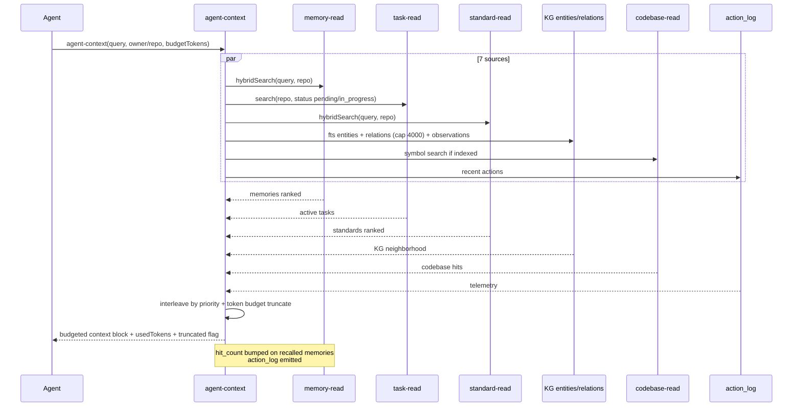
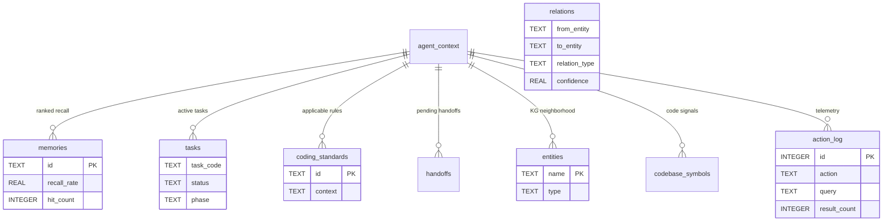

# Context Compilation — Agent-Context 7 Sources Token-Budgeted

> **Module:** `context` (cross-cutting) · **Feature:** `agent-context` 7-source token-budgeted compilation · **Tools:** `agent-context` (recall) + `memory-read`/`task-read`/`standard-read` under the hood · **Storage:** `memories` + `tasks` + `coding_standards` + `entities`/`relations`/`observations` + `action_log` + `codebase_*`

## 1. Overview

Context Compilation is the **agent-context** recall pipeline that assembles a token-budgeted prompt payload from **7 sources** before an agent acts. It is the S0 Synthesize answer to "what does this agent need to know right now?" — fusing recent memories, task-relevant standards, active task state, handoff context, knowledge graph neighborhood, codebase signals, and telemetry into a single ordered, truncated, and deduplicated context block. Budget enforcement ensures the payload fits the model's window while preserving the highest-signal items per source.

The feature is exposed as the `agent-context` MCP tool (and conceptually via `memory-read` recap + `task-read` + `standard-read` composition). It honors `owner`/`repo` scoping, `is_global` broadcast, and per-agent attribution.

## 2. User Stories

| #   | As a ...         | I want ...                                                           | So that ...                                              |
| --- | ---------------- | -------------------------------------------------------------------- | -------------------------------------------------------- |
| 1   | Agent (S0)       | to call `agent-context(query, limit)` and get 7-source fused context | I start hydrated without N tool calls                    |
| 2   | Agent (mid-task) | to re-call `agent-context` scoped to my active `task_code`           | I stay grounded as task state evolves                    |
| 3   | Orchestrator     | to get a token-budgeted summary that fits `est_tokens` accounting    | Compilation does not blow the window                     |
| 4   | Reviewer         | to see which memories/standards were recalled and acknowledged       | Recall utility (`hit_count`/`recall_rate`) is measurable |
| 5   | Operator         | to see KG neighborhood and codebase signals alongside tasks          | Cross-cutting context is not siloed                      |

## 3. Business Logic (Pseudocode)

```text
function compileAgentContext(agent, repo, query, budgetTokens):
  sources = {
    memories:   memoryRead.hybridSearch(query, repo, limit=5),
    tasks:      taskRead.search(repo, status="pending,in_progress", limit=5),
    standards:  standardRead.hybridSearch(query, repo, limit=5),
    handoffs:   handoffRead.list(repo, status=pending, to_agent=agent),
    kg:         kgContext(repo, queryTokens=40, maxEntities=50, maxEdges=4000),
    codebase:   codebaseRead.search(query, repo, limit=5) if indexed else [],
    telemetry:  actionLog.recent(repo, limit=5)
  }
  // Per-source ranking already fused (RRF for memories/standards)
  // Cross-source ordering by signal:
  ordered = interleave(sources, priority=[tasks, handoffs, memories, standards, kg, codebase, telemetry])
  // Token budgeting:
  budgeted = []
  used = 0
  for item in ordered:
    cost = estimateTokens(item)
    if used + cost > budgetTokens: break  // truncate low-priority tail
    budgeted.push(item); used += cost
  // Side effects:
  for m in budgeted.memories: bump hit_count, last_used_at
  log action_log {action:"agent-context", query, result_count: budgeted.length}
  return {context: budgeted, usedTokens: used, truncated: ordered.length > budgeted.length}

// KG context enrichment:
function kgContext(repo, query, maxEntities=50):
  entities = ftsSearchEntities(query, repo, limit=maxEntities)
  relations = fetchRelations(entities, repo, cap=KG_MAX_GRAPH_EDGES)
  observations = fetchObservations(entities, repo)
  return {entities, relations, observations}
```

Scoping: all sources filtered by `owner`/`repo`; `is_global` rows included.

## 4. Sequence Diagram



## 5. Data Model



Budget config: `KG_MAX_CONTEXT_ENTITIES=50`, `KG_CONTEXT_TEXT_TOKENS=40`, `KG_MAX_GRAPH_EDGES=4000`, `VECTOR_CANDIDATE_CAP=100`; per-source `limit` typically 5; overall budget caller-controlled.

## 6. Public Interface

| Tool / API           | Key Params                                                                      | Returns                                                                                                                                                                  |
| :------------------- | :------------------------------------------------------------------------------ | :----------------------------------------------------------------------------------------------------------------------------------------------------------------------- |
| `agent-context`      | `query`, `owner`/`repo`, `agent`, `model`, `limit` (per-source), `budgetTokens` | Fused context block: `memories[]`, `tasks[]`, `standards[]`, `handoffs[]`, `kg{entities,relations,observations}`, `codebase[]`, `telemetry[]` + `usedTokens`/`truncated` |
| `memory-read(recap)` | `owner`/`repo` (no query)                                                       | Repo summary + recent activity (subset of agent-context)                                                                                                                 |
| `synthesize`         | `query`, `owner`/`repo`                                                         | Composite synthesis via MCP sampling (requires client sampling)                                                                                                          |

Behavior: `agent`/`model` auto-populated from session (`MCP_CLIENT_NAME`/`MCP_MODEL`); `owner`/`repo` inferred from git remote + directory basename unless explicit.

## 7. Dependencies

- **Upstream sources:** `memory-read` hybrid (FTS5 + vector), `task-read` hybrid, `standard-read` hybrid, `handoff-read`, KG `entities`/`relations`/`observations`, `codebase-read` (if indexed), `action_log`.
- **Scoping:** `owner`/`repo` isolation; `is_global` included; dashboard merges by short `repo` only for display.
- **Token budget:** caller-provided `budgetTokens`; estimation via `est_tokens` accounting; `KG_CONTEXT_TEXT_TOKENS=40` tokenizes query for KG FTS.
- **Runtime profile:** `MCP_RUNTIME_PROFILE` affects vector availability (`minimal` = lexical only for memories/standards).
- **Attribution:** `agent`/`role`/`model` on recall; `hit_count`/`recall_count`/`recall_rate` updated on use.

## 8. Limitations

| Limitation                    | Detail                                                            | Mitigation                                                  |
| :---------------------------- | :---------------------------------------------------------------- | :---------------------------------------------------------- |
| Budget truncation             | Low-priority tail (telemetry/codebase) dropped under tight budget | Raise `budgetTokens` or call source-specific tools directly |
| Vectors eventually consistent | New memories/standards lexical-only until queue drains (<1s)      | RRF converges after worker batch                            |
| KG confidence display-only    | `relations.confidence` not used in ranking/filtering              | Future recomputation from observations deferred             |
| Codebase repo-keyed           | Index is `repo`-keyed, not `owner/repo`                           | Pass explicit `repo` to codebase source                     |
| Sampling-gated synthesize     | `synthesize` requires client MCP sampling support                 | Fallback to `agent-context` + manual synthesis              |
| Single workspace              | Context compiled for one `owner`/`repo` at a time                 | Re-call per repo for multi-repo tasks                       |

## 9. Compliance

- **S0 Synthesize mandatory:** orchestrator calls `memory-read(recap)` + `agent-context` before planning.
- **Scope isolation:** all 7 sources filtered by `owner`/`repo`; no cross-repo leakage.
- **Attribution & audit:** `action_log` per compilation; `task_comments` per task transition.
- **Standards gate:** `standard-read` is S1 hydrate — standards in context are normative, not advisory.
- **Anti-hallucination:** context is retrieved, not generated; thresholds (`MEMORY_CONFLICT_THRESHOLD=0.85`) guard against near-duplicate pollution.

## 10. UI Layout

Dashboard `Agent Arena` / `Stats` / `Knowledge Graph` tabs surface compiled context:

- **Arena overview:** active tasks by agent, claim ownership, pending handoffs, per-agent progress; cache TTL `ARENA_OVERVIEW_TTL_MS=5000`.
- **KG graph:** nodes (entities) + edges (relations) with confidence opacity buckets; `KG_MAX_GRAPH_EDGES=4000` cap indicator.
- **Code graph:** repo- scoped symbol graph, `CODE_GRAPH_MAX_EDGES=400` cap.
- **Stats:** repo-level counts (memories/tasks/KG) cached `DASHBOARD_STATS_TTL_MS=30000`.
- **Context inspector (future):** per-agent last `agent-context` payload with source breakdown and `usedTokens`/`truncated` badge.

## 11. Implementation Tasks

| #   | Task                                                                         | Scope                                                                                           |
| --- | ---------------------------------------------------------------------------- | ----------------------------------------------------------------------------------------------- |
| 1   | `agent-context` tool — 7-source fan-out + interleave + token budget truncate | `src/mcp/tools/agent-context.ts`, `src/mcp/services/context-compiler.ts`                        |
| 2   | `memory-read`/`standard-read` hybrid integration (RRF + tag extraction)      | `src/mcp/tools/memory.read.ts`, `src/mcp/tools/standard.read.ts`, `src/mcp/utils/query-tags.ts` |
| 3   | KG context enrichment (entity FTS + relation fetch + observations)           | `src/mcp/entities/knowledge-graph/entity.ts`, `src/mcp/tools/kg-archivist/`                     |
| 4   | Codebase source integration + staleness guard + cap enforcement              | `src/mcp/tools/codebase.read.ts`, `src/mcp/codebase-index/`                                     |
| 5   | `action_log` telemetry + `hit_count`/`recall_rate` maintenance               | `src/mcp/entities/action-log.ts`, `src/mcp/services/memory*`                                    |
| 6   | Dashboard arena + KG + stats + code graph views                              | `src/dashboard/services/`, `src/dashboard/ui/src/lib/components/Arena*.svelte`                  |

## 12. Cross-References

- API contracts: `../../api/context/api-agent-context.md` · `../api/context/api-synthesize.md` · `../../api/memory/api-memory.md` · `../../api/tasks/api-tasks.md` · `../../api/standards/api-standards.md`
- Module landings: `../memory/overview.md` · `../tasks/overview.md` · `../standards/overview.md` · `../handoffs/overview.md` · `../codebase-index/overview.md` · `../dashboard/overview.md`
- Feature deep-dives: `../memory/memory-search.md` · `../tasks/task-lifecycle.md` · `../codebase-index/codebase-indexing.md` · `../dashboard/dashboard-shell.md`
- Testing: `../../testing.md` · `../../../testing/context/agent-context.test.md` · `src/mcp/tests/agent-context*.test.ts`
- Design: `../../../design/domain/domain.md` (§ all entities) · `../../../design/database/schema.md` (§ all tables) · `../../../design/architecture/context-compilation.md`
- Operations: `../../../operations/context-compilation.md` · Decisions: `../../../decisions/ADR-008-global-vs-scoped-ownership-and-dashboard-repo-view.md`
- Manifest: `../manifest.md` · Tool contract: `../../../../src/mcp/prompts/server/instructions.md`

---

_Feature owner: `documentation` agent · Last verified: 2026-09-07 against `src/mcp/tools/agent-context.ts`, `src/mcp/entities/knowledge-graph/`, and `src/mcp/utils/constants.ts`._
