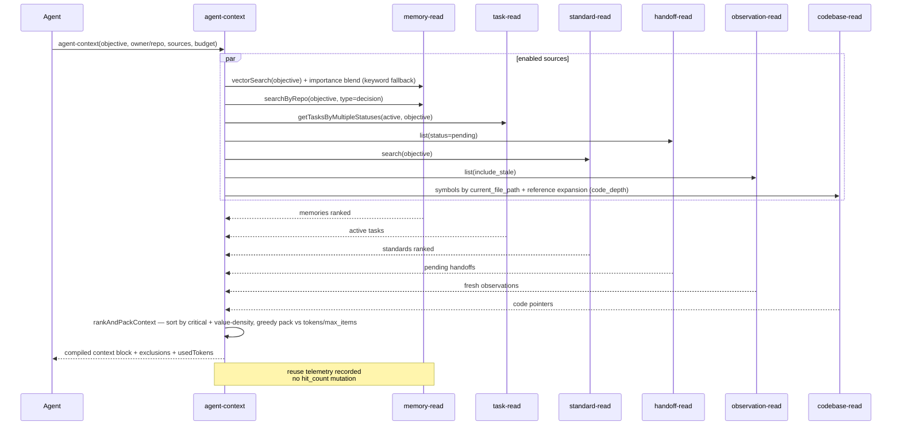
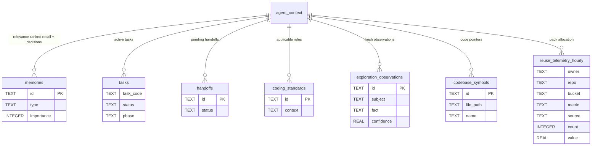

# Context Compilation — Agent-Context 7 Sources Token-Budgeted

> **Module:** `context` (cross-cutting) · **Feature:** `agent-context` 7-source token-budgeted compilation · **Tools:** `agent-context` (recall) + `memory-read`/`task-read`/`standard-read`/`handoff-read`/`observation-read`/`codebase-read` under the hood · **Storage:** `memories` + `tasks` + `handoffs` + `coding_standards` + `exploration_observations`/`exploration_evidence` + `codebase_symbols`/`codebase_references` + `reuse_telemetry_hourly`

## 1. Overview

Context Compilation is the **agent-context** recall pipeline that assembles a token-budgeted prompt payload from **7 sources** before an agent acts. It is the S0 Synthesize answer to "what does this agent need to know right now?" — fusing active tasks, relevance-matched decision memories, pending handoffs, applicable standards, fresh exploration observations, indexed code pointers, and relevance-ranked memories into a single ordered, truncated, and deduplicated context block. Budget enforcement ensures the payload fits the model's window while preserving the highest-signal items per source.

The feature is exposed as the `agent-context` MCP tool (and conceptually via `memory-read` recap + `task-read` + `standard-read` composition). It honors `owner`/`repo` scoping, `is_global` broadcast, and per-agent attribution.

## 2. User Stories

| #   | As a ...         | I want ...                                                               | So that ...                                              |
| --- | ---------------- | ------------------------------------------------------------------------ | -------------------------------------------------------- |
| 1   | Agent (S0)       | to call `agent-context(objective, limit)` and get 7-source fused context | I start hydrated without N tool calls                    |
| 2   | Agent (mid-task) | to re-call `agent-context` scoped to my active `task_code`               | I stay grounded as task state evolves                    |
| 3   | Orchestrator     | to get a token-budgeted summary that fits `est_tokens` accounting        | Compilation does not blow the window                     |
| 4   | Reviewer         | to see which candidates were packed and which were excluded              | Pack allocation (`reuse_telemetry_hourly`) is measurable |
| 5   | Operator         | to see exploration observations and code pointers alongside tasks        | Cross-cutting context is not siloed                      |

## 3. Business Logic (Pseudocode)

```text
function compileAgentContext(owner, repo, objective, budget, sources):
  candidateLimit = min(100, max(budget.max_items * 3, limit))  // pool floor from legacy limit
  candidates = []

  // Per-source retrieval (only enabled `sources`; all scoped by owner/repo):
  memories   = vectorSearch(objective) blended with importance, keyword fallback; recent if no objective
  decisions  = memories.searchByRepo(objective, type="decision")
  tasks      = tasks.getTasksByMultipleStatuses([in_progress, pending, backlog, blocked], objective)
  handoffs   = handoffs.list(status=pending)
  standards  = standards.search(objective)
  observations = explorationObservations.list(include_stale)
  code       = codebaseSymbols.getSymbolsByFile(current_file_path) + reference-graph expansion to budget.code_depth

  // rankAndPackContext — single cross-source ordering + greedy pack:
  score each candidate = lexicalScore(title + text, objective.trim())  // fraction of objective terms present
  critical = (source == "decisions") ? hasObjective && score >= threshold : candidate.critical
  threshold = budget.min_relevance > 0 ? budget.min_relevance : DECISION_CRITICAL_MIN_SCORE (0.34)
  // TASK-025: drop non-critical candidates with score < budget.min_relevance as "below_relevance"
  // (only when an objective is set AND min_relevance > 0; critical/pinned items are exempt)
  order by: critical desc, then value-density (priority + score*5) / estimated_tokens desc,
            then source order, then id
  greedy pack:
    for item in ordered:
      reason = included.length >= budget.max_items ? "item_budget"
             : used + item.estimated_tokens > budget.tokens ? "token_budget" : null
      if reason: exclusions.push(reason); continue
      included.push(item); used += item.estimated_tokens

  // Cache + telemetry (no memory mutation):
  contextPackId = hash(owner, repo, correlation)
  reuseTelemetry.recordContextPack({allocation, observationIds, memoryIds, evidencePointers})
  if context_pack_id: reuseTelemetry.cachePack(contextPackId, response)
  return {context: included, exclusions, usedTokens: used}

// estimated_tokens per candidate: max(12, ceil(len("title: text") / 4) + 8)
// source order (AGENT_CONTEXT_SOURCE_ORDER): tasks, decisions, handoffs, standards, observations, code, memories
```

Scoping: all sources filtered by `owner`/`repo`; `is_global` rows included. Memory pre-rank blend is `AGENT_CONTEXT_BLEND = { vector: 0.6, importance: 0.4 }` over `(vectorScore * 0.6) + ((importance / 5) * 0.4)`, with a keyword (`searchByRepo`) fallback when the vector store is unavailable or empty.

## 4. Sequence Diagram



## 5. Data Model



Budget config: `VECTOR_CANDIDATE_CAP=100` (pool ceiling) with `AGENT_CONTEXT_CANDIDATE_POOL_MULTIPLIER=3`; the per-source `limit` is only a pool floor, never a cap. `budget.tokens` (256–20000, default 2000), `budget.max_items` (1–100, default 20), `budget.code_depth` (0–5, default 1), `budget.min_relevance` (0–1, default 0). KG constants (`KG_MAX_CONTEXT_ENTITIES`, `KG_CONTEXT_TEXT_TOKENS`, `KG_MAX_GRAPH_EDGES`) are **not** used by this tool.

## 6. Public Interface

| Tool / API           | Key Params                                                                                                                                                                                                  | Returns                                                                                                                                                                                                                                            |
| :------------------- | :---------------------------------------------------------------------------------------------------------------------------------------------------------------------------------------------------------- | :------------------------------------------------------------------------------------------------------------------------------------------------------------------------------------------------------------------------------------------------- |
| `agent-context`      | `objective`/`query`, `task_code`, `current_file_path`, `sources[]`, `type_filter`, `owner`/`repo`, `limit`, `include_stale`, `budget{tokens,max_items,code_depth,min_relevance}`, `context_pack_id`, `json` | Compiled block: `context[]` (`source`, `id`, `title`, `text`, `estimated_tokens`), `exclusions[]` (`token_budget`/`item_budget`/`below_relevance`), `estimated_tokens`, `allocation`, plus legacy `memories[]`/`decisions[]`/`tasks[]` projections |
| `memory-read(recap)` | `owner`/`repo` (no query)                                                                                                                                                                                   | Repo summary + recent activity (subset of agent-context)                                                                                                                                                                                           |
| `synthesize`         | `query`, `owner`/`repo`                                                                                                                                                                                     | Composite synthesis via MCP sampling (requires client sampling)                                                                                                                                                                                    |

Behavior: `agent`/`model` auto-populated from session (`MCP_CLIENT_NAME`/`MCP_MODEL`); `owner`/`repo` inferred from git remote + directory basename unless explicit. An explicit `context_pack_id` caches the response and replays it for identical correlation keys.

## 7. Dependencies

- **Upstream sources:** `memory-read` vector + importance blend (keyword fallback), `task-read` active-task lookup, `handoff-read` pending list, `standard-read` search, `observation-read` (respecting `include_stale`), `codebase-read` symbols + reference graph expansion.
- **Scoping:** `owner`/`repo` isolation; `is_global` included; dashboard merges by short `repo` only for display.
- **Token budget:** caller-provided `budget.tokens`/`budget.max_items`; per-candidate estimation is `max(12, ceil(len/4) + 8)`.
- **Runtime profile:** `MCP_RUNTIME_PROFILE` affects vector availability (`minimal` = lexical only for memories).
- **Attribution:** `agent`/`role`/`model` on recall; pack allocation recorded in `reuse_telemetry_hourly`. No `hit_count`/`recall_rate` mutation on use.

## 8. Limitations

| Limitation                     | Detail                                                                  | Mitigation                                                                      |
| :----------------------------- | :---------------------------------------------------------------------- | :------------------------------------------------------------------------------ |
| Budget truncation              | Lowest value-density items dropped once `budget.tokens`/`max_items` hit | Raise `budget.tokens`/`budget.max_items` or call source-specific tools directly |
| Vectors eventually consistent  | New memories lexical-only until the vector queue drains                 | Keyword (`searchByRepo`) fallback covers the gap                                |
| Relevance filter can over-trim | `budget.min_relevance > 0` excludes non-critical below-threshold items  | Leave `min_relevance` at 0; pin critical items via `task_code`                  |
| Codebase repo-keyed            | Index is `repo`-keyed, not `owner/repo`                                 | Pass explicit `repo` to codebase source                                         |
| Sampling-gated synthesize      | `synthesize` requires client MCP sampling support                       | Fallback to `agent-context` + manual synthesis                                  |
| Single workspace               | Context compiled for one `owner`/`repo` at a time                       | Re-call per repo for multi-repo tasks                                           |

## 9. Compliance

- **S0 Synthesize mandatory:** orchestrator calls `memory-read(recap)` + `agent-context` before planning.
- **Scope isolation:** all 7 sources filtered by `owner`/`repo`; no cross-repo leakage.
- **Attribution & audit:** reuse telemetry (`reuse_telemetry_hourly`) per compilation; `task_comments` per task transition.
- **Standards gate:** `standard-read` is S1 hydrate — standards in context are normative, not advisory.
- **Anti-hallucination:** context is retrieved, not generated; thresholds (`MEMORY_CONFLICT_THRESHOLD=0.85`) guard against near-duplicate pollution.

## 10. UI Layout

Dashboard `Agent Arena` / `Stats` / `Knowledge Graph` tabs surface compiled context:

- **Arena overview:** active tasks by agent, claim ownership, pending handoffs, per-agent progress; cache TTL `ARENA_OVERVIEW_TTL_MS=5000`.
- **KG graph:** nodes (entities) + edges (relations) with confidence opacity buckets; `KG_MAX_GRAPH_EDGES=4000` cap indicator.
- **Code graph:** repo- scoped symbol graph, `CODE_GRAPH_MAX_EDGES=400` cap.
- **Stats:** repo-level counts (memories/tasks/KG) cached `DASHBOARD_STATS_TTL_MS=30000`.
- **Context inspector (future):** per-agent last `agent-context` payload with source breakdown (`allocation`) and `exclusions` badge.

## 11. Implementation Tasks

| #   | Task                                                                          | Scope                                                                                     |
| --- | ----------------------------------------------------------------------------- | ----------------------------------------------------------------------------------------- |
| 1   | `agent-context` tool — 7-source fan-out + `rankAndPackContext` + token budget | `src/mcp/tools/agent-context.ts`, `src/mcp/tools/agent-context-compiler.ts`               |
| 2   | `memory-read` vector + importance blend (keyword fallback)                    | `src/mcp/tools/agent-context.ts`, `src/mcp/storage/vectors.*`, `src/mcp/entities/memory*` |
| 3   | Observation source + freshness/`include_stale` handling                       | `src/mcp/entities/exploration-observation.ts`, `src/mcp/tools/observation.read.ts`        |
| 4   | Codebase source integration + reference-graph expansion + cap enforcement     | `src/mcp/tools/agent-context.ts`, `src/mcp/entities/codebase-*.ts`                        |
| 5   | Reuse telemetry + context-pack caching                                        | `src/mcp/utils/reuse-telemetry.ts`, `src/mcp/entities/reuse-telemetry.ts`                 |
| 6   | Dashboard arena + KG + stats + code graph views                               | `src/dashboard/services/`, `src/dashboard/ui/src/lib/components/Arena*.svelte`            |

## 12. Cross-References

- API contracts: `../../api/context/api-context.md` · `../api/context/api-synthesize.md` · `../../api/memory/api-memory.md` · `../../api/tasks/api-tasks.md` · `../../api/standards/api-standards.md`
- Module landings: `../memory/overview.md` · `../tasks/overview.md` · `../standards/overview.md` · `../handoffs/overview.md` · `../codebase-index/overview.md` · `../dashboard/overview.md`
- Feature deep-dives: `../memory/memory-search.md` · `../tasks/task-lifecycle.md` · `../codebase-index/codebase-indexing.md` · `../dashboard/dashboard-shell.md`
- Testing: `../../testing.md` · `../../../testing/context/agent-context.test.md` · `src/mcp/tests/agent-context*.test.ts`
- Design: `../../../design/domain/domain.md` (§ all entities) · `../../../design/database/schema.md` (§ all tables) · `../../../design/architecture/context-compilation.md`
- Operations: `../codebase-index/context-compilation.md` · Decisions: `../../../design/decisions/ADR-008-global-vs-scoped-ownership-and-dashboard-repo-view.md`
- Manifest: `../manifest.md` · Tool contract: `../../../../src/mcp/prompts/server/instructions.md`

---

_Feature owner: `documentation` agent · Last verified: 2026-09-11 against `src/mcp/tools/agent-context.ts` and `src/mcp/tools/agent-context-compiler.ts`._
