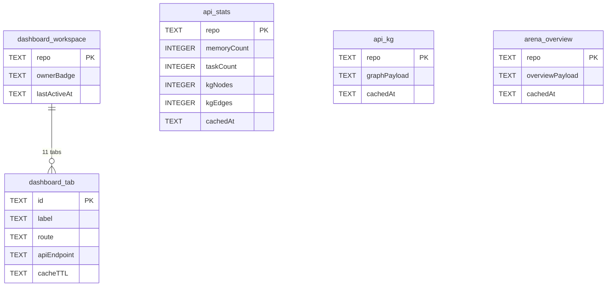

# Dashboard Shell — Workspace-First Shell + 11 Tabs

> **Module:** `dashboard` · **Feature:** Shell + Navigation + 11 Tabs · **Stack:** Svelte 5 + Vite + Express (port 3456) · **Entry:** `src/dashboard/server.ts` → `dist/dashboard/server.js`

## 1. Overview

Dashboard Shell is the operational workspace for the local-memory MCP. It is an **Express API + Svelte 5 SPA** served on `port 3456` (default, `DASHBOARD_HOST=127.0.0.1`) that provides a **workspace-first** layout: a persistent sidebar + top bar that frames **11 tabs** (Memories, Tasks, Agent Arena, Codebase, Code Graph, Knowledge Graph, Standards, Coordination, Stats, Settings, Health). The shell handles workspace switching (repo-scoped), auth gating (`DASHBOARD_TOKEN` bearer), polling/refresh coordination, and error/empty/loading states. All data is repo-scoped and read via REST `/api/*` controllers that aggregate by short `repo` (ADR-008) while rows render owner badges.

## 2. User Stories

| #   | As a ...       | I want ...                                                              | So that ...                               |
| --- | -------------- | ----------------------------------------------------------------------- | ----------------------------------------- |
| 1   | Operator       | to open the dashboard and see workspace tabs with repo context          | I orient quickly without CLI              |
| 2   | Operator       | to switch workspace (repo) and have all tabs re-scope                   | I operate multi-repo from one host        |
| 3   | Agent reviewer | to browse Memories/Tasks/KG with search + pagination                    | I audit what agents persisted             |
| 4   | Operator       | to see index freshness, queue depth, and health in one view             | I detect staleness and embedding lag      |
| 5   | Admin          | to set `DASHBOARD_TOKEN` and gate access                                | The dashboard is not open on shared hosts |
| 6   | Developer      | to run `dashboard:dev` (:5173 proxying `/api` → :3456) for live UI work | I iterate without rebuilding the bundle   |

## 3. Business Logic (Pseudocode)

```text
// Server bootstrap:
function startDashboard():
  require built bundle dist/dashboard/public exists else throw (rebuild trap)
  express()
    .use(json limit=DASHBOARD_JSON_LIMIT=50mb)
    .use(authGate) // if DASHBOARD_TOKEN set, require Bearer header
    .mount /api/memories, /api/tasks, /api/standards, /api/handoffs,
            /api/claims, /api/codebase, /api/kg, /api/stats, /api/arena, /api/health
    .static(dist/dashboard/public)
    .listen(PORT=3456, host=DASHBOARD_HOST)

// API scoping (intentional repo-only merge):
function listMemories(req):
  repo = req.query.repo  // short repo name
  // service does: MemoryService.list(owner="", repo) — merges owners
  rows = db.query("WHERE scope_repo=?", repo)
  attach ownerBadge per row (informational)
  return {items, total}

// Shell workspace state (Svelte):
store workspace = {repo, ownerBadgeVisible:true}
on workspace change: invalidate stats/kg/arena caches (TTL 30s/30s/5s)
polling: per-tab interval with visibility-aware pause (STD-002)
```

Build trap: `bin/mcp-memory-dashboard.js` calls `ensureDashboardBuild()` — if UI source newer than bundle and build fails, bin throws on launch.

## 4. Sequence Diagram

```mermaid
sequenceDiagram
    participant User
    participant Shell as Svelte Shell
    participant API as Express /api/*
    participant DB as SQLite

    User->>Shell: open / (workspace=repoA)
    Shell->>API: GET /api/stats?repo=repoA
    API->>DB: aggregate by scope_repo=repoA (merged owners)
    DB-->>API: {memories: N, tasks: M, kg: K}
    API-->>Shell: stats payload (cached 30s)
    Shell->>API: GET /api/memories?repo=repoA
    API-->>Shell: paginated memories + owner badges
    User->>Shell: switch workspace → repoB
    Shell->>Shell: invalidate caches
    Shell->>API: GET /api/stats?repo=repoB
    API-->>Shell: repoB stats
    Shell->>API: GET /api/tasks?repo=repoB
    API-->>Shell: repoB tasks (board)
    Note over Shell,API: DASHBOARD_TOKEN gate: Bearer required<br/>if token set; else open
```

## 5. Data Model



Cache TTLs: `DASHBOARD_STATS_TTL_MS=30000`, `DASHBOARD_KG_TTL_MS=30000`, `ARENA_OVERVIEW_TTL_MS=5000`. Tabs: Memories, Tasks, Agent Arena, Codebase, Code Graph, Knowledge Graph, Standards, Coordination, Stats, Settings, Health.

## 6. Public Interface

| Surface | Endpoint / Route            | Params                                    | Returns                                                       |
| :------ | :-------------------------- | :---------------------------------------- | :------------------------------------------------------------ |
| REST    | `GET /api/memories?repo=X`  | `repo` (short), `limit`/`offset`, `query` | Paginated memories (merged owners + badges)                   |
| REST    | `GET /api/tasks?repo=X`     | `repo`, `status`, `phase`                 | Tasks board data                                              |
| REST    | `GET /api/standards?repo=X` | `repo`, `language`, `stack`               | Standards catalog                                             |
| REST    | `GET /api/handoffs?repo=X`  | `repo`, `status`                          | Handoffs + claims                                             |
| REST    | `GET /api/codebase?repo=X`  | `repo`                                    | Index status + symbol counts                                  |
| REST    | `GET /api/kg?repo=X`        | `repo`                                    | Graph payload (nodes/edges, capped `KG_MAX_GRAPH_EDGES=4000`) |
| REST    | `GET /api/stats?repo=X`     | `repo`                                    | Aggregated counts (cached 30s)                                |
| REST    | `GET /api/arena?repo=X`     | `repo`                                    | Arena overview (cached 5s)                                    |
| REST    | `GET /api/health`           | —                                         | Health + version + DB path                                    |
| SPA     | `/*`                        | workspace in URL/query                    | Svelte shell + tab router                                     |

Auth: `Authorization: Bearer <DASHBOARD_TOKEN>` when `DASHBOARD_TOKEN` is set; unset = open. CORS: loopback by default (`DASHBOARD_HOST=127.0.0.1`).

## 7. Dependencies

- **Build:** `vite build` (Svelte 5) → `dist/dashboard/public/`; `tsup` bundles server; `ensureDashboardBuild()` trap in `bin/mcp-memory-dashboard.js`.
- **Nested workspace** `src/dashboard/ui` (own `node_modules`, `package.json`).
- **Env:** `PORT=3456`, `DASHBOARD_HOST=127.0.0.1`, `DASHBOARD_TOKEN`, `DASHBOARD_JSON_LIMIT=50mb`, `DASHBOARD_ENABLE_MCP=false`, `DASHBOARD_OWNER=""`, `CODEBASE_REPOS_DIR=..` (dashboard-only).
- **Dashboard-only services:** `src/dashboard/services/` with `MemoryService.list`, `TaskService.getTasksByRepo("", repo)`, `codebase.service.ts` (reads `CODEBASE_REPOS_DIR`).
- **Standards:** `STD-001` (Arena layout manager-driven), `STD-002` (Dashboard a11y/focus/polling baseline).

## 8. Limitations

| Limitation               | Detail                                                                        | Mitigation                                             |
| :----------------------- | :---------------------------------------------------------------------------- | :----------------------------------------------------- |
| Repo-only aggregation    | Controllers merge by short `repo` (ADR-008); per-owner isolation via MCP only | Owner badge per row; MCP for strict scoping            |
| Build-required serving   | `npm run dashboard` serves built bundle; stale bundle throws                  | Run `npm run build` or `npm run dashboard:build` first |
| Loopback default         | `DASHBOARD_HOST=127.0.0.1` — not LAN-reachable                                | Set `DASHBOARD_HOST=0.0.0.0` + `DASHBOARD_TOKEN`       |
| Stats/KG cache staleness | 30s TTL on stats/KG, 5s on arena                                              | Cache-bypass via query param or manual refresh         |
| No multi-workspace tabs  | One workspace (repo) active at a time                                         | Switch workspace; no split-pane multi-repo             |

## 9. Compliance

- **A11y/polling baseline** `STD-002`: focus management, keyboard nav, visibility-aware polling pause.
- **Arena layout** `STD-001`: manager-driven layout, no hardcoded grid.
- **Security:** `DASHBOARD_TOKEN` bearer gate; `DASHBOARD_HOST` loopback default; no secrets in URL.
- **Local-first:** no external APIs; all data from local SQLite.
- **Scope isolation:** dashboard is operational single-host view; ownership enforcement via MCP tools.

## 10. UI Layout

```
┌─────────────────────────────────────────────────────────────┐
│ Top Bar: workspace selector (repo) · health badge · token   │
├──────────┬──────────────────────────────────────────────────┤
│ Sidebar  │ Tab Content (one of 11)                          │
│ Memories │ ┌──────────────────────────────────────────────┐ │
│ Tasks    │ │ List/Board + search · pagination · filters   │ │
│ Arena    │ │ Detail drawer (slide-over)                   │ │
│ Codebase │ │ Empty / loading / error states per tab       │ │
│ CodeGraph│ └──────────────────────────────────────────────┘ │
│ KG       │ Polling indicator · last refreshed · manual ↻    │
│ Standards│ Owner badges on rows · is_global highlight       │
│ Coord.   │                                                  │
│ Stats    │                                                  │
│ Settings │                                                  │
│ Health   │                                                  │
└──────────┴──────────────────────────────────────────────────┘
```

Responsive: collapsible sidebar on narrow viewports; tab bar scrolls horizontally. Each tab owns its polling interval and pause-on-hidden.

## 11. Implementation Tasks

| #   | Task                                                                          | Scope                                                                                  |
| --- | ----------------------------------------------------------------------------- | -------------------------------------------------------------------------------------- |
| 1   | Express server + auth gate + static SPA serving + `ensureDashboardBuild` trap | `src/dashboard/server.ts`, `bin/mcp-memory-dashboard.js`                               |
| 2   | REST controllers (memories/tasks/standards/handoffs/kg/stats/arena/health)    | `src/dashboard/services/`, `src/dashboard/controllers/`                                |
| 3   | Svelte 5 shell + workspace store + sidebar/topbar + tab router                | `src/dashboard/ui/src/lib/components/Shell*.svelte`, `src/dashboard/ui/src/App.svelte` |
| 4   | Per-tab views (board/list/graph) + detail drawers + pagination                | `src/dashboard/ui/src/lib/components/` (per-tab)                                       |
| 5   | Cache layers (stats 30s, KG 30s, arena 5s) + visibility-aware polling         | `src/dashboard/services/cache.ts`, UI polling composables                              |
| 6   | Build pipeline (Vite + tsup + gen-bins) + nested workspace wiring             | `src/dashboard/ui/vite.config.ts`, `tsup.config.ts`, `scripts/gen-bins.mjs`            |

## 12. Cross-References

- API contracts: `../../api/dashboard/api-dashboard.md` · `../api/dashboard/api-stats.md` · `../api/dashboard/api-kg.md` · `../api/dashboard/api-health.md`
- Module landings: `../memory/overview.md` · `../tasks/overview.md` · `../standards/overview.md` · `../handoffs/overview.md` · `../codebase-index/overview.md` · `../context/overview.md`
- Feature deep-dives: `../codebase-index/codebase-indexing.md` · `../context/context-compilation.md`
- Testing: `../../testing.md` · `src/dashboard/ui/src/**/__tests__/` (colocated) · `src/dashboard/tests/`
- Design: `../../../design/ui/dashboard.md` · `../../../design/architecture/dashboard-architecture.md` · `STD-001` · `STD-002`
- Operations: `../../../operations/dashboard.md` · Decisions: `../../../decisions/ADR-008-global-vs-scoped-ownership-and-dashboard-repo-view.md`
- Manifest: `../manifest.md` · Tool contract: `../../../../src/mcp/prompts/server/instructions.md`

---

_Feature owner: `documentation` agent · Last verified: 2026-09-07 against `src/dashboard/server.ts`, `src/dashboard/services/`, and `src/dashboard/ui/src/`._
