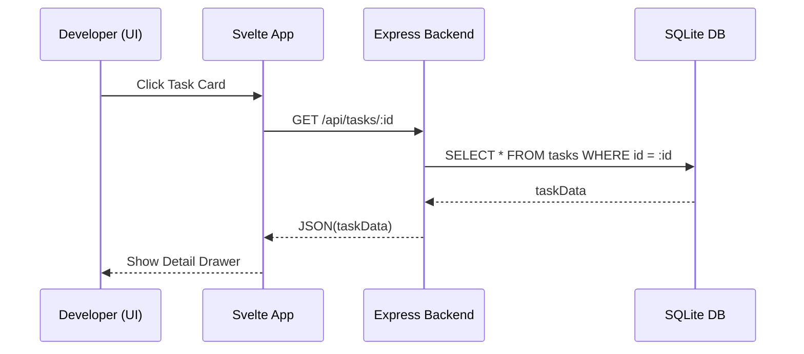

# Feature Documentation: Dashboard UI

## User Stories
- **Story 1: Visual Task Audit**
  - **Given** a developer is running multiple projects,
  - **When** they open the dashboard and select a repository,
  - **Then** they should see a Kanban board displaying all tasks grouped by their current status.
- **Story 2: Context Management**
  - **Given** an AI agent has stored an irrelevant or incorrect memory,
  - **When** the developer locates that memory in the Dashboard Memory List and clicks "Delete",
  - **Then** the record should be permanently removed from the SQLite database.
- **Story 3: Real-time Stats**
  - **Given** the dashboard is open,
  - **When** the underlying MCP server processes a new memory,
  - **Then** the Dashboard stats widget should reflect the updated count without a full page reload.

## Business Flow

## Business Rules
| Rule Name | Description | Consequence |
|-----------|-------------|-------------|
| Local Bind | The dashboard server must only bind to `localhost` / `127.0.0.1`. | Prevents accidental external exposure of sensitive context data. |
| Read-Mostly | The dashboard is primary for inspection; write operations are restricted to status updates and deletions. | Minimizes structural database corruption risks. |

## Compliance Requirements
- **Responsive Design**: The UI must remain usable on small window sizes (e.g., side-by-side with an IDE).
- **Accessibility**: All buttons and interactive elements must have proper labels for screen readers.

## Task List
- [x] Setup Svelte + Vite boilerplate.
- [x] Implement Repository sidebar with auto-detection.
- [x] Build Kanban board with status column logic.
- [x] Create Memory search/filter grid.
