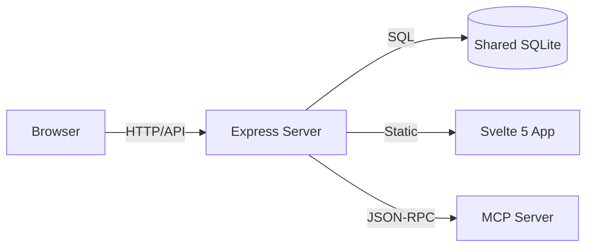

# Module Overview: Dashboard

## Header & Navigation

- [Dashboard UI Feature Doc](dashboard-ui.md)
- [Memories API](../../api/dashboard/api-memories.md)
- [System API](../../api/dashboard/api-system.md)
- [Tasks API](../../api/dashboard/api-tasks.md)
- [Dashboard Tests](../../testing/dashboard/test-dashboard.md)
- [MCP Server Module Overview](../../modules/mcp-server/overview.md)

## Responsibility

The `dashboard` module is the window into the MCP system. It provides developers and observers with a visually rich interface to audit agent activity, manage task boards, inspect the semantic knowledge base, view knowledge graphs, and manage coding standards. It is designed to be lightweight, local-only, and responsive.

## Core Services

- **Telemetry UI**: Real-time visualization of database volume, memory counts, and embedding performance.
- **Activity Stream**: A chronological feed of tool calls, inputs, and results with burst condensation.
- **Task Kanban**: A full-featured task board with 4 swimlanes (backlog, pending, in_progress, completed) and detail drawers.
- **Knowledge Explorer**: Search and curation interface for semantic memories with bulk import/export.
- **Knowledge Graph**: Interactive force-directed graph visualization of entities and their relationships.
- **Standards Browser**: Browse and manage coding standard entries with search.
- **Capability Reference**: Visual documentation of the agent's available MCP tools, prompts, and resources.
- **Agent Arena**: Multi-agent coordination overview with handoff and claim management.
- **Coordination Panel**: View and manage handoffs and claims between agents.

## Architecture Decisions

The dashboard follows a modern Full-Stack Local architecture:

- **Direct SQLite Access**: For maximum performance, the dashboard backend reads directly from the `better-sqlite3` instance. This ensures the UI remains functional even if the MCP protocol layer is unresponsive.
- **MCP Client Integration**: The dashboard includes an internal `MCPClient` to allow developers to manually trigger tool calls for testing and calibration.
- **Stateless API**: The Express server is entirely stateless, relying on the SQLite DB for all persistence.
- **JSON:API Format**: All responses follow the JSON:API v1.1 specification for consistent client-side handling.

## Tabs & Views

1. **Dashboard**: StatsWidget, TaskStatsWidget, TimeStatsWidget — high-level system health.
2. **Activity**: RecentActions feed — chronological audit trail with burst condensation.
3. **Memories**: Searchable MemoryList with MemoryDrawer for create/edit, BulkImportModal.
4. **Tasks**: KanbanBoard with 4 swimlanes, AddTaskModal, TaskCard components.
5. **Reference**: Tools/Prompts/Resources catalog with drawer for JSON schema detail.
6. **Standards**: StandardsPanel for browsing and searching coding standards.
7. **Handoffs**: HandoffsPanel for viewing agent-to-agent handoffs.
8. **Knowledge Graph**: KGGraph shell with force-directed canvas renderer.

## Security Invariants

- **Local-First Binding**: The dashboard server defaults to `127.0.0.1` (port 3456) for single-user local development.
- **Optional Auth**: Bearer token via `DASHBOARD_TOKEN` env var for additional security.
- **Read-Heavy Design**: Most views are read-only. Mutations (editing memories/tasks) are logged in `action_log` with source marked as `dashboard`.
- **Path Isolation**: The server validates that file-system related requests are scoped to the active MCP Roots.

## Aesthetics

- **Aesthetic**: Agentic Glass (v2.0) — focus on transparency, backdrop-blurs (28px), micro-animations, and colored glows.
- **Responsiveness**: Mobile-first grid system using CSS Grid and Flexbox.
- **Theme**: Full light/dark mode support with `localStorage` persistence.
