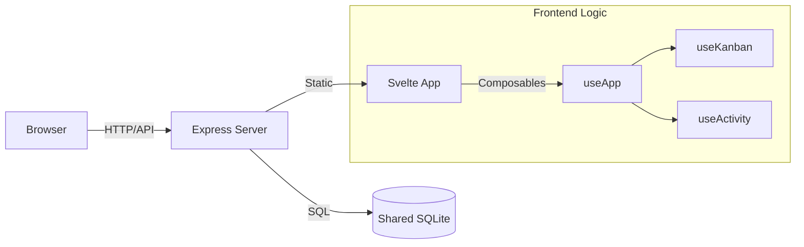

# Module Overview: Dashboard

## Responsibility
The `dashboard` module is the window into the MCP system. It provides developers and observers with a visually rich interface to audit agent activity, manage task boards, and inspect the semantic knowledge base. It is designed to be lightweight, local-only, and responsive.

## Core Services
- **Telemetry UI**: Real-time visualization of database volume and embedding performance.
- **Activity Stream**: A chronological feed of tool calls, inputs, and results.
- **Task Kanban**: A full-featured task board with swimlanes and detail drawers.
- **Knowledge Explorer**: Search and curation interface for semantic memories.
- **Capability Reference**: Visual documentation of the agent's available MCP tools.

## Architecture
The dashboard follows a modern Full-Stack Local architecture:
- **Backend**: Express.js server providing a REST API and serving built static assets.
- **Frontend**: Svelte 5 / Vite SPA utilizing a "Glass" design system.
- **Shared Storage**: Direct read/write access to the same SQLite database used by the MCP server.

## UI Themes
- **Support**: Native Light and Dark mode support.
- **Aesthetic**: Agentic Glass (v2.0) - focus on transparency, blurs, and micro-animations.
