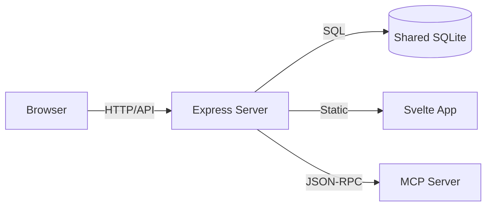

# Module Overview: Dashboard

## Responsibility
The `dashboard` module is the window into the MCP system. It provides developers and observers with a visually rich interface to audit agent activity, manage task boards, and inspect the semantic knowledge base. It is designed to be lightweight, local-only, and responsive.

## Core Services
- **Telemetry UI**: Real-time visualization of database volume and embedding performance.
- **Activity Stream**: A chronological feed of tool calls, inputs, and results.
- **Task Kanban**: A full-featured task board with swimlanes and detail drawers.
- **Knowledge Explorer**: Search and curation interface for semantic memories.
- **Capability Reference**: Visual documentation of the agent's available MCP tools.
- **Export/Import Service**: Tools for repository state portability.

## Architecture Decisions
The dashboard follows a modern Full-Stack Local architecture:
- **Direct SQLite Access**: For maximum performance and reliability, the dashboard backend reads directly from the `better-sqlite3` instance. This ensures the UI remains functional (for auditing) even if the MCP protocol layer is under load or unresponsive.
- **MCP Client Integration**: The dashboard includes an internal `MCPClient` to allow developers to manually trigger tool calls for testing and calibration.
- **Stateless API**: The Express server is entirely stateless, relying on the SQLite DB for all persistence.

## Security Invariants
- **Local-First Binding**: The dashboard server defaults to `localhost` (port 3456) and is intended for single-user local development.
- **Read-Heavy Design**: While most views are read-only to preserve the audit trail, mutations (e.g., editing memories or tasks) are permitted but logged in the `action_log` with the source marked as `dashboard`.
- **Path Isolation**: The server validates that any file-system related requests are scoped to the active MCP Roots.

## Aesthetics
- **Aesthetic**: Agentic Glass (v2.0) - focus on transparency, blurs, and micro-animations.
- **Responsiveness**: Mobile-first grid system using CSS Grid and Flexbox.
