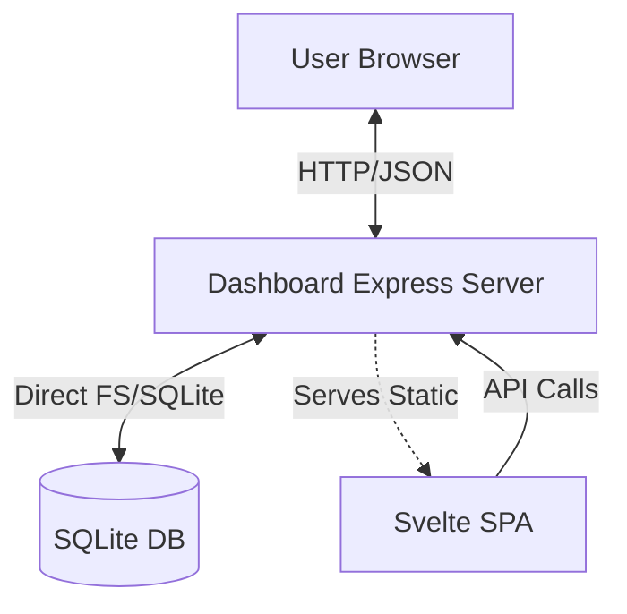

# Module Overview: Dashboard

## Responsibility
The `dashboard` module provides a graphical user interface (GUI) for developers to inspect, audit, and manage the contextual memories and tasks stored by the MCP server. It consists of a lightweight Express.js backend that serves a high-performance Svelte-based single-page application (SPA).

## Features
- **Visual Kanban Board**: A drag-and-drop style interface to manage task statuses across different repositories.
- **Memory Inspector**: A searchable and filterable list of all semantic memories, allowing for manual curation and deletion.
- **Repository Scoping**: Seamless switching between different project contexts detected by the server.
- **System Telemetry**: Real-time display of database health, model loading status, and total memory count.

## Architecture

## Dependencies
- `svelte`: For the reactive frontend interface.
- `express`: To provide the local API and serve the built static assets.
- `better-sqlite3`: Shared database access with the MCP server module.
- `vite`: For the rapid development and building of the frontend.
