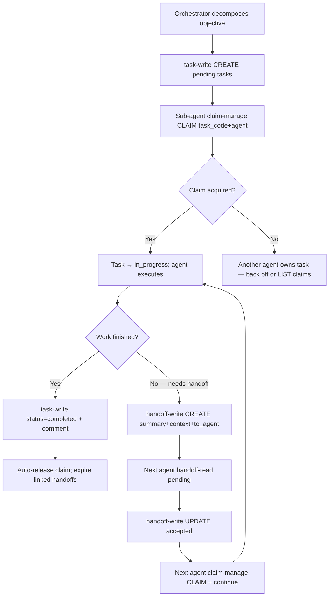

# Handoffs & Claims Module — Overview

> **Module:** `handoffs/claims` · **Scope:** Inter-agent coordination — transient handoffs + durable task claims.
> **Tools:** `handoff-read` · `handoff-write` · `claim-manage` (3 tools) · **Storage:** `handoffs` + `claims` + `task_comments`

## Purpose

The Handoffs & Claims module is the coordination fabric for multi-agent execution. It solves two distinct problems: **claims** provide exclusive task ownership (who is working on what, with fencing), and **handoffs** carry transient context between agents when work is left unfinished. Together they prevent duplicate work, lost context, and orphaned tasks.

- **Claim** = ownership lock on a single task (`one claim per task` invariant). Lifecycle: `claim → in_progress → completed → auto-release`.
- **Handoff** = directed context transfer (`from_agent → to_agent`) with optional `task_id` linkage, status-tracked and auto-expiring.

This module is the orchestration counterpart to the Tasks FSM; tasks define _what_, handoffs/claims define _who_ and _what remains_.

## Module Position

| Dimension  | Value                                                                 |
| :--------- | :-------------------------------------------------------------------- |
| Manifest # | 4 — `handoffs/claims`                                                 |
| Scope      | `owner`/`repo` isolated; claims unique per `task_id`                  |
| Tools      | 3 — `handoff-read`, `handoff-write`, `claim-manage`                   |
| Storage    | `handoffs` (transient), `claims` (ownership), `task_comments` (audit) |
| Consumer   | Orchestrator + sub-agents during S0→Execute→Close                     |

Related: [Tasks](../tasks/overview.md) (FSM) · [Memory](../memory/overview.md) (durable recall) · [Standards](../standards/overview.md) (normative gates) · [Dashboard](../dashboard/overview.md) (coordination view)

## Tool Surface (3 Tools)

### 1. `claim-manage` — Claim Lifecycle (CLAIM | RELEASE | LIST)

Auto-infers operation from field presence:

| Mode    | Trigger                                                | Behavior                                                                                 |
| :------ | :----------------------------------------------------- | :--------------------------------------------------------------------------------------- |
| CLAIM   | `task_id`/`task_code` + `agent` without `release:true` | Acquire exclusive claim; transitions task toward `in_progress`; fails if already claimed |
| RELEASE | `task_id`/`task_code` + `release:true`                 | Release claim, set `released_at`; idempotent                                             |
| LIST    | `query` or `agent` or no task locator                  | Search/list active claims with `active_only`, `limit`/`offset`                           |

Invariants: one active claim per `task_id` (unique constraint); claim auto-released on `task-write(status=completed)`.

### 2. `handoff-read` — Unified Handoff/Claim Read

| Mode        | Trigger                                   | Behavior                                                                                                             |
| :---------- | :---------------------------------------- | :------------------------------------------------------------------------------------------------------------------- |
| DETAIL      | `id` present                              | Fetch single handoff by UUID                                                                                         |
| LIST CLAIMS | `claim:true` or `agent` with claim filter | List active claims                                                                                                   |
| SEARCH      | `query` present                           | Hybrid search across handoff `summary`/`context`                                                                     |
| LIST        | none                                      | Paginated handoff listing, filtered by `status` (`pending`/`accepted`/`rejected`/`expired`), `from_agent`/`to_agent` |

Flags: `active_only` (default true), `status`, `limit`/`offset`, `owner`/`repo` scoping.

### 3. `handoff-write` — Create or Update Handoff

| Mode   | Trigger                                                  | Behavior                                                                                           |
| :----- | :------------------------------------------------------- | :------------------------------------------------------------------------------------------------- |
| CREATE | `summary` + `from_agent` (+ `owner`/`repo`) without `id` | Insert `pending` handoff; optional `to_agent`, `task_id`/`task_code`, `context` JSON, `expires_at` |
| UPDATE | `id` + `status`                                          | Transition status (`pending→accepted`/`rejected`/`expired`); records `accepted_at`                 |

Rule: create handoffs **only for unfinished work** with concrete next owner/steps. Completion summaries belong in task comments (`task-write(comment)`), not handoffs.

## Coordination Flows



### Micro-flow: Handoff Expiry

Pending handoffs auto-expire via `expires_at` (default TTL bounded). Expired handoffs are filtered by `active_only:true` and do not block task completion. Task completion expires all linked handoffs for that `task_id` regardless of status.

## Data Model Summary

```
handoffs (id PK UUID, task_id FK nullable, from_agent, to_agent nullable (broadcast if null),
          summary, context JSON, status enum pending/accepted/rejected/expired,
          scope_owner, scope_repo, created_at, accepted_at nullable, expires_at nullable)

claims   (id PK UUID, task_id FK UNIQUE ON DELETE CASCADE, agent, role nullable,
          metadata JSON, scope_owner, scope_repo, claimed_at, released_at nullable)

task_comments (id PK UUID, task_id FK CASCADE, comment, agent, role, model,
               previous_status, next_status, created_at) — audit trail for status transitions
```

Indexes: `idx_handoffs_scope_status` on `(scope_owner, scope_repo, status)`; `idx_claims_task_id` unique on `task_id`.

## Scoping & Isolation

- Strict `owner`/`repo` isolation on both tables. No `is_global` for handoffs/claims (coordination is always repo-scoped).
- Dashboard coordination view aggregates by short `repo` (merges owners) for operational visibility; MCP tools enforce per-`owner` isolation.

## Compliance Gates

- **Never skip `in_progress`:** `claim-manage` is the gate that moves `pending`/`backlog` → `in_progress`.
- **One claim per task:** enforced at DB unique constraint; application layer returns conflict error on duplicate claim.
- **Handoff discipline:** only for unfinished work with concrete next steps/owner. No handoff for "done" summaries.
- **Attribution required:** `agent`/`role`/`model` on every mutation for chain of responsibility.

## Operations & Limits

| Guard               | Value                                            | Source                      |
| :------------------ | :----------------------------------------------- | :-------------------------- |
| Write serialization | `WriteLock` cooperative lock                     | `src/mcp/storage/`          |
| Task comment audit  | Every status transition emits a comment row      | `src/mcp/entities/task.ts`  |
| Handoff TTL         | Bounded `expires_at`; sweeper expires stale rows | `src/mcp/tools/handoff*.ts` |
| Claim fencing       | Unique `task_id` prevents double-claim           | `claims` table constraint   |

## Cross-References

- API contracts: `../../api/handoffs/api-handoffs.md` · `../api/handoffs/api-handoff-read.md` · `../api/handoffs/api-handoff-write.md` · `../api/handoffs/api-claim-manage.md` · `../../api/tasks/api-tasks.md`
- Feature deep-dives: `../tasks/task-lifecycle.md` (FSM) · `../context/context-compilation.md` (agent-context hydration)
- Testing: `../../testing.md` · `../../../testing/handoffs/handoff-coordination.test.md` · `src/mcp/tests/handoff*.test.ts` · `src/mcp/tests/claim*.test.ts`
- Design: `../../../design/domain/domain.md` (§7 Handoff, §8 Claim) · `../../../design/database/schema.md` (§ `handoffs`, `claims`, `task_comments`)
- Decisions: `../../../decisions/ADR-008-global-vs-scoped-ownership-and-dashboard-repo-view.md`
- Manifest: `../manifest.md` · Brief: `../../brief.md`

---

_Module owner: `documentation` agent · Last verified: 2026-09-07 against `src/mcp/tools/handoff*.ts`, `src/mcp/tools/claim*.ts`, and `src/mcp/storage/migrations/`._
