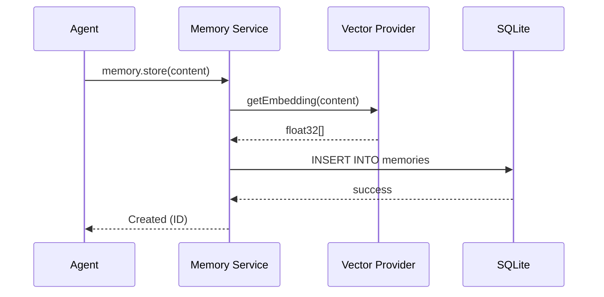

# Feature Documentation: Memory Management

## Responsibility
The Memory Management module provides the system's "Long-Term Persistence". It allows agents to store architectural decisions, patterns, and facts that persist across sessions.

## Core Tools
- `memory.store`: Saves a new memory with automatic vectorization.
- `memory.search`: Performs hybrid Vector + FTS5 search (ranked by similarity).
- `memory.synthesize`: Consolidates multiple memories into a high-level architectural insight.
- `memory.summarize`: Updates the repository's global summary signal.
- `memory.recap`: Provides a pointer table of the most important recent memories.
- `memory.acknowledge`: Mandatory confirmation after an agent uses a memory to generate logic.

## Business Rules
| Rule Name | Description |
|-----------|-------------|
| **Hybrid Ranking** | Results are ranked using a combination of Cosine Similarity (Vector) and BM25 (Full-Text Search). |
| **Deduplication** | Identical content within the same repository scope is rejected to prevent noise. |
| **Importance Bias** | Search results can be prioritized using `minImportance` (1-5). |
| **Global Scope** | Memories marked as `is_global` are searchable across all repository contexts. |

## Data Model (memories table)
- `id` (UUID, PK)
- `type` (decision, code_fact, mistake, pattern, agent_handoff)
- `title` (TEXT)
- `content` (TEXT)
- `repo` (TEXT)
- `importance` (INTEGER, 1-5)
- `is_global` (BOOLEAN)
- `metadata` (JSON)
- `embedding` (F32 Vector)
- `created_at` (TIMESTAMP)

## Business Flow: Storage & Retrieval

## Compliance
- **Local Privacy**: All embeddings are generated locally. No plain text or vectors are transmitted over the network.
- **Protocol Strictness**: All responses follow the MCP result schema with `content` arrays.
