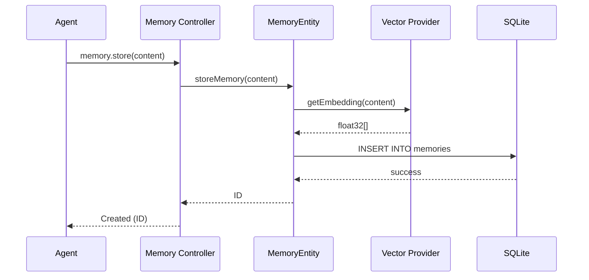

# Module Documentation: Memory Partition

## Responsibility
The Memory Partition handles the persistence, retrieval, and structural integrity of semantic knowledge and task state. It is built on a "Local-First" principle, ensuring high performance without external dependencies.

## Data Schema (SQLite)
The system uses the following core tables to maintain state:

### 1. `memories`
The primary store for semantic knowledge.
- **`id`**: UUID v4 (Primary Key).
- **`repo`**: Repository name for scoping.
- **`type`**: Enum (code_fact, decision, mistake, pattern, task_archive).
- **`title`**: Human-readable title for UI display.
- **`content`**: The actual knowledge payload.
- **`importance`**: Integer (1 to 5) used for ranking.
- **`is_global`**: Boolean (0/1) for cross-repository visibility.
- **`tags`**: JSON array of tech-stack or logic markers.
- **`hit_count` / `recall_count`**: Used to calculate "recall rate" and decay.

### 2. `tasks`
The state machine for development initiatives.
- **`status`**: Enum (backlog, pending, in_progress, completed, blocked, canceled).
- **`task_code`**: Unique human-readable code (e.g., `TASK-001`).
- **`est_tokens`**: Token budget tracking for cost/performance analysis.

## Search Ranking Algorithm
Memory search utilizes a hybrid ranking strategy:
1.  **Semantic Filter**: Broad filtering based on `repo` affinity and `is_global` status.
2.  **Tag Boost**: Priorities are given to entries matching the `current_tags` of the active environment.
3.  **Vector Calculation**: Cosine similarity between the query embedding and stored content vectors.
4.  **Ranking Bias**: 
    -   `repo_match`: +0.1 similarity boost.
    -   `importance`: Higher importance values act as tie-breakers.

## Memory Lifecycle & Maintenance
The system performs automated "Garbage Collection" and curation:
- **Expiry**: Memories with an `expires_at` timestamp are automatically moved to `memories_archive` or marked as `archived`.
- **Decay Scoring**: High-volume repositories utilize a decay algorithm where `hit_count` (frequency of access) vs. `recall_count` (relevance of access) is used to demote low-quality memories.
- **Auto-Archiving**:
    -   Memories older than 90 days with `importance < 3` are archived.
    -   Memories with `hit_count > 10` but `recall_count = 0` are flagged for review/archival.
- `memory.search`: Performs hybrid Vector + FTS5 search (ranked by similarity).
- `memory.synthesize`: Consolidates multiple memories into a high-level architectural insight.
- `memory.summarize`: Updates the repository's global summary signal.
- `memory.recap`: Provides a pointer table of the most important recent memories.
## Business Rules
| Rule Name | Description |
|-----------|-------------|
| **Hybrid Ranking** | Results are ranked using a combination of Cosine Similarity (Vector) and BM25 (Full-Text Search). |
| **Deduplication** | Identical content within the same repository scope is rejected to prevent noise. |
| **Importance Bias** | Search results can be prioritized using `minImportance` (1-5). |
| **Global Scope** | Memories marked as `is_global` are searchable across all repository contexts. |
| **Bound Validation** | Absolute paths in `current_file_path` must remain within the active MCP roots. |

## Data Model (memories table)
- `id` (UUID, PK)
- `type` (decision, code_fact, mistake, pattern, task_archive)
- `title` (TEXT)
- `content` (TEXT)
- `repo` (TEXT)
- `importance` (INTEGER, 1-5)
- `is_global` (BOOLEAN)
- `metadata` (JSON)
- `embedding` (F32 Vector)
- `created_at` (TIMESTAMP)

## Business Flow: Storage & Retrieval

## Agent Coordination
- Handoffs and task claims are **not** stored as memories.
- Use the dedicated `handoffs` and `claims` tables via the `handoff-create`, `handoff-list`, and `task-claim` MCP tools.
- This keeps durable semantic memory separate from transient agent coordination state.

## Implementation Note
The persistence logic for this module is encapsulated in the **[MemoryEntity](file:///home/vheins/Projects/local-memory-mcp/src/mcp/entities/memory.ts)**, which handles all SQL interactions, vector serialization, and archival transitions.

## Compliance
- **Local Privacy**: All embeddings are generated locally. No plain text or vectors are transmitted over the network.
- **Protocol Strictness**: All responses follow the MCP result schema with `content` arrays.
