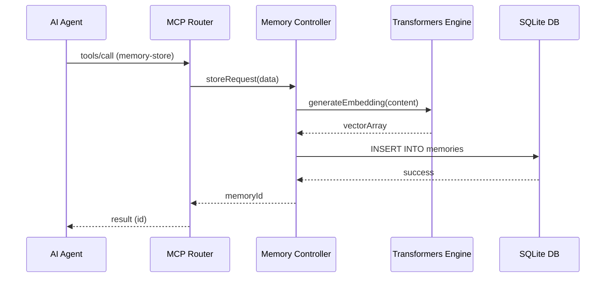

# Feature Documentation: Memory Management

## User Stories
- **Story 1: Persist Context**
  - **Given** an AI agent has discovered a new architectural decision or rule,
  - **When** it calls the `memory-store` tool with the relevant content and importance,
  - **Then** the system should store the data in SQLite, generate a vector embedding, and return a unique UUID.
- **Story 2: Semantic Search**
  - **Given** an agent is looking for past context regarding a specific topic,
  - **When** it calls the `memory-search` tool with a natural language query,
  - **Then** the system should perform a hybrid (Vector + FTS5) search and return relevant memories ranked by similarity.
- **Story 3: Content Update**
  - **Given** an existing memory contains outdated information,
  - **When** the agent calls `memory-update` with the new content,
  - **Then** the system should update the record and refresh its vector embedding.

## Business Flow

## Business Rules
| Rule Name | Description | Consequence |
|-----------|-------------|-------------|
| Importance Scale | Importance must be an integer between 1 and 5. | Rejection with `-32602` error. |
| Duplicate Prevention | The system checks for identical titles within the same repository scope before storing. | Conflict warning or auto-versioning. |
| Hybrid Ranking | Results are ranked using a combination of cosine similarity and BM25 text score. | Higher precision for developer-specific terminology. |

## Data Model (ERD)
- **Table:** `mcp_memories`
  - `id` (UUID, PK): Primary unique identifier.
  - `type` (TEXT): Categorization (decision, doc, rule).
  - `title` (TEXT): Short summary of the memory.
  - `content` (TEXT): Full markdown or text content.
  - `embedding` (BLOB): 384-dimensional vector (F32).
  - `repo` (TEXT): Repository scope.
  - `importance` (INT): 1-5 scale.

## Compliance Requirements
- **Privacy**: No memory data or embedding requests may ever leave the local machine. All processing must be offline.
- **Protocol**: Response format must strictly follow the `content` array structure defined in MCP 2025-11-25.

## Task List
- [x] Implement SQLite FTS5 extension mapping.
- [x] Configure `@xenova/transformers` for background model loading.
- [x] Build `memory-search` hybrid query logic.
- [x] Add telemetry for `memory-acknowledge` tracking.
