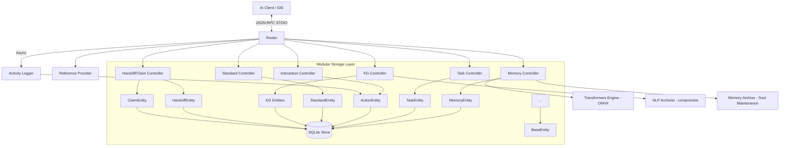

# Module Overview: MCP Server

## Header & Navigation

- [Memory Feature](memory.md)
- [Task Feature](task.md)
- [Interaction Feature](interaction.md)
- [References Feature](references.md)
- [Memory API](../../api/mcp-server/api-memory.md)
- [Task API](../../api/mcp-server/api-task.md)
- [Core API](../../api/mcp-server/api-core.md)
- [Memory Tests](../../testing/mcp-server/test-memory.md)
- [Task Tests](../../testing/mcp-server/test-task.md)

## Responsibility

The `mcp-server` module is the core intelligence engine of the system. It implements the Model Context Protocol (MCP) to provide agents with a stateful, semantic knowledge base and a standardized task orchestration framework. It manages local persistence, embedding generation, automated audit logging, multi-agent coordination, coding standards, and knowledge graphs.

## Core Capabilities

The server advertises and supports the following formal MCP capabilities:

- **Tools**: Stateful task management, memory operations, handoffs, claims, standards, knowledge graph CRUD.
- **Resources**: Direct access to indexed knowledge, task boards, standards, and audit logs via URI templates.
- **Prompts**: 31 standardized behavioral contracts for agent initialization and specialized workflows.
- **Completions**: Intelligent argument suggestion for repos, tags, task codes, and file paths.
- **Logging**: Configurable runtime logging with standard severity levels (`debug`, `info`, `warn`, `error`).
- **Sampling**: Capability for the server to request LLM message generation from the client (used by `memory-synthesize`).
- **Elicitation**: Support for interactive user input via forms (structured data) and URLs (OAuth/payments).

## Core Services

- **Memory Service**: Handles semantic indexing, hybrid search (TF-IDF + vector), context sharing, memory decay (Soul Maintenance), and conflict detection.
- **Task Service**: Manages the multi-stage task lifecycle with strict transition safety, token budgeting, and auto-archiving to memory.
- **Standard Service**: Manages coding standards with vector similarity search and language/stack scoping.
- **Knowledge Graph Service**: CRUD for entities, relations, and observations with NLP-based auto-extraction via `compromise`.
- **Coordination Service**: Handoff creation/lifecycle and task claim ownership for multi-agent collaboration.
- **Interaction Service**: Orchestrates complex completions, session contexts, and interactive elicitations.
- **Logging & Activity Service**: Handles runtime configuration and logs all tool interactions for full auditability.
- **Reference Service**: Exposes internal MCP schemas (Tools, Prompts, Resources) for self-inspection.

## Architecture

## Dependencies

- `@xenova/transformers`: Local vector embedding generation (ONNX, all-MiniLM-L6-v2).
- `better-sqlite3`: High-performance local SQL persistence.
- `compromise` + `compromise-dates`: Lightweight NLP for entity extraction and temporal parsing.
- `uuid`: Unique identifier generation.
- `zod`: Schema validation for tool parameters and responses.
- `proper-lockfile`: Cross-process write locking.

## Key Architecture Patterns

- **Entity/Active Record Pattern**: Each DB table has a corresponding Entity class (e.g., `MemoryEntity`, `TaskEntity`) extending `BaseEntity`.
- **Scope Injection Pipeline**: Owner/repo injected from MCP session context into tool arguments automatically.
- **Hybrid Search**: TF-IDF cosine similarity + ONNX neural embeddings with tunable weights.
- **Soul Maintenance**: Biological-inspired memory decay with tag immunization. Runs at startup (checks <24h since last run).
