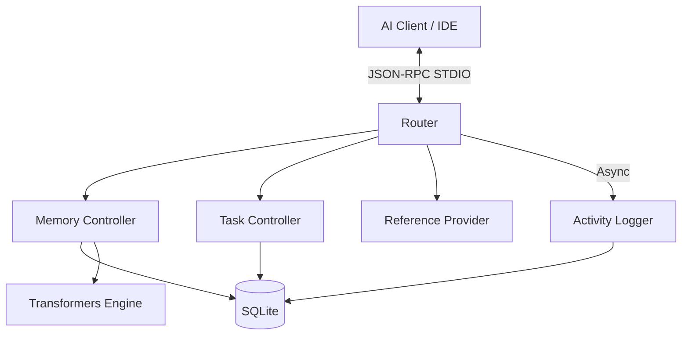

# Module Overview: MCP Server

## Responsibility
The `mcp-server` module is the core intelligence engine of the system. It implements the Model Context Protocol (MCP) to provide agents with a stateful, semantic knowledge base and a standardized task orchestration framework. It manages local persistence, embedding generation, and automated audit logging.

## Core Services
- **Memory Service**: Handles semantic indexing, hybrid search, and knowledge synthesis.
- **Task Service**: Manages the multi-stage task lifecycle with strict transition safety and token budgeting.
- **Activity Service**: Automatically logs all tool interactions for auditability.
- **Reference Service**: Exposes internal MCP schemas (Tools, Prompts, Resources) for self-inspection.

## Features
- **Contextual Memory**: Hybrid (Vector + FTS5) search across local memories with automated conflict resolution.
- **Task Orchestration**: Priority-based task management with unique task codes and mandatory workflow transitions.
- **Self-Inspection**: Resources that allow agents to query their own tool definitions and prompt templates.
- **Offline Intelligence**: Local-first embedding generation using `@xenova/transformers`.

## Architecture

## Dependencies
- `@xenova/transformers`: Local vector embedding generation (ONNX).
- `better-sqlite3`: High-performance local SQL persistence.
- `uuid`: Unique identifier generation.
- `zod`: Schema validation for tool parameters and responses.
