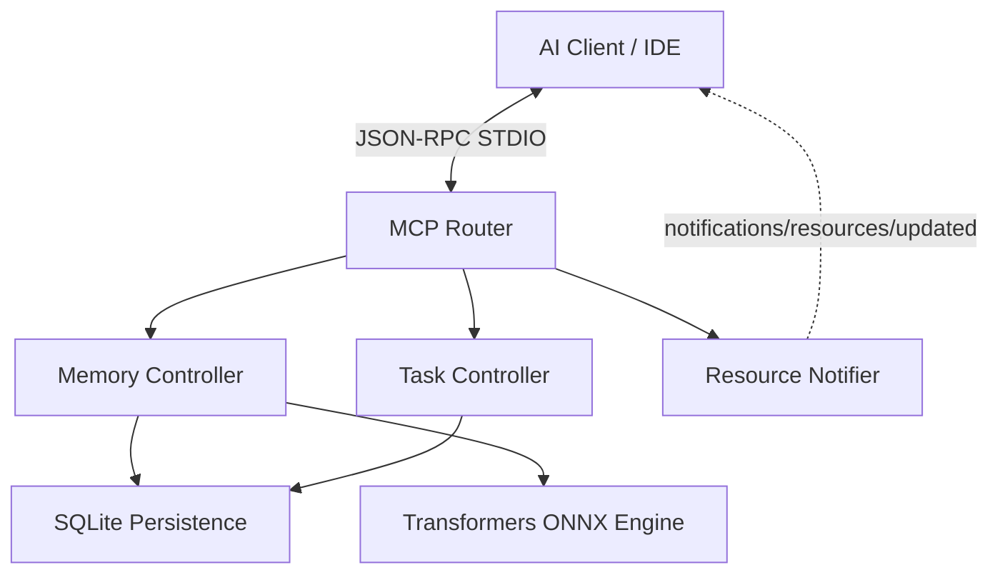

# Module Overview: MCP Server

## Responsibility
The `mcp-server` module serves as the primary engine for the Model Context Protocol implementation. It is responsible for handling all incoming JSON-RPC traffic over the STDIO transport, dispatching requests to specialized handlers (Memory and Task), managing the local SQLite persistence layer, and embedding AI model capabilities for semantic operations.

## Features
- **Contextual Memory Management**: Tools for storing, updating, searching, and synthesizing semantic memories with automated conflict detection.
- **Task Lifecycle Tracking**: A robust state machine for managing development tasks, providing explicit context boundaries for the AI agent.
- **Real-time Resource Subscriptions**: Exposes dynamic URIs for memories and tasks that clients can subscribe to for live updates.
- **Advanced Protocol Utilities**: Full support for MCP 2025-11-25 utilities including Progress reporting, Request Cancellation, and Elicitation forms.

## Architecture

## Dependencies
- `@xenova/transformers`: For local vector embedding generation.
- `better-sqlite3`: For high-performance, synchronous local data storage.
- `uuid`: For generating unique identifiers for memories and tasks.
