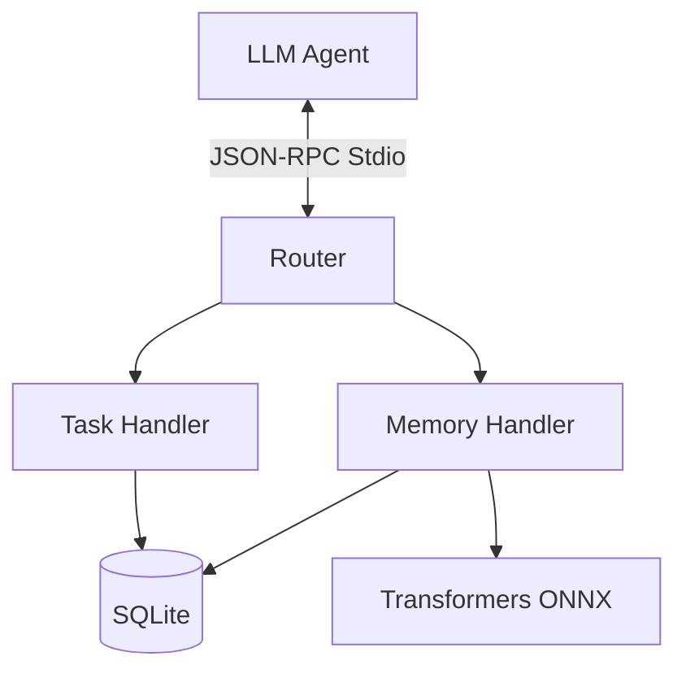

# Module Overview: MCP Server

## Responsibility
Handles all incoming JSON-RPC traffic over Stdio, executes logic via registered Tools and Resources, and embeds AI model capabilities.

## Features
- **Memory**: Store, search, delete, update, summarize context.
- **Tasks**: Create, read, update, activate isolated workspaces.

## Architecture

## Dependencies
- `@xenova/transformers`
- `better-sqlite3`