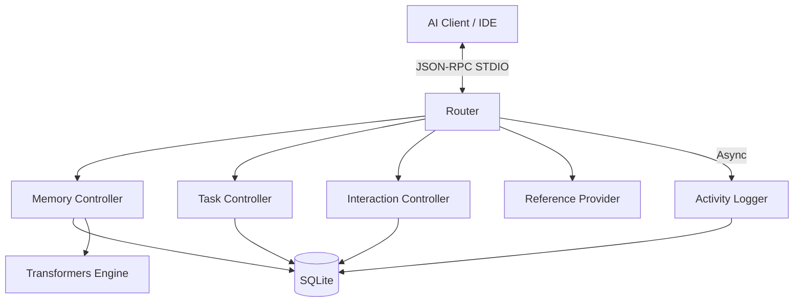

# Module Overview: MCP Server

## Responsibility
The `mcp-server` module is the core intelligence engine of the system. It implements the Model Context Protocol (MCP) to provide agents with a stateful, semantic knowledge base and a standardized task orchestration framework. It manages local persistence, embedding generation, and automated audit logging.

## Core Capabilities
The server advertises and supports the following formal MCP capabilities:
- **Tools**: Stateful task management and memory operations.
- **Resources**: Direct access to indexed knowledge and task boards via URI templates.
- **Prompts**: Standardized behavioral contracts for agent initialization.
- **Completions**: Intelligent argument suggestion and search refinement.
- **Logging**: Configurable runtime logging with standard severity levels.
- **Sampling**: Capability for the server to request message generation from the client.
- **Elicitation**: Support for interactive user input via forms and URLs.

## Core Services
- **Memory Service**: Handles semantic indexing, hybrid search, and context sharing (Affinity).
- **Task Service**: Manages the multi-stage task lifecycle with strict transition safety and token budgeting.
- **Interaction Service**: Orchestrates complex completions, session contexts, and interactive elicitations.
- **Logging & Activity Service**: Handles runtime configuration and asynchronously logs all tool interactions for auditability.
- **Reference Service**: Exposes internal MCP schemas (Tools, Prompts, Resources) for self-inspection.

## Architecture

## Dependencies
- `@xenova/transformers`: Local vector embedding generation (ONNX).
- `better-sqlite3`: High-performance local SQL persistence.
- `uuid`: Unique identifier generation.
- `zod`: Schema validation for tool parameters and responses.
