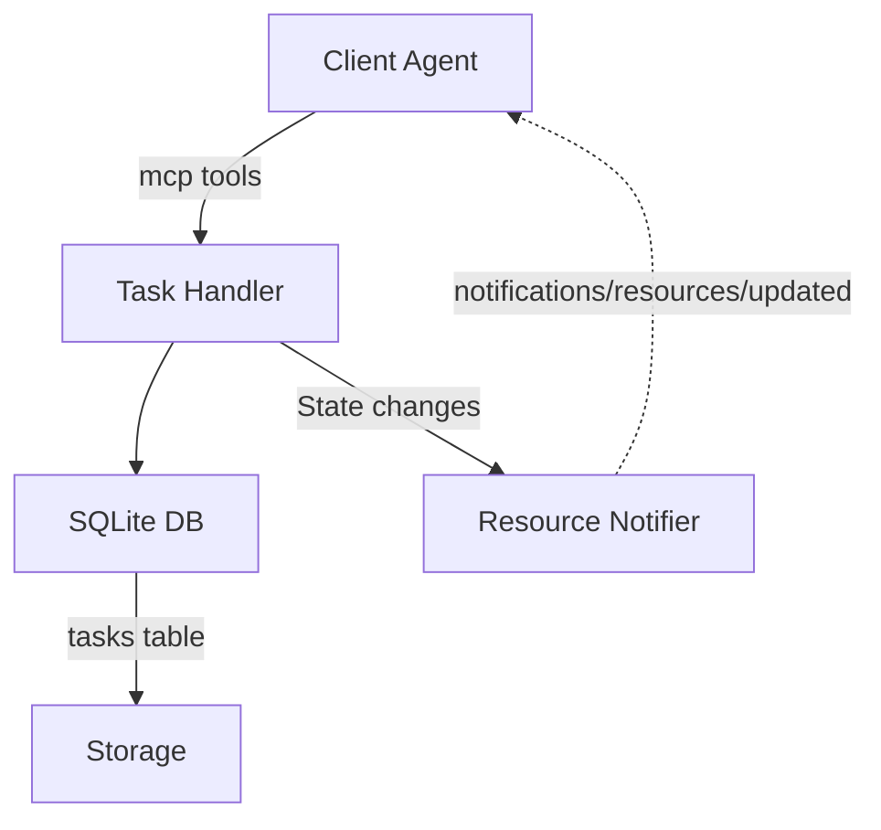

# Module Overview: Task Management

## Responsibility
Manages the lifecycle of development tasks (from creation to completion or archiving) for a specific repository. Its primary purpose is to define explicit "context boundaries"—so that memory searches and synthetic recaps only apply to the work currently being executed (the `active` task).

## Features
- **Task State Machine**: Allows tasks to transition between `pending`, `active`, `completed`, `failed`, and `archived`.
- **Singleton Active Task**: Enforces a rule where only one task can be `active` per repository at any given time.
- **Resource Subscription**: Exposes `tasks://current?repo={repo}` as an MCP resource that clients can subscribe to for real-time state updates.

## Architecture

## Dependencies
- `better-sqlite3`
- Node.js MCP Protocol Server