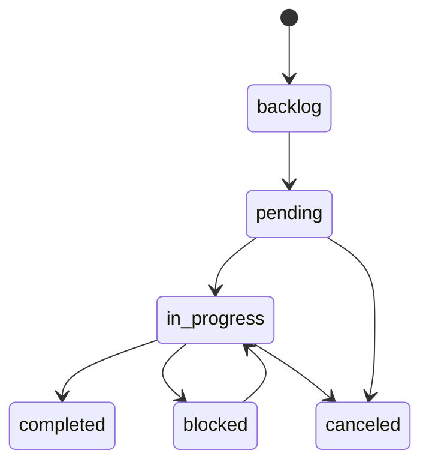

# Feature Documentation: Task Management

## Responsibility
The Task Management module provides a structured, stateful framework for tracking agent goals. It ensures coordination between multiple agents and provides human-readable visibility into the current work-in-progress.

## Task Status Sets
The system enforces a strict 6-stage lifecycle:
- `backlog`: Tasks that are planned but not yet ready for execution.
- `pending`: Tasks ready to be picked up by an agent.
- `in_progress`: The singular active focus of an agent.
- `completed`: Successfully finalized work.
- `canceled`: Tasks no longer required.
- `blocked`: Tasks stuck due to external dependencies or errors.

## Transition Rules
| Rule | Description |
|-----------|-------------|
| **Linear Progression** | A task cannot move from `pending` directly to `completed`. It MUST pass through `in_progress`. |
| **Token Budgeting** | When moving to `completed`, the agent MUST provide `est_tokens` (actual tokens used). |
| **Singleton Enforcement** | An agent should ideally have only one task `in_progress` per repository context to prevent context contamination. |
| **Unique Identifiers** | Each task has a unique `task_code` (e.g., TASK-001) for human referencing. |

## Data Model (tasks table)
- `id` (UUID, PK)
- `task_code` (TEXT, Unique)
- `title` (TEXT)
- `description` (TEXT)
- `status` (ENUM)
- `phase` (TEXT)
- `priority` (INTEGER)
- `agent` (TEXT)
- `role` (TEXT)
- `est_tokens` (INTEGER)
- `parent_id` (UUID, FK) - For hierarchical task trees.
- `created_at` (TIMESTAMP)
- `finished_at` (TIMESTAMP)

## State Machine

## Compliance
- **Auditability**: Every status change must be accompanied by a `comment` explaining the transition.
- **Observability**: Changes are automatically broadcast to the Dashboard via the `Activity` stream.
