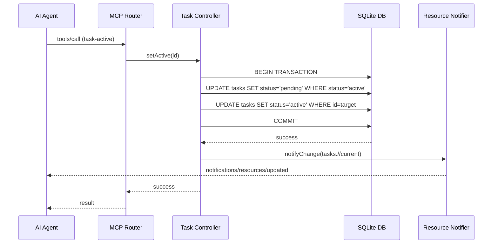

# Feature Documentation: Task Management

## User Stories
- **Story 1: Task Tracking**
  - **Given** an agent is assigned a new goal,
  - **When** it calls `task-create` with a title and description,
  - **Then** the system should log the task as `pending` and return its ID.
- **Story 2: Context Boundary Locking**
  - **Given** multiple tasks exist in a repository,
  - **When** the agent marks a specific task as `active` via `task-active`,
  - **Then** the system should ensure only that task is active, demoting any previously active task.
- **Story 3: Progress Subscription**
  - **Given** a client is interested in the current work state,
  - **When** the client subscribes to `tasks://current`,
  - **Then** the server should push a notification whenever the active task changes status.

## Business Flow

## Business Rules
| Rule Name | Description | Consequence |
|-----------|-------------|-------------|
| Singleton Active Task | Only one task per repository scope can have the `active` status. | Auto-transition of the old active task back to `pending`. |
| Status Transition | Tasks can only move to `completed` or `failed` from an `active` or `pending` state. | Rejection if transition is logically impossible. |
| Repo Scoping | All task operations MUST be scoped to a repository identifier. | Global operations are disallowed to prevent cross-project context leaks. |

## Data Model (ERD)
- **Table:** `mcp_tasks`
  - `id` (UUID, PK): Unique task identifier.
  - `title` (TEXT): Descriptive title.
  - `description` (TEXT): Detailed requirements.
  - `status` (TEXT): enum (pending, active, completed, failed).
  - `repo` (TEXT): Workspace identifier.
  - `created_at` (INT): Epoch timestamp.

## Compliance Requirements
- **Transparency**: Every task state change must be observable via the `tasks://current` resource.
- **User Control**: If the client supports it, interactive task creation via `elicitation` forms is preferred.

## Task List
- [x] Create SQLite `tasks` table with status indexes.
- [x] Implement atomic transaction for `task-active` toggle.
- [x] Map `tasks://current` to the resource router.
- [x] Integrate `elicitation/create` for guided task entry.
