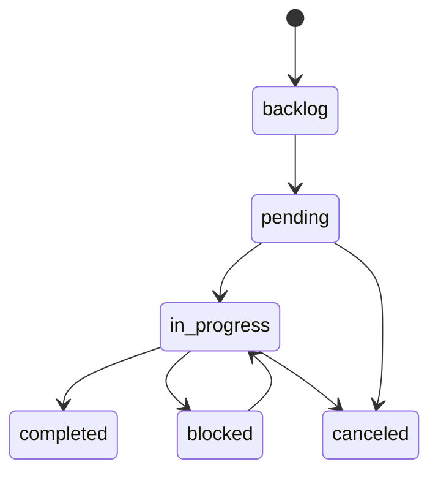

# Feature Documentation: Task Management

## Header & Navigation

- [Module Overview](overview.md)
- [Memory Feature](memory.md)
- [Interaction Feature](interaction.md)
- [Task API](../../api/mcp-server/api-task.md)
- [Task Tests](../../testing/mcp-server/test-task.md)

## Responsibility

The Task Management module provides a structured, stateful framework for tracking agent goals. It ensures coordination between multiple agents and provides human-readable visibility into the current work-in-progress.

## Task Status Sets

The system enforces a strict 6-stage lifecycle:

- `backlog`: Tasks that are planned but not yet ready for execution.
- `pending`: Tasks ready to be picked up by an agent.
- `in_progress`: The singular active focus of an agent.
- `completed`: Successfully finalized work.
- `canceled`: Tasks no longer required.
- `blocked`: Tasks stuck due to external dependencies or errors.

## Transition Rules

| Rule                      | Description                                                                                              |
| :------------------------ | :------------------------------------------------------------------------------------------------------- |
| **Linear Progression**    | Cannot move from `pending`/`backlog`/`blocked` directly to `completed`. MUST pass through `in_progress`. |
| **Token Budgeting**       | When moving to `completed`, the agent MUST provide `est_tokens` (actual tokens used).                    |
| **Singleton Enforcement** | Only one task should be `in_progress` per repository at a time.                                          |
| **Unique Identifiers**    | Each task has a unique `task_code` (e.g., `TASK-001`) for human referencing.                             |
| **Auto-Archiving**        | Moving to `completed` auto-generates a `task_archive` memory with full history.                          |
| **Audit Trail**           | Every status change with a `comment` is recorded in `task_comments`.                                     |

## State Machine

## Data Model (tasks table)

- `id` (UUID, PK)
- `task_code` (TEXT, Unique per repo)
- `title` (TEXT)
- `description` (TEXT)
- `status` (ENUM: backlog/pending/in_progress/completed/canceled/blocked)
- `phase` (TEXT, e.g., Research, Implementation, Review)
- `priority` (INTEGER, 1-5)
- `agent` (TEXT)
- `role` (TEXT)
- `est_tokens` (INTEGER, recorded on completion)
- `parent_id` (UUID, FK) — For hierarchical task trees
- `depends_on` (UUID, FK) — For task sequencing
- `scope_owner`, `scope_repo` — Repository scoping
- `tags`, `metadata` — JSON for extensibility
- `doc_path` — Path to relevant documentation
- `created_at`, `updated_at`, `in_progress_at`, `finished_at`, `canceled_at` — Timestamps

## Task Tools

| Tool                      | Description                                                                                                                  |
| :------------------------ | :--------------------------------------------------------------------------------------------------------------------------- |
| `task-create`             | Register one or more tasks. Supports single or bulk via `tasks` array.                                                       |
| `task-create-interactive` | Guided creation with elicitation fallback for missing fields.                                                                |
| `task-update`             | Update task(s) with transition validation and auto-archiving on completion.                                                  |
| `task-delete`             | Hard delete task(s). Supports single `id` or bulk `ids`.                                                                     |
| `task-list`               | PRIMARY navigation: returns tabular list with status/phase/query filters. Defaults to `backlog,pending,in_progress,blocked`. |
| `task-detail`             | Fetch full description, phase, priority, and all comments for a specific task.                                               |
| `task-search`             | Dedicated search by title or task_code.                                                                                      |

## Multi-Agent Coordination

### Claims

Tasks can be claimed by agents for exclusive ownership:

- `task-claim`: Record ownership in the dedicated `claims` table.
- `claim-list`: View active claims.
- `claim-release`: Release ownership when done.
- **Constraint**: One claim per task (unique `task_id`).

### Handoffs

Context can be transferred between agents:

- `handoff-create`: Create pending handoff with structured context payload.
- `handoff-list`: Query handoffs by status/agent.
- `handoff-update`: Accept, reject, or expire handoffs.

## Compliance

- **Auditability**: Every status change must be accompanied by a `comment` explaining the transition.
- **Observability**: Changes are automatically broadcast via resource change notifications.
- **Implementation Note**: The persistence logic is encapsulated in **[TaskEntity](../../../../../src/mcp/entities/task.ts)** and **[TaskCommentEntity](../../../../../src/mcp/entities/task-comment.ts)**.
