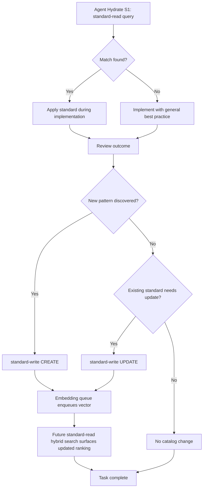

# Standards Module — Overview

> **Module:** `standards` · **Scope:** Coding standards catalog — normative contracts for automated compliance.
> **Tools:** `standard-read` · `standard-write` · `standard-delete` (3 tools) · **Storage:** `coding_standards` + `standard_vectors` (384-dim)

## Purpose

The Standards module is the normative catalog for coding rules, best practices, and architectural constraints. It provides a searchable, scoped, and versioned repository of standards that agents query before implementation (`standard-read` as S1 hydrate gate) and persist after refinement (`standard-write`). Standards are contracts: they state when a rule applies, what to do, and why.

Unlike memories (episodic knowledge), standards are prescriptive and durable. They survive across tasks and are enforced via pre-implementation hydration and post-implementation review.

## Module Position

| Dimension  | Value                                                               |
| :--------- | :------------------------------------------------------------------ |
| Manifest # | 3 — `standards`                                                     |
| Scope      | `owner/repo` isolated; `is_global` cross-repo broadcast             |
| Tools      | 3 — `standard-read`, `standard-write`, `standard-delete`            |
| Storage    | `coding_standards` table + `standard_vectors` (FTS + vector hybrid) |
| Consumer   | Agents (hydrate), reviewers, dashboard catalog UI                   |

Related modules: [Memory](../memory/overview.md) (episodic recall) · [Tasks](../tasks/overview.md) (execution) · [Handoffs](../handoffs/overview.md) (coordination) · [Codebase Index](../codebase-index/overview.md) (symbol grounding)

## Tool Surface (3 Tools)

### 1. `standard-read` — Unified Read (SEARCH | DETAIL | LIST)

Auto-infers mode from params:

| Mode   | Trigger                         | Behavior                                                                                          |
| :----- | :------------------------------ | :------------------------------------------------------------------------------------------------ |
| SEARCH | `query` present                 | Hybrid FTS + vector scoring per SPEC-001; honors `language`, `stack`, `tags`, `is_global` filters |
| DETAIL | `id` / `code` / `ids` / `codes` | Single or bulk fetch by UUID or short code                                                        |
| LIST   | neither `query` nor `id`/`code` | Paginated listing with `limit`/`offset`, scoped by `owner`/`repo`                                 |

Supports inline `key:value` tags extracted from `query` (e.g., `language:typescript stack:svelte tag:a11y`). Unknown keys remain free-text.

### 2. `standard-write` — Unified Write (CREATE | UPDATE | BULK)

| Mode   | Trigger                       | Behavior                                                                           |
| :----- | :---------------------------- | :--------------------------------------------------------------------------------- |
| CREATE | `content` without `id`/`code` | Insert new standard; generates `id` (UUID v4), optional `code`, enqueues embedding |
| UPDATE | `id` or `code` present        | Patch fields; re-enqueues vector if content changed                                |
| BULK   | `standards[]` array           | Mixed create/update items; transactional per-item                                  |

Required on create: `name` (3-255), `content` (≥10), `tags` (≥1), `metadata`. Optional: `language`, `stack`, `context`, `parent_id`, `is_global`.

### 3. `standard-delete` — Soft Delete

Accepts `id`/`code` or `ids`/`codes` (bulk). Auto-infers UUID vs code. Removes row, cascades `standard_vectors`, releases related claims/handoffs.

## Normative Contract Model

Every standard entry is a normative contract with four normative fields:

| Field            | Semantics              | Example                                                 |
| :--------------- | :--------------------- | :------------------------------------------------------ |
| `context`        | When the rule applies  | "When writing Svelte 5 components"                      |
| `content`        | What the rule mandates | "Use runes ($state, $derived) over stores"              |
| `recommendation` | Concrete alternative   | "Replace `writable()` with `$state()`"                  |
| `rationale`      | Why the rule exists    | "Rune reactivity is compiler-tracked and tree-shakable" |

Supporting fields: `scope` (`owner`, `repo`, `folder`, `language`, `stack`), `tags`, `is_global`, `parent_id` (hierarchical grouping), `status` (`active`/`deprecated`/`superseded`).

## Lifecycle



Lifecycle guarantees: writes are under `WriteLock`; embeddings are offloaded to async queue (migration v09); vectors converge within <1s after write.

## Scoping & Isolation

- Strict `owner`/`repo` isolation. `is_global = 1` rows are visible cross-repo.
- `scope` JSON narrows applicability: `language` (e.g., `typescript`), `stack` (e.g., `svelte`, `express`), `folder` (e.g., `src/dashboard/ui`).
- Dashboard merges by short `repo` for operational view; per-owner isolation via MCP tools only (ADR-008).

## Data Model Summary

```
coding_standards (id PK, title, description, scope JSON, context, recommendation,
                  rationale, tags JSON, is_global, parent_id FK, status, timestamps)
standard_vectors (standard_id PK/FK CASCADE, vector BLOB 384-dim, vector_version, updated_at)
```

Indexes: `idx_standards_scope` on `(scope_owner, scope_repo, language)`.

## Compliance Gates

- **S1 Hydrate mandatory:** agents MUST call `standard-read(query)` before implementation.
- **Persistence:** newly surfaced conventions MUST be persisted via `standard-write` at session end.
- **Review:** `code-reviewer` flags violations against catalog; `>500` lines/file requires ADR.

## Cross-References

- API contracts: `../../api/standards/api-standards.md` · `../api/standards/api-standard-read.md` · `../api/standards/api-standard-write.md` · `../api/standards/api-standard-delete.md`
- Feature deep-dive: `./standard-catalog.md` (catalog CRUD, search, hierarchy)
- Testing: `../../testing.md` · `../../../testing/standards/standard-catalog.test.md` · `src/mcp/tests/standard*.test.ts`
- Design: `../../../design/domain/domain.md` (§4 Standard entity) · `../../../design/database/schema.md` (§ `coding_standards`, `standard_vectors`)
- Manifest: `../manifest.md` · Dashboard: `../dashboard/overview.md`

## Implementation Notes

- Vector model: `Xenova/all-MiniLM-L6-v2` (384-dim), lazy-loaded per runtime profile (`full` eager, `balanced` on demand, `minimal` disabled).
- FTS tokenizer: `unicode61` with `*` prefix matching; tags stripped before FTS to avoid `language:ts` tokenization issues.
- Write integrity: `WriteLock` serializes mutations; `action_log` records every tool invocation.

---

_Module owner: `documentation` agent · Last verified: 2026-09-07 against `src/mcp/tools/standard*.ts` and `src/mcp/storage/migrations/`._
