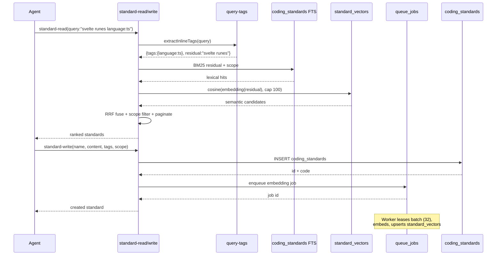

# Standard Catalog — Catalog CRUD + Hierarchy + Hybrid Search

> **Module:** `standards` · **Feature:** Catalog CRUD (hierarchy, scoping, hybrid search) · **Tools:** `standard-read` · `standard-write` · `standard-delete` · **Storage:** `coding_standards` + `standard_vectors` + `queue_jobs`

## 1. Overview

Standard Catalog is the CRUD and hierarchy layer for the `standards` normative catalog. It manages coding standards as first-class entities with **parent-child grouping** (`parent_id`), **multi-dimensional scoping** (`owner`/`repo`/`folder`/`language`/`stack`), **status lifecycle** (`active`/`deprecated`/`superseded`), and **hybrid search** (FTS + 384-dim vector via `standard_vectors`). The catalog is the enforcement backbone: agents hydrate via `standard-read` (S1 gate) before implementation, and new conventions are persisted via `standard-write` at session end. Dashboard renders the catalog as a scoped, searchable list with hierarchy breadcrumbs.

Unlike memories (episodic, TTL-bounded), standards are durable contracts — they version via `status` and `parent_id`, not `supersedes`.

## 2. User Stories

| #   | As a ...            | I want ...                                                                                | So that ...                                                       |
| --- | ------------------- | ----------------------------------------------------------------------------------------- | ----------------------------------------------------------------- |
| 1   | Agent (S1 hydrate)  | to call `standard-read(query:"svelte runes")` and get ranked normative rules              | I implement against the catalog, not assumptions                  |
| 2   | Agent (end of task) | to persist a newly surfaced convention via `standard-write(name, content, tags)`          | Future agents benefit from what I learned                         |
| 3   | Maintainer          | to group standards hierarchically via `parent_id`                                         | Related rules (e.g., "Svelte" → "Runes" → "Effect") are navigable |
| 4   | Maintainer          | to scope a standard to `language:typescript` + `stack:svelte` + `folder:src/dashboard/ui` | Rules apply only where relevant                                   |
| 5   | Reviewer            | to deprecate a superseded standard via `standard-write(id, status=deprecated)`            | Stale rules are visible but not enforced                          |
| 6   | Dashboard user      | to browse the catalog with filters and see `is_global` broadcast                          | I audit cross-repo vs scoped rules                                |

## 3. Business Logic (Pseudocode)

```text
function standardRead(query, scope, opts):
  tags = extractInlineTags(query)  // language:ts stack:svelte tag:a11y
  residual = stripTags(query, tags)
  lexical = ftsSearch("coding_standards", residual, scope, tags)
  if vectorAvailable && residual.nonEmpty:
    embedding = embed(residual)  // Xenova 384-dim
    candidates = vectorSearch(standard_vectors, embedding,
                              cap=VECTOR_CANDIDATE_CAP=100, min=10)
    fused = reciprocalRankFusion(lexical, candidates)
  else:
    fused = lexical
  fused = applyScopeFilters(fused, scope, is_global, folder, language, stack)
  fused = paginate(fused, opts.limit, opts.offset)
  return fused

function standardWrite(payload):
  acquire WriteLock
  if payload.id or payload.code:  // UPDATE
    row = fetchByIdOrCode(payload.id, payload.code)
    patch(row, payload)            // name/content/context/tags/scope/status/parent_id
    row.updated_at = now()
    if contentChanged: enqueue queue_jobs for re-embed
    return row
  else:                           // CREATE
    validate required: name (3-255), content (≥10), tags (≥1), metadata
    row = insert coding_standards {id:uuid, name, content, context,
          recommendation, rationale, tags, scope{owner,repo,folder,language,stack},
          is_global, parent_id, status:active, created_at, updated_at}
    enqueue queue_jobs {standard_id: row.id, vector_version}
    return row

function standardDelete(idOrCode):
  acquire WriteLock
  row = fetchByIdOrCode(idOrCode)
  delete row CASCADE standard_vectors
  return {deleted: idOrCode}

// Scoping truth:
// - is_global=1 visible cross-repo; else filtered by owner/repo
// - scope JSON narrows: language, stack[], folder — all ANDed
```

Invariants: `WriteLock` serializes mutations; embeddings offloaded to async queue (migration v09); `parent_id` FK nullable, no cycle check at DB level (app-layer guard).

## 4. Sequence Diagram



## 5. Data Model

```mermaid
erDiagram
    coding_standards ||--o| standard_vectors : "1:1 embedding"
    coding_standards ||--o{ coding_standards : "parent_id hierarchy"
    coding_standards {
        TEXT id PK
        TEXT title
        TEXT description
        TEXT scope_JSON
        TEXT context
        TEXT recommendation
        TEXT rationale
        TEXT tags_JSON
        INTEGER is_global
        TEXT parent_id FK_nullable
        TEXT status
        TEXT created_at
        TEXT updated_at
    }
    standard_vectors {
        TEXT standard_id PK_FK
        BLOB vector
        INTEGER vector_version
        TEXT updated_at
    }
    queue_jobs {
        TEXT id PK
        TEXT payload
        TEXT status
        TEXT leased_at
    }
```

Indexes: `idx_standards_scope` on `(scope_owner, scope_repo)`; FTS index on `title`/`description`/`tags`; `parent_id` indexed for hierarchy traversal.

## 6. Public Interface

| Tool              | Mode   | Key Params                                                                                                                       | Returns                       |
| :---------------- | :----- | :------------------------------------------------------------------------------------------------------------------------------- | :---------------------------- |
| `standard-read`   | SEARCH | `query` (+ inline `language:`, `stack:`, `tag:`), `owner`/`repo`, `language`, `stack[]`, `tags[]`, `is_global`, `limit`/`offset` | Ranked `Standard[]` + `total` |
| `standard-read`   | DETAIL | `id`/`code` or `ids`/`codes` (bulk)                                                                                              | Full `Standard` object(s)     |
| `standard-read`   | LIST   | (no query/id) + `owner`/`repo`, `limit`/`offset`                                                                                 | Paginated `Standard[]`        |
| `standard-write`  | CREATE | `name` (3-255), `content` (≥10), `tags` (≥1), `metadata`, optional `language`, `stack[]`, `context`, `parent_id`, `is_global`    | Created `Standard`            |
| `standard-write`  | UPDATE | `id`/`code` + fields to patch                                                                                                    | Updated `Standard`            |
| `standard-write`  | BULK   | `standards[]` array                                                                                                              | Per-item results              |
| `standard-delete` | DELETE | `id`/`code` or `ids`/`codes` (bulk, auto-infers UUID vs code)                                                                    | Deleted ids/codes             |

Inline tags: `language:typescript`, `stack:svelte`, `tag:a11y,perf` — unknown keys remain free-text.

## 7. Dependencies

- **Embedding model** `Xenova/all-MiniLM-L6-v2` (384-dim) via `@xenova/transformers`; lazy per `MCP_RUNTIME_PROFILE` (`full` eager, `balanced` on demand, `minimal` lexical only).
- **Queue:** `EMBEDDING_QUEUE_BATCH_SIZE=32`, `POLL_INTERVAL_MS=500`, `LEASE_MS=60000`, `BACKFILL_CAP=2000`.
- **Search bounds:** `VECTOR_CANDIDATE_CAP=100`, `VECTOR_MIN_CANDIDATES=10`.
- **Scope:** `owner`/`repo` isolation; `is_global` broadcast; `scope` JSON (`folder`, `language`, `stack`).
- **Upstream:** `src/mcp/utils/query-tags.ts`, `src/mcp/storage/sqlite.ts`, `src/mcp/entities/standard.ts`.

## 8. Limitations

| Limitation                   | Detail                                                | Mitigation                                       |
| :--------------------------- | :---------------------------------------------------- | :----------------------------------------------- |
| Semantic lag <1s             | Vectors offloaded; new standards lexical-only briefly | FTS covers immediacy; RRF converges after worker |
| `minimal` profile no vectors | Semantic enrichment unavailable                       | Lexical search remains functional                |
| No DB cycle guard            | `parent_id` cycles not rejected at constraint level   | App-layer cycle check on `standard-write`        |
| Status not enforced          | `deprecated`/`superseded` filtered by caller, not DB  | Filter `status=active` in `standard-read`        |
| Dashboard repo-merge         | Short `repo` merges owners for display (ADR-008)      | Owner badge per row; MCP for strict isolation    |

## 9. Compliance

- **S1 Hydrate gate:** agents MUST call `standard-read` before implementation; newly surfaced conventions MUST be persisted via `standard-write`.
- **Attribution:** `agent`/`role`/`model` auto-populated from session; `action_log` per tool call.
- **Naming:** `stack`/`tags` normalized to `slug-case` values; `TitleCase` keys per coding standards.
- **File-size guard:** `>500` lines/file flagged `MEDIUM`; split or ADR required.
- **Write integrity:** `WriteLock` cooperative lock; `action_log` audit.

## 10. UI Layout

Dashboard `Standards` tab (`src/dashboard/ui/src/lib/components/Standard*.svelte`):

- **List view:** cards with `title`, `status` badge (`active`/`deprecated`/`superseded`), `scope` chips (`owner/repo`, `language`, `stack`, `folder`), `tags`, `is_global` highlight, `updated_at` relative time.
- **Hierarchy breadcrumbs:** `parent_id` chain rendered as `Parent → Child → Current`; collapsible tree toggle.
- **Search bar:** single input with inline tag chip preview (`language:`, `stack:`, `tag:`); debounced hybrid search.
- **Detail drawer:** `context`/`content`/`recommendation`/`rationale` sections, metadata JSON, hierarchy, edit/delete actions.
- **Create/edit modal:** `name`, `content`, `context`, `tags`, `scope` pickers, `is_global` toggle, `parent_id` selector.
- **States:** loading skeleton, empty (no standards), stale (worker lag), error.

## 11. Implementation Tasks

| #   | Task                                                                         | Scope                                                           |
| --- | ---------------------------------------------------------------------------- | --------------------------------------------------------------- |
| 1   | `coding_standards` + `standard_vectors` tables + migrations + FTS triggers   | `src/mcp/storage/migrations/`, `src/mcp/entities/standard.ts`   |
| 2   | Embedding queue outbox + worker lease/backoff + backfill cap                 | `src/mcp/services/embedding-queue.ts`                           |
| 3   | `standard-read` hybrid fusion (RRF) + inline tag extraction                  | `src/mcp/tools/standard.read.ts`, `src/mcp/utils/query-tags.ts` |
| 4   | `standard-write` create/update/bulk + `parent_id` + `is_global` + validation | `src/mcp/tools/standard.write.ts`                               |
| 5   | `standard-delete` soft cascade + vector cleanup                              | `src/mcp/tools/standard.delete.ts`                              |
| 6   | Dashboard standards tab + hierarchy breadcrumbs + search + drawer            | `src/dashboard/ui/src/lib/components/Standard*.svelte`          |

## 12. Cross-References

- API contracts: `../../api/standards/api-standards.md` · `../api/standards/api-standard-read.md` · `../api/standards/api-standard-write.md` · `../api/standards/api-standard-delete.md`
- Module landings: `./overview.md` (standards landing) · `../memory/overview.md` · `../tasks/overview.md` · `../handoffs/overview.md` · `../dashboard/overview.md` · `../context/overview.md`
- Testing: `../../testing.md` · `../../../testing/standards/standard-catalog.test.md` · `src/mcp/tests/standard*.test.ts`
- Design: `../../../design/domain/domain.md` (§4 Standard) · `../../../design/database/schema.md` (§ `coding_standards`, `standard_vectors`)
- Decisions: `../../../design/decisions/ADR-008-global-vs-scoped-ownership-and-dashboard-repo-view.md`
- Manifest: `../manifest.md` · Tool contract: `../../../../src/mcp/prompts/server/instructions.md`

---

_Feature owner: `documentation` agent · Last verified: 2026-09-07 against `src/mcp/tools/standard*.ts`, `src/mcp/entities/standard.ts`, and `src/mcp/storage/migrations/`._
