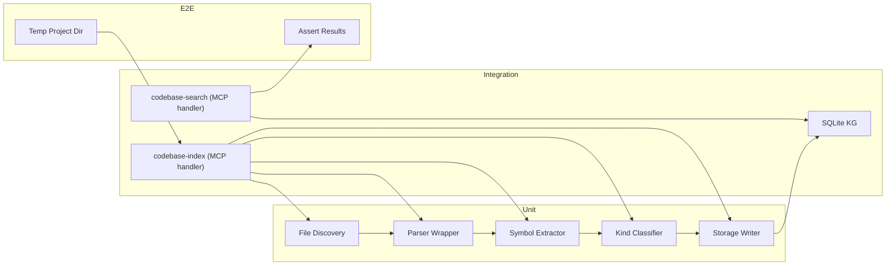

# Test Strategy: Codebase Index

## Header & Navigation

- [Indexing Test Scenarios](test-indexing.md)
- [Search Test Scenarios](test-search.md)
- [Performance Test Scenarios](test-performance.md)

End-to-end quality strategy for the Codebase Index feature: file discovery, tree-sitter parsing, knowledge graph storage, and MCP tool exposure.

## 1. Test Pyramid

```
        ╱  E2E  ╲          5%  — Full workflow (discover → parse → store → search)
      ╱ Integration ╲      20%  — MCP tool input/output, DB round-trips, pipeline stages
    ╱   Unit Tests   ╲     75%  — Parsers, extractors, filters, validators, mappers
```

| Layer           | Focus                                                                                                                                | Tools                                      |
| :-------------- | :----------------------------------------------------------------------------------------------------------------------------------- | :----------------------------------------- |
| **Unit**        | Individual functions: file discovery, tree-sitter AST walkers, symbol extraction, kind classification, deduplication, search ranking | Vitest, property-based (fast-check)        |
| **Integration** | Pipeline orchestration, MCP tool handlers (`codebase-index`, `codebase-search`), SQLite read/write, file-watcher delta detection     | Vitest + testcontainers / in-memory SQLite |
| **E2E**         | Full user journey: run indexer → query via MCP → assert symbol found; re-index after file change → assert delta                      | Vitest + temp directory fixtures           |

## 2. Unit Test Coverage Targets

| Module                             | Target | Critical Paths                                                         |
| :--------------------------------- | :----- | :--------------------------------------------------------------------- |
| File discovery (glob + .gitignore) | 90%+   | Respect `.gitignore`, max-depth, binary detection, hidden files        |
| tree-sitter parser wrapper         | 85%+   | Parse success, parse error recovery, unsupported language fallback     |
| Symbol extractors (per-language)   | 90%+   | Function/class/variable/interface extraction, nested scope handling    |
| Kind classifier                    | 95%+   | All supported kinds, unknown kind fallback                             |
| Storage writer (SQLite)            | 85%+   | Upsert, bulk insert, cascade delete, transaction rollback              |
| Search query builder               | 90%+   | Exact match, fuzzy match, kind/file filters, pagination, empty results |
| Delta detector                     | 85%+   | New file, modified file, deleted file, unchanged file                  |

## 3. Integration Test Coverage

| Flow                          | What It Validates                                                               |
| :---------------------------- | :------------------------------------------------------------------------------ |
| `codebase-index` MCP tool     | Full pipeline: discovery → parse → store; returns symbol count and file summary |
| `codebase-search` MCP tool    | Query → ranking → paginated results; empty result shape                         |
| Index then search round-trip  | Symbol stored → retrieved by exact name, partial name, kind, file               |
| Re-index with no changes      | Idempotent: same file list, same symbol count, no duplicate entries             |
| Re-index after file edit      | Delta: only changed file re-parsed, symbol count correct                        |
| Pipeline abort on fatal error | Unreadable root path returns structured error, partial results discarded        |
| Concurrent index requests     | Queue mechanism prevents race; second request receives "already in progress"    |
| File watcher integration      | FS event → auto-trigger delta index → searchable within T+5s                    |

## 4. Property-Based Tests

| Property            | Input Space                                  | Invariant                                                             |
| :------------------ | :------------------------------------------- | :-------------------------------------------------------------------- |
| Parse round-trip    | Any valid source file for supported language | `extract(parse(source)).every(s => s.kind ∈ KNOWN_KINDS)`             |
| ID stability        | Same file content, repeated parse            | Symbol IDs deterministic (hash-based, not random)                     |
| Search completeness | Any stored symbol                            | `search(byName(s.name)).includes(s)`                                  |
| Deduplication       | Same file indexed twice                      | Symbol count identical, no duplicate rows in `kg_entities`            |
| Delta detection     | Arbitrary file content changes               | `delta(original, modified).size === countChanged(original, modified)` |

## 5. Performance Benchmarks (Thresholds)

| Scenario                               | Threshold             | Measurement                               |
| :------------------------------------- | :-------------------- | :---------------------------------------- |
| Index 1000-file TS project             | <30s wall clock       | `process.hrtime.bigint()` around pipeline |
| Search across 10K symbols              | <500ms p95            | `perf_hooks` before/after query           |
| Concurrent index: 3 simultaneous calls | Only 1 runs; 2 queued | Assert `status: "queued"` in response     |
| Memory during 1000-file index          | <512MB RSS            | `process.memoryUsage().rss` after GC      |
| Delta index on 1 changed file          | <2s                   | Single-file re-parse + SQLite upsert      |
| Binary file detection overhead         | <50ms per 1000 files  | `isBinary()` microbenchmark               |

## 6. Mocking Strategy

| Dependency                | Mock Approach                                                                          | Tool                            |
| :------------------------ | :------------------------------------------------------------------------------------- | :------------------------------ |
| File system               | `mock-fs` or `memfs` — virtual directory tree with controllable permissions            | `memfs` / `mock-fs`             |
| `.gitignore` parsing      | Stub `ignore` module; inject known gitignore rules                                     | Vitest `vi.mock`                |
| tree-sitter WASM          | Inject mock `Parser` returning controlled AST fixtures (valid, malformed, unsupported) | Vitest `vi.mock` + fixture JSON |
| tree-sitter language WASM | Stub `loadLanguage()` returning mock language object or throwing                       | Vitest `vi.mock`                |
| SQLite                    | Use `better-sqlite3` `:memory:` database; truncate between tests                       | In-memory SQLite                |
| File system watcher       | Stub `chokidar` / `fs.watch` — emit controlled event sequences                         | Vitest `vi.mock`                |
| Clock / timestamps        | `vi.setSystemTime()` for deterministic `created_at` / `updated_at`                     | Vitest fake timers              |

## 7. Tool Architecture & Test Boundaries



| Boundary                                | Test Scope  | Mocked?                          |
| :-------------------------------------- | :---------- | :------------------------------- |
| `FileDiscovery.discover()` → `string[]` | Unit        | Mock filesystem                  |
| `Parser.parse(file)` → `ASTNode`        | Unit        | Mock tree-sitter                 |
| `Extractor.extract(ast)` → `Symbol[]`   | Unit        | Fixture AST                      |
| `Indexer.index(path)` → `IndexResult`   | Integration | Real fs (temp dir) + real SQLite |
| `MCP.codebase-index` tool               | Integration | Real SQLite                      |
| `MCP.codebase-search` tool              | Integration | Real SQLite                      |
| Full pipeline (CLI)                     | E2E         | Temp dir + real SQLite           |

## 8. CI Integration

- **PR gate**: All unit + integration tests must pass (<30s)
- **Daily**: Performance benchmarks run on `main`; regression alert if any threshold exceeded by >20%
- **Property-based**: Weekly run with 1000 iterations per property on CI
