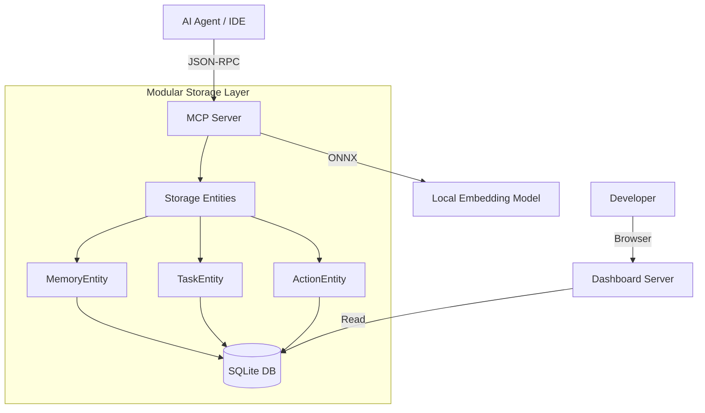

# Architecture Overview

This document specifies the technical architecture and component interactions of the MCP Local Memory system.

## 1. Physical & Process Architecture

The system is designed as a local-first, server-driven developer tool. It operates as two primary processes:

### A. MCP Server (Core Engine)
- **Path**: `dist/mcp/server.js` (Compiled from `src/mcp/`)
- **Role**: The primary AI-facing engine.
- **Communication**: Standard Input/Output (stdio) using JSON-RPC.
- **Key Responsibilities**:
  - Semantic Search & Keyword Search (SQLite + ONNX Embeddings).
  - Task & Memory CRUD Operations.
  - Multi-agent coordination logic.
  - Embedding generation using `@xenova/transformers`.

### B. Dashboard Server (Observation & Admin)
- **Path**: `dist/dashboard/server.js` (Compiled from `src/dashboard/`)
- **Role**: A web-based inspector for human developers.
- **Technology**: Express.js server serving a Vite-built Svelte 5 frontend.
- **Key Responsibilities**:
  - Visualizing the Kanban task board.
  - Auditing recent tool activity via the **Activity Log**.
  - Inspecting MCP capabilities (Tools, Prompts, Resources) via the **Reference Catalog**.
  - Bulk data management (Import/Export).

---

## 2. Component Logic & Data Flow

### Data Flow Invariants
- **Local-First**: No data leaves the machine. Embeddings are generated locally using ONNX.
- **Modular Storage**: Logic is decoupled into specialized entities (`MemoryEntity`, `TaskEntity`, `ActionEntity`, etc.) that inherit from a shared `BaseEntity` for consistent DB access.
- **Unified Storage**: Both the MCP server and Dashboard access the same SQLite file (typically located in `~/.gemini/antigravity/storage/`).
- **Activity Tracking**: Every tool call handled by the MCP Server is logged asynchronously to the `action_log` table for audit visibility in the dashboard.
- **Task Lifecycle**: The system supports a **6-stage task state machine**: `backlog` -> `pending` -> `in_progress` -> `completed` (with `canceled` and `blocked` as terminal/exception states). The Dashboard UI optimizes for the primary 4 swimlanes (`backlog`, `pending`, `in_progress`, `completed`).

---

## 3. Technology Rationale

- **Svelte 5 & Vite**: Selected for the dashboard to provide a high-performance, reactive UI with a small footprint.
- **@xenova/transformers**: Enables production-grade embeddings without API costs or data privacy concerns.
- **Standard Stdio**: The most resilient transport for integration with Cursor, VS Code, and other MCP-compliant hosts.