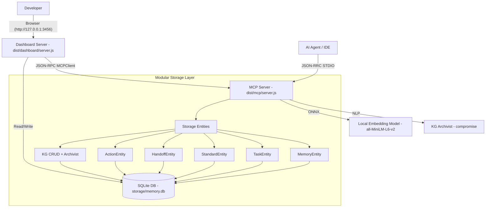

# Architecture Overview

This document specifies the technical architecture and component interactions of the MCP Local Memory system.

## 1. Physical & Process Architecture

The system is designed as a local-first, server-driven developer tool. It operates as two primary processes:

### A. MCP Server (Core Engine)

- **Path**: `dist/mcp/server.js` (Compiled from `src/mcp/`)
- **Role**: The primary AI-facing engine.
- **Communication**: Standard Input/Output (stdio) using JSON-RPC.
- **Key Responsibilities**:
  - Semantic Search & Hybrid Search (SQLite TF-IDF + ONNX Embeddings).
  - Memory & Task CRUD Operations.
  - Multi-agent coordination (claims, handoffs).
  - Coding Standards management with vector search.
  - Knowledge Graph CRUD with NLP-based auto-extraction.
  - Embedding generation using `@xenova/transformers` (all-MiniLM-L6-v2 ONNX).
  - Soul Maintenance (memory decay and archival).
  - Decision logging and session summarization.
  - Write-locked mutation operations for concurrent safety.

### B. Dashboard Server (Observation & Admin)

- **Path**: `dist/dashboard/server.js` (Compiled from `src/dashboard/`)
- **Role**: A web-based inspector for human developers.
- **Technology**: Express.js (v5) server serving a Vite-built Svelte 5 frontend.
- **Port**: 3456 (configurable via `PORT` env var).
- **Auth**: Optional Bearer token via `DASHBOARD_TOKEN` env var.
- **Key Responsibilities**:
  - Visualizing the Kanban task board (4 swimlanes).
  - Auditing recent tool activity via the **Activity Log**.
  - Inspecting MCP capabilities (Tools, Prompts, Resources) via the **Reference Catalog**.
  - Knowledge Graph visualization with force-directed graph renderer.
  - Bulk data management (Import/Export).
  - Coding Standards browsing and management.

---

## 2. Component Logic & Data Flow

### Data Flow Invariants

- **Local-First**: No data leaves the machine. Embeddings are generated locally using ONNX.
- **Modular Storage**: Logic is decoupled into specialized entities (`MemoryEntity`, `TaskEntity`, `StandardEntity`, etc.) that inherit from a shared `BaseEntity` for consistent DB access.
- **Shared SQLite**: Both the MCP server and Dashboard access the same SQLite file (default: `./storage/memory.db`).
- **Scope Injection**: `owner`, `repo`, and `folder` are auto-injected from MCP session context (roots) into tool arguments.
- **Write Locking**: All mutation tools run under `WriteLock.withLock()` using `proper-lockfile`.
- **Activity Tracking**: Every tool call is logged to the `action_log` table for full audit visibility.
- **Hybrid Search**: Combines TF-IDF cosine similarity with ONNX neural vector embeddings, with tunable weights.
- **Task Lifecycle**: 6-stage state machine: `backlog` → `pending` → `in_progress` → `completed` (with `canceled` and `blocked` as terminal/exception states).

---

## 3. Technology Rationale

- **Svelte 5 & Vite**: Selected for the dashboard to provide a high-performance, reactive UI with a small footprint.
- **@xenova/transformers**: Enables production-grade embeddings without API costs or data privacy concerns.
- **compromise + compromise-dates**: Lightweight NLP for entity extraction and temporal query parsing.
- **Standard Stdio**: The most resilient transport for integration with Cursor, VS Code, and other MCP-compliant hosts.
- **better-sqlite3**: Synchronous SQLite driver for maximum performance with zero-config persistence.
- **Zod v4**: Schema validation for all tool inputs with strict type checking.
- **tsup**: Fast TypeScript bundler for compiling the MCP server and dashboard.

---

## 4. Soul Maintenance (Memory Decay)

- Purpose: Automatically archive low-signal memories after periods of inactivity.
- **Decay Rate**: 0.5 (importance multiplier per decay cycle).
- **Inactivity Period**: 7 days (configurable).
- **Minimum Importance Threshold**: 1 (memories below this are archived).
- **Immunization**: Memories with certain tags can be excluded from decay.
- **Schedule**: Runs at server startup and periodically (checks if <24h since last run).

---

## 5. Knowledge Graph Architecture

- **Tables**: `entities` (name PK), `relations` (composite PK), `observations` (UUID PK).
- **Cascade Rules**: Deleting an entity cascades to all its relations and observations.
- **Auto-Extraction**: NLP Archivist (`kg-archivist.ts`) parses memory content via `compromise` on every `memory-store`.
- **Backfill**: `kg-backfill` tool scans existing memories to extract entities.
- **Visualization**: Force-directed graph layout (`KGForceLayout.ts`) rendered on HTML5 Canvas (`KGCanvasRenderer.ts`).
