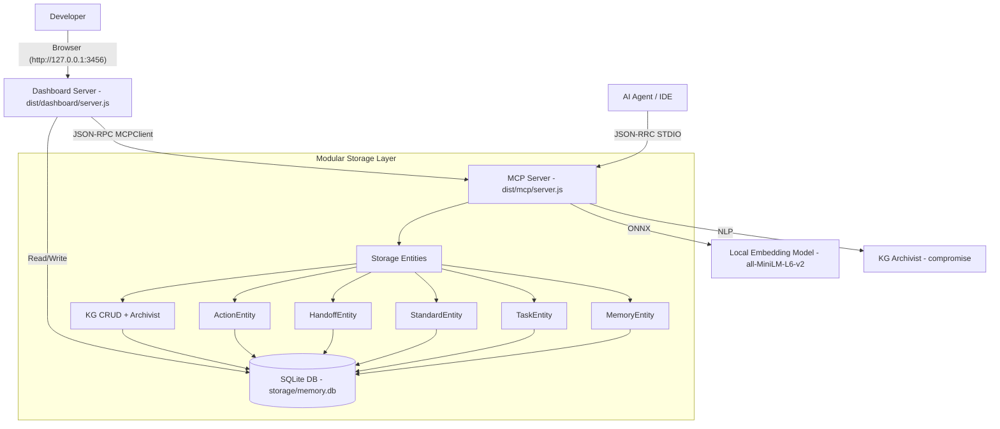

# Architecture Overview

> **VERIFIED vs IMPLEMENTATION (2026-08-08):** architecture is accurate with these corrections — (1) "Semantic Search & Hybrid Search (SQLite TF-IDF + ONNX Embeddings)": keyword scoring is FTS5-based (memory FTS v10, standards FTS v04, symbols FTS v18) blended with ONNX vectors via `scoreHybrid` (40/30/15/15); (2) "Knowledge Graph CRUD with NLP-based auto-extraction": there are **no KG MCP tools** — KG CRUD is dashboard/API-only, and extraction runs asynchronously via the embedding outbox worker (ADR-006); (3) "Decision logging and session summarization": `decision-log`/`session-summarize` are absorbed into `memory-write` convenience modes (ADR-007); (4) DB default path is OS-specific (Linux `~/.config/...`, macOS `~/Library/Application Support`, Windows `~/.local-memory-mcp`), not `./storage/memory.db`; (5) task lifecycle is 6 states (backlog/pending/in_progress/completed/canceled/blocked) with `in_progress`→`completed` required ✓. Dashboard responsibilities (Kanban 4 swimlanes, Activity, Reference, KG force-directed viz, Import/Export, Standards) all verified. There are 20 canonical MCP tools, not the 27 implied elsewhere.

This document specifies the technical architecture and component interactions of the MCP Local Memory system.

## 1. Physical & Process Architecture

The system is designed as a local-first, server-driven developer tool. It operates as two primary processes:

### A. MCP Server (Core Engine)

- **Path**: `dist/mcp/server.js` (Compiled from `src/mcp/`)
- **Role**: The primary AI-facing engine.
- **Communication**: Standard Input/Output (stdio) using JSON-RPC.
- **Key Responsibilities**:
  - Hybrid Search: FTS5 (v10 memory, v04 standards, v18 symbols) + vector blend 40/30/15/15.
  - Memory & Task CRUD Operations.
  - Multi-agent coordination (claims, handoffs).
  - Coding Standards management with vector search.
  - Knowledge Graph (dashboard-only): embedding outbox worker auto-extracts entities/relations; no MCP KG CRUD tools (ADR-006).
  - Embedding generation using `@xenova/transformers` (all-MiniLM-L6-v2 ONNX).
  - Soul Maintenance (memory decay and archival).
  - Decision logging and session summarization.
  - Write-locked mutation operations for concurrent safety.

### B. Dashboard Server (Observation & Admin)

- **Path**: `dist/dashboard/server.js` (Compiled from `src/dashboard/`)
- **Role**: A web-based inspector for human developers.
- **Technology**: Express.js (v5) server serving a Vite-built Svelte 5 frontend.
- **Port**: 3456 (configurable via `PORT` env var).
- **Auth**: Optional Bearer token via `DASHBOARD_TOKEN` env var.
- **Key Responsibilities**:
  - Visualizing the Kanban task board (4 swimlanes).
  - Auditing recent tool activity via the **Activity Log**.
  - Inspecting MCP capabilities (Tools, Prompts, Resources) via the **Reference Catalog**.
  - Knowledge Graph visualization with force-directed graph renderer.
  - Bulk data management (Import/Export).
  - Coding Standards browsing and management.

---

## 2. Component Logic & Data Flow

```mermaid
graph TD
    Agent[AI Agent / IDE] -- JSON-RRC STDIO --> MCPServer[MCP Server - dist/mcp/server.js]

    subgraph StorageLayer [Modular Storage Layer]
        MCPServer --> Entities[Storage Entities]
        Entities --> MemoryEnt[MemoryEntity]
        Entities --> TaskEnt[TaskEntity]
        Entities --> StandardEnt[StandardEntity]
        Entities --> HandoffEnt[HandoffEntity]
        Entities --> ActionEnt[ActionEntity]
        Entities --> KG[KG CRUD + Archivist]

        MemoryEnt --> SQLite[(SQLite DB - storage/memory.db)]
        TaskEnt --> SQLite
        StandardEnt --> SQLite
        HandoffEnt --> SQLite
        ActionEnt --> SQLite
        KG --> SQLite
    end

    MCPServer -- ONNX --> Model[Local Embedding Model - all-MiniLM-L6-v2]
    MCPServer -- NLP --> Archivist[KG Archivist - compromise]

    DashboardServer[Dashboard Server - dist/dashboard/server.js] -- Read/Write --> SQLite
    DashboardServer -- JSON-RPC MCPClient --> MCPServer
    User[Developer] -- Browser (http://127.0.0.1:3456) --> DashboardServer
```

### Data Flow Invariants

- **Local-First**: No data leaves the machine. Embeddings are generated locally using ONNX.
- **Modular Storage**: Logic is decoupled into specialized entities (`MemoryEntity`, `TaskEntity`, `StandardEntity`, etc.) that inherit from a shared `BaseEntity` for consistent DB access.
- **SQLite**: Single shared DB — platform config dir → `./storage/memory.db` fallback (AGENTS.md:128); both MCP server and Dashboard access the same file.
- **Scope Injection**: `owner`, `repo`, and `folder` are auto-injected from MCP session context (roots) into tool arguments.
- **Write Locking**: All mutation tools run under `WriteLock.withLock()` using `proper-lockfile`.
- **Activity Tracking**: Every tool call is logged to the `action_log` table for full audit visibility.
- **Hybrid Search**: FTS5 (v10 memory, v04 standards, v18 symbols) + ONNX vector blend 40/30/15/15 via `scoreHybrid`.
- **Task Lifecycle**: 6-stage state machine: `backlog` → `pending` → `in_progress` → `completed` (with `canceled` and `blocked` as terminal/exception states).
- **Runtime Profiles** (`MCP_RUNTIME_PROFILE`): `minimal` (SQLite + lexical) / `balanced` (semantic on demand) / `full` (eager; default) — AGENTS.md:99.

---

## 3. Data Flow

End-to-end flows per layer (transport → validation → persistence → retrieval).

### Write path (memory / task / standard)

1. **Transport** — AI agent calls MCP tool over stdio (`src/mcp/server.ts` → `src/mcp/tools/index.ts`).
2. **Validation** — Zod schema (`src/mcp/tools/schemas/`) validates input; missing `owner`/`repo`/`agent`/`model` auto-injected from session context.
3. **Write lock** — Mutations run under `WriteLock.withLock()` (`proper-lockfile`) for cross-process safety.
4. **Persistence** — Entity writes to SQLite (`src/mcp/storage/sqlite.ts` + `src/mcp/entities/`) with FTS5 triggers; embedding queued to `embedding_queue` outbox (migration v9, not inline).
5. **Action log** — `action_log` row written for every tool call (burst-condensed within 10 min).
6. **Dashboard** — `GET /api/memories|tasks|standards` reads the same `memory.db` via `src/dashboard/services/`.

### Read path (hybrid search)

1. **FTS5 keyword** — `unicode61` tokenizer with `*` prefix match (memory FTS v10, standards v04, symbols v18).
2. **Vector** — ONNX `all-MiniLM-L6-v2` embeddings (384-dim) fetched from `memory_vectors` / `standard_vectors`.
3. **Blend** — `scoreHybrid` combines keyword + vector (40/30/15/15) in `src/mcp/services/search-helpers.ts`.
4. **KG context** — `kg-context` enrichment enriches results with graph entities when available (dashboard/API-only CRUD).
5. **Time-tunnel** — Temporal expressions ("yesterday", "last week") parsed in `src/mcp/tools/time-tunnel.ts` inside `memory-read`.

### Codebase index path

`discover` → `compare` (mtime pre-filter) → `parse` (tree-sitter WASM, per-language grammar) → `store` (`writeParseBatch`, 100 rows/txn) → `clean` (stale deletion). Read via `codebase-read` (SEARCH / TRACE / FILE / CONTENT / ARCHITECTURE modes) backed by `codebase_symbols_fts` + `codebase_references` edges. See [Codebase Index Architecture](../codebase-index/architecture.md) and [Operations runbook](../../operations/codebase-index.md).

### Task coordination path

`task-write` (create/pending) → `claim-manage` (claim → `in_progress`, required before `completed`) → `task-write` (`completed` requires `est_tokens`, auto-archives to `task_archive` memory). Handoffs via `handoff-write`/`handoff-read` for cross-agent continuation.

## 4. Technology Rationale

- **Svelte 5 & Vite**: Selected for the dashboard to provide a high-performance, reactive UI with a small footprint.
- **@xenova/transformers**: Enables production-grade embeddings without API costs or data privacy concerns.
- **compromise + compromise-dates**: Lightweight NLP for entity extraction and temporal query parsing.
- **Standard Stdio**: The most resilient transport for integration with Cursor, VS Code, and other MCP-compliant hosts.
- **better-sqlite3**: Synchronous SQLite driver for maximum performance with zero-config persistence.
- **Zod v4**: Schema validation for all tool inputs with strict type checking.
- **tsup**: Fast TypeScript bundler for compiling the MCP server and dashboard.

---

## 5. Soul Maintenance (Memory Decay)

- Purpose: Automatically archive low-signal memories after periods of inactivity.
- **Decay Rate**: 0.5 (importance multiplier per decay cycle).
- **Inactivity Period**: 7 days (configurable).
- **Minimum Importance Threshold**: 1 (memories below this are archived).
- **Immunization**: Memories with certain tags can be excluded from decay.
- **Schedule**: Runs at server startup and periodically (checks if <24h since last run).

---

## 6. Knowledge Graph Architecture

- **Tables**: `entities` (name PK), `relations` (composite PK), `observations` (UUID PK).
- **Cascade Rules**: Deleting an entity cascades to all its relations and observations.
- **Auto-Extraction**: NLP Archivist (`kg-archivist.ts`) parses memory content via `compromise` on every `memory-store`.
- **Backfill**: `kg-backfill` tool scans existing memories to extract entities.
- **Visualization**: Force-directed graph layout (`KGForceLayout.ts`) rendered on HTML5 Canvas (`KGCanvasRenderer.ts`).
