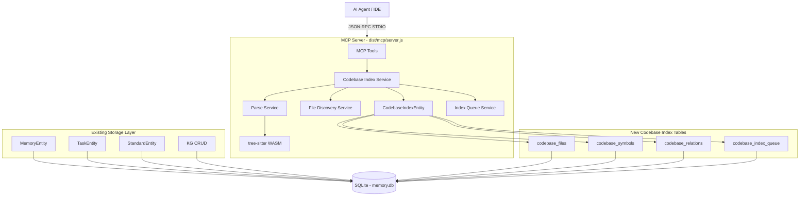
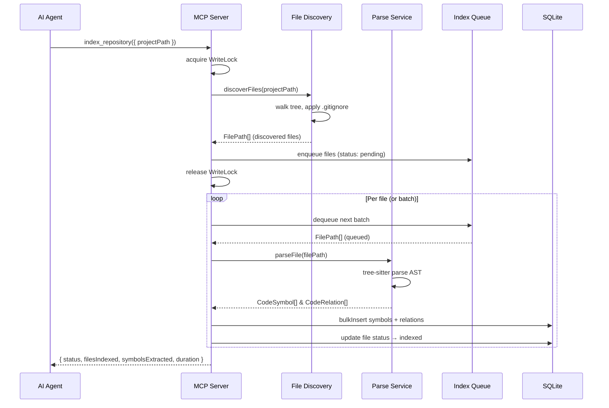
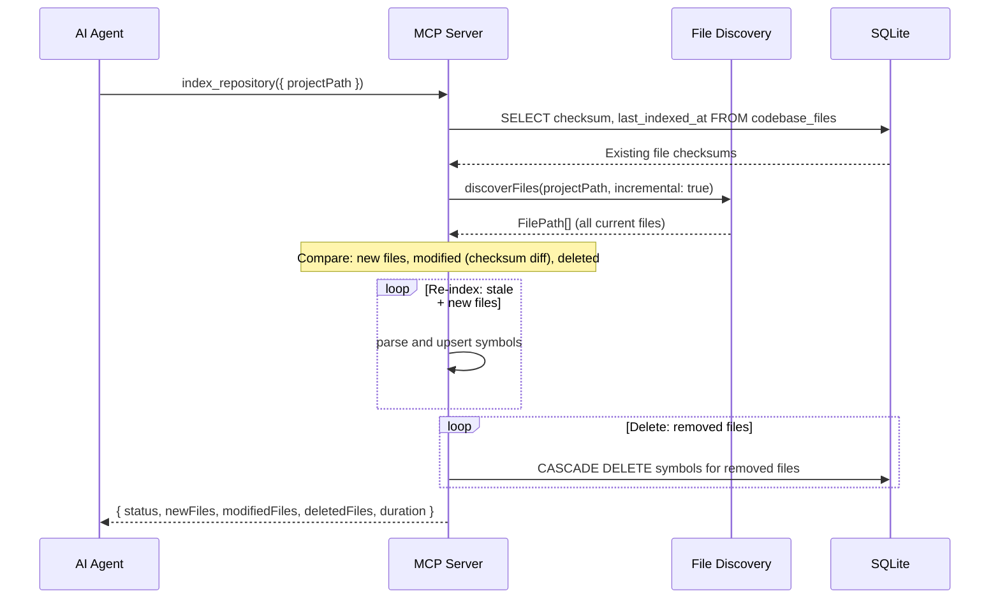
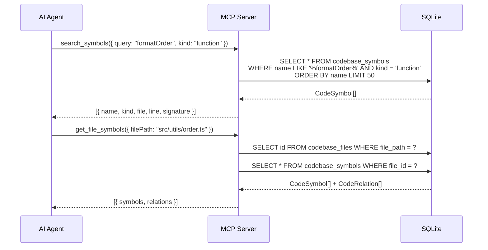

# Codebase Index — Architecture Design

This document specifies the system architecture for the Codebase Index feature, describing how it integrates into the existing local-memory-mcp MCP server.

## 1. Integration Overview

Codebase Index is a self-contained subsystem within the MCP server, sharing the existing SQLite database (`memory.db`) but using its own set of tables (`codebase_files`, `codebase_symbols`, `codebase_relations`, `codebase_index_queue`). It follows the same modular entity pattern as the existing `MemoryEntity`, `TaskEntity`, and knowledge graph components.



## 2. Component Architecture

### 2.1 File System Layer

```
┌──────────────────────────────────────────────────┐
│              File Discovery Service               │
│  - Recursive directory walker                     │
│  - .gitignore integration (ignore package)        │
│  - Include/exclude pattern matching               │
│  - Binary file detection (via magic bytes)        │
│  - Symlink resolution with cycle detection        │
│  - Size limit guard (configurable, default 1MB)   │
│  - Language detection via file extension mapping  │
└────────────────────┬─────────────────────────────┘
                     │  FilePath[]
                     ▼
```

### 2.2 Parsing Layer

```
┌──────────────────────────────────────────────────┐
│              Parse Service                        │
│  - tree-sitter initialization (WASM, once)         │
│  - Language grammar loading (TS/JS MVP)            │
│  - AST traversal with visitor pattern             │
│  - Symbol extraction: functions, classes, etc.    │
│  - Signature extraction (params + return type)    │
│  - Doc comment extraction (JSDoc/TSDoc)           │
│  - Error recovery (partial symbols on syntax err) │
│  - Batch processing with progress reporting       │
└────────────────────┬─────────────────────────────┘
                     │  CodebaseSymbol[], CodebaseRelation[]
                     ▼
```

### 2.3 Storage Layer

```
┌──────────────────────────────────────────────────┐
│              CodebaseIndexEntity                   │
│  - Extends BaseEntity (same as existing entities) │
│  - CRUD for codebase_files, _symbols, _relations  │
│  - Bulk insert with transaction wrapping          │
│  - Schema management via MigrationManager (v3)     │
│  - Query builders: search by name, file, kind     │
│  - Incremental indexing (checksum comparison)     │
└──────────────────────────────────────────────────┘
```

### 2.4 MCP Tool Layer

```
┌──────────────────────────────────────────────────┐
│              MCP Tool Handlers                     │
│  - index_repository   (write tool, under lock)    │
│  - get_file_symbols   (read tool)                 │
│  - search_symbols     (read tool)                 │
│  - get_architecture   (read tool)                 │
│  - trace_symbol       (read tool, Phase 1.1)      │
│  - index_status       (read tool)                 │
│  - Registered via registerAllTools() pipeline     │
│  - Input validation via Zod schemas               │
│  - Auto-inferred owner/repo from session          │
│  - Progress reporting via MCP notifications       │
└──────────────────────────────────────────────────┘
```

### 2.5 Dashboard / Resources (Phase 1.2)

```
┌──────────────────────────────────────────────────┐
│              MCP Resources                        │
│  - codebase://{project}/summary                   │
│  - codebase://{project}/files/{filePath}          │
│  - codebase://{project}/symbols/{symbolId}        │
│                                                   │
│              Dashboard Routes                      │
│  - GET /api/codebase/summary                      │
│  - GET /api/codebase/files                        │
│  - GET /api/codebase/symbols?search=              │
│  - Svelte 5 "Codebase" tab in dashboard           │
└──────────────────────────────────────────────────┘
```

## 3. Data Flow

### 3.1 Full Index Pipeline



### 3.2 Incremental Index Pipeline (Phase 1.1)



### 3.3 Symbol Search Flow



## 4. tree-sitter Integration Strategy

### 4.1 WASM Binding Choice

The project uses `web-tree-sitter` (npm: `web-tree-sitter`) which provides Node.js WASM bindings for tree-sitter. WASM files are loaded once at module initialization and cached for the process lifetime.

```
Load Order:
1. Import web-tree-sitter
2. Initialize Parser via Parser.init() (async, WASM bootstrap)
3. Load language WASM: tree-sitter-typescript.wasm
4. Create language instance: parser.setLanguage(tsLang)
5. Parse file: parser.parse(sourceCode)
6. Walk AST: cursor-based tree traversal
```

### 4.2 Language Support Matrix

| Phase     | Language   | Grammar Package                                | Include Patterns                  |
| :-------- | :--------- | :--------------------------------------------- | :-------------------------------- |
| MVP       | TypeScript | `@tree-sitter-grammars/tree-sitter-typescript` | `*.ts`, `*.tsx`                   |
| MVP       | JavaScript | Same package (shared grammar)                  | `*.js`, `*.jsx`, `*.mjs`, `*.cjs` |
| Phase 1.2 | Python     | `tree-sitter-python`                           | `*.py`, `*.pyi`                   |
| Phase 1.2 | Rust       | `tree-sitter-rust`                             | `*.rs`                            |
| Phase 1.2 | Go         | `tree-sitter-go`                               | `*.go`                            |
| Phase 1.2 | PHP        | `tree-sitter-php`                              | `*.php`                           |

## 5. Integration Points

### 5.1 Shared SQLite Database (memory.db)

The Codebase Index adds 4 new tables to the existing `memory.db`. Schema migration is handled by extending `MigrationManager` to version 3. The tables are independent of existing memory/task/standard tables — no cross-table foreign keys.

### 5.2 BaseEntity Inheritance

`CodebaseIndexEntity` extends `BaseEntity` (from `src/mcp/storage/base.ts`) following the identical pattern used by `MemoryEntity`, `TaskEntity`, etc. This gives it access to the shared `better-sqlite3` instance and `transaction()`, `run()`, `all()`, `get()` helpers.

### 5.3 Tool Registration

Codebase Index tools are registered via the same `registerAllTools()` function in `src/mcp/tools/index.ts`. They follow the same pattern:

- Zod schema for input validation
- Handler function with `(args, db, vectors, extra)` signature
- Write tools added to `WRITE_TOOLS` set
- Action logging via `logToolAction()`
- Resource mutation notifications

### 5.4 Scope Injection

All codebase index tools receive the session's `owner`/`repo` via the `normalizeToolArgs()` middleware. The `projectPath` is validated to stay within MCP root boundaries.

### 5.5 Write Locking

`index_repository` is registered as a write tool and executes under `store.withWrite()` for concurrent safety. Read tools (`search_symbols`, `get_file_symbols`, `get_architecture`, `trace_symbol`, `index_status`) execute outside the lock.

### 5.6 Progress Reporting

The `index_repository` tool emits progress notifications via `extra.onProgress(processed, totalFiles)` using the MCP SDK's notification mechanism, matching the pattern used in `memory-delete`.

## 6. Multi-Pass Indexing Pipeline Design

### Phase 1: MVP (Single-Pass, Definitions Only)

```
Pass 1: [FILE DISCOVERY] → [PARSE DECLARATIONS] → [STORE SYMBOLS]
  - Walk directory tree
  - Parse each file with tree-sitter
  - Extract: function, class, interface, type, enum, export declarations
  - Store symbols in codebase_symbols
  - Store file metadata in codebase_files
  - NO relation resolution
```

### Phase 2: Phase 1.1 (Two-Pass, Relations)

```
Pass 1: [FILE DISCOVERY] → [PARSE DECLARATIONS] → [STORE SYMBOLS]
  - Same as MVP

Pass 2: [RESOLVE RELATIONS]
  - Parse each file again (or reuse AST)
  - Extract: call expressions, import statements, extends/implements
  - Resolve targets to stored symbol IDs
  - Store edges in codebase_relations
```

### Phase 3: Phase 1.2+ (Three-Pass, Full Graph)

```
Pass 1: [FILE DISCOVERY] → [PARSE DECLARATIONS] → [STORE SYMBOLS]
  - Same as MVP

Pass 2: [RESOLVE RELATIONS]
  - Same as Phase 1.1

Pass 3: [DEAD CODE / HOTSPOT ANALYSIS]
  - Compute symbol reference counts
  - Identify zero-reference symbols (dead code candidates)
  - Identify high-reference symbols (hotspots)
  - Update symbol metadata with computed properties
```

## 7. Concurrency Model

- **Indexing is serial**: Only one `index_repository` call can run at a time (enforced by write lock).
- **Reads are concurrent**: Multiple `search_symbols` / `get_file_symbols` can run simultaneously.
- **Mixed read/write safety**: SQLite WAL mode ensures readers never block writers and vice versa.
- **Queue-based work distribution**: Large projects are chunked into batches processed sequentially with progress updates between batches.

## 8. Error Handling Strategy

| Scenario                  | Behavior                                                        |
| :------------------------ | :-------------------------------------------------------------- |
| File parse error          | Log warning, store partial symbols, record error in file record |
| File too large            | Skip file, record as `skipped` with reason                      |
| Binary file detected      | Skip silently                                                   |
| tree-sitter Init failure  | Fail entire index operation, return error                       |
| SQLite write failure      | Rollback transaction, return error                              |
| Concurrent index request  | Return "already indexing" status, provide progress              |
| Empty project (no files)  | Complete with zero files indexed                                |
| Permission denied on file | Skip file, record as `skipped` with reason                      |
| Symlink cycle detected    | Skip symlink, log warning                                       |
| Language not supported    | Skip file, record as `skipped` with reason                      |
| Index interrupted (crash) | On next start, detect incomplete index, re-index from scratch   |

## 9. Performance Targets

| Metric                     | Target              | Condition                   |
| :------------------------- | :------------------ | :-------------------------- |
| Cold index (<10K files)    | < 60 seconds        | Full re-index               |
| Incremental index          | < 10 seconds        | <100 files changed          |
| `search_symbols` latency   | < 100ms             | Indexed, results <500       |
| `get_file_symbols` latency | < 50ms              | Single file                 |
| Storage overhead           | < 50MB for 100K LOC | Symbols + relations + files |
| Memory usage during index  | < 2GB peak          | Large project (<50K files)  |

## 10. Directory Structure

```
src/codebase-index/
├── entity.ts                  # CodebaseIndexEntity (extends BaseEntity)
├── file-discovery.ts          # FileDiscoveryService
├── parser.ts                  # tree-sitter parser orchestration
├── ast-visitors.ts            # Language-specific AST visitors
├── indexer.ts                 # Index orchestrator (pipeline coordination)
├── mcp-tools.ts               # MCP tool handlers
├── schemas.ts                 # Zod validation schemas
├── types.ts                   # TypeScript interfaces
├── resource-handlers.ts       # MCP resource URI handlers (Phase 1.2)
└── __tests__/
    ├── entity.test.ts
    ├── file-discovery.test.ts
    ├── parser.test.ts
    ├── mcp-tools.test.ts
    └── fixtures/
        ├── sample-class.ts
        ├── sample-function.ts
        ├── sample-interface.ts
        └── sample-syntax-error.ts
```

## 11. Dependency Graph

```mermaid
flowchart TD
    FD[File Discovery Service] --> IS[Index Orchestrator]
    PS[Parse Service] --> IS
    IS --> CI[CodebaseIndexEntity]
    CI --> SQL[(SQLite memory.db)]

    IS --> MCP[MCP Tool Handlers]
    MCP --> REG[registerAllTools()]

    subgraph External
        TS[web-tree-sitter + grammar WASM]
        IG[ignore package]
    end

    PS --> TS
    FD --> IG

    subgraph Shared
        Base[BaseEntity]
        Lock[WriteLock]
        Mig[MigrationManager]
        Log[Logger]
    end

    CI --> Base
    IS --> Lock
    CI --> Mig
    IS --> Log
```

## 12. Auto-Index Hook (Phase 1.1)

When the MCP server initializes (`initialize` handler), a background check triggers:

```
On Server Initialize:
  1. Check codebase_files for existing index
  2. If no index → trigger full index (async, non-blocking)
  3. If index is >24h stale → trigger incremental re-index (async)
  4. If index is fresh → skip
  5. File count guard: if >50,000 files, require explicit index_repository call
```
