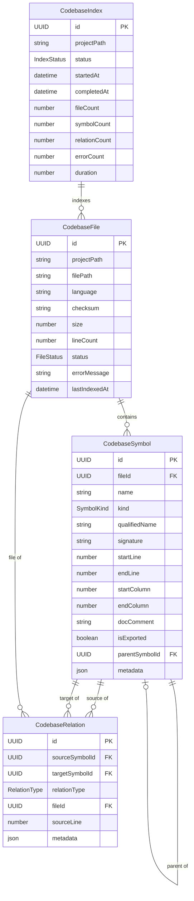

# Codebase Index — Domain Model

This document specifies the domain entities, value objects, and business rules for the Codebase Index feature using DDD (Domain-Driven Design) principles.

## 1. Core Entities

### 1.1 CodebaseFile

Represents a single source file discovered in the project directory tree.

| Attribute       | Type             | Description                                           |
| :-------------- | :--------------- | :---------------------------------------------------- |
| `id`            | `UUID`           | Primary key (UUID v4).                                |
| `projectPath`   | `string`         | Normalized absolute path to the project root.         |
| `filePath`      | `string`         | Relative path from project root to the file.          |
| `absolutePath`  | `string`         | Full resolved path (derived: projectPath + filePath). |
| `language`      | `string`         | Detected language (e.g., `typescript`, `javascript`). |
| `checksum`      | `string`         | SHA-256 hash of file content (for change detection).  |
| `size`          | `number`         | File size in bytes.                                   |
| `lineCount`     | `number`         | Total lines in file (computed during parse).          |
| `status`        | `FileStatus`     | Current indexing state. See §2.1.                     |
| `errorMessage`  | `string \| null` | Last parse error message (null if successful).        |
| `lastIndexedAt` | `ISO-8601`       | Timestamp of last successful parse.                   |
| `createdAt`     | `ISO-8601`       | Row creation timestamp.                               |
| `updatedAt`     | `ISO-8601`       | Row last modified timestamp.                          |

**Invariants:**

- `filePath` must be unique per `projectPath` (enforced by unique index).
- `checksum` must be recomputed on every successful re-parse.
- `status` transition: `pending` → `indexing` → `indexed`; any status → `failed` on error.

### 1.2 CodebaseSymbol

Represents a structural declaration extracted from source code (function, class, interface, enum, type alias, variable, method).

| Attribute        | Type             | Description                                                           |
| :--------------- | :--------------- | :-------------------------------------------------------------------- |
| `id`             | `UUID`           | Primary key (UUID v4).                                                |
| `fileId`         | `UUID`           | FK to `codebase_files(id)`. Parent file this symbol was found in.     |
| `name`           | `string`         | Short identifier name (e.g., `formatOrder`).                          |
| `kind`           | `SymbolKind`     | Type of symbol. See §2.2.                                             |
| `qualifiedName`  | `string \| null` | Fully qualified name (e.g., `OrderService.formatOrder`).              |
| `signature`      | `string \| null` | Human-readable signature (params + return type).                      |
| `startLine`      | `number`         | Declaration start line (1-indexed).                                   |
| `endLine`        | `number`         | Declaration end line (1-indexed).                                     |
| `startColumn`    | `number`         | Declaration start column (1-indexed).                                 |
| `endColumn`      | `number`         | Declaration end column (1-indexed).                                   |
| `docComment`     | `string \| null` | JSDoc/TSDoc comment text associated with the symbol.                  |
| `isExported`     | `boolean`        | Whether the symbol is exported from its module.                       |
| `parentSymbolId` | `UUID \| null`   | FK to `codebase_symbols(id)`. Parent symbol (e.g., class for method). |
| `metadata`       | `JSON \| null`   | Extra symbol attributes (e.g., visibility, isAsync, isStatic).        |
| `createdAt`      | `ISO-8601`       | Row creation timestamp.                                               |

**Invariants:**

- `name` must not be empty.
- `fileId` must reference an existing `codebase_files` row.
- `startLine` ≤ `endLine`.
- `qualifiedName` is derived from `parentSymbolId` chain when not explicitly set.
- Cascade delete: deleting a file deletes all its symbols.

### 1.3 CodebaseRelation

Represents a directed relationship between two symbols (call, import, inheritance, etc.).

| Attribute        | Type             | Description                                                    |
| :--------------- | :--------------- | :------------------------------------------------------------- |
| `id`             | `UUID`           | Primary key (UUID v4).                                         |
| `sourceSymbolId` | `UUID`           | FK to `codebase_symbols(id)`. The caller/importer/child.       |
| `targetSymbolId` | `UUID`           | FK to `codebase_symbols(id)`. The callee/importee/parent.      |
| `relationType`   | `RelationType`   | Type of relationship. See §2.3.                                |
| `fileId`         | `UUID`           | FK to `codebase_files(id)`. File where the relation was found. |
| `sourceLine`     | `number \| null` | Line in source file where the relation occurs.                 |
| `metadata`       | `JSON \| null`   | Extra relation attributes (e.g., namedImport, defaultImport).  |
| `createdAt`      | `ISO-8601`       | Row creation timestamp.                                        |

**Invariants:**

- `sourceSymbolId` ≠ `targetSymbolId` (no self-references).
- Composite uniqueness: `(sourceSymbolId, targetSymbolId, relationType)` must be unique.
- Cascade delete: deleting a symbol deletes all relations where it is source or target.

### 1.4 CodebaseIndex

Represents an indexing session/task for a project. Tracks the state of the indexing process.

| Attribute       | Type               | Description                                                    |
| :-------------- | :----------------- | :------------------------------------------------------------- |
| `id`            | `UUID`             | Primary key (UUID v4).                                         |
| `projectPath`   | `string`           | Absolute path to the indexed project root.                     |
| `status`        | `IndexStatus`      | Current state. See §2.4.                                       |
| `startedAt`     | `ISO-8601`         | When indexing began.                                           |
| `completedAt`   | `ISO-8601 \| null` | When indexing finished (null if in progress or failed).        |
| `fileCount`     | `number`           | Total number of files discovered.                              |
| `symbolCount`   | `number`           | Total number of symbols extracted.                             |
| `relationCount` | `number`           | Total number of relations resolved (Phase 1.1).                |
| `errorCount`    | `number`           | Number of files that failed to parse.                          |
| `duration`      | `number \| null`   | Total indexing duration in milliseconds (null if in progress). |
| `createdAt`     | `ISO-8601`         | Row creation timestamp.                                        |
| `updatedAt`     | `ISO-8601`         | Row last modified timestamp.                                   |

**Invariants:**

- Only one active index (`status` = `in_progress`) per `projectPath` at a time.
- `completedAt` must be set when transitioning to `completed` or `failed`.
- `duration` is computed as `completedAt - startedAt`.

## 2. Value Objects

### 2.1 FileStatus

Enumeration of file indexing states.

| Value      | Description                                             |
| :--------- | :------------------------------------------------------ |
| `pending`  | File discovered but not yet indexed.                    |
| `indexing` | File is currently being parsed.                         |
| `indexed`  | File parsed successfully, symbols stored.               |
| `failed`   | File parsing failed. `errorMessage` contains the error. |
| `skipped`  | File intentionally skipped (binary, too large, etc.).   |
| `stale`    | File changed since last index, needs re-index.          |

**State Transitions:**

```
pending → indexing → indexed
pending → indexing → failed
pending → skipped
indexed → stale (on checksum mismatch)
stale → indexing → indexed
```

### 2.2 SymbolKind

Enumeration of symbol types extracted by tree-sitter.

| Value       | tree-sitter Node Type             | Description                         |
| :---------- | :-------------------------------- | :---------------------------------- |
| `function`  | `function_declaration`            | Standalone function declaration.    |
| `method`    | `method_definition`               | Method defined inside a class.      |
| `class`     | `class_declaration`               | Class declaration.                  |
| `interface` | `interface_declaration`           | Interface declaration (TypeScript). |
| `type`      | `type_alias_declaration`          | Type alias (TypeScript).            |
| `enum`      | `enum_declaration`                | Enum declaration (TypeScript).      |
| `variable`  | `variable_declaration` (exported) | Exported variable/constant.         |
| `module`    | `export default { ... }` (future) | Module-level re-exports.            |

### 2.3 RelationType

Enumeration of symbol relationships.

| Value        | Direction       | Description                                       |
| :----------- | :-------------- | :------------------------------------------------ |
| `calls`      | source → target | Source function calls target function.            |
| `imports`    | source → target | Source file imports target symbol.                |
| `extends`    | source → target | Source class extends target class.                |
| `implements` | source → target | Source class implements target interface.         |
| `member_of`  | source → target | Source method/variable is member of target class. |
| `throws`     | source → target | Source function throws target error type.         |
| `returns`    | source → target | Source function returns instance of target type.  |
| `parameter`  | source → target | Source function takes parameter of target type.   |

### 2.4 IndexStatus

Enumeration of indexing session states.

| Value         | Description                                      |
| :------------ | :----------------------------------------------- |
| `queued`      | Index request received, not yet started.         |
| `in_progress` | Indexing is actively running.                    |
| `completed`   | Indexing finished successfully.                  |
| `failed`      | Indexing terminated with an unrecoverable error. |
| `cancelled`   | Indexing was cancelled by user/abort signal.     |

## 3. Entity Relationships



## 4. Business Rules & Invariants

### 4.1 Indexing Rules

1. **Idempotency**: Running `index_repository` twice with no file changes should produce identical results. Checksum comparison guarantees this.
2. **Partial Progress**: If indexing is interrupted mid-way, already-indexed files retain their `indexed` status. On restart, only `pending`/`stale` files are re-processed.
3. **File Limit Guard**: Files exceeding the configured size limit (default: 1MB) are skipped with `skipped` status. The limit is configurable.
4. **Binary Detection**: Files identified as binary (via null byte detection or extension) are skipped.
5. **Single Active Index**: Only one `index_repository` call per `projectPath` can be `in_progress` at a time.

### 4.2 Symbol Rules

1. **Name uniqueness scope**: Symbol names are unique within a file but NOT across files (name + fileId + kind forms a functional uniqueness).
2. **Qualified name derivation**: For nested symbols (e.g., class methods), `qualifiedName` is `ParentClass.methodName`.
3. **Exported symbol visibility**: Exported symbols are flagged with `isExported = true` for quick entry-point discovery.
4. **Signature format**: Signatures follow the pattern `name(param1: Type1, param2: Type2): ReturnType`.

### 4.3 Relation Rules

1. **No orphan relations**: Both `sourceSymbolId` and `targetSymbolId` must reference existing symbols. CASCADE delete enforces this.
2. **Deduplication**: A single `(sourceSymbolId, targetSymbolId, relationType)` combination may appear only once.
3. **Cross-file support**: Relations can span files (e.g., `src/a.ts` function calls `src/b.ts` function).

### 4.4 Cascade Delete Rules

```
DELETE CodebaseFile
  → DELETE all CodebaseSymbol where fileId = deleted file
    → DELETE all CodebaseRelation where sourceSymbolId or targetSymbolId = deleted symbol

DELETE CodebaseIndex
  → No CASCADE (files and symbols are independent of the index session)
```

### 4.5 Checksum Integrity

1. **Computed at parse time**: `checksum` is the SHA-256 hash of the file's raw content, computed immediately before parsing.
2. **Change detection basis**: On incremental re-index, if `checksum(new) === checksum(stored)`, the file is skipped.
3. **Collision handling**: SHA-256 collision probability is negligible for this use case; no special collision handling.

## 5. Domain Services

### 5.1 FileDiscoveryService

```
discoverFiles(projectPath: string, options?: DiscoveryOptions): FilePath[]

DiscoveryOptions:
  - includePatterns: string[]  (default: based on language)
  - excludePatterns: string[]  (default: .gitignore + node_modules)
  - maxFileSize: number        (default: 1MB)
  - followSymlinks: boolean    (default: false)
```

### 5.2 ParseService

```
parseFile(filePath: string, language: string): ParseResult

ParseResult:
  - symbols: CodebaseSymbol[]
  - relations: CodebaseRelation[]  (Phase 1.1)
  - errors: ParseError[]
```

### 5.3 IndexOrchestrator

```
indexProject(projectPath: string, options?: IndexOptions): IndexResult

IndexOptions:
  - incremental: boolean       (default: true if existing index)
  - languages: string[]        (default: all supported)
  - onProgress: callback       (batch progress reporting)

IndexResult:
  - filesDiscovered: number
  - filesIndexed: number
  - filesFailed: number
  - filesSkipped: number
  - filesDeleted: number       (incremental only)
  - symbolsExtracted: number
  - relationsResolved: number  (Phase 1.1)
  - duration: number           (ms)
```

### 5.4 SymbolQueryService

```
searchSymbols(query: string, filters?: SearchFilters): CodebaseSymbol[]

SearchFilters:
  - kind: SymbolKind
  - filePath: string
  - isExported: boolean
  - limit: number              (default: 50)
  - offset: number

getFileSymbols(filePath: string): FileSymbolsResult

FileSymbolsResult:
  - file: CodebaseFile
  - symbols: CodebaseSymbol[]
  - relations: CodebaseRelation[]

traceSymbol(symbolName: string, direction: 'inbound'|'outbound'|'both', maxDepth: number): TracePath
```
