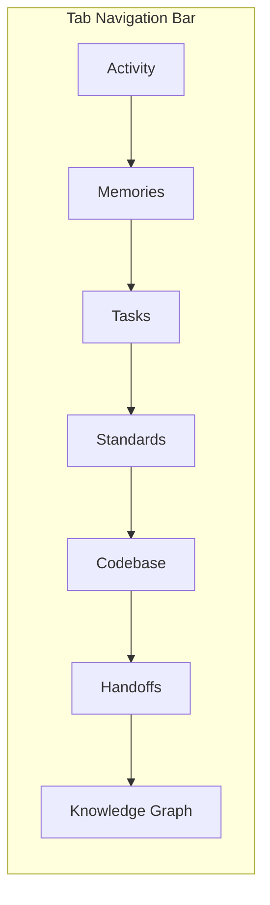
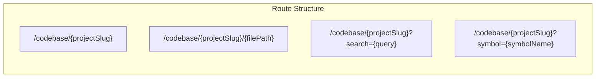

# Codebase Index — Navigation Integration

This document specifies how the Codebase tab integrates into the existing dashboard navigation structure.

---

## 1. Tab Order Change

The Codebase tab is inserted between **Standards** (index 5) and **Handoffs** (index 6) in the `TABS` constant in `useApp.ts`.

### Updated `TABS` Constant

```typescript
const TABS = [
	{ id: "arena", label: "Agent Arena", icon: "cpu" },
	{ id: "dashboard", label: "Dashboard", icon: "layout-dashboard" },
	{ id: "activity", label: "Activity", icon: "activity" },
	{ id: "memories", label: "Memories", icon: "brain" },
	{ id: "tasks", label: "Tasks", icon: "clipboard-list" },
	{ id: "standards", label: "Standards", icon: "check" },
	{ id: "codebase", label: "Codebase", icon: "file-code" }, // NEW
	{ id: "handoffs", label: "Handoffs", icon: "git-branch" },
	{ id: "reference", label: "Reference", icon: "book-open" }
];
```

### Updated Tab Navigation Bar



### Affected Files

| File                                             | Change                                                                   |
| :----------------------------------------------- | :----------------------------------------------------------------------- |
| `src/dashboard/ui/src/lib/composables/useApp.ts` | Add `codebase` to `TABS` array between `standards` and `handoffs`        |
| `src/dashboard/ui/src/App.svelte`                | Add `{#if $activeTab === "codebase"}` block, import `CodebaseTab.svelte` |

---

## 2. Route Structure

The Codebase tab uses a **flat route scheme** driven by the `activeTab` store, with query params for state.



| Route                                         | Description                                           | State                                     |
| :-------------------------------------------- | :---------------------------------------------------- | :---------------------------------------- |
| `/codebase/{projectSlug}`                     | Codebase tab with file tree visible, no file selected | `activeTab = "codebase"`, no query params |
| `/codebase/{projectSlug}/{filePath}`          | File selected and displayed in main area              | `activeFile` set to `filePath`            |
| `/codebase/{projectSlug}?search={query}`      | Search results shown for query                        | `searchQuery` set, `mainTab = "results"`  |
| `/codebase/{projectSlug}?symbol={symbolName}` | Symbol detail panel open for symbol                   | `activeSymbol` set, `rightTab = "detail"` |

**Note:** Since the dashboard is a client-side SPA without a router, routes map to `activeTab` store values. The URL is not manipulated directly in v1. These routes define the **logical state model** for the tab. A future enhancement may add `window.history` integration for deep-linking.

### State Model

```typescript
interface CodebaseRouteState {
	activeFile: string | null; // /codebase/{slug}/{path}
	searchQuery: string | null; // ?search={query}
	activeSymbol: string | null; // ?symbol={name}
	mainTab: "file" | "results" | "stats";
	rightTab: "detail" | "callgraph";
}
```

---

## 3. Breadcrumb

```text
Dashboard > Codebase > {Project} > {File}
```

| Level | Label       | Link                                        | Visibility                   |
| :---- | :---------- | :------------------------------------------ | :--------------------------- |
| 1     | Dashboard   | `/` (activates Dashboard tab)               | Always                       |
| 2     | Codebase    | `/codebase/{projectSlug}`                   | Always when on Codebase tab  |
| 3     | `{Project}` | Project name (e.g., `local-memory-mcp`)     | Always                       |
| 4     | `{File}`    | Relative file path (e.g., `src/App.svelte`) | Only when a file is selected |

The breadcrumb is rendered in the **top bar** of the Codebase tab (within the tab content, not the global top bar).

---

## 4. Contextual Back Button

A back button appears in the following contexts:

| Context                            | Location             | Behavior                                           |
| :--------------------------------- | :------------------- | :------------------------------------------------- |
| Symbol detail active (from search) | Right panel top-left | Goes back to search results, clears `activeSymbol` |
| File viewer active (from tree)     | Main area top-left   | Goes to tree root, clears `activeFile`             |
| Search results visible             | Main area top-left   | Clears `searchQuery`, returns to file view         |

The back label is context-aware:

- **"Back to results"** — when viewing a symbol from search results
- **"Back to tree"** — when viewing a file
- **"Back to files"** — when viewing search results

---

## 5. Integration Points

### 5.1 Global Sidebar (RepoSidebar.svelte)

No changes needed — the sidebar already provides the active repository context, which the Codebase tab consumes via the `currentRepo` store.

### 5.2 Global TopBar (TopBar.svelte)

No changes needed. The Codebase tab provides its own in-tab search bar and status indicator.

### 5.3 Detail Drawer (DetailDrawer.svelte)

The existing detail drawer is **not reused** for symbol details. The Codebase tab has its own right-panel layout (`SymbolDetail` + `CallGraph`) that is more specialized for code navigation.

### 5.4 Cross-tab Linking

| From Tab            | To Codebase | Mechanism                                       |
| :------------------ | :---------- | :---------------------------------------------- |
| **Memories**        | —           | No cross-link (memories are semantic, not code) |
| **Tasks**           | —           | Future: task could reference a code symbol      |
| **Standards**       | —           | Future: standard could link to code location    |
| **Handoffs**        | —           | No cross-link                                   |
| **Knowledge Graph** | —           | Future: KG entity could link to code definition |

---

## 6. Keyboard Shortcuts

| Shortcut | Action |
|:---|:---|:---|
| `Ctrl+K` / `Cmd+K` | Focus search bar |
| `Ctrl+Enter` | Trigger re-index (with confirmation) |
| `Escape` | Close detail panel / clear search |
| `↑` / `↓` | Navigate file tree or search results |
| `→` | Expand directory / open file |
| `←` | Collapse directory / go back |
| `Alt+1` | Switch to File tab |
| `Alt+2` | Switch to Results tab |
| `Alt+3` | Switch to Stats tab |
| `Alt+4` | Switch to Detail tab |
| `Alt+5` | Switch to Call Graph tab |

---

## 7. Site Map Update

```text
Dashboard Root (/)
├── Repository Context (Sidebar)
│   ├── Repo A (Active)
│   └── Repo B
├── Main View (Tab Groups)
│   ├── 1. Dashboard (Overview Widgets)
│   ├── 2. Activity (Interaction Log)
│   ├── 3. Memories (Knowledge Base)
│   ├── 4. Tasks (Kanban Board)
│   ├── 5. Standards (Coding Rules)
│   ├── 6. Codebase ⭐ (NEW)          ← Added
│   │   ├── File Browser (Tree)
│   │   ├── File Content Viewer
│   │   ├── Symbol Search
│   │   ├── Symbol Detail (Panel)
│   │   └── Call Graph (Panel)
│   ├── 7. Handoffs (Agent Coordination)
│   ├── 8. Reference (Capabilities Index)
│   └── 9. Knowledge Graph (Visualization)
└── Global Actions (TopBar)
    ├── Refresh Sync
    └── Theme Toggle (Light/Dark)
```
