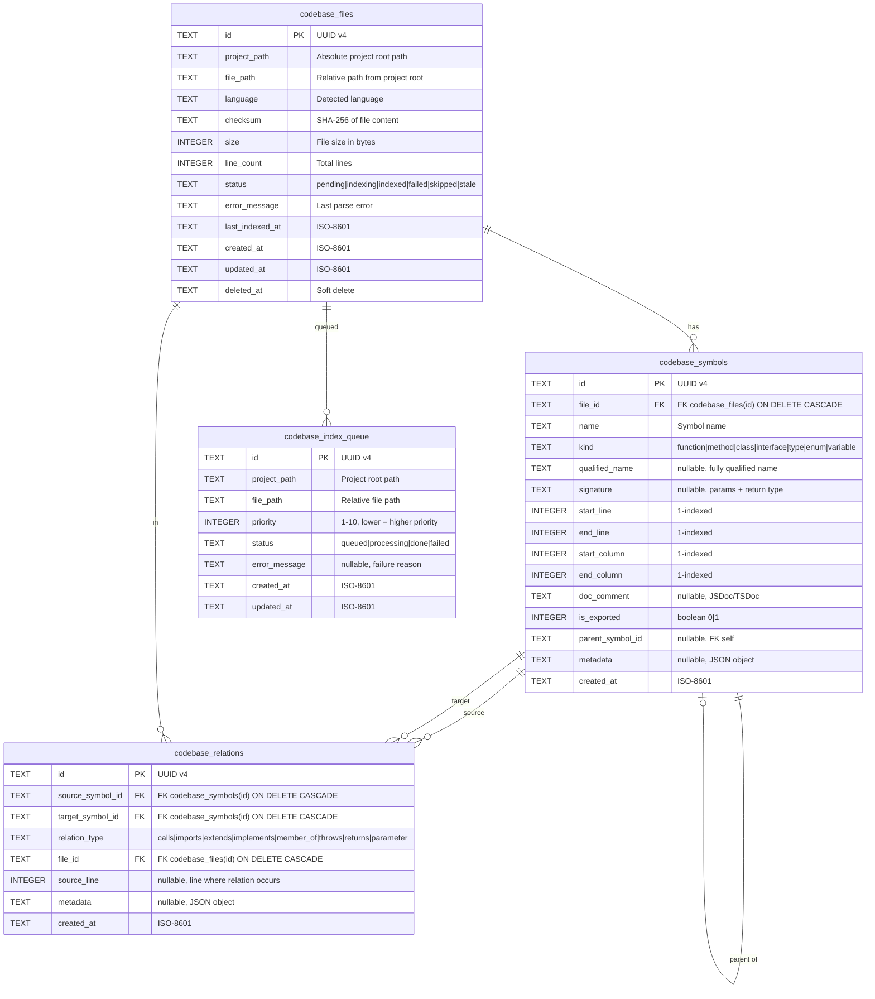

# Codebase Index — Database Schema

This document specifies the SQLite schema for the Codebase Index feature. These tables are added to the existing `memory.db` via migration version 3, managed by `MigrationManager` in `src/mcp/storage/migrations.ts`.

## 1. Entity-Relationship Diagram



## 2. Table Definitions

### 2.1 `codebase_files`

Stores metadata about each discovered source file in the indexed project.

```sql
CREATE TABLE IF NOT EXISTS codebase_files (
    id              TEXT PRIMARY KEY,                  -- UUID v4
    project_path    TEXT NOT NULL,                     -- absolute path to project root
    file_path       TEXT NOT NULL,                     -- relative path from project root
    language        TEXT NOT NULL,                     -- detected language (e.g., 'typescript')
    checksum        TEXT,                              -- SHA-256 hash of last parsed content
    size            INTEGER NOT NULL DEFAULT 0,       -- file size in bytes
    line_count      INTEGER NOT NULL DEFAULT 0,       -- total lines (computed during parse)
    status          TEXT NOT NULL DEFAULT 'pending',   -- pending|indexing|indexed|failed|skipped|stale
    error_message   TEXT,                              -- last parse error (null if successful)
    last_indexed_at TEXT,                              -- ISO-8601 timestamp of last successful parse
    created_at      TEXT NOT NULL,                     -- row creation timestamp
    updated_at      TEXT NOT NULL,                     -- row last modified timestamp
    deleted_at      TEXT                               -- soft delete timestamp
);
```

**Constraints:**

- `file_path` must be unique per `project_path` → composite unique index.
- `status` values are validated in application logic (no CHECK constraint for forward compatibility).
- `deleted_at` follows the project convention for soft delete (though rarely used — files are typically re-discovered).

### 2.2 `codebase_symbols`

Stores structural declarations extracted from source code.

```sql
CREATE TABLE IF NOT EXISTS codebase_symbols (
    id               TEXT PRIMARY KEY,                 -- UUID v4
    file_id          TEXT NOT NULL,                    -- FK → codebase_files(id)
    name             TEXT NOT NULL,                    -- short identifier name
    kind             TEXT NOT NULL,                    -- function|method|class|interface|type|enum|variable
    qualified_name   TEXT,                             -- fully qualified name (nullable)
    signature        TEXT,                             -- human-readable signature string
    start_line       INTEGER NOT NULL,                 -- declaration start line (1-indexed)
    end_line         INTEGER NOT NULL,                 -- declaration end line (1-indexed)
    start_column     INTEGER NOT NULL DEFAULT 0,      -- declaration start column (1-indexed)
    end_column       INTEGER NOT NULL DEFAULT 0,      -- declaration end column (1-indexed)
    doc_comment      TEXT,                             -- JSDoc/TSDoc comment text
    is_exported      INTEGER NOT NULL DEFAULT 0,      -- 1 if exported from module, 0 otherwise
    parent_symbol_id TEXT,                             -- FK → codebase_symbols(id), for nested symbols
    metadata         TEXT,                             -- JSON object for extra attributes
    created_at       TEXT NOT NULL,                    -- row creation timestamp

    FOREIGN KEY (file_id) REFERENCES codebase_files(id) ON DELETE CASCADE,
    FOREIGN KEY (parent_symbol_id) REFERENCES codebase_symbols(id) ON DELETE SET NULL
);
```

**Constraints:**

- `name` must not be empty (validated in application logic).
- `start_line` ≤ `end_line` (validated in application logic).
- `parent_symbol_id` self-referencing FK for nested symbols (e.g., class → method).
- CASCADE delete: deleting a file deletes all its symbols.

### 2.3 `codebase_relations`

Stores directed relationships between symbols.

```sql
CREATE TABLE IF NOT EXISTS codebase_relations (
    id               TEXT PRIMARY KEY,                  -- UUID v4
    source_symbol_id TEXT NOT NULL,                     -- FK → codebase_symbols(id)
    target_symbol_id TEXT NOT NULL,                     -- FK → codebase_symbols(id)
    relation_type    TEXT NOT NULL,                     -- calls|imports|extends|implements|member_of|throws|returns|parameter
    file_id          TEXT NOT NULL,                     -- FK → codebase_files(id), file where relation was found
    source_line      INTEGER,                          -- line number where relation occurs (nullable)
    metadata         TEXT,                              -- JSON object for extra attributes
    created_at       TEXT NOT NULL,                     -- row creation timestamp

    FOREIGN KEY (source_symbol_id) REFERENCES codebase_symbols(id) ON DELETE CASCADE,
    FOREIGN KEY (target_symbol_id) REFERENCES codebase_symbols(id) ON DELETE CASCADE,
    FOREIGN KEY (file_id) REFERENCES codebase_files(id) ON DELETE CASCADE
);
```

**Constraints:**

- Composite unique index: `(source_symbol_id, target_symbol_id, relation_type)` prevents duplicate edges.
- Self-references (`source_symbol_id = target_symbol_id`) are disallowed by application logic.
- CASCADE delete: deleting a symbol deletes all relations where it appears as source or target.

### 2.4 `codebase_index_queue`

Tracks files queued for parsing, enabling batch processing and restartability.

```sql
CREATE TABLE IF NOT EXISTS codebase_index_queue (
    id            TEXT PRIMARY KEY,                    -- UUID v4
    project_path  TEXT NOT NULL,                       -- project root path
    file_path     TEXT NOT NULL,                       -- relative file path
    priority      INTEGER NOT NULL DEFAULT 5,          -- 1-10, lower = higher priority
    status        TEXT NOT NULL DEFAULT 'queued',      -- queued|processing|done|failed
    error_message TEXT,                                -- failure reason (if status = failed)
    created_at    TEXT NOT NULL,                       -- row creation timestamp
    updated_at    TEXT NOT NULL                         -- row last modified timestamp
);
```

**Constraints:**

- `file_path` unique per `project_path` and batch → no direct unique constraint; application controls deduplication.
- Queue is cleared on completion of a full index; only used transiently during indexing.

## 3. Indexes

```sql
-- ── codebase_files indexes ─────────────────────────────────────────────

-- Primary lookup: find file by project + relative path
CREATE UNIQUE INDEX IF NOT EXISTS idx_codebase_files_project_file
    ON codebase_files(project_path, file_path);

-- Filter by status for incremental re-index queries
CREATE INDEX IF NOT EXISTS idx_codebase_files_status
    ON codebase_files(status);

-- Filter by language for multi-language queries
CREATE INDEX IF NOT EXISTS idx_codebase_files_language
    ON codebase_files(language);

-- Check index staleness
CREATE INDEX IF NOT EXISTS idx_codebase_files_last_indexed
    ON codebase_files(last_indexed_at);


-- ── codebase_symbols indexes ───────────────────────────────────────────

-- Per-file symbol listing (get_file_symbols)
CREATE INDEX IF NOT EXISTS idx_codebase_symbols_file_id
    ON codebase_symbols(file_id);

-- Name search (search_symbols — exact, prefix, and LIKE queries)
CREATE INDEX IF NOT EXISTS idx_codebase_symbols_name
    ON codebase_symbols(name);

-- Combined name + kind for filtered name search
CREATE INDEX IF NOT EXISTS idx_codebase_symbols_name_kind
    ON codebase_symbols(name, kind);

-- Qualified name lookup (trace_symbol, cross-file resolution)
CREATE INDEX IF NOT EXISTS idx_codebase_symbols_qualified_name
    ON codebase_symbols(qualified_name);

-- Entry point discovery (get_architecture)
CREATE INDEX IF NOT EXISTS idx_codebase_symbols_exported
    ON codebase_symbols(is_exported)
    WHERE is_exported = 1;

-- Per-file + kind for architecture overview
CREATE INDEX IF NOT EXISTS idx_codebase_symbols_file_kind
    ON codebase_symbols(file_id, kind);

-- Parent symbol lookup (class → methods)
CREATE INDEX IF NOT EXISTS idx_codebase_symbols_parent
    ON codebase_symbols(parent_symbol_id);


-- ── codebase_relations indexes ──────────────────────────────────────────

-- Outbound relations from a symbol (trace_symbol outbound)
CREATE INDEX IF NOT EXISTS idx_codebase_relations_source
    ON codebase_relations(source_symbol_id);

-- Inbound relations to a symbol (trace_symbol inbound)
CREATE INDEX IF NOT EXISTS idx_codebase_relations_target
    ON codebase_relations(target_symbol_id);

-- Filter by relation type (architecture queries)
CREATE INDEX IF NOT EXISTS idx_codebase_relations_type
    ON codebase_relations(relation_type);

-- Composite uniqueness (also serves as deduplication index)
CREATE UNIQUE INDEX IF NOT EXISTS idx_codebase_relations_unique
    ON codebase_relations(source_symbol_id, target_symbol_id, relation_type);

-- Per-file relation listing
CREATE INDEX IF NOT EXISTS idx_codebase_relations_file_id
    ON codebase_relations(file_id);


-- ── codebase_index_queue indexes ────────────────────────────────────────

-- Dequeueing: fetch highest priority pending items
CREATE INDEX IF NOT EXISTS idx_codebase_index_queue_status_priority
    ON codebase_index_queue(status, priority);

-- Project-scoped queue queries
CREATE INDEX IF NOT EXISTS idx_codebase_index_queue_project
    ON codebase_index_queue(project_path, status);
```

## 4. Migration Strategy

### 4.1 Migration Version

Version **3** in `MigrationManager`. Bump `SCHEMA_VERSION` from 2 to 3 in `src/mcp/storage/migrations.ts`.

### 4.2 Migration Implementation

```typescript
// Added to MigrationManager.migrate(), after version 2 logic:

public addCodebaseIndexTables(): void {
    this.exec(`
        CREATE TABLE IF NOT EXISTS codebase_files (
            id TEXT PRIMARY KEY,
            project_path TEXT NOT NULL,
            file_path TEXT NOT NULL,
            language TEXT NOT NULL,
            checksum TEXT,
            size INTEGER NOT NULL DEFAULT 0,
            line_count INTEGER NOT NULL DEFAULT 0,
            status TEXT NOT NULL DEFAULT 'pending',
            error_message TEXT,
            last_indexed_at TEXT,
            created_at TEXT NOT NULL,
            updated_at TEXT NOT NULL,
            deleted_at TEXT
        );

        CREATE TABLE IF NOT EXISTS codebase_symbols (
            id TEXT PRIMARY KEY,
            file_id TEXT NOT NULL,
            name TEXT NOT NULL,
            kind TEXT NOT NULL,
            qualified_name TEXT,
            signature TEXT,
            start_line INTEGER NOT NULL,
            end_line INTEGER NOT NULL,
            start_column INTEGER NOT NULL DEFAULT 0,
            end_column INTEGER NOT NULL DEFAULT 0,
            doc_comment TEXT,
            is_exported INTEGER NOT NULL DEFAULT 0,
            parent_symbol_id TEXT,
            metadata TEXT,
            created_at TEXT NOT NULL,
            FOREIGN KEY (file_id) REFERENCES codebase_files(id) ON DELETE CASCADE,
            FOREIGN KEY (parent_symbol_id) REFERENCES codebase_symbols(id) ON DELETE SET NULL
        );

        CREATE TABLE IF NOT EXISTS codebase_relations (
            id TEXT PRIMARY KEY,
            source_symbol_id TEXT NOT NULL,
            target_symbol_id TEXT NOT NULL,
            relation_type TEXT NOT NULL,
            file_id TEXT NOT NULL,
            source_line INTEGER,
            metadata TEXT,
            created_at TEXT NOT NULL,
            FOREIGN KEY (source_symbol_id) REFERENCES codebase_symbols(id) ON DELETE CASCADE,
            FOREIGN KEY (target_symbol_id) REFERENCES codebase_symbols(id) ON DELETE CASCADE,
            FOREIGN KEY (file_id) REFERENCES codebase_files(id) ON DELETE CASCADE
        );

        CREATE TABLE IF NOT EXISTS codebase_index_queue (
            id TEXT PRIMARY KEY,
            project_path TEXT NOT NULL,
            file_path TEXT NOT NULL,
            priority INTEGER NOT NULL DEFAULT 5,
            status TEXT NOT NULL DEFAULT 'queued',
            error_message TEXT,
            created_at TEXT NOT NULL,
            updated_at TEXT NOT NULL
        );
    `);

    // Create all indexes (see §3 for full list)
    this.createCodebaseIndexes();
}

private createCodebaseIndexes(): void {
    this.exec(`
        -- files
        CREATE UNIQUE INDEX IF NOT EXISTS idx_codebase_files_project_file
            ON codebase_files(project_path, file_path);
        CREATE INDEX IF NOT EXISTS idx_codebase_files_status
            ON codebase_files(status);
        CREATE INDEX IF NOT EXISTS idx_codebase_files_language
            ON codebase_files(language);
        CREATE INDEX IF NOT EXISTS idx_codebase_files_last_indexed
            ON codebase_files(last_indexed_at);

        -- symbols
        CREATE INDEX IF NOT EXISTS idx_codebase_symbols_file_id
            ON codebase_symbols(file_id);
        CREATE INDEX IF NOT EXISTS idx_codebase_symbols_name
            ON codebase_symbols(name);
        CREATE INDEX IF NOT EXISTS idx_codebase_symbols_name_kind
            ON codebase_symbols(name, kind);
        CREATE INDEX IF NOT EXISTS idx_codebase_symbols_qualified_name
            ON codebase_symbols(qualified_name);
        CREATE INDEX IF NOT EXISTS idx_codebase_symbols_exported
            ON codebase_symbols(is_exported) WHERE is_exported = 1;
        CREATE INDEX IF NOT EXISTS idx_codebase_symbols_file_kind
            ON codebase_symbols(file_id, kind);
        CREATE INDEX IF NOT EXISTS idx_codebase_symbols_parent
            ON codebase_symbols(parent_symbol_id);

        -- relations
        CREATE INDEX IF NOT EXISTS idx_codebase_relations_source
            ON codebase_relations(source_symbol_id);
        CREATE INDEX IF NOT EXISTS idx_codebase_relations_target
            ON codebase_relations(target_symbol_id);
        CREATE INDEX IF NOT EXISTS idx_codebase_relations_type
            ON codebase_relations(relation_type);
        CREATE UNIQUE INDEX IF NOT EXISTS idx_codebase_relations_unique
            ON codebase_relations(source_symbol_id, target_symbol_id, relation_type);
        CREATE INDEX IF NOT EXISTS idx_codebase_relations_file_id
            ON codebase_relations(file_id);

        -- queue
        CREATE INDEX IF NOT EXISTS idx_codebase_index_queue_status_priority
            ON codebase_index_queue(status, priority);
        CREATE INDEX IF NOT EXISTS idx_codebase_index_queue_project
            ON codebase_index_queue(project_path, status);
    `);
}
```

### 4.3 Rollback

To roll back the migration:

1. Drop the 4 codebase tables: `DROP TABLE IF EXISTS codebase_index_queue; DROP TABLE IF EXISTS codebase_relations; DROP TABLE IF EXISTS codebase_symbols; DROP TABLE IF EXISTS codebase_files;`
2. Set schema version back to 2.

The tables are additive and do not modify any existing tables, so rollback is a clean DROP operation with no data loss for the rest of the system.

## 5. Query Patterns

### 5.1 Full Re-Index

```sql
-- Clear project data before re-index
DELETE FROM codebase_index_queue WHERE project_path = ?;
DELETE FROM codebase_relations WHERE file_id IN (SELECT id FROM codebase_files WHERE project_path = ?);
DELETE FROM codebase_symbols WHERE file_id IN (SELECT id FROM codebase_files WHERE project_path = ?);
DELETE FROM codebase_files WHERE project_path = ?;

-- Bulk insert new file records
INSERT INTO codebase_files (id, project_path, file_path, language, status, created_at, updated_at)
VALUES ...

-- Bulk insert symbols (per file batch)
INSERT INTO codebase_symbols (id, file_id, name, kind, ...) VALUES ...

-- Bulk insert relations (Phase 1.1)
INSERT INTO codebase_relations (id, source_symbol_id, target_symbol_id, ...) VALUES ...
```

### 5.2 Incremental Re-Index

```sql
-- Find stale files (checksum changed since last index)
SELECT id, file_path FROM codebase_files
WHERE project_path = ? AND status = 'indexed';

-- Application compares checksums, identifies stale/new/deleted files

-- Delete removed files (CASCADE handles symbols + relations)
DELETE FROM codebase_files WHERE id = ?;

-- Upsert modified files: re-insert symbols for file
DELETE FROM codebase_symbols WHERE file_id = ?;
INSERT INTO codebase_symbols (...) VALUES ...;
UPDATE codebase_files SET checksum = ?, last_indexed_at = ?, updated_at = ? WHERE id = ?;
```

### 5.3 Symbol Search

```sql
-- Exact match
SELECT * FROM codebase_symbols
WHERE name = ? COLLATE NOCASE
LIMIT ?;

-- Prefix match
SELECT * FROM codebase_symbols
WHERE name LIKE ? || '%' COLLATE NOCASE
LIMIT ?;

-- Fuzzy match (LIKE)
SELECT * FROM codebase_symbols
WHERE name LIKE '%' || ? || '%' COLLATE NOCASE
LIMIT ?;

-- Filtered by kind
SELECT * FROM codebase_symbols
WHERE name LIKE '%' || ? || '%' COLLATE NOCASE
AND kind = ?
LIMIT ?;

-- Filtered by file
SELECT * FROM codebase_symbols
WHERE name LIKE '%' || ? || '%' COLLATE NOCASE
AND file_id = ?
LIMIT ?;
```

### 5.4 File Symbols

```sql
-- Get file metadata
SELECT * FROM codebase_files
WHERE project_path = ? AND file_path = ?;

-- Get all symbols in file
SELECT * FROM codebase_symbols
WHERE file_id = ?
ORDER BY start_line ASC;

-- Get all relations for those symbols
SELECT * FROM codebase_relations
WHERE file_id = ?;
```

### 5.5 Trace Symbol

```sql
-- Outbound (what does this symbol call/reference?)
SELECT cs.name, cs.kind, cf.file_path, cr.relation_type
FROM codebase_relations cr
JOIN codebase_symbols cs ON cs.id = cr.target_symbol_id
JOIN codebase_files cf ON cf.id = cs.file_id
WHERE cr.source_symbol_id = ?;

-- Inbound (what calls/references this symbol?)
SELECT cs.name, cs.kind, cf.file_path, cr.relation_type
FROM codebase_relations cr
JOIN codebase_symbols cs ON cs.id = cr.source_symbol_id
JOIN codebase_files cf ON cf.id = cs.file_id
WHERE cr.target_symbol_id = ?;

-- Multi-level traversal (recursive CTE)
WITH RECURSIVE trace AS (
    SELECT target_symbol_id, 1 as depth
    FROM codebase_relations
    WHERE source_symbol_id = ?
    UNION ALL
    SELECT cr.target_symbol_id, t.depth + 1
    FROM codebase_relations cr
    JOIN trace t ON cr.source_symbol_id = t.target_symbol_id
    WHERE t.depth < ?
)
SELECT DISTINCT cs.name, cs.kind, cf.file_path, t.depth
FROM trace t
JOIN codebase_symbols cs ON cs.id = t.target_symbol_id
JOIN codebase_files cf ON cf.id = cs.file_id
ORDER BY t.depth, cs.name;
```

### 5.6 Architecture Overview

```sql
-- File count
SELECT COUNT(*) as file_count FROM codebase_files
WHERE project_path = ? AND status = 'indexed';

-- Symbol counts per kind
SELECT kind, COUNT(*) as count FROM codebase_symbols
WHERE file_id IN (SELECT id FROM codebase_files WHERE project_path = ?)
GROUP BY kind
ORDER BY count DESC;

-- Top files by symbol count (hotspots)
SELECT cf.file_path, COUNT(cs.id) as symbol_count
FROM codebase_files cf
JOIN codebase_symbols cs ON cs.file_id = cf.id
WHERE cf.project_path = ? AND cf.status = 'indexed'
GROUP BY cf.id
ORDER BY symbol_count DESC
LIMIT 20;

-- Entry points (exported symbols)
SELECT cs.name, cs.kind, cf.file_path
FROM codebase_symbols cs
JOIN codebase_files cf ON cf.id = cs.file_id
WHERE cf.project_path = ? AND cs.is_exported = 1
ORDER BY cs.name;
```

## 6. Data Volume Estimation

For a typical TypeScript project:

| Project Size | Files  | Symbols (approx) | Relations (approx) | DB Size (approx) |
| :----------- | :----- | :--------------- | :----------------- | :--------------- |
| Small        | 100    | 1,500            | 3,000              | ~2 MB            |
| Medium       | 1,000  | 15,000           | 30,000             | ~15 MB           |
| Large        | 5,000  | 75,000           | 150,000            | ~50 MB           |
| Very Large   | 20,000 | 300,000          | 600,000            | ~150 MB          |

These estimates include index overhead. Symbols average ~500 bytes per row, relations ~200 bytes per row.

## 7. Concurrency & WAL Mode

All tables are created within the existing SQLite database which already uses WAL mode. This provides:

- **Writers don't block readers**: Multiple `search_symbols` calls can run while `index_repository` writes.
- **Readers don't block writers**: Active queries don't prevent indexer from inserting.
- **No additional configuration needed**: WAL mode is already enabled during `SQLiteStore.create()`.
