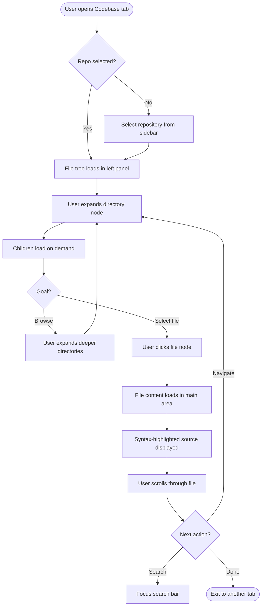
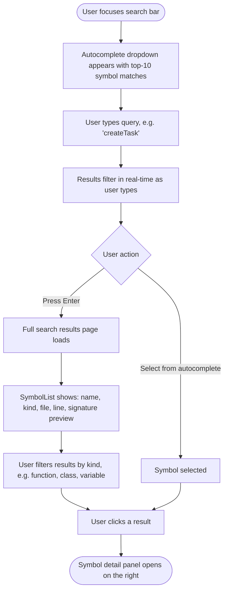
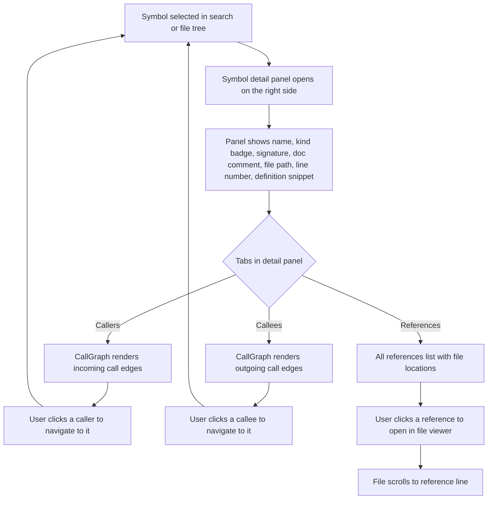
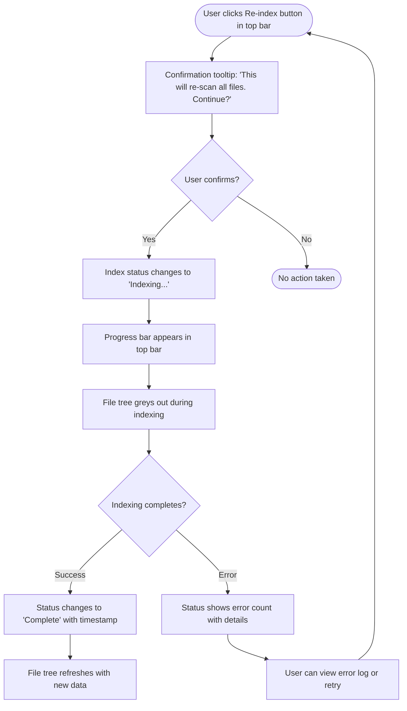
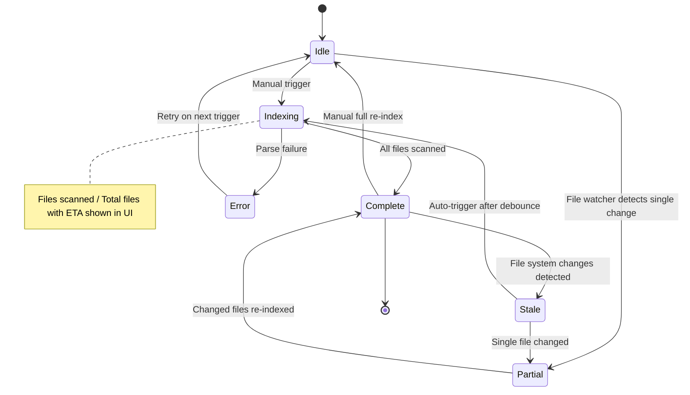

# Codebase Index — User Flow Descriptions

This document maps the primary user journeys within the Codebase Index tab of the Local Memory Dashboard.

---

## Flow 1: Browsing Project File Tree

The user explores the repository file structure and views source files.

**Key UX Decisions:**

- File tree loads lazily — children fetched on directory expand, not upfront.
- Active file highlighted in tree with a distinct background color.
- Scroll position of tree preserved when navigating between files.
- Keyboard navigation: arrow keys move through tree, Enter opens files.

---

## Flow 2: Searching for Symbols by Name

The user finds a function, class, or variable by name using the search bar.

**Key UX Decisions:**

- Autocomplete debounced at 200ms to avoid excessive queries.
- Search scope = active repository only; cross-repo search is a future enhancement.
- Kind filters are rendered as pill-shaped toggle buttons above the result list.
- Empty state shows "No symbols found matching your query."

---

## Flow 3: Viewing Symbol Details and Call Graph

The user drills into a symbol to see its definition, callers, and callees.

**Key UX Decisions:**

- Call graph uses Mermaid flowchart rendering inside a scrollable container.
- Call graph depth limited to direct edges (no transitive expansion in v1).
- Clicking a caller/callee navigates the file viewer to that symbol's definition and updates the detail panel.
- References tab shows a flat list with file path, line number, and a 3-line context snippet.

---

## Flow 4: Triggering a Re-index

The user initiates a fresh scan of the codebase to update the symbol index.

**Key UX Decisions:**

- Re-index is a manual trigger only (auto-index on file watch is future scope).
- Progress bar shows `files scanned / total files` with an ETA estimate.
- Indexing is non-blocking — user can browse other tabs during re-index.
- Error log is accessible from the status indicator after a failed index.

---

## Flow 5: Viewing Index Status

The user checks the health and freshness of the codebase index.

**Index Status States:**

| State        | Indicator                       | Description                                                   |
| :----------- | :------------------------------ | :------------------------------------------------------------ |
| **Idle**     | Gray dot                        | Index exists and is up-to-date. No scan in progress.          |
| **Indexing** | Blue pulsing dot + progress bar | Actively scanning files and extracting symbols.               |
| **Complete** | Green checkmark                 | Index finished successfully with last-indexed timestamp.      |
| **Partial**  | Yellow half-circle              | Some files updated via incremental scan.                      |
| **Stale**    | Orange exclamation              | Files changed on disk since last index; re-index recommended. |
| **Error**    | Red X                           | Indexing failed; count of errors shown.                       |

**Key UX Decisions:**

- Status indicator lives in the top bar, always visible when the Codebase tab is active.
- Clicking the status indicator opens a small dropdown with detailed stats:
  - Total files indexed
  - Total symbols extracted
  - Last indexed timestamp
  - File types breakdown (`.ts`, `.svelte`, `.json`, etc.)
  - Error count (if any)
- Stale state triggers a subtle toast notification: "Files changed — re-index recommended."
