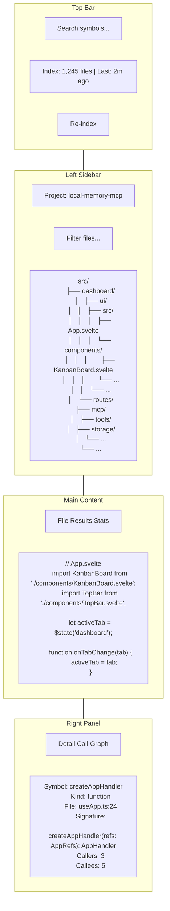

# Codebase Index — Wireframe Layout

This document provides the wireframe layout for the Codebase Index tab, following the established glass-interface design system from the dashboard.

---

## 1. Overall Layout

The Codebase tab uses a **4-zone layout**: top bar, left sidebar (file tree), main content (tabbed), right panel (symbol detail).



---

## 2. Zone Specifications

### 2.1 Top Bar

```
+------------------------------------------------------------------+
| [🔍 Search symbols by name...              ] [⬤ Indexed  ◷ 2m] [⟳] |
+------------------------------------------------------------------+
```

| Element             | Type                                  | Behavior                                                                                                          |
| :------------------ | :------------------------------------ | :---------------------------------------------------------------------------------------------------------------- |
| **Search Input**    | Text input with autocomplete dropdown | Global symbol search across the indexed codebase. Results match function/variable/class/type names.               |
| **Index Status**    | Badge with icon + text                | Shows current state (Idle/Indexing/Stale/Error) and last-indexed timestamp. Clicking opens status detail tooltip. |
| **Re-index Button** | Icon button (⟳)                       | Triggers full re-scan. Shows confirmation on first click. Disabled during active indexing.                        |

### 2.2 Left Sidebar

```
+-------------------------------+
| 📁 Project: local-memory-mcp  |
| [Filter files...            ] |
|                               |
| src/                          |
| ├── 🗀 dashboard/             |
| │   ├── 🗀 ui/                |
| │   │   └── 🗀 src/           |
| │   │       ├── 📄 App.svelte |
| │   │       └── 🗀 components/|
| │   └── 📄 routes/            |
| ├── 🗀 mcp/                   |
| │   ├── 🗀 tools/             |
| │   ├── 🗀 storage/           |
| │   └── 📄 index.ts           |
| ├── 📄 package.json           |
| └── ...                       |
+-------------------------------+
```

| Element              | Type                       | Behavior                                                                                                       |
| :------------------- | :------------------------- | :------------------------------------------------------------------------------------------------------------- |
| **Project Selector** | Dropdown at top of sidebar | Selects the repository whose index to browse. Defaults to the active repo from the global sidebar.             |
| **Filter Input**     | Text input                 | Filters visible tree nodes by filename (client-side filter). Matching nodes are highlighted.                   |
| **File Tree**        | Recursive collapsible tree | Lazily loads children on expand. Directories sorted above files. Current file highlighted.                     |
| **Node Icons**       | 📁 directory / 📄 file     | Visual distinction between directories and files. File icons can map to file type (`.ts`, `.svelte`, `.json`). |

### 2.3 Main Content Area

```
+--------------------------------------------------+
| [📄 File]  [🔍 Results]  [📊 Stats]              |
+--------------------------------------------------+
|                                                    |
|   // App.svelte                                    |
|   import KanbanBoard from './components/...';      |
|   import TopBar from './components/TopBar.svelte'; |
|                                                    |
|   let activeTab = $state('dashboard');             |
|                                                    |
|   function onTabChange(tab) {                      |
|       activeTab = tab;                             |
|   }                                                 |
|                                                    |
|   Line 42  Col 8   TypeScript   UTF-8              |
+--------------------------------------------------+
```

Three sub-tabs within the main area:

| Tab         | Content                                                                                                                                                     |
| :---------- | :---------------------------------------------------------------------------------------------------------------------------------------------------------- |
| **File**    | Syntax-highlighted source code viewer. Shows the currently selected file. Includes a line-number gutter and a status bar with line/col, language, encoding. |
| **Results** | Symbol search results table (when a search is active). Columns: Name, Kind, File, Line. Clickable rows open the symbol detail panel.                        |
| **Stats**   | Index statistics dashboard: total files, symbols by kind (pie chart or bar), file type distribution, index size, indexing duration.                         |

### 2.4 Right Panel

```
+----------------------------------+
| [📋 Detail]  [🔗 Call Graph]     |
+----------------------------------+
| Symbol: createAppHandler         |
| Kind:   function                 |
| File:   useApp.ts:24             |
|                                   |
| Signature:                        |
| createAppHandler(refs: AppRefs)   |
|   : AppHandler                    |
|                                   |
| Doc comment:                      |
| Creates the main app handler     |
| that orchestrates tab state.     |
|                                   |
| Callers (3):                      |
|   App.svelte:12                   |
|   useApp.ts:88                    |
|   server.ts:45                    |
|                                   |
| Callees (5):                      |
|   loadRepos                       |
|   loadHealth                      |
|   loadData                        |
|   onTabChange                     |
|   initPersistedState              |
+----------------------------------+
```

Two sub-tabs within the right panel:

| Tab            | Content                                                                                                                                        |
| :------------- | :--------------------------------------------------------------------------------------------------------------------------------------------- |
| **Detail**     | Symbol metadata: name, kind, signature, doc comment, file path, line number, definition snippet. Lists callers and callees as clickable links. |
| **Call Graph** | Mermaid-rendered DAG showing incoming and outgoing edges for the selected symbol. Rendered inside a scrollable container with zoom support.    |

---

## 3. Responsive Behavior

| Breakpoint              | Layout Changes                                                                                                                                                   |
| :---------------------- | :--------------------------------------------------------------------------------------------------------------------------------------------------------------- |
| **Desktop (>1024px)**   | Full 4-zone layout: top bar + left sidebar (280px) + main area (flex) + right panel (360px).                                                                     |
| **Tablet (768–1024px)** | Right panel collapses to a slide-over drawer triggered by a button in the main area toolbar. Left sidebar width reduces to 240px.                                |
| **Mobile (<768px)**     | Left sidebar hides (replaced by a hamburger drawer). Right panel always a full-screen drawer. Main area takes full width. File tree accessible via bottom sheet. |

---

## 4. Empty States

| State                 | Illustration                                                                                                                  |
| :-------------------- | :---------------------------------------------------------------------------------------------------------------------------- |
| **No index exists**   | Centered message: "No codebase index found for this repository. Click 'Re-index' to scan the project." with a large ⟳ button. |
| **No search results** | "No symbols match your query. Try a different name or check your spelling." with recent suggestions.                          |
| **No file selected**  | "Select a file from the tree to browse its contents." with a visual hint pointing to the sidebar.                             |
| **Index error**       | "Indexing failed for 3 files. [View error log]" with a list of failed file paths and error messages.                          |
