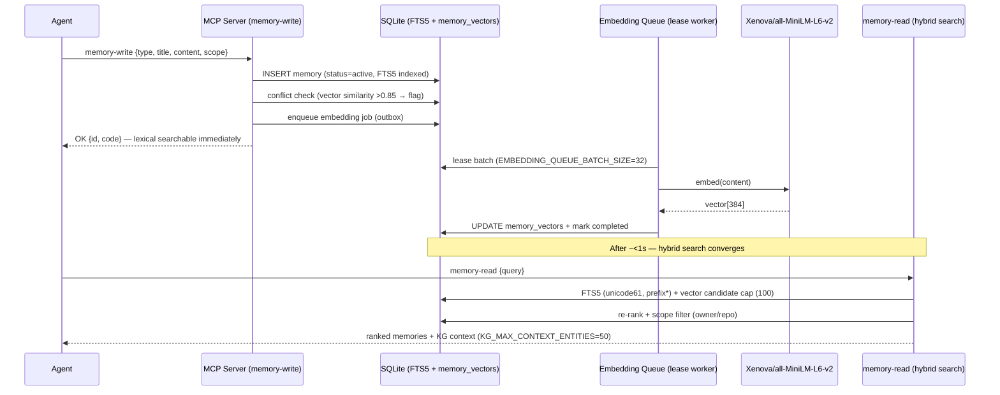
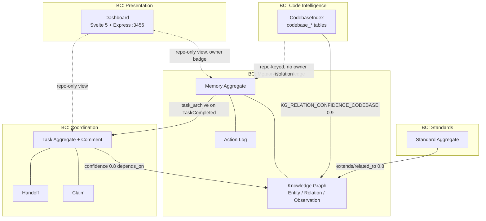

# Event Storming — Local Memory MCP

> Domain source: [`domain.md`](domain.md) · Aggregates verified 2026-08-08/10 · Contract: `src/mcp/prompts/server/instructions.md` · Tool boundaries: `src/mcp/tools/`.

## 1. Purpose

Event Storming maps the temporal flow of domain events (orange), commands (blue), aggregates (yellow), hotspots (red), and bounded contexts for the MCP Local Memory system. This artifact complements [`domain.md`](domain.md) with a time-ordered view and cross-context dependencies.

## 2. Timeline — Domain Events (Orange Stickies)

Events are ordered left-to-right as they occur in a typical agent session. Actor swim-lanes: **Agent**, **MCP Server**, **Async Workers**, **Dashboard**.

```mermaid
timeline
  title Local Memory MCP — Domain Event Timeline
  section Session Start
    Agent connects via stdio : MCP handshake + session context inferred (owner/repo/agent/model)
    Server ensures DB + migrations : SQLite WAL + migrations auto-run
  section Memory Lifecycle
    Agent issues memory-write : MemoryCreated (pending vector)
    Semantic conflict check runs : ConflictDetected (threshold 0.85) or NoConflict
    Embedding queue leases job : EmbeddingRequested → EmbeddingCompleted
    Vector + FTS5 indexed : MemorySearchable (FTS + vector ready)
    Agent reads via memory-read : MemoryRecalled (hit_count++)
    Agent acknowledges usage : MemoryAcknowledged (used/irrelevant/contradictory)
    Memory superseded or expired : MemorySuperseded / MemoryExpired → archived
    Inactivity decay fires : MemoryDecayed (importance drift)
  section Task Coordination
    Agent creates task : TaskCreated (backlog/pending)
    Agent claims task : TaskClaimed → TaskInProgress
    Agent updates / comments : TaskUpdated + CommentAdded
    Agent completes task : TaskCompleted → task_archive Memory auto-created
    Claim auto-released : ClaimReleased + HandoffExpired (if linked)
  section Knowledge & Index
    Codebase indexed : CodebaseIndexed (tree-sitter → codebase_* tables)
    File watcher sweep : FileChangeDetected → Reindexed
    KG extraction runs : EntityCreated / RelationCreated / ObservationAdded
    KG query served : KGContextEnriched
  section Dashboard
    Dashboard polls REST : DashboardViewServed (repo-scoped aggregation)
```

## 3. Key Flow — Memory Write → Embedding Queue → Vector Search

The async embedding offload (migration v9) creates a brief searchability window. `MCP_RUNTIME_PROFILE` controls worker startup: `full` = eager, `balanced` = on-demand, `minimal` = lexical-only.

## 4. Bounded Contexts

Context map notes: BC1/BC2/BC3 share the same SQLite DB but enforce `owner/repo` scope isolation (except `is_global`). BC4 is **repo-keyed by design** — owner isolation out-of-scope per ADR-008. BC5 is read-model only (REST over BC1/BC2).

## 5. Commands → Events → Aggregates

| Command (blue)                        | Domain Event (orange)                  | Aggregate (yellow)    | Trigger                                   |
| :------------------------------------ | :------------------------------------- | :-------------------- | :---------------------------------------- |
| `memory-write` (create)               | `MemoryCreated`                        | Memory                | Agent stores knowledge                    |
| `memory-write` (supersedes)           | `MemorySuperseded` + `MemoryCreated`   | Memory                | Versioning                                |
| `memory-write` (acknowledge)          | `MemoryAcknowledged`                   | Memory                | Agent marks used/irrelevant/contradictory |
| `memory-delete`                       | `MemoryArchived`                       | Memory                | Soft-delete                               |
| `task-write` (create)                 | `TaskCreated`                          | Task                  | Agent registers work                      |
| `claim-manage` (claim)                | `TaskClaimed`                          | Claim                 | Agent takes ownership                     |
| `task-write` (status=in_progress)     | `TaskInProgress`                       | Task                  | Gradual promotion enforced                |
| `task-write` (status=completed)       | `TaskCompleted` + `TaskArchiveCreated` | Task → Memory         | Auto-archive invariant                    |
| `handoff-write`                       | `HandoffCreated`                       | Handoff               | Agent leaves unfinished work              |
| `standard-write`                      | `StandardCreated/Updated`              | Standard              | Agent persists rule                       |
| `codebase-index` (repoPath+repo)      | `CodebaseIndexed`                      | CodebaseIndex         | Tree-sitter scan                          |
| `codebase-read` (query/name/filePath) | `CodebaseQueried`                      | CodebaseIndex         | Search/trace/file/architecture            |
| `repo-summarize`                      | `RepoSummarized`                       | Memory (task_archive) | Session signals archived                  |

Policy events (purple): `EmbeddingRequested`, `EmbeddingCompleted`, `ConflictDetected`, `MemoryDecayed`, `ClaimReleased`, `HandoffExpired`, `Reindexed`.

## 6. Aggregate Inventory

| Aggregate          | Root Entity                                              | Key Invariants                                                                                                                            | Bounded Context    |
| :----------------- | :------------------------------------------------------- | :---------------------------------------------------------------------------------------------------------------------------------------- | :----------------- |
| **Memory**         | `memories` (UUID PK, FTS5)                               | supersedes chains archived; conflict >0.85 flagged; decay 7d / rate 0.5; scope `owner/repo` unless `is_global`                            | Memory & Knowledge |
| **Task**           | `tasks` (UUID + task_code)                               | 6-state FSM; `backlog/pending/blocked` → `in_progress` → `completed` only (gradual promotion); `est_tokens` required on complete          | Coordination       |
| **Standard**       | `standards` (UUID)                                       | `active/deprecated/superseded`; scope `owner/repo/folder/language/stack`; query via `standard-read` hybrid                                | Standards          |
| **Handoff/Claim**  | `handoffs` + `claims` (task_id unique)                   | Handoff `pending/accepted/rejected/expired` with TTL; Claim one-per-task; complete auto-releases claim + expires handoff                  | Coordination       |
| **CodebaseIndex**  | `codebase_*` (inside same DB)                            | Tree-sitter WASM parse; `CODEBASE_REPOS_DIR` dashboard-only; MCP indexes CWD; `INDEX_STALENESS_TTL_MS=30s`                                | Code Intelligence  |
| **KnowledgeGraph** | `entities` + `relations` (composite PK) + `observations` | FK cascade on entity delete; `confidence` first-write-wins (1.0 manual / 0.9 codebase / 0.8 semantic / 0.55 auto); `kg_degrees` v22 cache | Memory & Knowledge |

## 7. Hotspots & Risks (Red Stickies)

| #   | Hotspot                        | Risk                                                                    | Mitigation                                                                                      |
| :-- | :----------------------------- | :---------------------------------------------------------------------- | :---------------------------------------------------------------------------------------------- |
| H1  | Embedding offload window       | Semantic search stale <1s after write → agent re-reads miss             | Document searchability window; `MCP_RUNTIME_PROFILE=minimal` fallback is lexical-only by design |
| H2  | Confidence first-write-wins    | `INSERT OR IGNORE` keeps 0.55 auto edge when later manual edge collides | Documented gap in `domain.md` §9; per-edge recomputation deferred                               |
| H3  | Scope isolation leak           | Dashboard repo-only view merges owners (ADR-008); embed uses `owner=""` | Dashboard renders owner badge; MCP tools require explicit `owner/repo`                          |
| H4  | `CODEBASE_REPOS_DIR` confusion | Server ignores it — dashboard-only                                      | Env table in `AGENTS.md` + manifest annotation                                                  |
| H5  | FTS5 prefix only               | No mid-word substring (trigram deferred)                                | Document `unicode61` + `*` semantics in AGENTS.md                                               |
| H6  | WriteLock contention           | Concurrent mutations across processes                                   | `WriteLock` cooperative lock on all mutation tools                                              |
| H7  | Coverage floor                 | `test --coverage` exits 1 by design (below 70/70/70/60)                 | CI non-blocking until TST-013 (S03); S04 closes gap                                             |

## 8. Links

- Domain entities & rules: [`domain.md`](domain.md)
- DB schema & constraints: [`../database/schema.md`](../database/schema.md)
- Flows & wireframes: [`../flows/README.md`](../flows/README.md) · [`../ui/wireframes/`](../ui/wireframes/)
- Tool contract: `src/mcp/prompts/server/instructions.md` · Decisions: [`../design/decisions`](../design/decisions)
