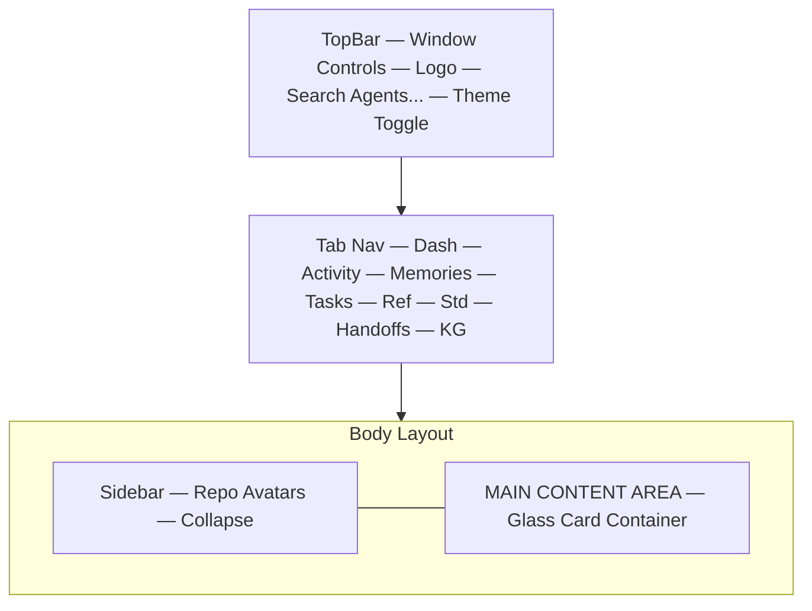

# Main Wireframe (Glass Interface)

> **Note (2026-09-06, v0.44.1):** Superseded by PRs #104–106 — workspace-first navigation (WorkspaceSwitcher), 9 shared primitives, lazy route splitting (-44%), arena HiDPI. See CHANGELOG 0.44.1. Content below is historical.

> **VERIFIED vs IMPLEMENTATION (2026-08-08):** global shell, glass sidebar/header, pill tab bar, detail drawer, Quick Create FAB, and theme toggle all match the shipped dashboard. Tab list below is outdated — shipped tabs also include **Arena**, **Codebase**, and **Queue** (11 tabs total after TASK-297; see design/ui/navigation/site-map.md). The hybrid search bar ("Task codes, Memory content, Standards") is realized via the dashboard search + reference catalog; no single cross-entity search bar ships today.

This document provides a low-fidelity visual map of the primary dashboard screen.

## 1. Global Shell

## 2. Component Placement

- **Sidebar (Left)**: Floating glass panel with repository avatars and names. Collapsible to icons only.
- **Header (Top)**: Sticky glass bar with global actions (Refresh, Sync Status, Theme Toggle).
- **Tab Bar (Sub-header)**: Centered pill-shaped navigation group with 8 tabs.
- **Main View**: A grid-based playground that swaps content based on the active tab.

## 3. Interaction Zones

1. **Repo Selector**: Triggers a global data reload (Stats, Tasks, Memories, Standards, KG).
2. **Search Bar**: Hybrid search spanning Task codes, Memory content, and Standards.
3. **Detail Layer**: Any card click triggers an overlaying **Detail Drawer** from the right edge, maintaining the scroll position of the main view.
4. **Quick Create FAB**: Floating action button in the bottom-right for rapid task creation.
5. **Theme Toggle**: Persists to `localStorage` for light/dark mode preference.

## 4. Tab Content Areas

| Tab             | Content Area                                                          |
| :-------------- | :-------------------------------------------------------------------- |
| Dashboard       | StatsWidget (full width) + TaskStatsWidget/TimeStatsWidget (2-column) |
| Activity        | Scrollable audit feed with burst condensation                         |
| Memories        | Search bar + scrollable memory cards                                  |
| Tasks           | 4-column Kanban (Backlog, Pending, In Progress, Completed)            |
| Reference       | Filtered list + schema drawer                                         |
| Standards       | List + detail panel                                                   |
| Handoffs        | Status-filtered handoff list                                          |
| Knowledge Graph | Full canvas force-directed graph                                      |
