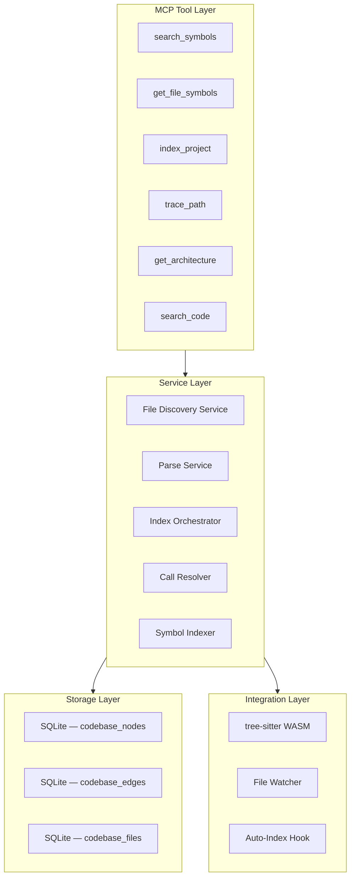
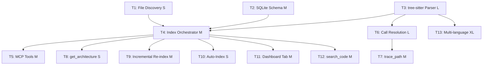

# Feature Decomposition — Codebase Index

> **Scope**: All phases (MVP, Phase 1.1, Phase 1.2).
> **Effort Scale**: S = <1 day, M = 1-3 days, L = 3-5 days, XL = 1-2 weeks.

---

## Layer Architecture

---

## MVP Tasks (P0)

### T1: File Discovery Service

> **Effort**: S | **Depends on**: Nothing

| Aspect          | Detail                                                                                                                                                                                                                                                                                      |
| :-------------- | :------------------------------------------------------------------------------------------------------------------------------------------------------------------------------------------------------------------------------------------------------------------------------------------ |
| **Description** | Walk the project directory tree, respect `.gitignore`, apply include/exclude patterns, return a list of file paths.                                                                                                                                                                         |
| **Sub-tasks**   | 1. Implement recursive directory walker 2. Integrate `.gitignore` parsing (`ignore` package) 3. Implement include/exclude pattern matching 4. Detect and handle symlinks (resolve, cycle detection) 5. Detect and skip binary files 6. Detect and skip files over size limit |
| **Tests**       | Unit: directory walk with mock filesystem Integration: walk real project, verify `.gitignore` respected Edge: empty dir, symlink cycle, permission denied                                                                                                                             |
| **Files**       | `src/codebase-index/file-discovery.ts` `src/codebase-index/__tests__/file-discovery.test.ts`                                                                                                                                                                                             |

---

### T2: SQLite Storage Schema & Migrations

> **Effort**: M | **Depends on**: Nothing (can parallel with T1)

| Aspect          | Detail                                                                                                                                                                                                                                                                                                                                                                                                                                                                                                                                               |
| :-------------- | :--------------------------------------------------------------------------------------------------------------------------------------------------------------------------------------------------------------------------------------------------------------------------------------------------------------------------------------------------------------------------------------------------------------------------------------------------------------------------------------------------------------------------------------------------- |
| **Description** | Define and migrate the `codebase_files`, `codebase_nodes`, and `codebase_edges` tables in the existing `memory.db`.                                                                                                                                                                                                                                                                                                                                                                                                                                  |
| **Sub-tasks**   | 1. Design schema: `codebase_files` (id, path, project_root, size, lines, indexed_at, parse_error) 2. Design schema: `codebase_nodes` (id, file_id, name, kind, signature, doc_comment, line_start, line_end, col_start, col_end, is_exported, parent_node_id) 3. Design schema: `codebase_edges` (id, source_node_id, target_node_id, edge_kind, file_id) 4. Create indexes on name, file_id, edge_kind 5. Write migration function (idempotent — `CREATE TABLE IF NOT EXISTS`) 6. Add foreign key relationships with CASCADE deletes |
| **Tests**       | Unit: schema creation, index verification Integration: insert and query sample symbols, verify FK constraints                                                                                                                                                                                                                                                                                                                                                                                                                                     |
| **Files**       | `src/codebase-index/schema.ts` `src/codebase-index/__tests__/schema.test.ts`                                                                                                                                                                                                                                                                                                                                                                                                                                                                      |

---

### T3: tree-sitter Parser Integration

> **Effort**: L | **Depends on**: T1 (file paths), T2 (storage)

| Aspect          | Detail                                                                                                                                                                                                                                                                                                                                                                                                                                                                                                                                                                                                                                                                                |
| :-------------- | :------------------------------------------------------------------------------------------------------------------------------------------------------------------------------------------------------------------------------------------------------------------------------------------------------------------------------------------------------------------------------------------------------------------------------------------------------------------------------------------------------------------------------------------------------------------------------------------------------------------------------------------------------------------------------------ |
| **Description** | Integrate `web-tree-sitter` with TypeScript/JavaScript grammar WASM. Parse files and extract declaration symbols.                                                                                                                                                                                                                                                                                                                                                                                                                                                                                                                                                                     |
| **Sub-tasks**   | 1. Install `web-tree-sitter` + `@tree-sitter-grammars/tree-sitter-typescript` 2. Initialize tree-sitter WASM at module load 3. Implement file parsing with error recovery 4. Write AST visitor for function declarations 5. Write AST visitor for class declarations + methods 6. Write AST visitor for interface / type / enum declarations 7. Write AST visitor for exported variable declarations 8. Extract signatures (params with names/types, return type) 9. Extract JSDoc/TSDoc comments 10. Handle files with syntax errors — extract partial symbols 11. Handle large files — AST depth limiting 12. Batch-write parsed symbols to SQLite |
| **Tests**       | Unit: parse single-file fixtures for each declaration kind Integration: parse real project, verify all declarations captured Edge: syntax errors, comments-only, BOM, shebang                                                                                                                                                                                                                                                                                                                                                                                                                                                                                                   |
| **Files**       | `src/codebase-index/parser.ts` `src/codebase-index/ast-visitors.ts` `src/codebase-index/__tests__/fixtures/*.ts` `src/codebase-index/__tests__/parser.test.ts`                                                                                                                                                                                                                                                                                                                                                                                                                                                                                                               |

---

### T4: Index Orchestrator

> **Effort**: M | **Depends on**: T1, T2, T3

| Aspect          | Detail                                                                                                                                                                                                                                                                                                                                                                           |
| :-------------- | :------------------------------------------------------------------------------------------------------------------------------------------------------------------------------------------------------------------------------------------------------------------------------------------------------------------------------------------------------------------------------- |
| **Description** | Coordinate file discovery → parsing → storage. Handle progress reporting, concurrency guards, and error aggregation.                                                                                                                                                                                                                                                             |
| **Sub-tasks**   | 1. Implement `index_project` orchestration function 2. Add concurrency guard (mutex, reject duplicate requests) 3. Add progress callback (files processed, errors, duration) 4. Handle partial failures (some files fail, index what succeeded) 5. Implement full re-index (truncate + rebuild) 6. Report summary: files indexed, symbols stored, errors, skipped |
| **Tests**       | Integration: full index pipeline on test fixture project Edge: concurrent index request, partial parse failures                                                                                                                                                                                                                                                               |
| **Files**       | `src/codebase-index/indexer.ts` `src/codebase-index/__tests__/indexer.test.ts`                                                                                                                                                                                                                                                                                                |

---

### T5: MCP Tools — `search_symbols` and `get_file_symbols`

> **Effort**: M | **Depends on**: T4

| Aspect          | Detail                                                                                                                                                                                                                                                                                                                                                                                                                                                        |
| :-------------- | :------------------------------------------------------------------------------------------------------------------------------------------------------------------------------------------------------------------------------------------------------------------------------------------------------------------------------------------------------------------------------------------------------------------------------------------------------------ |
| **Description** | Register MCP tools that query the code graph. `search_symbols` for fuzzy/precision name search, `get_file_symbols` for file-level listing.                                                                                                                                                                                                                                                                                                                    |
| **Sub-tasks**   | 1. Register `codebase_index` tool — triggers full or incremental index 2. Implement `search_symbols` MCP tool with exact + prefix + fuzzy (SQL `LIKE` / FTS5) 3. Implement `get_file_symbols` MCP tool — query by file path 4. Handle missing-index error gracefully 5. Add input validation (empty query, invalid file path) 6. Return structured results with all metadata fields 7. Support filtering by symbol kind in `search_symbols` |
| **Tests**       | Integration: call tools via MCP protocol, verify responses Unit: query logic, edge cases (no index, no results)                                                                                                                                                                                                                                                                                                                                            |
| **Files**       | `src/codebase-index/mcp-tools.ts` `src/codebase-index/__tests__/mcp-tools.test.ts`                                                                                                                                                                                                                                                                                                                                                                         |

---

## Phase 1.1 Tasks (P1)

### T6: Cross-File Call Resolution

> **Effort**: L | **Depends on**: T3

| Aspect          | Detail                                                                                                                                                                                                                                                                                     |
| :-------------- | :----------------------------------------------------------------------------------------------------------------------------------------------------------------------------------------------------------------------------------------------------------------------------------------- |
| **Description** | Resolve function/method call expressions across files. Build `CALLS` edges in `codebase_edges`.                                                                                                                                                                                            |
| **Sub-tasks**   | 1. Extract call expressions from AST (`call_expression` nodes) 2. Resolve call target name to indexed symbol 3. Handle ambiguous names (multiple symbols with same name — best-effort) 4. Build `CALLS` edges with call site file/line metadata 5. Batch-write edges to SQLite |

---

### T7: `trace_path` MCP Tool

> **Effort**: M | **Depends on**: T6

| Aspect          | Detail                                                                                                                                                                                                                                                                                                  |
| :-------------- | :------------------------------------------------------------------------------------------------------------------------------------------------------------------------------------------------------------------------------------------------------------------------------------------------------ |
| **Description** | Given a symbol name, trace inbound (callers) or outbound (callees) call chains.                                                                                                                                                                                                                         |
| **Sub-tasks**   | 1. Implement inbound query — find all symbols that CALL the target 2. Implement outbound query — find all symbols CALLED by the target 3. Support `maxDepth` parameter for multi-level traversal 4. Return ordered list of call chains 5. Handle symbols with no callers/callees gracefully |

---

### T8: `get_architecture` MCP Tool

> **Effort**: S | **Depends on**: T4

| Aspect          | Detail                                                                                                                                                                                                                                  |
| :-------------- | :-------------------------------------------------------------------------------------------------------------------------------------------------------------------------------------------------------------------------------------- |
| **Description** | Return aggregate statistics about the indexed codebase.                                                                                                                                                                                 |
| **Sub-tasks**   | 1. Implement file count and symbol count aggregation queries 2. Implement per-kind symbol counts 3. Identify entry points (files with exports) 4. Compute directory depth and breadth 5. Return top-N files by symbol count |

---

### T9: Incremental Re-Indexing

> **Effort**: M | **Depends on**: T4

| Aspect          | Detail                                                                                                                                                                                                                                                                                                                  |
| :-------------- | :---------------------------------------------------------------------------------------------------------------------------------------------------------------------------------------------------------------------------------------------------------------------------------------------------------------------- |
| **Description** | On subsequent index runs, only re-parse files whose mtime has changed. Handle deleted files.                                                                                                                                                                                                                            |
| **Sub-tasks**   | 1. Store `indexed_at` timestamp per file in `codebase_files` 2. On re-index, compare current mtime vs `indexed_at` 3. Re-parse only stale files (update existing symbol records) 4. Detect and remove deleted files' symbols 5. Detect and add new files 6. Fall back to full re-index if schema changed |

---

### T10: Auto-Index on Session Start

> **Effort**: S | **Depends on**: T4

| Aspect          | Detail                                                                                                                                                                                                                                                                                                                     |
| :-------------- | :------------------------------------------------------------------------------------------------------------------------------------------------------------------------------------------------------------------------------------------------------------------------------------------------------------------------- |
| **Description** | When MCP server initializes, automatically trigger indexing (full or incremental) with a file count guard.                                                                                                                                                                                                                 |
| **Sub-tasks**   | 1. Hook into MCP server initialization lifecycle 2. Check for existing index in `codebase_files` table 3. If no index, trigger full `index_project` 4. If index stale (>24h), trigger incremental re-index 5. If index fresh, skip 6. Enforce file count guard (default 50,000) to prevent runaway indexing |

---

## Phase 1.2 Tasks (P2)

### T11: Dashboard Codebase Tab

> **Effort**: M | **Depends on**: T4, existing Svelte dashboard

| Aspect          | Detail                                                                                                                                                                                                                                              |
| :-------------- | :-------------------------------------------------------------------------------------------------------------------------------------------------------------------------------------------------------------------------------------------------- |
| **Description** | Add a "Codebase" tab to the existing Svelte dashboard showing indexed files, symbols, and search.                                                                                                                                                   |
| **Sub-tasks**   | 1. Add "Codebase" navigation tab 2. Build file tree browser (collapsible, respect project root) 3. Build symbol list view (filterable by kind) 4. Build search UI with real-time results 5. Wire to MCP tool endpoints via existing API |

---

### T12: `search_code` MCP Tool

> **Effort**: M | **Depends on**: T4

| Aspect          | Detail                                                                                                                                                          |
| :-------------- | :-------------------------------------------------------------------------------------------------------------------------------------------------------------- |
| **Description** | Content search over indexed files, returning results enriched with surrounding symbol context.                                                                  |
| **Sub-tasks**   | 1. Implement content search over file text 2. Enrich results with nearby symbol definitions 3. Return file, line, context snippet, and associated symbols |

---

### T13: Multi-Language Support

> **Effort**: XL per language | **Depends on**: T3

| Aspect          | Detail                                                                                                                                                        |
| :-------------- | :------------------------------------------------------------------------------------------------------------------------------------------------------------ |
| **Description** | Extend tree-sitter parsing to additional languages (priority: Python → Rust → Go → PHP).                                                                      |
| **Sub-tasks**   | 1. Load language grammar WASM 2. Implement language-specific AST visitors 3. Add language-specific include patterns 4. Test against real-world repos |

---

## Dependency Graph

## Effort Summary

| Phase | Task                            | Effort |   Cumulative   |
| :---- | :------------------------------ | :----: | :------------: |
| MVP   | T1 — File Discovery             |   S    |    0.5 day     |
| MVP   | T2 — SQLite Storage             |   M    |     2 days     |
| MVP   | T3 — tree-sitter Parser         |   L    |     4 days     |
| MVP   | T4 — Index Orchestrator         |   M    |     2 days     |
| MVP   | T5 — MCP Tools                  |   M    |     2 days     |
|       | **MVP Total**                   |        | **~10.5 days** |
| P1.1  | T6 — Call Resolution            |   L    |     4 days     |
| P1.1  | T7 — trace_path                 |   M    |     2 days     |
| P1.1  | T8 — get_architecture           |   S    |    0.5 day     |
| P1.1  | T9 — Incremental Re-index       |   M    |     2 days     |
| P1.1  | T10 — Auto-Index                |   S    |    0.5 day     |
|       | **Phase 1.1 Total**             |        |  **~9 days**   |
| P1.2  | T11 — Dashboard Tab             |   M    |     3 days     |
| P1.2  | T12 — search_code               |   M    |     2 days     |
| P1.2  | T13 — Multi-language (per lang) |   XL   |    5-7 days    |
|       | **Phase 1.2 Total**             |        | **~5-10 days** |
|       | **Grand Total (MVP + P1)**      |        | **~19.5 days** |
