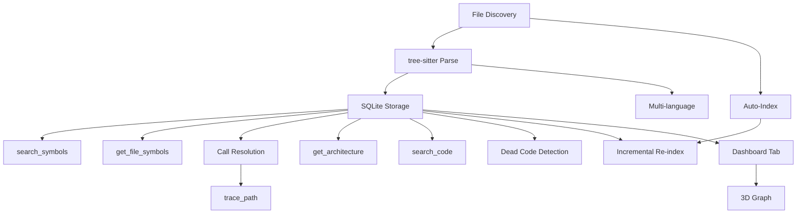

# Feature Prioritization — Codebase Index

## Methodology: RICE Scoring

Features ranked by **Reach × Impact × Confidence ÷ Effort**. Scores are relative (not absolute) and used for build-order decisions.

| Factor         | Scale               | Notes                                      |
| -------------- | ------------------- | ------------------------------------------ |
| **Reach**      | 1-5                 | How many user sessions benefit per week    |
| **Impact**     | 1-5                 | How much this improves the core value prop |
| **Confidence** | 0.5-1.0             | How certain we are of the estimate         |
| **Effort**     | Story points (1-13) | Relative engineering effort                |

---

## Feature RICE Matrix

| #   | Feature                             | Reach | Impact | Confidence | Effort | RICE Score | Phase   |
| --- | ----------------------------------- | ----- | ------ | ---------- | ------ | ---------- | ------- |
| 1   | **File discovery + filtering**      | 5     | 5      | 1.0        | 2      | 12.5       | **MVP** |
| 2   | **tree-sitter AST parsing (TS/JS)** | 5     | 5      | 0.9        | 5      | 4.5        | **MVP** |
| 3   | **Symbol storage (SQLite)**         | 5     | 5      | 1.0        | 3      | 8.3        | **MVP** |
| 4   | **`search_symbols` tool**           | 5     | 5      | 1.0        | 2      | 12.5       | **MVP** |
| 5   | **`get_file_symbols` tool**         | 4     | 4      | 1.0        | 1      | 16.0       | **MVP** |
| 6   | **Cross-file call resolution**      | 4     | 4      | 0.8        | 5      | 2.6        | Ph 1.1  |
| 7   | **`trace_path` tool**               | 4     | 5      | 0.9        | 3      | 6.0        | Ph 1.1  |
| 8   | **`get_architecture` tool**         | 3     | 3      | 0.8        | 2      | 3.6        | Ph 1.1  |
| 9   | **Incremental re-indexing**         | 5     | 4      | 0.9        | 5      | 3.6        | Ph 1.1  |
| 10  | **Auto-index on session start**     | 5     | 3      | 0.8        | 2      | 6.0        | Ph 1.1  |
| 11  | **Dashboard Codebase tab**          | 3     | 3      | 0.8        | 5      | 1.4        | Ph 1.2  |
| 12  | **3D graph visualization**          | 2     | 3      | 0.6        | 13     | 0.3        | Ph 1.2  |
| 13  | **`search_code` tool**              | 3     | 3      | 0.8        | 3      | 2.4        | Ph 1.2  |
| 14  | **Multi-language support**          | 3     | 4      | 0.7        | 8      | 1.1        | Ph 1.2  |
| 15  | **Dead code detection**             | 2     | 2      | 0.7        | 5      | 0.6        | Ph 1.2  |
| 16  | **Cross-repo indexing**             | 2     | 3      | 0.5        | 13     | 0.2        | Ph 2    |
| 17  | **LSP integration**                 | 3     | 4      | 0.5        | 8      | 0.8        | Ph 2    |
| 18  | **Semantic/vector search**          | 3     | 4      | 0.6        | 8      | 0.9        | Ph 2    |

---

## Build Order Recommendation

### Sprint 1: Foundation (MVP)

```
Priority: 5 → 1 → 3 → 4 → 2
(by RICE score descending, respecting dependency order)
```

| Step | Feature                        | RICE | Depends On                                          | Deliverable                                                        |
| ---- | ------------------------------ | ---- | --------------------------------------------------- | ------------------------------------------------------------------ |
| 1    | **`get_file_symbols` tool**    | 16.0 | Nothing (shell: returns file lines for known files) | Utility tool for known file structure                              |
| 2    | **File discovery + filtering** | 12.5 | Nothing                                             | List of project files respecting `.gitignore`                      |
| 3    | **Symbol storage (SQLite)**    | 8.3  | Step 2                                              | Schema + migrations for `codebase_nodes` + `codebase_edges` tables |
| 4    | **`search_symbols` tool**      | 12.5 | Step 3                                              | Agents can query symbols by name                                   |
| 5    | **tree-sitter AST parsing**    | 4.5  | Steps 2, 3                                          | Populates the database with real symbol data                       |

**Note**: Steps 4 and 5 can be developed in parallel — step 4 as a shell tool querying seeded data, step 5 as the pipeline that feeds real data.

### Sprint 2: Call Graph & Agent Tools (Should)

| Step | Feature                         | RICE | Depends On         | Deliverable                           |
| ---- | ------------------------------- | ---- | ------------------ | ------------------------------------- |
| 6    | **Auto-index on session start** | 6.0  | Step 5             | Zero-config indexing on MCP init      |
| 7    | **`trace_path` tool**           | 6.0  | Step 6, call edges | Trace inbound/outbound function calls |
| 8    | **`get_architecture` tool**     | 3.6  | Step 6             | High-level codebase summary           |
| 9    | **Incremental re-indexing**     | 3.6  | Step 6             | Fast subsequent index runs            |
| 10   | **Cross-file call resolution**  | 2.6  | Step 6             | Call graph edges populated            |

### Sprint 3: Dashboard & Developer UX (Could)

| Step | Feature                    | RICE | Depends On  | Deliverable                                 |
| ---- | -------------------------- | ---- | ----------- | ------------------------------------------- |
| 11   | **`search_code` tool**     | 2.4  | Step 6      | Graph-augmented grep                        |
| 12   | **Dashboard Codebase tab** | 1.4  | Step 6      | Visual symbol browser in existing dashboard |
| 13   | **Multi-language support** | 1.1  | Step 5      | Python, Rust, Go, PHP parsers               |
| 14   | **Dead code detection**    | 0.6  | Step 10     | Zero-caller function identification         |
| 15   | **3D graph visualization** | 0.3  | Step 10, 12 | Interactive graph in dashboard              |

### Phase 2: Advanced (Won't)

| Step | Feature                    | RICE | Rationale for Delay                                                          |
| ---- | -------------------------- | ---- | ---------------------------------------------------------------------------- |
| 16   | **Semantic/vector search** | 0.9  | Needs ONNX embedding model integration; evaluate demand first                |
| 17   | **LSP integration**        | 0.8  | High complexity, type inference can be approximated with tree-sitter for MVP |
| 18   | **Cross-repo indexing**    | 0.2  | Niche use case; revisit when multi-repo signal emerges                       |

---

## Dependency Graph



---

## Risk-Adjusted Effort

| Risk                                                   | Likelihood | Impact | Mitigation                                                                                              |
| ------------------------------------------------------ | ---------- | ------ | ------------------------------------------------------------------------------------------------------- |
| tree-sitter WASM build issues in Node.js               | Medium     | High   | Use `web-tree-sitter` package; pin versions; fallback to regex-based extraction for critical edge cases |
| SQLite schema migration conflicts with existing tables | Low        | Medium | Prefix all codebase tables with `codebase_`; use existing migration system                              |
| Parsing large files (>10K LOC) causes OOM              | Medium     | Medium | Set per-file AST depth limit; stream results; test against project's own source                         |
| Incremental re-indexing missing changed files          | Medium     | Low    | Always support full re-index as fallback; validate against git diff                                     |
| tree-sitter grammar updates breaking AST shape         | Low        | High   | Pin grammar versions in `package.json`; integration tests against known parse outputs                   |
