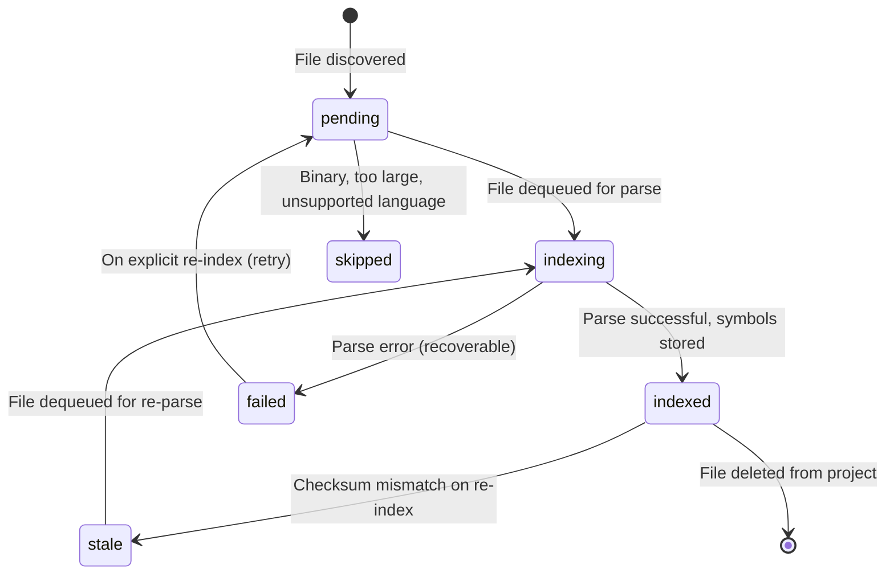
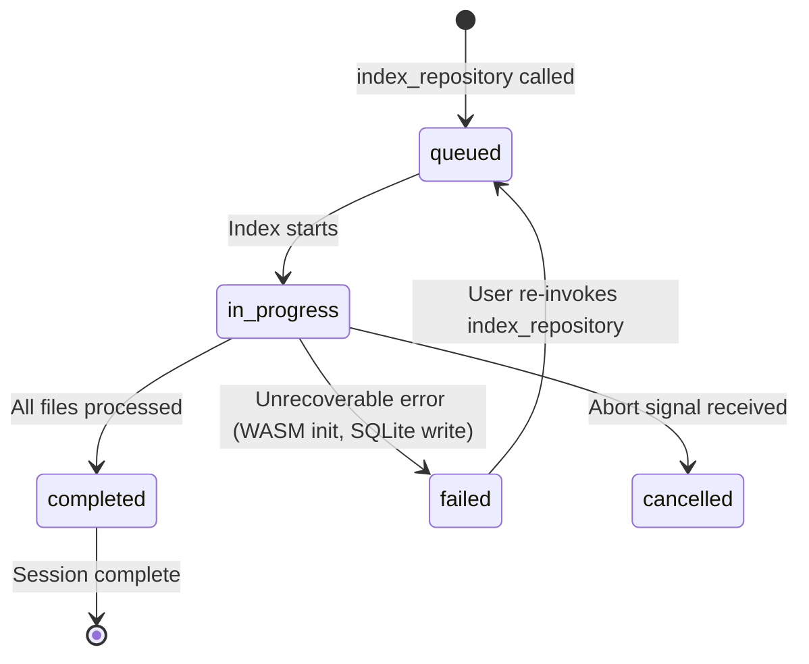
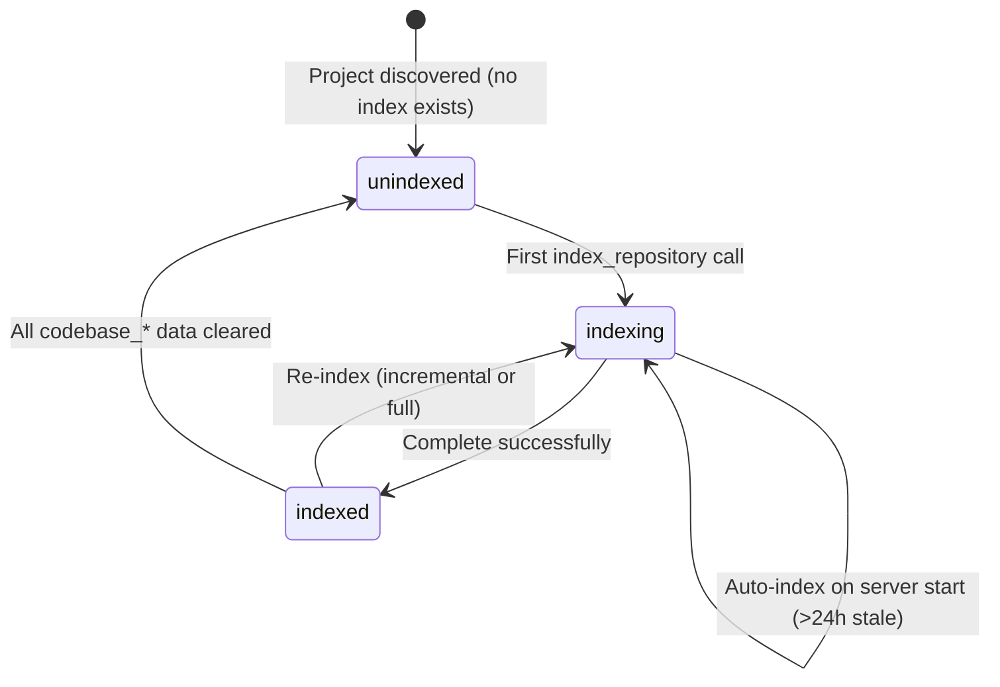
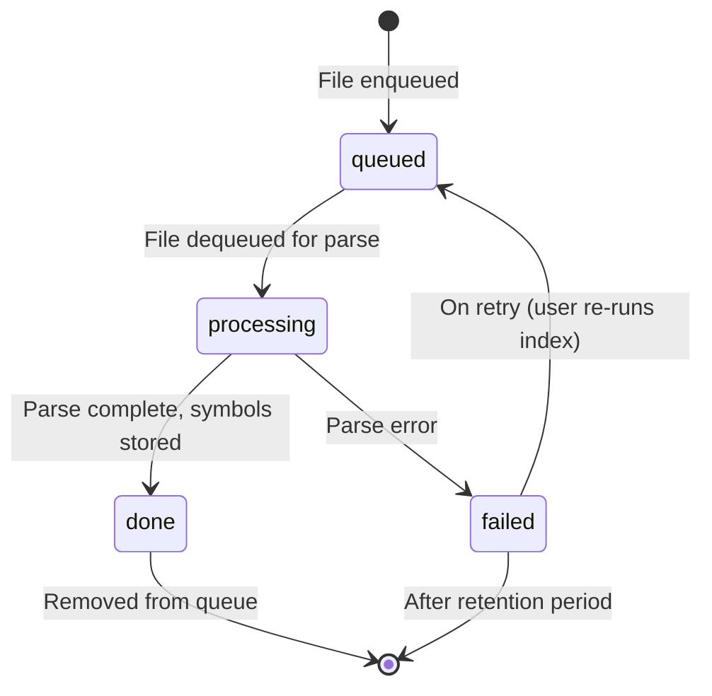

# Functional Specification Document (FSD) — Codebase Index

- **Feature:** Codebase Index
- **Project:** local-memory-mcp (`@vheins/local-memory-mcp`)
- **Status:** Draft
- **Date:** 2026-07-22

---

## Overview

This document specifies the functional behavior of the Codebase Index feature. It defines what the system does — not how it's implemented. For implementation details, see the TDD (`tdd.md`) and design documents under `../../design/codebase-index/`.

The Codebase Index follows the same tool/service/resource patterns as the existing Memory, Task, Coding Standards, and Knowledge Graph features.

---

## 1. Feature: File Discovery

### Description

When an index is triggered, the system must discover all indexable files in the project directory tree. Discovery respects the developer's intent about which files constitute project source code versus dependencies, build artifacts, or generated output.

### Behavior

| Scenario                              | Expected Behavior                                                                                      |
| :------------------------------------ | :----------------------------------------------------------------------------------------------------- |
| Project root exists                   | Recursively walk directory tree starting from project root                                             |
| `.gitignore` present                  | Apply `.gitignore` patterns to exclude files/directories. Support nested `.gitignore` files            |
| No `.gitignore` present               | Apply sensible defaults: exclude `node_modules`, `.git`, `dist`, `build`, `.next`, `.cache`, `vendor`  |
| Include patterns configured           | Only files matching include patterns (e.g., `*.ts`, `*.tsx`, `*.js`) are discovered                    |
| Exclude patterns configured           | Files matching exclude patterns are filtered out after includes                                        |
| Both include and exclude              | Include filter applied first, then exclude filter removes matches                                      |
| Binary file encountered               | Skip file silently. Detection via: null byte check in first 8KB, or known binary extension list        |
| File exceeds size limit (default 1MB) | Skip file, record as `skipped` with reason "file too large"                                            |
| Symlink encountered                   | Follow if `followSymlinks=true` (default: false). Cycle detection via inode tracking                   |
| Permission denied on file             | Skip file, record as `skipped` with reason "permission denied"                                         |
| No indexable files found              | Return status `no_files` with empty file list                                                          |
| Language detection                    | Map file extension to language: `.ts`/`.tsx` → `typescript`, `.js`/`.jsx`/`.mjs`/`.cjs` → `javascript` |

### Supported Language Extensions (MVP)

| Language   | File Extensions               |
| :--------- | :---------------------------- |
| TypeScript | `.ts`, `.tsx`                 |
| JavaScript | `.js`, `.jsx`, `.mjs`, `.cjs` |

### Configuration Options

| Option            | Type       | Default                                                | Description                         |
| :---------------- | :--------- | :----------------------------------------------------- | :---------------------------------- |
| `includePatterns` | `string[]` | `["*.ts", "*.tsx", "*.js", "*.jsx", "*.mjs", "*.cjs"]` | Glob patterns for include filtering |
| `excludePatterns` | `string[]` | `[]` (`.gitignore` used by default)                    | Additional patterns to exclude      |
| `maxFileSize`     | `number`   | `1048576` (1MB)                                        | Maximum file size in bytes          |
| `followSymlinks`  | `boolean`  | `false`                                                | Whether to follow symbolic links    |

---

## 2. Feature: tree-sitter Parsing

### Description

Each discovered source file is parsed using tree-sitter WASM to extract structural declarations. Parsing is per-file, deterministic, and purely syntactic (no type resolution in MVP).

### Declarations Extracted (MVP)

| Symbol Kind | tree-sitter Node Type    | Extracted Attributes                                                                    |
| :---------- | :----------------------- | :-------------------------------------------------------------------------------------- |
| `function`  | `function_declaration`   | name, parameters, return type, doc comment, export status, line span, column span       |
| `method`    | `method_definition`      | name, parameters, return type, doc comment, parent class, visibility, isStatic, isAsync |
| `class`     | `class_declaration`      | name, doc comment, export status, type parameters, line span                            |
| `interface` | `interface_declaration`  | name, doc comment, export status, type parameters, line span                            |
| `type`      | `type_alias_declaration` | name, doc comment, export status, type parameters, line span                            |
| `enum`      | `enum_declaration`       | name, doc comment, export status, line span                                             |
| `variable`  | `variable_declaration`   | name, type annotation, export status, const/let/var, line span                          |

### Doc Comment Extraction

| Comment Syntax | Extracted Content                                                 |
| :------------- | :---------------------------------------------------------------- |
| `/** JSDoc */` | Full comment text including `@param`, `@returns`, `@example` tags |
| `/// TSDoc`    | Full comment text (TypeScript only)                               |
| No comment     | `null`                                                            |

### Signature Format

Signatures follow a normalized human-readable format:

```
functionName(param1: Type1, param2: Type2): ReturnType
className.methodName(param1: Type1): ReturnType
```

### Error Recovery

| Parsing Scenario                     | Behavior                                                                                                                               |
| :----------------------------------- | :------------------------------------------------------------------------------------------------------------------------------------- |
| Syntax error in file                 | Attempt to extract symbols from valid portions of the AST; record error message in file record; symbols from valid portions are stored |
| Empty file                           | Complete with zero symbols; file marked `indexed`                                                                                      |
| File with only imports/exports       | Complete with zero symbols (imports are not symbols in MVP); file marked `indexed`                                                     |
| Language not supported               | Skip file; record as `skipped` with reason "language not supported"                                                                    |
| tree-sitter WASM fails to initialize | Fail entire index operation; return error to caller                                                                                    |
| Parse timeout (>30s per file)        | Abort parse for this file; record as `failed` with reason "parse timeout"                                                              |

---

## 3. Feature: Symbol Storage

### Description

Parsed symbols and file metadata are persisted in the shared SQLite database (`memory.db`). Storage supports bulk inserts, incremental updates, and cascade deletes.

### Storage Rules

| Rule                       | Description                                                                                                                              |
| :------------------------- | :--------------------------------------------------------------------------------------------------------------------------------------- |
| **File deduplication**     | `(project_path, file_path)` is unique. On re-index, the existing file record is updated, not duplicated.                                 |
| **Symbol deduplication**   | Symbol records are scoped to a file. On re-index, all symbols for a file are deleted and re-inserted (no incremental symbol-level diff). |
| **Relation deduplication** | `(source_symbol_id, target_symbol_id, relation_type)` is unique. Duplicate edges are prevented by unique index.                          |
| **Cascade delete**         | Deleting a file cascades to delete all its symbols. Deleting a symbol cascades to delete all its relations.                              |
| **Checksum storage**       | On successful parse, the file's SHA-256 checksum is stored. On next index, checksum comparison determines if re-parse is needed.         |
| **Status tracking**        | Each file has a status: `pending` → `indexing` → `indexed`, or `failed`/`skipped` for error cases.                                       |

### Data Retention

| Scenario                                     | Behavior                                                                                         |
| :------------------------------------------- | :----------------------------------------------------------------------------------------------- |
| File deleted from project                    | On incremental re-index, detected as removed; file tombstoned via `deleted_at`, symbols cascaded |
| File renamed                                 | Detected as new file + deleted file; full re-parse of new location                               |
| Project deleted (no longer indexed)          | Clear all `codebase_*` data for that `project_path`                                              |
| `codebase_index_queue` after index completes | Queue records for completed files are removed; only errors retained temporarily                  |

---

## 4. Feature: Symbol Search

### Description

The `search_symbols` tool provides structured name-based search across indexed symbols. It supports three matching strategies, applied in order of precision.

### Search Strategy

| Strategy            | SQL Pattern                     | When Used                                                  |
| :------------------ | :------------------------------ | :--------------------------------------------------------- |
| **Exact match**     | `WHERE name = ? COLLATE NOCASE` | Query is a short identifier (<10 chars) or matches exactly |
| **Prefix match**    | `WHERE name LIKE ?              |                                                            | '%' COLLATE NOCASE` | Query is 3+ characters, no spaces, not exact |
| **Substring match** | `WHERE name LIKE '%'            |                                                            | ?                   |                                              | '%' COLLATE NOCASE` | Query is 2+ characters, fallback |

All three strategies are unioned, deduplicated, and returned ordered by match quality (exact > prefix > substring).

### Filters

| Filter       | Type      | Behavior                                                                                    |
| :----------- | :-------- | :------------------------------------------------------------------------------------------ |
| `kind`       | `string`  | Restrict to specific symbol kind (function, class, interface, type, enum, variable, method) |
| `filePath`   | `string`  | Restrict to symbols in a specific file (relative path)                                      |
| `isExported` | `boolean` | Restrict to exported symbols only                                                           |
| `limit`      | `number`  | Maximum results (default: 50, max: 500)                                                     |
| `offset`     | `number`  | Pagination offset (default: 0)                                                              |

### Response Shape

Results include: `id`, `name`, `kind`, `qualifiedName`, `signature`, `filePath`, `startLine`, `endLine`, `docComment`, `isExported`.

### Validation

| Invalid Input       | Error Message                                |
| :------------------ | :------------------------------------------- |
| Empty query         | "Search query must not be empty"             |
| Query <2 characters | "Search query must be at least 2 characters" |
| `limit` > 500       | "Limit must not exceed 500"                  |
| `limit` < 1         | "Limit must be at least 1"                   |

---

## 5. Feature: MCP Tools

### Tool: `index_repository`

Triggers indexing of a project's source code. Performs full index if no prior index exists, incremental if prior data is found.

| Property    | Value                                                                                                                                           |
| :---------- | :---------------------------------------------------------------------------------------------------------------------------------------------- |
| Tool name   | `index_repository`                                                                                                                              |
| Category    | **Write** (under `store.withWrite()`)                                                                                                           |
| Input       | `{ projectPath?: string }`                                                                                                                      |
| Output      | `{ status, filesDiscovered, filesIndexed, filesFailed, filesSkipped, filesDeleted?, symbolsExtracted, relationsResolved?, duration, errors[] }` |
| Progress    | Emits `notifications/progress` with `(processed, totalFiles)`                                                                                   |
| Error cases | 409 (already indexing), 500 (init failure), 403 (path not in roots), 404 (path not found)                                                       |

Reference: `../../design/codebase-index/api-contracts.md` for full input/output schemas.

### Tool: `get_file_symbols`

Returns all symbols declared in a specific file, optionally with relations.

| Property    | Value                                                                                       |
| :---------- | :------------------------------------------------------------------------------------------ |
| Tool name   | `get_file_symbols`                                                                          |
| Category    | **Read**                                                                                    |
| Input       | `{ filePath: string, includeRelations?: boolean }`                                          |
| Output      | `{ file, symbols[], relations?[] }`                                                         |
| Error cases | File not indexed → `{ file: null, symbols: [] }`. File not found → error. No index → error. |

### Tool: `search_symbols`

Searches indexed symbols by name with optional filters.

| Property    | Value                                                                                                        |
| :---------- | :----------------------------------------------------------------------------------------------------------- |
| Tool name   | `search_symbols`                                                                                             |
| Category    | **Read**                                                                                                     |
| Input       | `{ query: string, kind?: string, filePath?: string, isExported?: boolean, limit?: number, offset?: number }` |
| Output      | `{ symbols[], total, limit, offset }`                                                                        |
| Error cases | Empty query → validation error. No index → error "No index found."                                           |

### Tool: `get_architecture`

Returns a high-level structural overview of the indexed codebase.

| Property    | Value                                                                                                                               |
| :---------- | :---------------------------------------------------------------------------------------------------------------------------------- |
| Tool name   | `get_architecture`                                                                                                                  |
| Category    | **Read**                                                                                                                            |
| Input       | `{ projectPath?: string }`                                                                                                          |
| Output      | `{ languages[], totalFiles, totalSymbols, totalRelations?, symbolCounts, relationCounts?, entryPoints[], topFiles[], hotspots?[] }` |
| Error cases | No index → empty stats (not an error)                                                                                               |

### Tool: `trace_symbol`

Traces inbound and/or outbound relationships from a symbol.

| Property    | Value                                                                                                            |
| :---------- | :--------------------------------------------------------------------------------------------------------------- |
| Tool name   | `trace_symbol`                                                                                                   |
| Category    | **Read**                                                                                                         |
| Input       | `{ symbolName: string, direction?: "inbound" \| "outbound" \| "both", maxDepth?: number, projectPath?: string }` |
| Output      | `{ symbol, inbound[], outbound[] }`                                                                              |
| Depth limit | Default: 3, Max: 10                                                                                              |
| Error cases | Symbol not found → error. No relations → empty arrays. No index → error.                                         |

### Tool: `index_status`

Returns the current indexing status and progress for a project.

| Property       | Value                                                                                              |
| :------------- | :------------------------------------------------------------------------------------------------- |
| Tool name      | `index_status`                                                                                     |
| Category       | **Read**                                                                                           |
| Input          | `{ projectPath?: string }`                                                                         |
| Output         | `{ indexed, status, progress?, lastIndexedAt, fileCount, symbolCount, relationCount?, lastError }` |
| No-index state | `{ indexed: false, status: "idle", fileCount: 0, symbolCount: 0 }`                                 |

### Tool Registration Pattern

All tools are registered via `registerAllTools()` in `src/mcp/tools/index.ts`, following the same pattern as existing memory and task tools:

- Zod schema for input validation
- Handler function with `(args, db, vectors, extra)` signature
- Write tools added to `WRITE_TOOLS` set for write lock protection
- Action logging via `logToolAction()`
- Auto-inferred `owner`/`repo` via session scope injection

### Progress Reporting

`index_repository` emits progress notifications via the MCP SDK notification mechanism, matching the pattern used by `memory-delete`. Progress is reported per-file-batch (batch size: configurable, default: 10 files).

---

## 6. Feature: Auto-Index (Phase 1.1)

### Description

When the MCP server initializes, it performs a background check to determine if an auto-index should be triggered.

### Behavior

| State                                     | Action                                                                          |
| :---------------------------------------- | :------------------------------------------------------------------------------ |
| No existing index for any project         | No auto-index (user must run `index_repository` explicitly for first index)     |
| Existing index for a project, <24h stale  | No action (index is fresh)                                                      |
| Existing index for a project, >24h stale  | Trigger incremental re-index in background (async, non-blocking)                |
| Existing index, project has >50,000 files | Do NOT auto-index; return a notification requesting explicit `index_repository` |
| Auto-index currently running              | Skip; only one index per project at a time                                      |
| Multiple projects indexed                 | Auto-index all stale projects sequentially (not parallel)                       |

### Staleness Detection

Staleness is determined by comparing the current time against `last_indexed_at` from the `codebase_index` record. The staleness threshold is configurable (default: 24 hours).

### Concurrency

Auto-index runs asynchronously and does not block server initialization or tool execution. During auto-index:

- `index_status` returns `status: "indexing"` with current progress
- `search_symbols` and `get_file_symbols` return results from the existing (stale) index
- `index_repository` called explicitly during auto-index returns a "currently indexing" status

---

## 7. Error Handling Matrix

| Scenario                        | HTTP Analogue | Error Message                                                                   | Recovery                                           |
| :------------------------------ | :------------ | :------------------------------------------------------------------------------ | :------------------------------------------------- |
| Project path not in MCP roots   | 403           | "Project path is not within allowed MCP root directories"                       | User provides valid path                           |
| Project path does not exist     | 404           | "Project path does not exist on filesystem"                                     | User corrects path                                 |
| tree-sitter WASM init failure   | 500           | "Failed to initialize parser: {details}"                                        | Check Node.js version, WASM compatibility          |
| Already indexing                | 409           | "Index already in progress for this project. {progress}"                        | Wait for completion or cancel                      |
| Index cancelled by abort signal | 499           | "Indexing was cancelled. Partial results available."                            | Re-run for complete results                        |
| File parse error                | —             | (logged per-file)                                                               | Partial symbols stored; re-run on next incremental |
| File too large                  | —             | "Skipped: file exceeds size limit ({size} > {limit})"                           | Increase limit or split file                       |
| Binary file                     | —             | (silent skip)                                                                   | N/A                                                |
| Permission denied               | —             | "Skipped: permission denied"                                                    | Fix file permissions                               |
| Symlink cycle                   | —             | "Skipped: symlink cycle detected"                                               | Break cycle or disable followSymlinks              |
| Language not supported          | —             | "Skipped: {language} is not supported (MVP supports: TypeScript, JavaScript)"   | Add language grammar                               |
| Search query empty              | 422           | "Search query must not be empty"                                                | Provide valid query                                |
| Symbol not found (trace)        | 404           | "Symbol '{name}' not found in index"                                            | Check spelling or index the project                |
| No index exists                 | 404           | "No index found for this project. Run `index_repository` first."                | Run `index_repository`                             |
| SQLite write failure            | 500           | "Database write failed: {details}"                                              | Check disk space, file permissions                 |
| Concurrent index request        | 409           | "Another index operation is in progress. Use `index_status` to check progress." | Wait for completion                                |

---

## 8. State Machines

### File Lifecycle



### Index Session Lifecycle



### Project Index Lifecycle



### Queue Item Lifecycle



---

## 9. Performance Thresholds

| Operational Boundary            | Threshold          | Behavior Beyond Threshold                                                      |
| :------------------------------ | :----------------- | :----------------------------------------------------------------------------- |
| Max files per single index      | 50,000             | Warning emitted; auto-index refuses; explicit `index_repository` still allowed |
| Max file size for parse         | 1MB (configurable) | File skipped with reason                                                       |
| Max line count for parse        | 50,000 lines       | File skipped with reason (prevents OOM)                                        |
| Max symbol results per search   | 500                | Hard limit enforced; paginate via offset                                       |
| Max trace depth                 | 10 levels          | Hard limit on recursive CTE depth                                              |
| Max concurrent index operations | 1 per project      | Mutex; returns 409 on conflict                                                 |
| Search query minimum length     | 2 characters       | Returns validation error                                                       |
| Max relations per tracing call  | 1,000              | Truncated with warning                                                         |

---

## 10. Integration Dependencies

### Shared Services

| Service                 | Usage                                                                               |
| :---------------------- | :---------------------------------------------------------------------------------- |
| `MigrationManager`      | Schema migration v3 — adds `codebase_*` tables                                      |
| `BaseEntity`            | `CodebaseIndexEntity` extends it — gains `transaction()`, `run()`, `all()`, `get()` |
| `store.withWrite()`     | Write lock for `index_repository`                                                   |
| `logToolAction()`       | Audit logging for all codebase index tool invocations                               |
| `normalizeToolArgs()`   | Auto-injects `owner`/`repo` from session context                                    |
| MCP notification system | Progress reporting for long-running index operations                                |
| `registerAllTools()`    | Tool registration pipeline                                                          |

### External Dependencies (New)

| Dependency                                     | Purpose                               | Type                   |
| :--------------------------------------------- | :------------------------------------ | :--------------------- |
| `web-tree-sitter`                              | tree-sitter WASM bindings for Node.js | npm runtime dependency |
| `@tree-sitter-grammars/tree-sitter-typescript` | TypeScript/JavaScript grammar (WASM)  | npm runtime dependency |
| `ignore`                                       | `.gitignore` pattern matching         | npm runtime dependency |

---

## 11. Related Documents

| Document             | Location                                       |
| :------------------- | :--------------------------------------------- |
| Product Requirements | `prd.md`                                       |
| Architecture Design  | `../../design/codebase-index/architecture.md`  |
| API Contracts        | `../../design/codebase-index/api-contracts.md` |
| Domain Model         | `../../design/codebase-index/domain.md`        |
| Database Schema      | `../../design/codebase-index/schema.md`        |
| Technical Design     | `tdd.md`                                       |
| Acceptance Criteria  | `acceptance-criteria.md`                       |
| BDD Scenarios        | `bdd-scenarios.md`                             |
| Edge Cases           | `edge-cases.md`                                |
