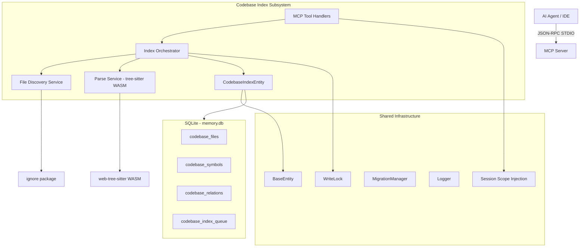
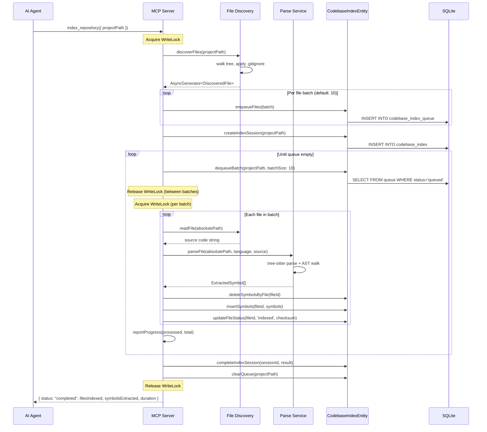
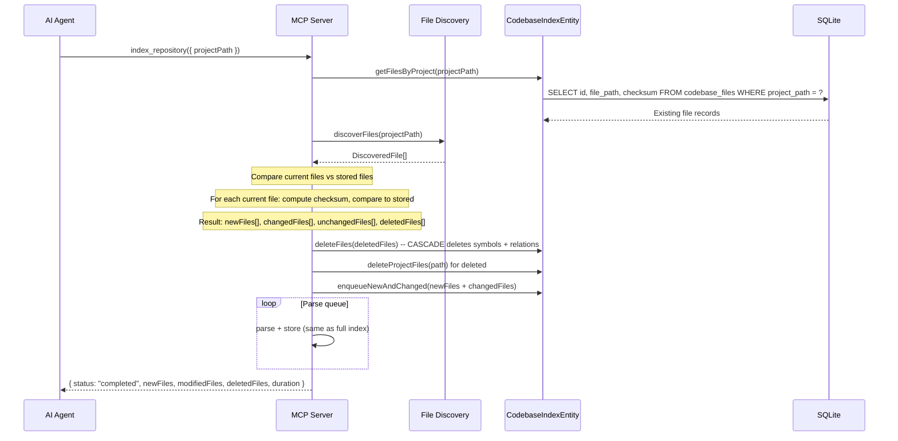
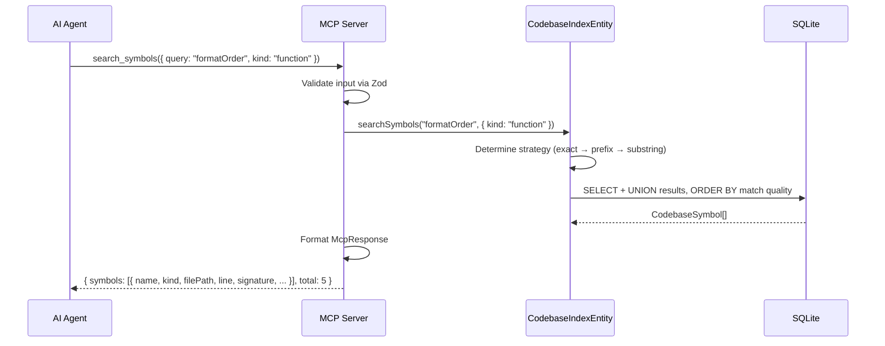

# Technical Design Document (TDD) — Codebase Index

- **Feature:** Codebase Index
- **Project:** local-memory-mcp (`@vheins/local-memory-mcp`)
- **Status:** Draft
- **Date:** 2026-07-22

---

## System Architecture Overview

The Codebase Index is a self-contained subsystem within the existing MCP server. It follows the same architectural patterns as Memory, Tasks, Coding Standards, and Knowledge Graph: an Entity layer extending `BaseEntity`, a set of MCP tool handlers registered via `registerAllTools()`, and storage in the shared SQLite database.

For the full architecture design including component diagrams, see `../../design/codebase-index/architecture.md`.

### High-Level Architecture



### Directory Structure

```
src/codebase-index/
├── entity.ts                  # CodebaseIndexEntity (extends BaseEntity)
├── file-discovery.ts          # FileDiscoveryService
├── parser.ts                  # tree-sitter parser orchestration
├── ast-visitors.ts            # Language-specific AST visitors
├── indexer.ts                 # Index orchestrator (pipeline coordination)
├── mcp-tools.ts               # MCP tool handlers
├── schemas.ts                 # Zod validation schemas
├── types.ts                   # TypeScript interfaces
├── resource-handlers.ts       # MCP resource URI handlers (Phase 1.2)
└── __tests__/
    ├── entity.test.ts
    ├── file-discovery.test.ts
    ├── parser.test.ts
    ├── mcp-tools.test.ts
    └── fixtures/
```

---

## Component Specifications

### 1. FileDiscoveryService (`file-discovery.ts`)

**Responsibility:** Discover indexable files in a project directory tree.

**Interface:**

```typescript
interface DiscoveryOptions {
	includePatterns?: string[]; // Default: *.ts, *.tsx, *.js, *.jsx, *.mjs, *.cjs
	excludePatterns?: string[]; // Default: [] (.gitignore used)
	maxFileSize?: number; // Default: 1MB (1,048,576 bytes)
	followSymlinks?: boolean; // Default: false
}

interface DiscoveredFile {
	filePath: string; // Relative path from project root
	absolutePath: string; // Resolved absolute path
	language: string; // Detected language
	size: number; // File size in bytes
}

class FileDiscoveryService {
	discoverFiles(projectPath: string, options?: DiscoveryOptions): AsyncGenerator<DiscoveredFile, void, undefined>;
}
```

**Key Behaviors:**

- Uses `ignore` package for `.gitignore` parsing (supports nested `.gitignore`)
- Returns an `AsyncGenerator` for streaming results to the queue without loading all file paths into memory
- Detects binary files via null-byte scan of first 8KB
- Language detection via extension map
- Path traversal protection: validates `projectPath` is within MCP root directories
- Symlink cycle detection via inode tracking set

### 2. ParseService (`parser.ts` + `ast-visitors.ts`)

**Responsibility:** Parse source files using tree-sitter WASM and extract symbols.

**Interface:**

```typescript
interface ParseResult {
	symbols: ExtractedSymbol[];
	relations: ExtractedRelation[]; // Phase 1.1
	errors: ParseError[];
}

interface ExtractedSymbol {
	name: string;
	kind: SymbolKind;
	qualifiedName: string | null;
	signature: string | null;
	startLine: number;
	endLine: number;
	startColumn: number;
	endColumn: number;
	docComment: string | null;
	isExported: boolean;
	parentSymbolId: string | null;
	metadata: Record<string, unknown> | null;
}

interface ExtractedRelation {
	sourceSymbolName: string;
	targetSymbolName: string;
	relationType: RelationType;
	sourceLine: number | null;
	metadata: Record<string, unknown> | null;
}

class ParseService {
	private parser: Parser; // Single WASM instance, cached
	private languageInstances: Map<string, Language>;

	async initialize(): Promise<void>; // Load WASM (once)
	parseFile(absolutePath: string, language: string, source: string): ParseResult;
	getSupportedLanguages(): string[];
}
```

**Key Behaviors:**

- Single `web-tree-sitter` WASM instance initialized once and cached for process lifetime
- Language grammar loaded per language family
- AST traversal via cursor-based walker (visitor pattern)
- Language-specific visitor implementations in `ast-visitors.ts` (implements `LanguageVisitor` interface)
- Signature extraction from parameter/return type nodes
- Doc comment extraction from preceding comment nodes

### 3. IndexOrchestrator (`indexer.ts`)

**Responsibility:** Coordinate the multi-phase indexing pipeline.

**Interface:**

```typescript
interface IndexOptions {
	incremental?: boolean; // Default: true if prior index exists
	languages?: string[]; // Default: all supported
	onProgress?: (processed: number, total: number) => void;
	signal?: AbortSignal; // For cancellation
}

interface IndexResult {
	status: "completed" | "no_files" | "error" | "cancelled";
	filesDiscovered: number;
	filesIndexed: number;
	filesFailed: number;
	filesSkipped: number;
	filesDeleted: number;
	symbolsExtracted: number;
	relationsResolved: number;
	duration: number;
	errors: Array<{ filePath: string; message: string }>;
}

class IndexOrchestrator {
	private isIndexing: Map<string, boolean>; // Mutex per projectPath

	async indexProject(projectPath: string, options?: IndexOptions): Promise<IndexResult>;

	getStatus(projectPath: string): Promise<IndexStatus>;
}
```

**Pipeline Phases (MVP):**

| Phase                   | Steps                                                                                         |
| :---------------------- | :-------------------------------------------------------------------------------------------- |
| **1. Discovery**        | Walk directory tree → filter by include/exclude/binary/size → return file list                |
| **2. Checksum Compare** | Query existing `codebase_files` → compare checksums → classify: new/changed/unchanged/deleted |
| **3. Parse Batch**      | Dequeue files in batches → parse via tree-sitter → collect symbols                            |
| **4. Store Batch**      | Transaction: delete old symbols for file → insert new symbols → update file metadata          |
| **5. Cleanup**          | Remove deleted files → clear queue → record index completion                                  |

### 4. CodebaseIndexEntity (`entity.ts`)

**Responsibility:** Database access layer for codebase tables.

**Inheritance:** Extends `BaseEntity` (from `src/mcp/storage/base.ts`).

**Interface:**

```typescript
class CodebaseIndexEntity extends BaseEntity {
	// File operations
	getFileByPath(projectPath: string, filePath: string): CodebaseFile | null;
	getFilesByProject(projectPath: string): CodebaseFile[];
	upsertFile(file: CodebaseFile): string;
	deleteFile(id: string): void;
	deleteProjectFiles(projectPath: string): void;
	getChangedFiles(
		projectPath: string,
		currentChecksums: Map<string, string>
	): {
		newFiles: CodebaseFile[];
		changedFiles: CodebaseFile[];
		deletedFiles: CodebaseFile[];
		unchangedCount: number;
	};

	// Symbol operations
	insertSymbols(fileId: string, symbols: ExtractedSymbol[]): void;
	deleteSymbolsByFile(fileId: string): void;
	searchSymbols(query: string, filters: SearchFilters): { symbols: CodebaseSymbol[]; total: number };
	getSymbolsByFile(fileId: string): CodebaseSymbol[];
	getSymbolById(id: string): CodebaseSymbol | null;

	// Relation operations (Phase 1.1)
	insertRelations(relations: CodebaseRelation[]): void;
	getInboundRelations(symbolId: string, depth: number): RelationPath[];
	getOutboundRelations(symbolId: string, depth: number): RelationPath[];

	// Index session operations
	createIndexSession(projectPath: string): string;
	completeIndexSession(id: string, result: IndexResult): void;
	getCurrentStatus(projectPath: string): IndexStatus;
}
```

### 5. MCP Tool Handlers (`mcp-tools.ts`)

**Responsibility:** Implement MCP tool handlers for codebase index operations.

Each handler follows the same pattern:

```typescript
// Handler: (args, db, vectors, extra) => McpResponse
const handleSearchSymbols: ToolHandler = (args, db, _vectors, _extra) => {
	const input = SearchSymbolsInput.parse(args); // Zod validation
	const entity = new CodebaseIndexEntity(db);
	const result = entity.searchSymbols(input.query, {
		kind: input.kind,
		filePath: input.filePath,
		isExported: input.isExported,
		limit: input.limit ?? 50,
		offset: input.offset ?? 0
	});
	return {
		content: [{ type: "text", text: JSON.stringify(result) }],
		structuredContent: { data: result, repo: db.repo }
	};
};
```

For full tool schemas (input, output, error cases), see `../../design/codebase-index/api-contracts.md`.

### 6. AST Visitors (`ast-visitors.ts`)

**Responsibility:** Language-specific tree-sitter AST traversal logic.

**Interface:**

```typescript
interface LanguageVisitor {
	/** Language this visitor handles */
	language: string;

	/** Namespace queries executed against the AST */
	queries: Record<string, string>;

	/** Extract all symbols from a parsed tree */
	extractSymbols(tree: Tree, source: string): ExtractedSymbol[];

	/** Extract relations from a parsed tree (Phase 1.1) */
	extractRelations(tree: Tree, source: string): ExtractedRelation[];

	/** Extract doc comment from preceding node */
	extractDocComment(node: SyntaxNode, source: string): string | null;

	/** Build signature string from function/method node */
	extractSignature(node: SyntaxNode, source: string): string | null;
}
```

**Concrete Implementations (MVP):**

| Visitor             | Language               | Grammar                  | Key Query Patterns                                                                                                                                          |
| :------------------ | :--------------------- | :----------------------- | :---------------------------------------------------------------------------------------------------------------------------------------------------------- |
| `TypeScriptVisitor` | TypeScript, JavaScript | `tree-sitter-typescript` | `function_declaration`, `class_declaration`, `interface_declaration`, `type_alias_declaration`, `enum_declaration`, `method_definition`, `export_statement` |

---

## Data Flow Diagrams

### Full Index Flow (Fresh Project)



### Incremental Re-Index Flow



### Symbol Search Flow



### `trace_symbol` Flow (Phase 1.1)

```mermaid
sequenceDiagram
    participant Agent as AI Agent
    participant MCP as MCP Server
    participant Entity as CodebaseIndexEntity
    participant DB as SQLite

    Agent->>MCP: trace_symbol({ symbolName: "formatOrder", direction: "both", maxDepth: 2 })
    MCP->>MCP: Validate input via Zod
    MCP->>Entity: getFileByPath... searchSymbols... get symbol by match

    Note over Entity: Find symbol id from name

    Entity->>DB: Recursive CTE for inbound
    Entity->>DB: Recursive CTE for outbound
    DB-->>Entity: RelationPath[]

    MCP-->>Agent: {
    symbol: { name: "formatOrder", kind: "function", ... },
    inbound: [{ symbol: {...}, relationType: "calls", depth: 1 }, ...],
    outbound: [{ symbol: {...}, relationType: "calls", depth: 1 }, ...]
  }
```

---

## API Contracts Summary

Full API contract specifications (Zod schemas, input/output types, error codes) are in `../../design/codebase-index/api-contracts.md`.

| Tool               | Input                                                               | Output                                                                  | Write? |
| :----------------- | :------------------------------------------------------------------ | :---------------------------------------------------------------------- | :----: |
| `index_repository` | `{ projectPath?: string }`                                          | `{ status, files*, symbols*, duration }`                                |  Yes   |
| `get_file_symbols` | `{ filePath: string, includeRelations?: bool }`                     | `{ file, symbols[], relations?[] }`                                     |   No   |
| `search_symbols`   | `{ query: string, kind?, filePath?, isExported?, limit?, offset? }` | `{ symbols[], total, limit, offset }`                                   |   No   |
| `get_architecture` | `{ projectPath?: string }`                                          | `{ languages[], total*, symbolCounts, entryPoints[] }`                  |   No   |
| `trace_symbol`     | `{ symbolName: string, direction?, maxDepth?, projectPath? }`       | `{ symbol, inbound[], outbound[] }`                                     |   No   |
| `index_status`     | `{ projectPath?: string }`                                          | `{ indexed, status, progress?, lastIndexedAt, fileCount, symbolCount }` |   No   |

### Resource URIs (Phase 1.2)

| URI Template                                                      | Returns                                 |
| :---------------------------------------------------------------- | :-------------------------------------- |
| `codebase://{project}/summary`                                    | JSON (same shape as `get_architecture`) |
| `codebase://{project}/files/{filePath}`                           | JSON (same shape as `get_file_symbols`) |
| `codebase://{project}/symbols/{symbolId}`                         | JSON `{ symbol, relations[] }`          |
| `codebase://{project}/search?q={query}&kind={kind}&limit={limit}` | JSON (same shape as `search_symbols`)   |

### Response Format

All tools follow the project's standard `McpResponse`:

```typescript
{
  content: [{ type: "text", text: string }],
  structuredContent: {
    data: T,     // Tool-specific output
    repo: string
  }
}
```

Errors:

```typescript
{
  content: [{ type: "text", text: "Error: ..." }],
  isError: true
}
```

---

## Database Schema Summary

Full schema (DDL, indexes, migration code) is in `../../design/codebase-index/schema.md`.

### Tables (Migration v3 — Additive)

| Table                  | Purpose                | Key Columns                                                                                                                                | Foreign Keys                                   |
| :--------------------- | :--------------------- | :----------------------------------------------------------------------------------------------------------------------------------------- | :--------------------------------------------- |
| `codebase_files`       | Per-file metadata      | `id`, `project_path`, `file_path`, `language`, `checksum`, `status`, `size`, `line_count`                                                  | —                                              |
| `codebase_symbols`     | Extracted declarations | `id`, `file_id`, `name`, `kind`, `qualified_name`, `signature`, `start_line`, `end_line`, `doc_comment`, `is_exported`, `parent_symbol_id` | `file_id → codebase_files(id) CASCADE`         |
| `codebase_relations`   | Symbol relationships   | `id`, `source_symbol_id`, `target_symbol_id`, `relation_type`, `file_id`, `source_line`                                                    | `source/target → codebase_symbols(id) CASCADE` |
| `codebase_index_queue` | Parse work queue       | `id`, `project_path`, `file_path`, `priority`, `status`                                                                                    | —                                              |

### Key Indexes

| Table                  | Index                       | Column(s)                                             |          Unique?           |
| :--------------------- | :-------------------------- | :---------------------------------------------------- | :------------------------: |
| `codebase_files`       | `idx_files_project_file`    | `(project_path, file_path)`                           |            Yes             |
| `codebase_files`       | `idx_files_status`          | `(status)`                                            |             No             |
| `codebase_symbols`     | `idx_symbols_name`          | `(name)`                                              |             No             |
| `codebase_symbols`     | `idx_symbols_name_kind`     | `(name, kind)`                                        |             No             |
| `codebase_symbols`     | `idx_symbols_file_id`       | `(file_id)`                                           |             No             |
| `codebase_symbols`     | `idx_symbols_exported`      | `(is_exported)`                                       | Partial (WHERE exported=1) |
| `codebase_relations`   | `idx_relations_unique`      | `(source_symbol_id, target_symbol_id, relation_type)` |            Yes             |
| `codebase_relations`   | `idx_relations_source`      | `(source_symbol_id)`                                  |             No             |
| `codebase_relations`   | `idx_relations_target`      | `(target_symbol_id)`                                  |             No             |
| `codebase_index_queue` | `idx_queue_status_priority` | `(status, priority)`                                  |             No             |

### Migration Version

Bump `SCHEMA_VERSION` from **2** to **3** in `src/mcp/storage/migrations.ts`.

### Data Volume Estimates

| Project Size | Files  | Symbols | Relations | DB Growth |
| :----------- | :----- | :------ | :-------- | :-------- |
| Small        | 100    | 1,500   | 3,000     | ~2 MB     |
| Medium       | 1,000  | 15,000  | 30,000    | ~15 MB    |
| Large        | 5,000  | 75,000  | 150,000   | ~50 MB    |
| Very Large   | 20,000 | 300,000 | 600,000   | ~150 MB   |

---

## Security Considerations

### Threat Model

| Threat                                                                              | Severity | Mitigation                                                                                                              |
| :---------------------------------------------------------------------------------- | :------- | :---------------------------------------------------------------------------------------------------------------------- |
| **Path traversal**: Agent passes `projectPath` outside allowed roots                | High     | Validate `projectPath` is within MCP root directories via `normalizeToolArgs()`. Reject paths containing `..` segments. |
| **Arbitrary file read**: Agent reads non-indexed files via path tricks              | Medium   | `get_file_symbols` only returns data for files in `codebase_files`. File paths are relative, stored from discovery.     |
| **Code injection via source file**: Malicious source file exploits tree-sitter WASM | Low      | tree-sitter operates on a read-only AST; no code evaluation. WASM runs in isolated memory space.                        |
| **Storage exhaustion**: Agent indexes massive projects, fills disk                  | Low      | File count guard (50K limit for auto-index); file size limit (1MB default); storage budget warning at 500MB.            |
| **Side-channel via timing**: Index timing reveals file structure                    | Low      | Not applicable for local-only deployment. No network timing attack surface.                                             |
| **Race condition**: Concurrent index operations corrupt data                        | Medium   | Write mutex via `proper-lockfile`; SQLite transactions for atomic batch writes.                                         |

### Security Controls

| Control           | Implementation                                                              |
| :---------------- | :-------------------------------------------------------------------------- |
| Input validation  | Zod schemas for all tool inputs                                             |
| Path sanitization | Path must resolve within MCP root boundaries                                |
| No code execution | tree-sitter is a read-only parser; no JavaScript evaluation of source files |
| Audit logging     | All tool calls logged to `action_log` with input params and timestamps      |
| Write locking     | `store.withWrite()` for all mutation operations                             |
| Resource limits   | File count, file size, parse timeout, result count limits                   |

---

## Performance Targets

| Metric                                | Target               | How Measured                          | Critical for MVP? |
| :------------------------------------ | :------------------- | :------------------------------------ | :---------------: |
| Cold index (10K files, 500K LOC)      | <60 seconds          | Wall clock, `index_repository` timing |        Yes        |
| Incremental index (100 changed files) | <10 seconds          | Wall clock, incremental run           |      Ph 1.1       |
| `search_symbols` P99 latency          | <100ms               | Instrumented query timing             |        Yes        |
| `get_file_symbols` P50/P99            | <10ms / <50ms        | Instrumented query timing             |        Yes        |
| `trace_symbol` P99 (depth=3)          | <200ms               | Instrumented recursive CTE timing     |      Ph 1.1       |
| `get_architecture` response           | <500ms               | Aggregate query timing                |      Ph 1.1       |
| Index memory peak                     | <2GB for 50K files   | Heap snapshot during parse            |        Yes        |
| Server baseline with index loaded     | <50MB additional RAM | Memory usage before/after             |        Yes        |
| Parse throughput                      | >100 files/second    | Files / batch duration                |        Yes        |

---

## Testing Strategy

### Test Levels

| Level              | Focus                                                                   | Tools                  | Location                                         |
| :----------------- | :---------------------------------------------------------------------- | :--------------------- | :----------------------------------------------- |
| **Unit**           | Individual service logic (discovery, entity queries, schema validation) | Vitest                 | `src/codebase-index/__tests__/*.test.ts`         |
| **Integration**    | End-to-end index pipeline with real SQLite backend                      | Vitest + temp SQLite   | `src/codebase-index/__tests__/entity.test.ts`    |
| **Parser Fixture** | tree-sitter AST extraction against known source files                   | Vitest + fixture files | `src/codebase-index/__tests__/fixtures/*.ts`     |
| **MCP Tool**       | Tool handler input/output contract verification                         | Vitest + mock DB       | `src/codebase-index/__tests__/mcp-tools.test.ts` |

### Test Files

| Test File                | Tests                                                                                                              | Coverage Target |
| :----------------------- | :----------------------------------------------------------------------------------------------------------------- | :-------------- |
| `entity.test.ts`         | CRUD for files, symbols, relations; bulk insert; search queries; cascade deletes                                   | 90%+            |
| `file-discovery.test.ts` | Directory walking, `.gitignore` parsing, binary detection, symlink handling, size limits                           | 95%+            |
| `parser.test.ts`         | tree-sitter initialization, symbol extraction per kind, doc comment extraction, signature building, error recovery | 90%+            |
| `mcp-tools.test.ts`      | Tool handler validity, input validation, error cases, response formatting                                          | 90%+            |

### Fixture Files

| Fixture                  | Purpose                                                  |
| :----------------------- | :------------------------------------------------------- |
| `sample-class.ts`        | Class with methods, constructor, properties, decorators  |
| `sample-function.ts`     | Functions with params, return types, overloads, generics |
| `sample-interface.ts`    | Interface with methods, properties, generics, extends    |
| `sample-type.ts`         | Type aliases, unions, intersections, mapped types        |
| `sample-enum.ts`         | Numeric, string, and const enums                         |
| `sample-exports.ts`      | Named, default, and re-exports                           |
| `sample-syntax-error.ts` | File with syntax error (tests error recovery)            |
| `sample-empty.ts`        | Empty file (tests edge case)                             |

### Key Test Scenarios

| Scenario                                  | Expected                                        |
| :---------------------------------------- | :---------------------------------------------- |
| Index a project with 100 files            | All files indexed within 5 seconds              |
| Search by exact name                      | Returns 1 result with correct metadata          |
| Search by prefix                          | Returns all symbols starting with prefix        |
| Search by substring                       | Returns all symbols containing substring        |
| Filter by kind                            | Only symbols of specified kind returned         |
| Get symbols for non-existent file         | Returns error                                   |
| Index same project twice (no changes)     | Idempotent: same symbols, <2s second run        |
| Index with `.gitignore` excluding `dist/` | No files from `dist/` appear                    |
| Parse file with syntax error              | Partial symbols extracted; file marked `failed` |
| Parse binary/too-large file               | File skipped with reason                        |
| Concurrent index calls                    | Second call returns 409 status                  |

---

## Deployment Considerations

### Dependency Addition

```json
{
	"dependencies": {
		"web-tree-sitter": "^0.20.0",
		"@tree-sitter-grammars/tree-sitter-typescript": "^0.20.0",
		"ignore": "^5.2.4"
	}
}
```

These are the only new runtime dependencies. All other dependencies (SQLite, Zod, etc.) are already part of local-memory-mcp.

### WASM Bundle Strategy

tree-sitter grammar WASM files must be loadable at runtime. Two approaches:

| Approach                                            | Pros                           | Cons                                               |
| :-------------------------------------------------- | :----------------------------- | :------------------------------------------------- |
| **npm package** (grammars ship WASM in npm package) | Standard, automatic versioning | WASM files may be large; bundled in `node_modules` |
| **Download at install time**                        | Lighter `node_modules`         | Requires postinstall script; network access needed |

**Recommendation**: Use npm packages (the grammars are published as npm packages with WASM included). WASM files are loaded via `fs.readFileSync()` from `node_modules` path.

### Node.js Compatibility

`web-tree-sitter` requires Node.js ≥18 (WASM support). The project already targets Node.js ≥18.

### CI/CD Impact

| Concern        | Impact                                                          |
| :------------- | :-------------------------------------------------------------- |
| Test duration  | Parser tests add ~30s per CI run (WASM initialization overhead) |
| Build size     | Additional ~5MB from WASM grammar files in `dist/`              |
| Native modules | None — WASM only, no native compilation                         |
| CI caching     | WASM files cacheable via npm cache                              |

### Rollback Strategy

| Scenario                                    | Rollback Action                                                                 | Data Loss?                                              |
| :------------------------------------------ | :------------------------------------------------------------------------------ | :------------------------------------------------------ |
| Schema migration v3 breaks existing install | Revert code; set `_schema_version` back to 2; DROP 4 codebase tables (if empty) | None (codebase tables are empty if feature not used)    |
| Index tool causes MCP server crash          | Remove codebase-index module; pin previous version                              | Index data is lost; memory/task/standard data untouched |
| Performance regression from indexes         | DROP individual indexes; tune query patterns                                    | None                                                    |

### Backward Compatibility

- All existing memory, task, standard, handoff, and knowledge graph tools are **unaffected**
- Schema migration v3 is **additive only** (no changes to existing tables)
- `memory.db` from v2 opens correctly in v3 — migration runs automatically
- All new tools are opt-in — agents must call them explicitly

---

## Related Documents

| Document                         | Location                                           |
| :------------------------------- | :------------------------------------------------- |
| Business Requirements            | `brd.md`                                           |
| Product Requirements             | `prd.md`                                           |
| Functional Specification         | `fsd.md`                                           |
| Architecture Design              | `../../design/codebase-index/architecture.md`      |
| API Contracts                    | `../../design/codebase-index/api-contracts.md`     |
| Domain Model                     | `../../design/codebase-index/domain.md`            |
| Database Schema                  | `../../design/codebase-index/schema.md`            |
| ADR-002 (Architecture Decisions) | `../../design/decisions/adr-002-codebase-index.md` |
| Overall Architecture             | `../../design/architecture/architecture.md`        |
