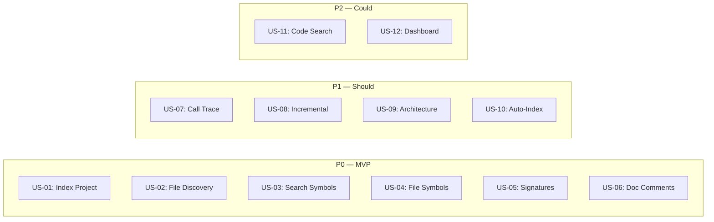

# User Stories — Codebase Index

> **Scope**: MVP (Phase 1.0) — File discovery, tree-sitter parsing, SQLite storage, `search_symbols` and `get_file_symbols` MCP tools.

## Persona Reference

| Persona                | Description                                                               |
| :--------------------- | :------------------------------------------------------------------------ |
| **Agent (autonomous)** | AI coding agent running a task that requires code structure understanding |
| **Agent (sub-agent)**  | Delegated agent operating on an unfamiliar module                         |
| **Developer**          | Human engineer relying on AI agents for code understanding                |
| **Agent (reviewer)**   | Code review agent assessing cross-file change impact                      |

---

## US-01: Index Project on Demand

> As an **AI agent (autonomous)**, I want to **trigger indexing of the current project** so that **I can query the code graph without a separate setup step**.

**Priority**: P0 (MVP) | **Effort**: L | **Depends on**: File discovery, tree-sitter parsing, SQLite storage

---

## US-02: Discover Indexable Files

> As an **AI agent**, I want the **indexer to automatically find all relevant source files while respecting `.gitignore`** so that **I only query files that are part of the project, not dependencies or build artifacts**.

**Priority**: P0 (MVP) | **Effort**: S | **Depends on**: Nothing (foundational)

---

## US-03: Search Symbols by Name

> As an **AI agent**, I want to **search for symbols (functions, classes, interfaces, types) by name using exact, prefix, and fuzzy matching** so that **I can find relevant code without grepping through the filesystem**.

**Priority**: P0 (MVP) | **Effort**: M | **Depends on**: SQLite storage

---

## US-04: List Symbols in a File

> As an **AI agent**, I want to **retrieve all symbols defined in a specific file** so that **I can understand a module's public API at a glance without reading the entire file**.

**Priority**: P0 (MVP) | **Effort**: S | **Depends on**: SQLite storage

---

## US-05: Understand Function Signatures

> As an **AI agent (sub-agent)**, I want to **get the full signature of a function including parameters and return type** so that **I can call it correctly in generated code without guessing parameter names**.

**Priority**: P0 (MVP) | **Effort**: M | **Depends on**: tree-sitter parsing with signature extraction

---

## US-06: Get Symbol Documentation

> As an **AI agent**, I want to **retrieve JSDoc/TSDoc comments associated with a symbol** so that **I can understand its purpose and usage conventions without reading its implementation body**.

**Priority**: P0 (MVP) | **Effort**: S | **Depends on**: tree-sitter parsing with doc comment extraction

---

## US-07: Trace Call Relationships

> As an **AI agent (reviewer)**, I want to **trace which functions call a given function and which functions it calls** so that **I can assess the blast radius of a change before writing code**.

**Priority**: P1 (Should) | **Effort**: L | **Depends on**: Cross-file call resolution

---

## US-08: Incremental Re-Index

> As a **developer**, I want the **index to update automatically when I modify files** so that **the code graph is never stale without requiring a full re-index**.

**Priority**: P1 (Should) | **Effort**: L | **Depends on**: File watcher, mtime tracking

---

## US-09: Get Architecture Overview

> As an **AI agent**, I want to **query the high-level structure of the project (file count, symbol counts per kind, entry points)** so that **I can decide which modules to explore in depth**.

**Priority**: P1 (Should) | **Effort**: M | **Depends on**: SQLite aggregate queries

---

## US-10: Auto-Index on Session Start

> As a **developer**, I want the **codebase to be indexed automatically when the MCP session starts** so that **I never have to remember to trigger indexing manually**.

**Priority**: P1 (Should) | **Effort**: S | **Depends on**: Index command, session lifecycle hook

---

## US-11: Search Code with Symbol Context

> As an **AI agent**, I want to **search file contents and get results enriched with surrounding symbol definitions** so that **I can understand the context of a match without opening the file**.

**Priority**: P2 (Could) | **Effort**: M | **Depends on**: tree-sitter parsing

---

## US-12: View Index in Dashboard

> As a **developer**, I want to **browse the indexed symbols in the local-memory-mcp Dashboard** so that **I can visually explore the codebase without switching to an IDE**.

**Priority**: P2 (Could) | **Effort**: M | **Depends on**: Svelte Dashboard tab

---

## Story Mapping

---

## Traceability Matrix

| User Story | Feature (from mvp-scope) | Acceptance Criteria |
| :--------- | :----------------------- | :------------------ |
| US-01      | M1, M2, M3               | AC-01, AC-02, AC-10 |
| US-02      | M1                       | AC-01, AC-11, AC-12 |
| US-03      | M4                       | AC-03, AC-04, AC-07 |
| US-04      | M5                       | AC-03               |
| US-05      | M2                       | AC-02, AC-05        |
| US-06      | M2                       | AC-02, AC-06        |
| US-07      | S1, S2                   | AC-09               |
| US-08      | S4                       | AC-08, AC-13        |
| US-09      | S3                       | AC-14               |
| US-10      | S5                       | AC-15               |
| US-11      | C3                       | —                   |
| US-12      | C1                       | —                   |
