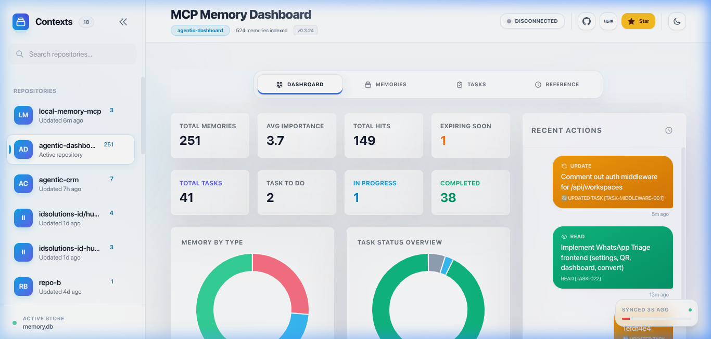
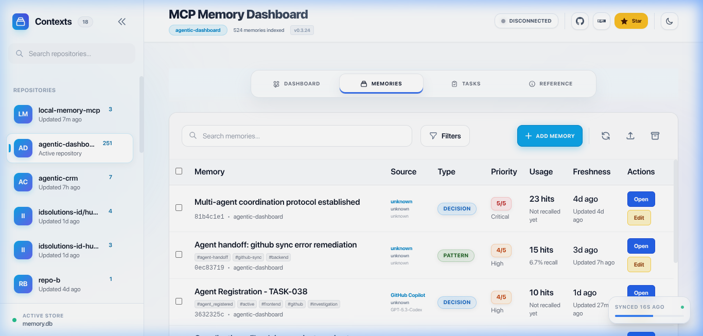
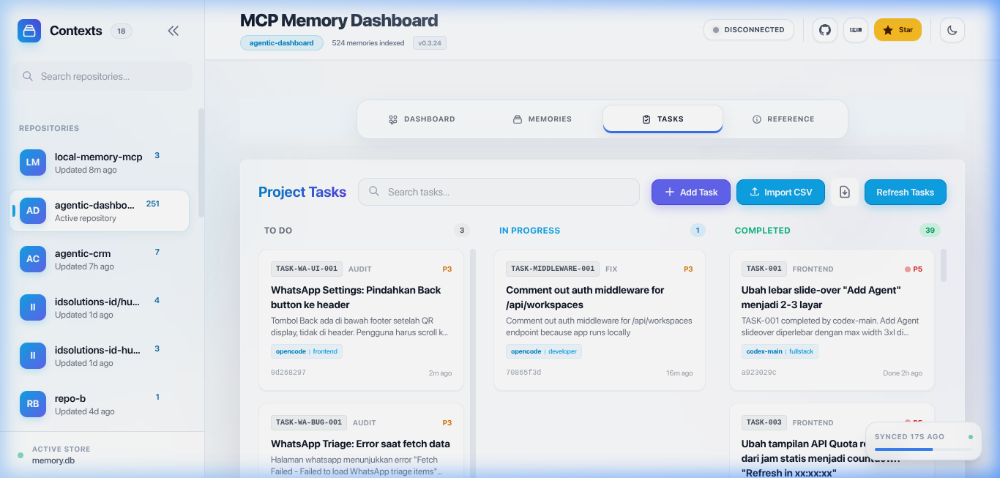
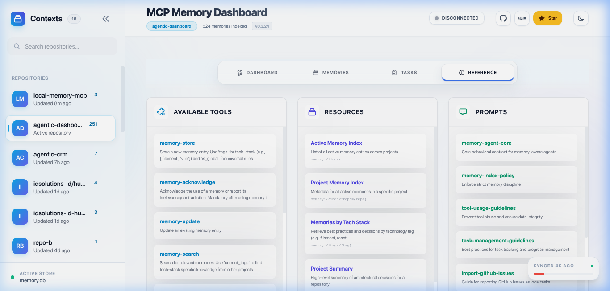

# @vheins/local-memory-mcp

[](https://www.npmjs.com/package/@vheins/local-memory-mcp)
[](https://www.npmjs.com/package/@vheins/local-memory-mcp)
[](https://www.npmjs.com/package/@vheins/local-memory-mcp)
[](https://opensource.org/licenses/MIT)

**MCP Local Memory Service** adalah server [Model Context Protocol (MCP)](https://modelcontextprotocol.io) berkinerja tinggi yang menyediakan memori jangka panjang dan bersinyal tinggi untuk AI Agent (seperti Claude Desktop, Cursor, atau Windsurf).

Dibangun dengan filosofi **Local-First**, layanan ini menyimpan keputusan arsitektur, pola kode, dan fakta kritis secara lokal di mesin Anda menggunakan SQLite dan Pencarian Semantik berbasis AI.

## 🚀 Fitur Utama

- 🧠 **Pencarian Semantik (V2):** Temukan memori berdasarkan makna, bukan hanya kata kunci, menggunakan model `all-MiniLM-L6-v2` secara lokal dengan peringkat hibrida TF-IDF + vektor.
- 🔄 **Tech-Stack Affinity:** Bagikan pengetahuan antar repositori secara cerdas berdasarkan tag teknologi.
- 🛡️ **Pengaman Anti-Hallusinasi:** Ambang batas kemiripan yang ketat dan deteksi konflik keputusan.
- 🧩 **Knowledge Graph:** Entitas, relasi, dan observasi terstruktur dengan ekstraksi otomatis via NLP offline.
- 🕰️ **Time Tunnel:** Kueri memori dengan tanggal berbahasa alami ("kemarin", "minggu lalu").
- 📉 **Soul Maintenance:** Decay memori bergaya biologis dengan imunitas tag — otomatis mengarsipkan memori usang.
- 🤖 **Alat Agentic:** Konteks sesi sekali-panggil (`agent-context`), pencatatan keputusan terstruktur via `memory-write` (`type: "decision"`), sintesis pengetahuan berbasis LLM (`synthesize`), dan ringkasan proyek per-repo (`repo-summarize`).
- 📊 **Dasbor Kaca (Glassy Dashboard):** Visualisasikan memori, tugas, handoff, knowledge graph, dan log interaksi melalui antarmuka Svelte 5 modern.
- 🔍 **Codebase Index:** Indeks dan kueri struktur kode sumber — cari fungsi, kelas, antarmuka, tipe, dan enum di seluruh proyek Anda. Menggunakan tree-sitter WASM untuk parsing cepat dengan pembaruan inkremental.
- 🧭 **Codebase Search & Trace:** Satu alat terpadu (`codebase-read`) dengan mode yang terdeteksi otomatis — cari simbol berperingkat (`query`), telusuri definisi dan situs pemanggilan simbol (`name`), daftar simbol yang dideklarasikan dalam berkas (`filePath`), atau jelajahi ikhtisar arsitektur (`depth`). `codebase-index` membangun dan memperbarui indeks tree-sitter.

## 🔌 Penggunaan & Konfigurasi MCP

Tambahkan layanan ini ke AI Agent Anda (Claude Desktop, Cursor, Windsurf, dll.) menggunakan salah satu metode di bawah.

> 💡 **Rekomendasi:** Jika MCP Anda sering berjalan (agen, CI, otomatisasi), hindari `npx` dan gunakan instalasi global atau lokal. Ini mengurangi unduhan NPM yang tidak perlu dan mempercepat startup Agent.

### 🚀 Quick Start (Tanpa Setup)

Cocok untuk **pengguna pertama** atau **pengujian cepat**. Ini menggunakan `npx` untuk menjalankan server tanpa setup permanen.

```json
"local-memory": {
  "command": "npx",
  "args": ["-y", "@vheins/local-memory-mcp"],
  "type": "stdio"
}
```

- **Menggunakan `npx`**: Otomatis menangani eksekusi.
- **Tradeoff**: Mungkin mengunduh ulang paket di beberapa lingkungan dan tidak optimal untuk eksekusi yang sering.

### ⚡ Direkomendasikan untuk Produksi / Penggunaan Sering

Metode ini memastikan waktu startup tercepat dan keandalan maksimal untuk penggunaan harian.

1. **Instal secara global:**

   ```bash
   npm install -g @vheins/local-memory-mcp
   ```

2. **Tambahkan ke konfigurasi Anda:**
   ```json
   "local-memory": {
     "command": "local-memory-mcp",
     "type": "stdio"
   }
   ```

- **Startup lebih cepat**: Tanpa pemeriksaan jaringan setiap kali dimulai.
- **Tanpa unduhan berulang**: Menghemat bandwidth dan menghindari ketergantungan pada registry NPM.
- **Lebih baik untuk otomatisasi**: Lebih stabil untuk alur kerja Agent yang berat.

### 🧠 Cara Kerjanya (Wawasan Penting)

- **Penggunaan npx**: Saat Anda menggunakan `npx`, ia sering melakukan permintaan jaringan untuk memeriksa versi terbaru atau mengunduh ulang paket jika tidak ada di cache. Karena klien MCP sering memulai dan menghentikan alat, ini dapat menyebabkan ratusan unduhan yang tidak perlu.
- **Biner terinstal**: Dengan menginstal paket, Anda menyimpan salinan permanen di disk. Agen menggunakan ulang versi lokal ini secara instan, memberikan pengalaman yang jauh lebih mulus.

## 📊 Dasbor Kaca (Glassy Dashboard)

Visualisasikan dan kelola memori Agent Anda melalui antarmuka web modern.

|                    Ikhtisar Dasbor                    |                   Manajemen Memori                    |
| :---------------------------------------------------: | :---------------------------------------------------: |
|  |  |

|               Pelacakan Tugas                |                  Referensi Alat yang Tersedia                  |
| :------------------------------------------: | :------------------------------------------------------------: |
|  |  |

### Cara Menjalankan

```bash
local-memory-mcp dashboard
```

_Jika tidak terinstal global, gunakan:_ `npx @vheins/local-memory-mcp dashboard`

### Alur Kerja Pengembang (UI Dasbor)

UI dasbor dibangun dengan **Svelte 5 + Vite**. Berkas sumber berada di `src/dashboard/ui/`.

```bash
# Mulai server API (port 3456)
npm run dashboard

# Di terminal terpisah, mulai dev server Svelte (port 5173)
npm run dashboard:dev
# → Buka http://localhost:5173 (proxy /api ke :3456)

# Build UI Svelte untuk produksi (output → dist/dashboard/public/)
npm run dashboard:build

# Build produksi lengkap (Svelte + TypeScript)
npm run build
```

> Server menyajikan build Svelte terkompilasi dari `dist/dashboard/public/` di produksi.

### Auto-Start Dasbor di IDE

Dasbor bisa otomatis menyala saat Anda membuka project di VS Code, Cursor, Windsurf, Zed, atau IDE JetBrains.

📖 **[Lihat panduan auto-start →](docs/id/auto-start-dashboard.md)**

## 📖 Dokumentasi

- [Memulai & Pengaturan](docs/id/getting-started.md) — Instalasi & konfigurasi klien
- [Referensi Alat & Panduan Penggunaan](docs/id/tools-reference.md) — Dokumentasi alat lengkap dengan contoh dan alur kerja
- [Panduan Pemecahan Masalah](docs/id/troubleshooting.md) — Mengatasi masalah umum
- [Fitur & Cara Kerja](docs/id/features.md) — Pencarian semantik, anti-halusinasi, decay memori
- [Logika Pencarian Hibrida](docs/id/hybrid-search.md) — Cara kerja skoring pencarian
- [Panduan Dasbor](docs/id/dashboard-guide.md) — UI web untuk manajemen memori & tugas
- [Codebase Index — Ikhtisar Fitur](docs/features/codebase-index.md) — Mengindeks, mencari, dan menelusuri simbol kode sumber
- [Codebase Index — Referensi API](docs/api/codebase-index.md) — Dokumentasi lengkap alat MCP untuk 2 alat Codebase Index terpadu (`codebase-index` + `codebase-read`)
- [Referensi Protokol MCP](docs/id/mcp-concepts.md) — Detail teknis protokol
- [Integrasi dengan Claude Code](docs/id/claude-code-integration.md) — Panduan setup untuk Claude Code CLI
- [Integrasi dengan Codex (OpenAI)](docs/id/codex-integration.md) — Panduan setup untuk Codex CLI
- [Integrasi dengan Kiro](docs/id/kiro-integration.md) — Panduan setup untuk Kiro IDE
- [Auto-Start Dasbor di IDE](docs/id/auto-start-dashboard.md) — tasks.json untuk VS Code, Cursor, Windsurf, Zed, JetBrains

> 🇬🇧 **Versi bahasa Inggris tersedia:** [`README.md`](README.md) & dokumentasi di [`docs/en/`](docs/en/)

- [Panduan Kontribusi](CONTRIBUTING.md)

## ⚠️ Penyangkalan

**PERANGKAT LUNAK INI DISEDIAKAN "SEBAGAIMANA ADANYA", TANPA JAMINAN DALAM BENTUK APAPUN**, baik tersurat maupun tersirat, termasuk namun tidak terbatas pada jaminan kepatutan, kesesuaian untuk tujuan tertentu, dan tidak melanggar hak pihak ketiga. Dalam hal apa pun penulis atau pemegang hak cipta tidak bertanggung jawab atas klaim, kerusakan, atau kewajiban lainnya, baik dalam tindakan kontrak, gugatan, atau lainnya, yang timbul dari, di luar, atau sehubungan dengan perangkat lunak ini.

## ⚖️ Lisensi

MIT © Muhammad Rheza Alfin

## 🙏 Ucapan Terima Kasih

- **Knowledge Graph** terinspirasi [Beledarian/mcp-local-memory](https://github.com/Beledarian/mcp-local-memory) — konsep grafik entitas/relasi terstruktur dibangun di atas proyek ini, diimplementasikan ulang dengan skema sendiri dan ekstraksi NLP offline.

- **Codebase Index** terinspirasi [DeusData/codebase-memory-mcp](https://github.com/DeusData/codebase-memory-mcp) — kemampuan pengindeksan, pencarian, dan penelusuran kode dibangun di atas konsep ini, diimplementasikan ulang dengan tree-sitter WASM dan alat yang terpadu.
