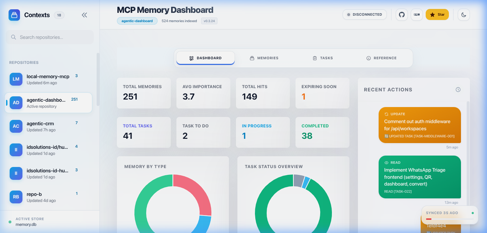
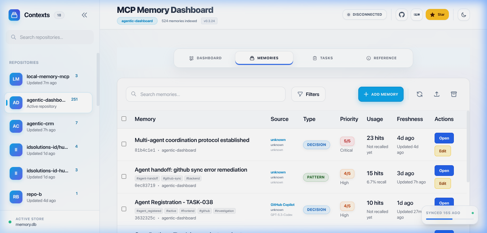
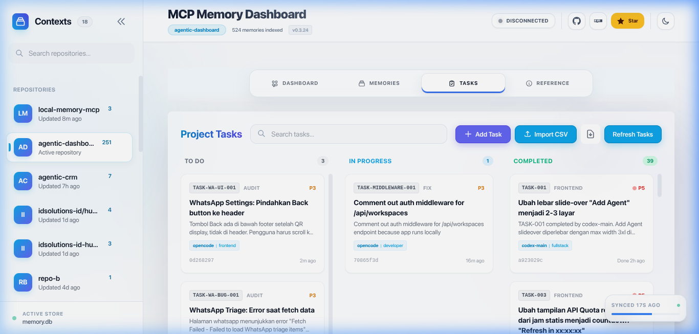
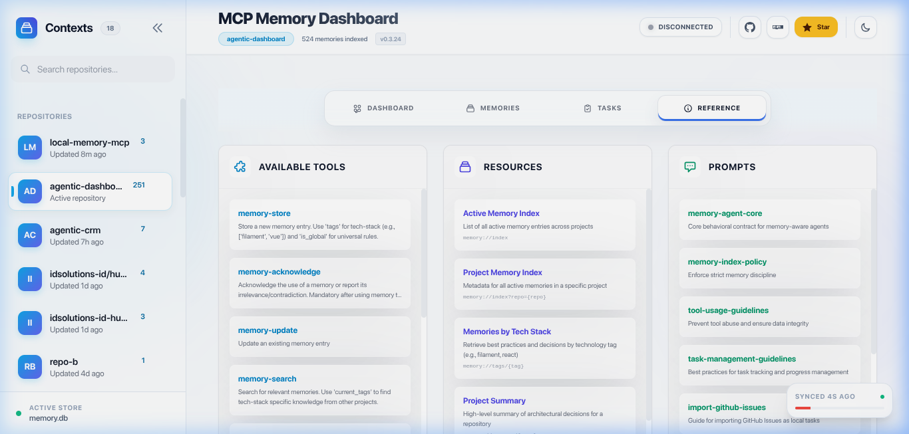

# @vheins/local-memory-mcp

[](https://www.npmjs.com/package/@vheins/local-memory-mcp)
[](https://www.npmjs.com/package/@vheins/local-memory-mcp)
[](https://www.npmjs.com/package/@vheins/local-memory-mcp)
[](https://opensource.org/licenses/MIT)

**MCP Local Memory Service** is a high-performance [Model Context Protocol (MCP)](https://modelcontextprotocol.io) server that provides long-term, high-signal memory for AI Agents (such as Claude Desktop, Cursor, or Windsurf).

Built with a **Local-First** philosophy, this service stores architectural decisions, code patterns, and critical facts locally on your machine using SQLite and AI-powered Semantic Search.

## 🚀 Key Features

- 🧠 **Semantic Search (V2):** Find memories based on meaning, not just keywords, using the `all-MiniLM-L6-v2` model locally.
- 🔄 **Tech-Stack Affinity:** Share knowledge across repositories intelligently based on technology tags (e.g., Filament memories in Repo A are accessible in Repo B).
- 🛡️ **Anti-Hallucination Guard:** Prevents Agents from hallucinating with strict similarity thresholds and decision conflict detection.
- 📉 **Automatic Memory Decay:** Automatically archives obsolete memories to keep the context clean and relevant.
- 📊 **Glassy Dashboard:** Visualize memories, usage statistics, and audit interaction logs through a modern web interface.

## 🔌 MCP Usage & Configuration

Add this service to your AI Agent (Claude Desktop, Cursor, Windsurf, etc.) using one of the methods below.

> 💡 **Recommendation:** If your MCP runs frequently (agents, CI, automation), avoid `npx` and use a global or local install instead. It reduces unnecessary NPM downloads and speeds up Agent startup.

### 🚀 Quick Start (Zero Setup)
Best for **first-time users** or **quick testing**. This uses `npx` to run the server without any permanent setup.

```json
"local-memory": {
  "command": "npx",
  "args": ["-y", "@vheins/local-memory-mcp"],
  "type": "stdio"
}
```
* **Uses `npx`**: Automatically handles the execution.
* **Tradeoff**: May re-download the package in some environments and is not optimal for frequent execution.

### ⚡ Recommended for Production / Frequent Usage
This method ensures the fastest startup times and maximum reliability for daily use.

1. **Install globally:**
   ```bash
   npm install -g @vheins/local-memory-mcp
   ```

2. **Add to your configuration:**
   ```json
   "local-memory": {
     "command": "local-memory-mcp",
     "type": "stdio"
   }
   ```
* **Faster startup**: No network checks required on every start.
* **No repeated downloads**: Saves bandwidth and avoids NPM registry dependency.
* **Better for automation**: More stable for heavy-duty Agent workflows.

### 🧠 How It Works (Important Insight)
* **npx usage**: When you use `npx`, it often performs a network request to check for the latest version or re-downloads the package if it's not in the cache. Since MCP clients start and stop tools frequently, this can lead to hundreds of unnecessary downloads.
* **Installed binary**: By installing the package, you keep a permanent copy on your disk. The Agent reuses this local version instantly, providing a much smoother experience.

## 📊 Glassy Dashboard

Visualize and manage your Agent's memory through a modern web interface.

| Dashboard Overview | Memories Management |
|:---:|:---:|
|  |  |

| Task Tracking | Available Tools & Reference |
|:---:|:---:|
|  |  |

### How to Run
```bash
local-memory-mcp dashboard
```
*If not installed globally, use:* `npx @vheins/local-memory-mcp dashboard`

### Developer Workflow (Dashboard UI)

The dashboard UI is built with **Svelte 5 + Vite**. Source files live in `src/dashboard/ui/`.

```bash
# Start the API server (port 3456)
npm run dashboard

# In a separate terminal, start the Svelte dev server (port 5173)
npm run dashboard:dev
# → Open http://localhost:5173 (proxies /api to :3456)

# Build Svelte UI for production (output → dist/dashboard/public/)
npm run dashboard:build

# Full production build (Svelte + TypeScript)
npm run build
```

> The server serves the compiled Svelte build from `dist/dashboard/public/` in production.

### Auto-launch Dashboard in IDEs

The dashboard can auto-start when you open a project in VS Code, Cursor, Windsurf, Zed, or JetBrains IDEs.

📖 **[See the auto-start guide →](docs/en/auto-start-dashboard.md)**

## 📖 Documentation

- [Getting Started & Setup](docs/en/getting-started.md) — Installation & client configuration
- [Tool Reference & Usage Guide](docs/en/tools-reference.md) — Complete tool docs with examples and workflows
- [Troubleshooting Guide](docs/en/troubleshooting.md) — Fix common issues
- [Features & How It Works](docs/en/features.md) — Semantic search, anti-hallucination, memory decay
- [Hybrid Search Logic](docs/en/hybrid-search.md) — How search scoring works
- [Dashboard Guide](docs/en/dashboard-guide.md) — Web UI for memory & task management
- [MCP Protocol Reference](docs/en/mcp-concepts.md) — Technical protocol details
- [Claude Code Integration](docs/en/claude-code-integration.md) — Setup for Claude Code CLI
- [Codex (OpenAI) Integration](docs/en/codex-integration.md) — Setup for Codex CLI
- [Kiro Integration](docs/en/kiro-integration.md) — Setup for Kiro IDE
- [Auto-Start Dashboard in IDEs](docs/en/auto-start-dashboard.md) — tasks.json for VS Code, Cursor, Windsurf, Zed, JetBrains

> 🇮🇩 **Indonesian version available:** [`README.id.md`](README.id.md) & docs in [`docs/id/`](docs/id/)

- [Contribution Guidelines](CONTRIBUTING.md)

## ⚠️ Disclaimer

**THE SOFTWARE IS PROVIDED "AS IS", WITHOUT WARRANTY OF ANY KIND**, express or implied, including but not limited to the warranties of merchantability, fitness for a particular purpose and noninfringement. In no event shall the authors or copyright holders be liable for any claim, damages or other liability, whether in an action of contract, tort or otherwise, arising from, out of or in connection with the software or the use or other dealings in the software.

## ⚖️ License

MIT © Muhammad Rheza Alfin
