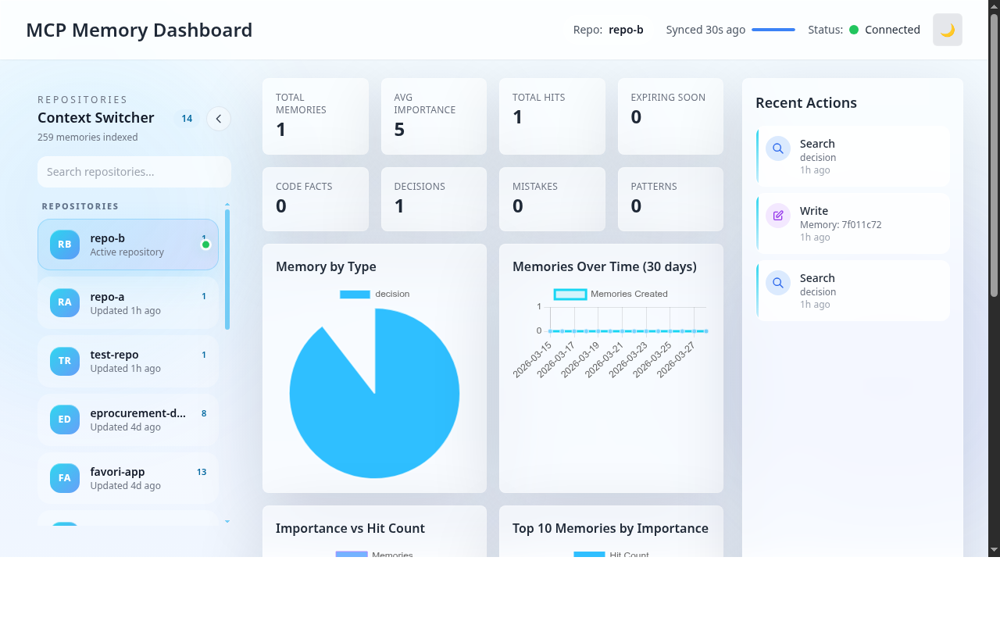

# @vheins/local-memory-mcp

[](https://www.npmjs.com/package/@vheins/local-memory-mcp)
[](https://opensource.org/licenses/MIT)



A Model Context Protocol (MCP) server that provides **persistent, long-term memory** for AI coding agents. It helps agents remember architectural decisions, project-specific patterns, past mistakes, and codebase facts across different chat sessions.

Includes a **Web Dashboard** for easy management and visualization of stored memories.

## 🚀 Key Features

- **Project-Specific Memory**: Automatic isolation of memories per Git repository.
- **Durable Knowledge**: Store decisions, facts, mistakes, and patterns that survive context window resets.
- **Hybrid Search**: Combines semantic similarity scoring with keyword fallback.
- **Antigravity Summaries**: High-level project-wide "rules of engagement" for agents.
- **Web Dashboard**: Interactive UI to browse, edit, and delete memories (default: `http://localhost:3456`).
- **SQLite Backend**: Fast, local, and file-based storage.

## 📦 Installation

### Via npx (Recommended for most clients)
No manual installation needed. Configure your MCP client to run:
```bash
npx @vheins/local-memory-mcp
```

### Global Install
```bash
npm install -g @vheins/local-memory-mcp
```

## 🛠 Configuration

Add the server to your favorite MCP-compatible client (Cursor, Claude Desktop, Gemini CLI, etc.):

### Claude Desktop / Cursor / OpenCode
Add this to your `mcpServers` configuration:

```json
{
  "mcpServers": {
    "local-memory": {
      "command": "npx",
      "args": ["-y", "@vheins/local-memory-mcp"]
    }
  }
}
```

### Gemini CLI
```bash
gemini mcp add local-memory --scope user npx -y @vheins/local-memory-mcp
```

## 🧠 Instructions for AI Agents (The "Rules")

To make this memory effective, you should copy and paste the following rules into your agent's **System Prompt**, **Custom Instructions**, or `.cursorrules` file:

### Copy-Paste Ready Rules
```markdown
# Local Memory Discipline
You have access to a long-term memory service. To maintain project continuity, you MUST follow these rules:

1. **Session Start**: At the beginning of every session or when switching projects, call `memory-recap` to get the latest context and `memory-search` for "project rules" or "architecture".
2. **Record Decisions**: Whenever a significant technical decision is made (e.g., folder structure, library choice, naming conventions), call `memory-store` with `type: "decision"`.
3. **Prevent Repetition**: If you spend time debugging a tricky bug, log it with `memory-store` using `type: "mistake"` so you don't repeat it.
4. **Update Facts**: If a fundamental fact about the codebase changes, search for the old memory and use `memory-update` or `memory-delete` to keep the knowledge base accurate.
5. **Title Required**: Every stored memory MUST have a clear, concise title.
```

## 🔧 Tools Provided

### `memory-store`
Stores a new memory.
- **Parameters**: `type` (code_fact, decision, mistake, pattern), `title`, `content`, `importance` (1-5), `scope` (object with `repo`).

### `memory-search`
Searches for memories using semantic similarity.
- **Parameters**: `query`, `repo`, `limit`, `includeRecap` (boolean).

### `memory-recap`
Quickly gets the latest memories for a repository.
- **Parameters**: `repo`, `limit`.

### `memory-summarize`
Updates the "Antigravity Summary" (High-level project rules).
- **Parameters**: `repo`, `signals` (array of strings).

### `memory-update` / `memory-delete`
Manage existing memory entries by ID.

## 📊 Web Dashboard

The service includes a built-in dashboard to help you manage your memories visually.

1. Run the dashboard:
   ```bash
   # If installed globally:
   mcp-memory-dashboard

   # Via npx (one-time or without global install):
   npx -y @vheins/local-memory-mcp dashboard
   ```
2. Open `http://localhost:3456` in your browser.

> **Note:** The `dashboard` subcommand was added in v0.1.28. For older versions use:
> `npx --package=@vheins/local-memory-mcp -- mcp-memory-dashboard`

### 🛠 Automating the Dashboard (IDE Integration)

If you use **VS Code**, **Cursor**, **Trae**, **Kiro**, or any VS Code-based IDE, you can create a task to launch the dashboard with a single command or shortcut.

Create or open `.vscode/tasks.json` in your project and add the following:

```json
{
  "version": "2.0.0",
  "tasks": [
    {
      "label": "Launch Memory Dashboard",
      "type": "shell",
      "command": "npx -y @vheins/local-memory-mcp dashboard",
      "isBackground": true,
      "problemMatcher": {
        "pattern": {
          "regexp": "^.*$",
          "file": 1,
          "location": 2,
          "message": 3
        },
        "background": {
          "activeOnStart": true,
          "beginsPattern": "^.*DASHBOARD_STARTING.*$",
          "endsPattern": "^.*MCP Memory Dashboard started.*$"
        }
      },
      "presentation": {
        "reveal": "always",
        "panel": "new",
        "group": "memory"
      }
    }
  ]
}
```

**How to use:**
1. Press `Cmd+Shift+P` (macOS) or `Ctrl+Shift+P` (Windows/Linux).
2. Type **"Run Task"** and select **"Launch Memory Dashboard"**.
3. The dashboard will start in a background terminal.

## ⚙️ Environment Variables

- `MEMORY_DB_PATH`: Custom path for the SQLite database file (default: `./storage/memory.db`).
- `PORT`: Port for the Web Dashboard (default: `3456`).

## 📄 License

MIT © Muhammad Rheza Alfin
